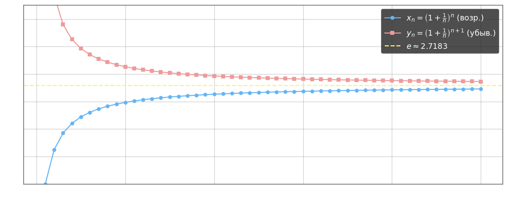

**Неравенство Бернулли.** При $x > -1$ и $n \in \mathbb{N}$, $n \geq 1$:

$$(1+x)^n \geq 1 + nx$$

*Доказательство по индукции.* База $n=1$: $(1+x)^1 = 1+x$. Шаг $n = k \to k+1$:

$$(1+x)^{k+1} = (1+x)^k(1+x) \geq (1+kx)(1+x) = 1 + kx + x + kx^2 \geq 1 + (k+1)x$$

поскольку $kx^2 \geq 0$.

**Лемма.** При $a > 1$ и любом $k \in \mathbb{N}$:

$$\lim_{n\to\infty} \frac{a^n}{n^k} = +\infty$$

*Доказательство.* Запишем $a^{1/(2k)} = 1 + x$, где $x > 0$ (так как $a > 1$). Тогда:

$$\frac{a^n}{n^k} = \left(\frac{(a^{1/(2k)})^{2n}}{n}\right)^k = \left(\frac{((1+x)^n)^2}{n}\right)^k$$

По неравенству Бернулли $(1+x)^n \geq 1 + nx \geq nx$, поэтому:

$$\frac{((1+x)^n)^2}{n} \geq \frac{(1+nx)^2}{n} \geq \frac{n^2 x^2}{n} = nx^2$$

Следовательно:

$$\frac{a^n}{n^k} \geq (nx^2)^k = n^k x^{2k} \xrightarrow{n\to\infty} +\infty$$

**Определение числа $e$.** Рассмотрим две последовательности:

$$x_n = \left(1 + \frac{1}{n}\right)^n, \qquad y_n = \left(1 + \frac{1}{n}\right)^{n+1}$$

Последовательность $\{x_n\}$ возрастает, $\{y_n\}$ убывает, и $x_n < y_n$ при всех $n$. Из монотонности и ограниченности ($x_n < y_1 = 4$) оба предела существуют и совпадают. Их общее значение обозначается $e$:

$$e = \lim_{n\to\infty}\left(1 + \frac{1}{n}\right)^n = \lim_{n\to\infty}\left(1 + \frac{1}{n}\right)^{n+1}$$

Число $e$ иррационально, $e \approx 2{,}71828\ldots$
