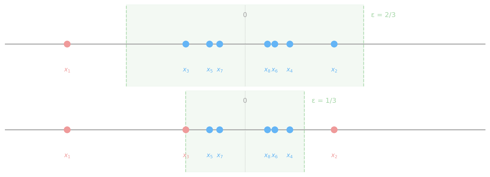

Интуитивно предел последовательности — это значение, к которому её члены приближаются при $n \to \infty$. Для $x_n = \frac{2n-1}{4n+5}$ отношение ведущих коэффициентов даёт $\frac{2}{4} = \frac{1}{2}$, поэтому члены стремятся к $\frac{1}{2}$. Это означает, что в любой окрестности $\left(\frac{1}{2} - \varepsilon,\, \frac{1}{2} + \varepsilon\right)$ находятся все члены начиная с некоторого номера, а вне неё — лишь конечное число.

**Задача 1.** Сколько членов $x_n = \frac{2n-1}{4n+5}$ лежит вне интервала $\left(\frac{1}{2} - \frac{1}{1000},\, \frac{1}{2} + \frac{1}{1000}\right)$?

Последовательность возрастает и остаётся ниже $\frac{1}{2}$, поэтому условие $x_n > \frac{1}{2} + \frac{1}{1000}$ решений не имеет. Для левой границы:

$$\frac{2n-1}{4n+5} < \frac{499}{1000} \implies 2000n - 1000 < 1996n + 2495 \implies n < \frac{3495}{4} = 873{,}75$$

Вне интервала находятся первые 873 члена.

**Задача 2.** Найти наименьшее $n$, при котором $\frac{5}{\sqrt{n}} < \varepsilon$.

Из условия $\sqrt{n} > \frac{5}{\varepsilon}$ следует $n > \frac{25}{\varepsilon^2}$:

| $\varepsilon$ | условие | наименьшее $n$ |
|:---:|:---:|:---:|
| $1$ | $n > 25$ | $26$ |
| $0{,}1$ | $n > 2500$ | $2501$ |
| $0{,}01$ | $n > 250000$ | $250001$ |

**Задача 3.** Найти $N$, начиная с которого для всех $n > N$ верно $\left|\frac{2n-1}{n+2} - 2\right| < \varepsilon$.

Модуль упрощается:

$$\left|\frac{2n-1}{n+2} - 2\right| = \frac{|2n-1 - 2n - 4|}{n+2} = \frac{5}{n+2}$$

Условие $\frac{5}{n+2} < \varepsilon$ равносильно $n > \frac{5}{\varepsilon} - 2$:

| $\varepsilon$ | $N$ |
|:---:|:---:|
| $10^{-1}$ | $48$ |
| $10^{-3}$ | $4998$ |
| $10^{-6}$ | $4\,999\,998$ |

Видно, что $N$ растёт обратно пропорционально $\varepsilon$: чем точнее приближение, тем дальше нужно зайти в последовательность.

**Формальное доказательство.** Покажем, что $\lim_{n \to \infty} \frac{n^2}{n^2+1} = 1$. Оценим отклонение от предполагаемого предела:

$$\left|\frac{n^2}{n^2+1} - 1\right| = \frac{1}{n^2+1} < \frac{1}{n^2} < \varepsilon$$

Цепочка выполнена при $n > \frac{1}{\sqrt{\varepsilon}}$, поэтому достаточно взять $N(\varepsilon) = \left\lfloor\frac{1}{\sqrt{\varepsilon}}\right\rfloor + 1$.

**Геометрический смысл.** Рассмотрим $x_n = (-1)^n \cdot \frac{1}{n}$ с членами $-1,\, \frac{1}{2},\, -\frac{1}{3},\, \frac{1}{4},\, \ldots$ — предел равен нулю. При $\varepsilon = \frac{2}{3}$ окрестность $\left(-\frac{2}{3},\, \frac{2}{3}\right)$ не содержит только $x_1 = -1$: одна точка снаружи. При $\varepsilon = \frac{1}{3}$ вне окрестности оказываются $x_1, x_2, x_3$ — но по-прежнему конечное число. При любом дальнейшем уменьшении $\varepsilon$ из интервала выпадает лишь конечный начальный отрезок последовательности.

