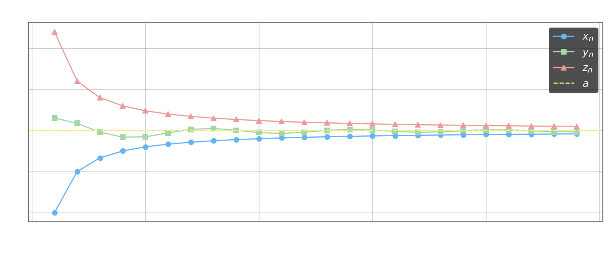

**1. Единственность предела.** Последовательность не может иметь двух различных пределов.

Доказательство от противного: предположим, что $\lim_{n\to\infty} x_n = a$ и $\lim_{n\to\infty} x_n = b$, причём $a \neq b$. Возьмём $\varepsilon = \frac{|a-b|}{2}$; тогда окрестности $(a-\varepsilon,\, a+\varepsilon)$ и $(b-\varepsilon,\, b+\varepsilon)$ не пересекаются. По определению предела, вне каждой из них лежит лишь конечное число членов. Но тогда вне их объединения — тоже конечное число членов, а поскольку окрестности дизъюнктны, бесконечно много членов должны одновременно быть вблизи $a$ и вблизи $b$ — противоречие.

**2. Ограниченность сходящейся последовательности.** Если последовательность имеет предел, то она ограничена: существует $M > 0$ такое, что $|x_n| \leq M$ при всех $n$.

Доказательство: возьмём $\varepsilon = 1$; по определению предела $\lim_{n\to\infty} x_n = a$ найдётся $N$ такой, что при $n > N$ выполнено $|x_n - a| < 1$, откуда $|x_n| < |a| + 1$. Для первых $N$ членов возьмём их максимальный модуль. Тогда

$$M = \max\bigl(|x_1|,\, |x_2|,\, \ldots,\, |x_N|,\, |a|+1\bigr)$$

является универсальной оценкой для всех членов.

**Лемма (совместная близость).** Пусть $\lim_{n\to\infty} x_n = a$, $\lim_{n\to\infty} y_n = b$ и $\varepsilon > 0$. Тогда найдётся номер $N$ такой, что при всех $n > N$ одновременно выполнено $|x_n - a| < \varepsilon$ и $|y_n - b| < \varepsilon$.

По определению предела существуют $N_1$ и $N_2$ такие, что $|x_n - a| < \varepsilon$ при $n \geq N_1$ и $|y_n - b| < \varepsilon$ при $n \geq N_2$. Достаточно взять $N = \max\{N_1,\, N_2\}$.

**3. Предельный переход в неравенстве.** Пусть $\lim_{n\to\infty} x_n = a$, $\lim_{n\to\infty} y_n = b$ и $x_n \leq y_n$ при всех $n$. Тогда $a \leq b$.

Доказательство от противного: если $a > b$, возьмём $\varepsilon = \frac{a-b}{2}$. По лемме при достаточно большом $n$ выполнено $x_n > a - \varepsilon = \frac{a+b}{2}$ и $y_n < b + \varepsilon = \frac{a+b}{2}$, то есть $x_n > y_n$ — противоречие с условием.

Из этой теоремы следуют два частных случая. **Следствие 1:** если $\lim_{n\to\infty} x_n = a$ и $x_n \leq b$ при всех $n$, то $a \leq b$. **Следствие 2:** если $\lim_{n\to\infty} y_n = b$ и $a \leq y_n$ при всех $n$, то $a \leq b$.

**4. Теорема о сжатой последовательности.** Пусть $x_n \leq y_n \leq z_n$ при всех $n$ и

$$\lim_{n\to\infty} x_n = \lim_{n\to\infty} z_n = a$$

Тогда $\lim_{n\to\infty} y_n = a$.

Для любого $\varepsilon > 0$ по лемме найдётся $N$ такой, что при $n > N$ одновременно $|x_n - a| < \varepsilon$ и $|z_n - a| < \varepsilon$, то есть $a - \varepsilon < x_n \leq y_n \leq z_n < a + \varepsilon$. Значит, $|y_n - a| < \varepsilon$.

