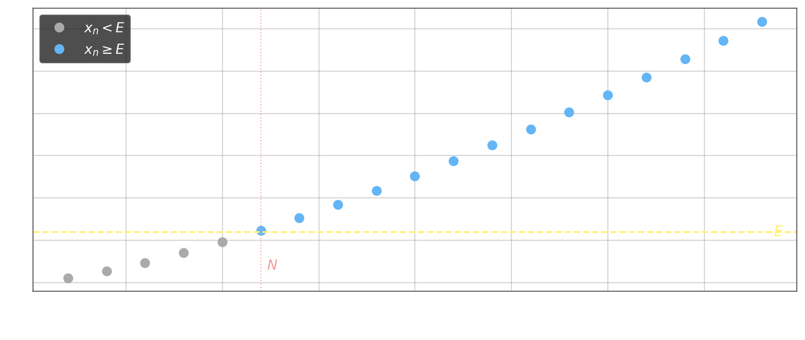

Последовательность $\{x_n\}$ имеет бесконечный предел $\lim_{n\to\infty} x_n = +\infty$, если для любого числа $E$ найдётся номер $N$ такой, что при всех $n \geq N$ выполнено $x_n \geq E$. Формально:

$$\lim_{n\to\infty} x_n = +\infty \;\overset{\mathrm{def}}{\iff}\; \forall E \;\exists N \in \mathbb{N} : \forall n \geq N \;\; x_n \geq E$$

Геометрически это означает: как бы далеко вправо ни сдвинуть порог $E$ на числовой прямой, начиная с некоторого члена $x_N$ все дальнейшие члены находятся правее (или на) $E$.

Аналогично определяется $\lim_{n\to\infty} x_n = -\infty$: для любого $E$ найдётся $N$ такой, что $x_n \leq E$ при всех $n \geq N$.
