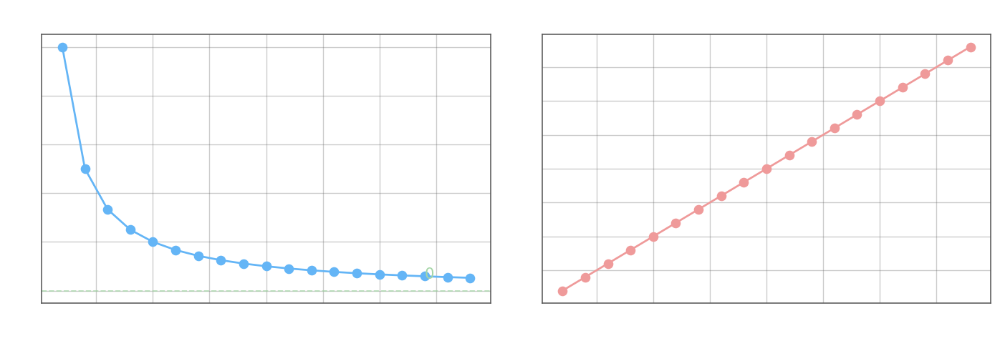

Последовательность $\{x_n\}$ называется **бесконечно большой**, если $\lim_{n\to\infty} x_n = \infty$, и **бесконечно малой**, если $\lim_{n\to\infty} x_n = 0$.

**Теорема о взаимосвязи.** Пусть $x_n \neq 0$ при всех $n$. Тогда $\{x_n\}$ является бесконечно большой тогда и только тогда, когда $\left\{\frac{1}{x_n}\right\}$ является бесконечно малой:

$$|x_n| \geq E \;\iff\; \left|\frac{1}{x_n}\right| \leq \frac{1}{E}$$

**Свойства бесконечно малых.**

**1.** Бесконечно малая последовательность ограничена.

**2.** Сумма и разность двух бесконечно малых — бесконечно мала.

**3.** Произведение бесконечно малой на ограниченную последовательность — бесконечно мало.

Доказательство свойства 3: пусть $x_n \to 0$ и $|y_n| \leq M$ при всех $n$. Тогда

$$-M|x_n| \leq x_n y_n \leq M|x_n|$$

Обе оценки стремятся к нулю, поэтому по [теореме о сжатой последовательности](3-properties.md) $x_n y_n \to 0$.

**Расширенная числовая прямая.** Полагают $\overline{\mathbb{R}} = \mathbb{R} \cup \{+\infty,\, -\infty\}$. Предел $\lim_{n\to\infty} x_n = a \in \overline{\mathbb{R}}$ охватывает как конечные, так и бесконечные пределы.

В $\overline{\mathbb{R}}$ сохраняются следующие свойства.

**1.** Предел единственен.

**2.** Если $x_n \leq y_n$ при всех $n$ и $\lim_{n\to\infty} x_n = +\infty$, то $\lim_{n\to\infty} y_n = +\infty$.

**3.** Если $x_n \leq y_n$ при всех $n$ и $\lim_{n\to\infty} y_n = -\infty$, то $\lim_{n\to\infty} x_n = -\infty$.
