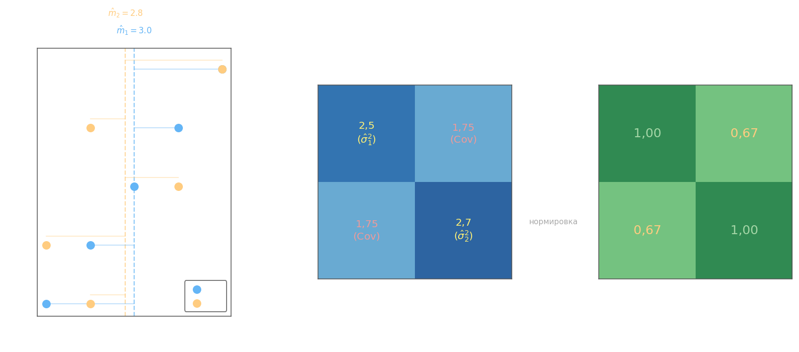

## Выборочная ковариационная матрица

При работе с реальными данными теоретическая ковариационная матрица заменяется **выборочной**. Пусть имеется выборка из $n$ наблюдений по $p$ признакам. Её удобно записывать в виде матрицы данных $X$ размером $n \times p$, где строка $i$ — это один объект, а столбец $j$ — все значения $j$-го признака:

$$X = \begin{pmatrix} x_{11} & x_{12} & \cdots & x_{1p} \\ x_{21} & x_{22} & \cdots & x_{2p} \\ \vdots & \vdots & \ddots & \vdots \\ x_{n1} & x_{n2} & \cdots & x_{np} \end{pmatrix}$$

## Вектор выборочных средних

**Выборочное среднее** $j$-го признака:

$$\hat{m}_j = \frac{1}{n}\sum_{i=1}^{n} x_{ij}$$

Все средние собираются в **вектор средних** $\hat{\mathbf{m}} = [\hat{m}_1, \hat{m}_2, \ldots, \hat{m}_p]^T$.

## Центрированная матрица

**Центрированная матрица** $X_c$ получается вычитанием вектора средних из каждой строки:

$$X_c = X - \mathbf{1}_n \hat{\mathbf{m}}^T, \qquad (X_c)_{ij} = x_{ij} - \hat{m}_j$$

где $\mathbf{1}_n$ — вектор-столбец из $n$ единиц. Каждый столбец $X_c$ имеет нулевое выборочное среднее.

## Выборочная ковариационная матрица

**Выборочная ковариационная матрица** $\hat{\Sigma}$ размером $p \times p$ вычисляется компактной формулой:

$$\hat{\Sigma} = \frac{1}{n-1}\,X_c^T X_c$$

Элемент $\hat{\Sigma}_{jk}$ — это выборочная ковариация признаков $j$ и $k$:

$$\hat{\Sigma}_{jk} = \frac{1}{n-1}\sum_{i=1}^{n}(x_{ij} - \hat{m}_j)(x_{ik} - \hat{m}_k)$$

Делитель $n-1$ (а не $n$) обеспечивает **несмещённость** оценки: $M\{\hat{\Sigma}\} = \Sigma$. Диагональные элементы — выборочные дисперсии, $\hat{\Sigma}_{jj} = \hat{\sigma}_j^2$; вектор стандартных отклонений:

$$\hat{\boldsymbol{\sigma}} = \begin{pmatrix}\hat{\sigma}_1 \\ \vdots \\ \hat{\sigma}_p\end{pmatrix} = \begin{pmatrix}\sqrt{\hat{\Sigma}_{11}} \\ \vdots \\ \sqrt{\hat{\Sigma}_{pp}}\end{pmatrix}$$

## Выборочная матрица корреляций

Ковариации зависят от масштаба признаков. Чтобы получить безразмерную меру линейной связи, каждый элемент нормируют на произведение стандартных отклонений — это даёт **выборочную матрицу корреляций**:

$$R_{jk} = \frac{\hat{\Sigma}_{jk}}{\sqrt{\hat{\Sigma}_{jj}\,\hat{\Sigma}_{kk}}} = \frac{\hat{\Sigma}_{jk}}{\hat{\sigma}_j\,\hat{\sigma}_k}$$

Матрица $R$ всегда имеет единицы на диагонали, симметрична и все её элементы удовлетворяют $|R_{jk}| \leq 1$.

## Пример

Даны две выборки из $n = 5$ наблюдений:

$$X_1 = \{1,\;2,\;3,\;4,\;5\}, \qquad X_2 = \{2,\;1,\;4,\;2,\;5\}$$

Матрица данных и её центрирование записаны по столбцам:

$$X = \begin{pmatrix}1 & 2\\2 & 1\\3 & 4\\4 & 2\\5 & 5\end{pmatrix}$$

**Вектор средних:**

$$\hat{m}_1 = \frac{1+2+3+4+5}{5} = 3, \qquad \hat{m}_2 = \frac{2+1+4+2+5}{5} = 2{,}8$$

$$\hat{\mathbf{m}} = \begin{pmatrix}3\\2{,}8\end{pmatrix}$$

**Центрированная матрица** $X_c = X - \mathbf{1}\hat{\mathbf{m}}^T$:

$$X_c = \begin{pmatrix}-2 & -0{,}8\\-1 & -1{,}8\\0 & 1{,}2\\1 & -0{,}8\\2 & 2{,}2\end{pmatrix}$$

**Выборочная ковариационная матрица** $\hat{\Sigma} = \dfrac{1}{4}\,X_c^T X_c$:

$$X_c^T X_c = \begin{pmatrix}-2 & -1 & 0 & 1 & 2\\-0{,}8 & -1{,}8 & 1{,}2 & -0{,}8 & 2{,}2\end{pmatrix} \begin{pmatrix}-2 & -0{,}8\\-1 & -1{,}8\\0 & 1{,}2\\1 & -0{,}8\\2 & 2{,}2\end{pmatrix} = \begin{pmatrix}10 & 7\\7 & 10{,}8\end{pmatrix}$$

$$\hat{\Sigma} = \frac{1}{4}\begin{pmatrix}10 & 7\\7 & 10{,}8\end{pmatrix} = \begin{pmatrix}2{,}5 & 1{,}75\\1{,}75 & 2{,}7\end{pmatrix}$$

Вектор стандартных отклонений: $\hat{\boldsymbol{\sigma}} = (\sqrt{2{,}5},\; \sqrt{2{,}7})^T$.

**Матрица корреляций:**

$$R = \begin{pmatrix}\dfrac{2{,}5}{\sqrt{2{,}5\cdot 2{,}5}} & \dfrac{1{,}75}{\sqrt{2{,}5\cdot 2{,}7}}\\[10pt] \dfrac{1{,}75}{\sqrt{2{,}5\cdot 2{,}7}} & \dfrac{2{,}7}{\sqrt{2{,}7\cdot 2{,}7}}\end{pmatrix} = \begin{pmatrix}1 & 0{,}67\\0{,}67 & 1\end{pmatrix}$$

Значение $R_{12} \approx 0{,}67$ свидетельствует об умеренной положительной линейной связи между $X_1$ и $X_2$: при росте первого признака второй в среднем тоже растёт.
