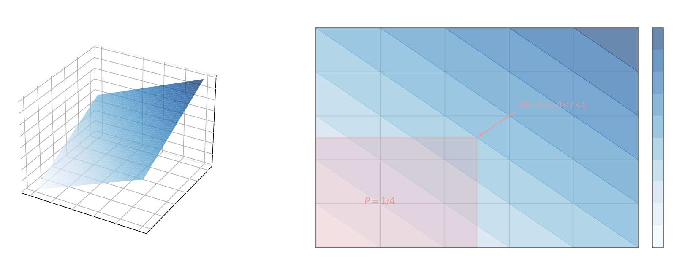

## Система двух случайных величин. Совместное распределение

Пара непрерывных случайных величин $(X, Y)$ полностью описывается **совместной плотностью распределения** $\omega(x, y)$ — неотрицательной функцией, интеграл которой по всей плоскости равен единице:

$$\iint_{-\infty}^{+\infty} \omega(x, y)\, dx\, dy = 1$$

Геометрически $\omega(x, y)$ задаёт «поверхность вероятностей» над плоскостью $Oxy$. Вероятность попадания пары $(X, Y)$ в прямоугольник $a < X < b$, $c < Y < d$ вычисляется как объём под этой поверхностью:

$$P(a < X < b,\; c < Y < d) = \int_a^b\!\int_c^d \omega(x, y)\, dy\, dx$$

## Маргинальные плотности

Зная совместную плотность, можно получить распределение каждой из величин в отдельности — **маргинальную (частную) плотность** — интегрируя по другой переменной:

$$\omega_1(x) = \int_{-\infty}^{+\infty} \omega(x, y)\, dy, \qquad \omega_2(y) = \int_{-\infty}^{+\infty} \omega(x, y)\, dx$$

Тогда для любого промежутка $[a, b]$ вероятность события $\{a < X < b\}$ (безотносительно $Y$) равна:

$$P(a < X < b) = \int_a^b \omega_1(x)\, dx$$

Это аналог формулы полной вероятности: мы «суммируем» по всем возможным значениям $Y$.

## Условные плотности

По аналогии с формулой умножения $P(AB) = P(A)\cdot P(B|A)$ для плотностей:

$$\omega(x, y) = \omega_1(x)\cdot\omega(y \mid x) = \omega_2(y)\cdot\omega(x \mid y)$$

Отсюда **условная плотность** $X$ при фиксированном $Y = y$:

$$\omega(x \mid y) = \frac{\omega(x, y)}{\omega_2(y)} = \frac{\omega(x, y)}{\displaystyle\int_{-\infty}^{+\infty} \omega(x, y)\, dx}$$

и условная плотность $Y$ при фиксированном $X = x$:

$$\omega(y \mid x) = \frac{\omega(x, y)}{\omega_1(x)} = \frac{\omega(x, y)}{\displaystyle\int_{-\infty}^{+\infty} \omega(x, y)\, dy}$$

Условная плотность — это «срез» совместной поверхности при данном значении одной переменной, нормированный так, чтобы её интеграл равнялся единице. Если $X$ и $Y$ **независимы**, то $\omega(x,y) = \omega_1(x)\cdot\omega_2(y)$ и условные плотности совпадают с маргинальными.

## Совместная функция распределения

**Совместная функция распределения (ФР)**:

$$F(x, y) = P(X < x,\; Y < y) = \int_{-\infty}^{x}\!\int_{-\infty}^{y} \omega(u, v)\, dv\, du$$

Свойства $F(x, y)$:

- $F(x, -\infty) = F(-\infty, y) = F(-\infty, -\infty) = 0$
- $F(x, +\infty) = F_1(x)$ — маргинальная ФР величины $X$
- $F(+\infty, y) = F_2(y)$ — маргинальная ФР величины $Y$
- $F(+\infty, +\infty) = 1$

Вероятность прямоугольника через ФР:

$$P(a \leq X \leq b,\; c \leq Y \leq d) = \int_a^b\!\int_c^d \omega(x,y)\,dx\,dy = F(b,d) - F(a,d) - F(b,c) + F(a,c)$$

Формула для прямоугольника напоминает формулу включений-исключений: из полного угла $F(b,d)$ вычитаются два лишних угла, но при этом угол $F(a,c)$ оказывается вычтенным дважды — его нужно прибавить обратно.

## Пример

Пусть совместная плотность равна $\omega(x, y) = x + y$ при $0 < x < 1$, $0 < y < 1$, и $\omega = 0$ вне единичного квадрата.

**Проверка нормировки:**
$$\int_0^1\!\int_0^1 (x + y)\,dy\,dx = \int_0^1\!\left[xy + \frac{y^2}{2}\right]_0^1 dx = \int_0^1 \left(x + \frac{1}{2}\right)dx = \frac{1}{2} + \frac{1}{2} = 1\;\checkmark$$

**Маргинальная плотность $X$:**
$$\omega_1(x) = \int_0^1 (x + y)\,dy = x + \frac{1}{2}, \quad 0 < x < 1$$

**Маргинальная плотность $Y$:**
$$\omega_2(y) = \int_0^1 (x + y)\,dx = \frac{1}{2} + y, \quad 0 < y < 1$$

**Вероятность прямоугольника** $\bigl\{0 < X < \tfrac{1}{2},\; 0 < Y < \tfrac{1}{2}\bigr\}$:
$$P = \int_0^{1/2}\!\int_0^{1/2} (x+y)\,dy\,dx = \int_0^{1/2}\!\left[\frac{1}{4}x + \frac{1}{8}\right]dx = \frac{1}{8} + \frac{1}{8} = \frac{1}{4}$$

Заметим, что величины $X$ и $Y$ **не независимы**: $\omega(x,y) = x+y \neq \omega_1(x)\cdot\omega_2(y) = (x+\tfrac{1}{2})(y+\tfrac{1}{2})$.
