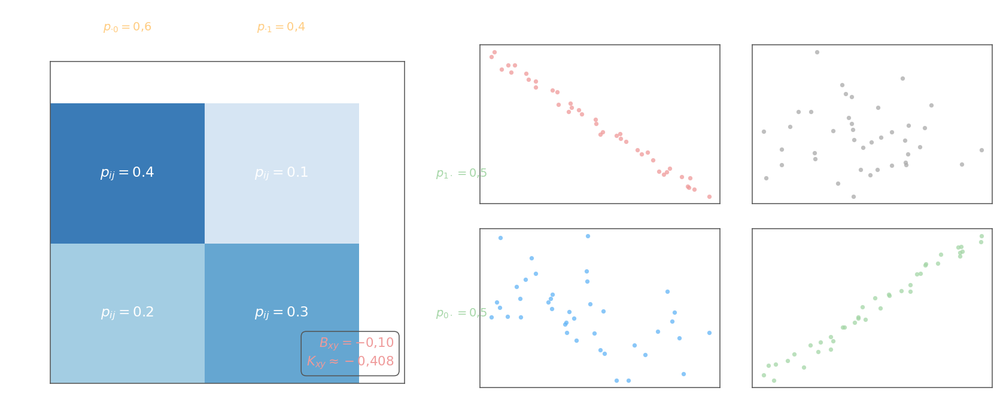

## Зависимость случайных величин. Смешанные моменты

Две случайные величины $X$ и $Y$ называются **независимыми**, если условное распределение $Y$ не зависит от того, какое значение принял $X$, то есть $\omega(y \mid x) = \omega_2(y)$. Необходимое и достаточное условие независимости — факторизация совместной плотности:

$$\omega(x, y) = \omega_1(x)\cdot\omega_2(y)$$

Для зависимых величин совместная плотность раскладывается только через условные:

$$\omega(x, y) = \omega_1(x)\cdot\omega(y \mid x) = \omega_2(y)\cdot\omega(x \mid y)$$

## Смешанные моменты

Числовые характеристики системы $(X, Y)$ определяются **смешанными моментами порядка $(k, s)$**.

**Начальный смешанный момент:**

$$\alpha_{k,s} = M\{X^k \cdot Y^s\}$$

**Центральный смешанный момент:**

$$\mu_{k,s} = M\{(X - m_x)^k\cdot(Y - m_y)^s\}$$

Для **дискретного** вектора $(X, Y)$ с вероятностями $p_{ij} = P(X = x_i,\; Y = y_j)$:

$$\alpha_{k,s} = \sum_i\sum_j x_i^k\, y_j^s\, p_{ij}, \qquad \mu_{k,s} = \sum_i\sum_j (x_i - m_x)^k(y_j - m_y)^s\, p_{ij}$$

Для **непрерывного** вектора:

$$\alpha_{k,s} = \int_{-\infty}^{+\infty}\!\int_{-\infty}^{+\infty} x^k\, y^s\;\omega(x,y)\,dx\,dy, \qquad \mu_{k,s} = \int_{-\infty}^{+\infty}\!\int_{-\infty}^{+\infty}(x-m_x)^k(y-m_y)^s\;\omega(x,y)\,dx\,dy$$

Частные случаи — привычные одномерные характеристики:

$$m_x = \alpha_{1,0} = M\{X\}, \quad m_y = \alpha_{0,1} = M\{Y\}$$

$$D_x = \mu_{2,0} = M\{(X - m_x)^2\}, \quad D_y = \mu_{0,2} = M\{(Y - m_y)^2\}$$

## Ковариация

Ключевую роль играет **смешанный центральный момент первого порядка** $\mu_{1,1}$, называемый **ковариацией**:

$$B_{xy} = \mu_{1,1} = M\{(X - m_x)(Y - m_y)\} = \int_{-\infty}^{+\infty}\!\int_{-\infty}^{+\infty}(x - m_x)(y - m_y)\;\omega(x,y)\,dx\,dy$$

Для дискретного случая: $B_{xy} = \displaystyle\sum_i\sum_j(x_i - m_x)(y_j - m_y)\,p_{ij}$.

**Если $X$ и $Y$ независимы**, ковариация равна нулю. Действительно, для независимых $\omega(x,y) = \omega_1(x)\omega_2(y)$, поэтому интеграл распадается на произведение:

$$B_{xy} = \int(x-m_x)\omega_1(x)\,dx \cdot \int(y-m_y)\omega_2(y)\,dy = (m_x - m_x)(m_y - m_y) = 0$$

Обратное неверно: $B_{xy} = 0$ не гарантирует независимости (только отсутствие линейной связи).

**Если $Y = kX + b$ — линейная зависимость**, ковариация принимает максимальное значение. Вычислим:

$$B_{xy} = \iint(x - m_x)(kx + b - km_x - b)\,\omega(x,y)\,dx\,dy = k\iint(x-m_x)^2\omega(x,y)\,dx\,dy = k\,D_x = k\,\sigma_x^2$$

При этом $D_y = k^2\sigma_x^2$, откуда $\sigma_y = |k|\sigma_x$ и $B_{xy} = k\sigma_x^2 = \sigma_x\cdot|k|\sigma_x = \pm\sigma_x\sigma_y$. Таким образом, $|B_{xy}|$ достигает максимума $\sigma_x\sigma_y$ именно при точной линейной зависимости.

## Коэффициент корреляции

**Коэффициент корреляции** нормирует ковариацию на произведение стандартных отклонений:

$$K_{xy} = \frac{B_{xy}}{\sigma_x\,\sigma_y}, \qquad -1 \leq K_{xy} \leq 1$$

Он характеризует **линейную** зависимость между $X$ и $Y$. При $K_{xy} = \pm 1$ — точная линейная связь; при $K_{xy} = 0$ — линейная связь отсутствует (но нелинейная возможна). На практике по выборке объёма $N$ используют **коэффициент Пирсона**:

$$K_{xy} = \frac{1}{N-1}\cdot\frac{1}{\hat{\sigma}_x\,\hat{\sigma}_y}\sum_{i=1}^{N}(x_i - \hat{m}_x)(y_i - \hat{m}_y)$$

где $\hat{m}_x, \hat{m}_y, \hat{\sigma}_x, \hat{\sigma}_y$ — выборочные средние и стандартные отклонения. Связь с [выборочным коэффициентом корреляции](../correlation-regression-analysis/1-correlation-analysis.md) из корреляционного анализа прямая: $r_\text{выб} = K_{xy}$, вычисленный по тем же данным.

## Пример — дискретный вектор

Совместное распределение $(X, Y)$:

| $X \backslash Y$ | $0$ | $1$ | $P(X = x_i)$ |
|:---:|:---:|:---:|:---:|
| $0$ | $0{,}2$ | $0{,}3$ | $0{,}5$ |
| $1$ | $0{,}4$ | $0{,}1$ | $0{,}5$ |
| $P(Y=y_j)$ | $0{,}6$ | $0{,}4$ | $1$ |

Средние: $m_x = 0 \cdot 0{,}5 + 1 \cdot 0{,}5 = 0{,}5$, $\quad m_y = 0 \cdot 0{,}6 + 1 \cdot 0{,}4 = 0{,}4$.

Дисперсии:
$$D_x = (0-0{,}5)^2\cdot0{,}5 + (1-0{,}5)^2\cdot0{,}5 = 0{,}25, \quad \sigma_x = 0{,}5$$
$$D_y = (0-0{,}4)^2\cdot0{,}6 + (1-0{,}4)^2\cdot0{,}4 = 0{,}24, \quad \sigma_y \approx 0{,}490$$

Ковариация:
$$B_{xy} = (-0{,}5)(-0{,}4)\cdot0{,}2 + (-0{,}5)(0{,}6)\cdot0{,}3 + (0{,}5)(-0{,}4)\cdot0{,}4 + (0{,}5)(0{,}6)\cdot0{,}1$$
$$= 0{,}04 - 0{,}09 - 0{,}08 + 0{,}03 = -0{,}10$$

Коэффициент корреляции:
$$K_{xy} = \frac{-0{,}10}{0{,}5\cdot0{,}490} \approx -0{,}408$$

Умеренная отрицательная корреляция: при большем $X$ значение $Y$ в среднем меньше.
