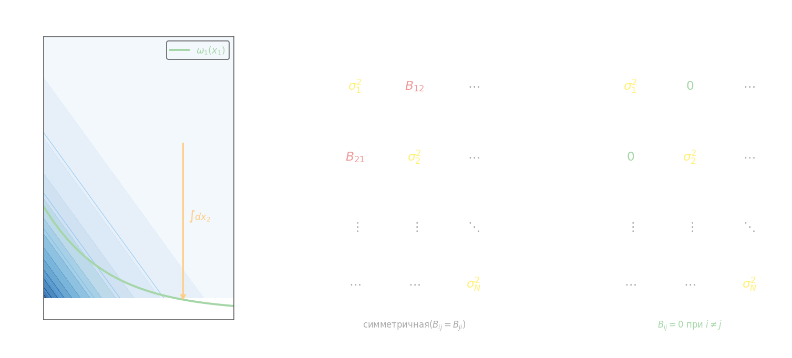

## Система нескольких случайных величин

Набор $N$ случайных величин образует **случайный вектор** (систему):

$$\mathbf{X} = [X_1,\; X_2,\; \ldots,\; X_N]^T$$

Полное описание системы задаётся **совместной функцией распределения**:

$$F(x_1, x_2, \ldots, x_N) = P(X_1 < x_1,\; X_2 < x_2,\; \ldots,\; X_N < x_N)$$

и **совместной плотностью** $\omega(x_1, x_2, \ldots, x_N)$, связанной с ФР через смешанную частную производную $N$-го порядка:

$$\omega(x_1, x_2, \ldots, x_N) = \frac{\partial^N F(x_1, \ldots, x_N)}{\partial x_1\,\partial x_2\cdots \partial x_N}$$

## Маргинальные распределения

**Маргинальная ФР** $j$-й компоненты получается подстановкой $+\infty$ на месте всех остальных аргументов:

$$F_j(x_j) = F(+\infty, \ldots, x_j, \ldots, +\infty)$$

Обобщение — совместная ФР первых $k$ компонент:

$$F_1(x_1) = F(x_1, +\infty, \ldots, +\infty)$$

**Маргинальная совместная плотность** первых $k$ переменных получается интегрированием совместной плотности по остальным:

$$\omega_{1,2,\ldots,k}(x_1, \ldots, x_k) = \int_{-\infty}^{+\infty}\!\cdots\!\int_{-\infty}^{+\infty} \omega(x_1, \ldots, x_N)\; dx_{k+1}\cdots dx_N$$

Это многомерное обобщение формулы маргинальной плотности из [двумерного случая](2-joint-distribution.md): там мы интегрировали по одной переменной, здесь — по $N - k$ переменным.

## Условная плотность

**Условная совместная плотность** первых $k$ переменных при фиксированных значениях остальных:

$$\omega(x_1, \ldots, x_k \mid x_{k+1}, \ldots, x_N) = \frac{\omega(x_1, \ldots, x_N)}{\omega_{k+1,\ldots,N}(x_{k+1}, \ldots, x_N)}$$

где знаменатель — маргинальная плотность «условиционирующих» переменных $X_{k+1}, \ldots, X_N$.

## Независимость компонент

Величины $X_1, X_2, \ldots, X_N$ **независимы в совокупности**, если совместная плотность факторизуется на произведение маргинальных:

$$\omega(x_1, x_2, \ldots, x_N) = \omega_1(x_1)\cdot\omega_2(x_2)\cdots\omega_N(x_N)$$

## Вектор средних и ковариационная матрица

Числовые характеристики случайного вектора компактно записываются в матричном виде.

**Вектор математических ожиданий** (вектор средних):

$$\mathbf{m} = M\{\mathbf{X}\} = [m_1,\; m_2,\; \ldots,\; m_N]^T, \qquad m_i = M\{X_i\}$$

**Ковариационная матрица** (матрица корреляционных моментов):

$$\mathbf{K} = \begin{pmatrix} \sigma_1^2 & B_{12} & \cdots & B_{1N} \\ B_{21} & \sigma_2^2 & \cdots & B_{2N} \\ \vdots & \vdots & \ddots & \vdots \\ B_{N1} & B_{N2} & \cdots & \sigma_N^2 \end{pmatrix}$$

где диагональные элементы $\sigma_i^2 = D\{X_i\}$ — дисперсии компонент, а внедиагональные $B_{ij} = M\{(X_i - m_i)(X_j - m_j)\}$ — ковариации пар (в соответствии с определением из [предыдущего раздела](3-moments-covariance.md), $B_{ij} = B_{ji}$, матрица симметрична).

Если все компоненты **попарно некоррелированы** (в частности, независимы), то $B_{ij} = 0$ при $i \neq j$ и матрица становится **диагональной**:

$$\mathbf{K} = \begin{pmatrix} \sigma_1^2 & 0 & \cdots & 0 \\ 0 & \sigma_2^2 & \cdots & 0 \\ \vdots & \vdots & \ddots & \vdots \\ 0 & 0 & \cdots & \sigma_N^2 \end{pmatrix}$$

## Пример

Рассмотрим трёхмерный случайный вектор $\mathbf{X} = (X_1, X_2, X_3)^T$ с совместной плотностью:

$$\omega(x_1, x_2, x_3) = e^{-x_1 - x_2 - x_3}, \quad x_1, x_2, x_3 > 0$$

**Нормировка:**
$$\int_0^\infty\!\int_0^\infty\!\int_0^\infty e^{-x_1-x_2-x_3}\,dx_1\,dx_2\,dx_3 = \left(\int_0^\infty e^{-t}\,dt\right)^3 = 1^3 = 1 \;\checkmark$$

**Маргинальные плотности** (интегрируем по двум другим переменным):

$$\omega_1(x_1) = \int_0^\infty\!\int_0^\infty e^{-x_1-x_2-x_3}\,dx_2\,dx_3 = e^{-x_1}\cdot 1 \cdot 1 = e^{-x_1}$$

Аналогично $\omega_2(x_2) = e^{-x_2}$, $\omega_3(x_3) = e^{-x_3}$.

**Независимость:** $\omega(x_1,x_2,x_3) = \omega_1(x_1)\cdot\omega_2(x_2)\cdot\omega_3(x_3)$ — выполнено, все три компоненты независимы.

**Вектор средних:** каждое $X_i \sim \mathrm{Exp}(1)$, поэтому $m_i = 1$, и

$$\mathbf{m} = [1,\; 1,\; 1]^T$$

**Ковариационная матрица:** $D\{X_i\} = 1$ для показательного распределения, ковариации нулевые в силу независимости:

$$\mathbf{K} = \begin{pmatrix}1&0&0\\0&1&0\\0&0&1\end{pmatrix} = \mathbf{I}_3$$

Единичная ковариационная матрица означает, что все три компоненты некоррелированы и имеют одинаковый разброс.
