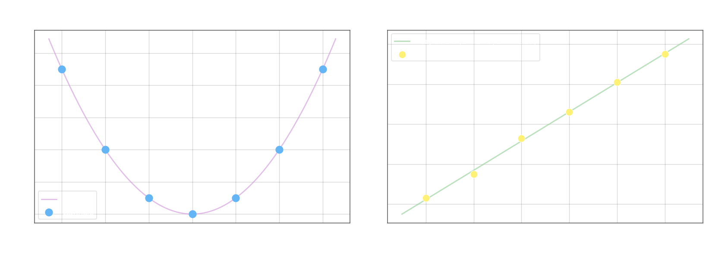

## Элементы корреляционного анализа

**Корреляционный анализ** изучает взаимосвязь между случайными величинами $X$ и $Y$, предполагая, что они имеют нормальное распределение. Важно различать два типа зависимости. При **функциональной зависимости** каждому значению $X = x$ соответствует ровно одно значение $Y$. При **корреляционной (стохастической) зависимости** каждому значению $X = x$ соответствует целое распределение значений $Y$, а характеристикой этого распределения служит **условное среднее** $\bar{y}_x$ — среднее значение $Y$ при фиксированном $X = x$. Зависимость условного среднего от $x$, то есть $\bar{y}_x = f(x)$, называется **уравнением регрессии** $Y$ на $X$.

## Линейный коэффициент корреляции Пирсона

Мерой линейной связи между двумя случайными величинами служит **линейный коэффициент корреляции**:

$$r = \frac{M(XY) - M(X)\,M(Y)}{\sigma(X)\,\sigma(Y)}$$

где $M(XY)$ — математическое ожидание произведения, $\sigma(X)$, $\sigma(Y)$ — стандартные отклонения. Числитель представляет собой **ковариацию** $\mathrm{cov}(X, Y) = M(XY) - M(X)M(Y)$, а знаменатель нормирует её до безразмерной величины.

Коэффициент $r$ обладает рядом ключевых свойств. Если $X$ и $Y$ независимы, то $M(XY) = M(X)M(Y)$, следовательно $r = 0$, однако обратное неверно: $r = 0$ исключает лишь линейную связь, но не нелинейную. При точной линейной зависимости $r = \pm 1$. Знак указывает направление: $r > 0$ соответствует прямой зависимости (оба признака растут вместе), $r < 0$ — обратной. Всегда выполняется $-1 \leq r \leq 1$.

## Выборочный коэффициент корреляции

На практике $M(X)$, $M(Y)$ и дисперсии неизвестны, поэтому используют **выборочный коэффициент корреляции**, вычисляемый по $n$ парам наблюдений $(x_i, y_i)$:

$$r_\text{выб} = \frac{\overline{xy} - \bar{x}\,\bar{y}}{\sigma_x\,\sigma_y}$$

Все величины оцениваются непосредственно из выборки:

$$\bar{x} = \frac{1}{n}\sum_{i=1}^n x_i, \qquad \bar{y} = \frac{1}{n}\sum_{i=1}^n y_i, \qquad \overline{xy} = \frac{1}{n}\sum_{i=1}^n x_i y_i$$

$$\overline{x^2} = \frac{1}{n}\sum_{i=1}^n x_i^2, \qquad \overline{y^2} = \frac{1}{n}\sum_{i=1}^n y_i^2$$

$$\sigma_x^2 = \overline{x^2} - \bar{x}^2, \qquad \sigma_y^2 = \overline{y^2} - \bar{y}^2$$

где $\sigma_x = \sqrt{\sigma_x^2}$, $\sigma_y = \sqrt{\sigma_y^2}$ — выборочные стандартные отклонения.

## Пример 1 — нулевая линейная корреляция при нелинейной зависимости

Рассмотрим данные $y = x^2$ при симметричных значениях $x$:

| $x$ | $-3$ | $-2$ | $-1$ | $0$ | $1$ | $2$ | $3$ |
| --- | ---- | ---- | ---- | --- | --- | --- | --- |
| $y$ | $9$  | $4$  | $1$  | $0$ | $1$ | $4$ | $9$ |

$$\bar{x} = \frac{1}{7}(-3 - 2 - 1 + 0 + 1 + 2 + 3) = 0$$

$$\bar{y} = \frac{1}{7}(9 + 4 + 1 + 0 + 1 + 4 + 9) = 4$$

$$\overline{xy} = \frac{1}{7}(-27 - 8 - 1 + 0 + 1 + 8 + 27) = 0$$

$$\overline{xy} - \bar{x}\,\bar{y} = 0 - 0 \cdot 4 = 0 \implies r_\text{выб} = 0$$

Линейная связь отсутствует, хотя зависимость $y = x^2$ существует и является точной. Это наглядно иллюстрирует ограниченность $r$: он обнаруживает только линейную составляющую корреляции.

## Пример 2 — тесная линейная корреляция

Имеются шесть пар наблюдений:

| $x$ | $1$     | $2$     | $3$     | $4$     | $5$     | $6$     |
| --- | ------- | ------- | ------- | ------- | ------- | ------- |
| $y$ | $0{,}3$ | $1{,}5$ | $3{,}3$ | $4{,}6$ | $6{,}1$ | $7{,}5$ |

Вычисляем средние и средние квадратов:

$$\bar{x} = \frac{1}{6}(1 + 2 + 3 + 4 + 5 + 6) = 3{,}5$$

$$\bar{y} = \frac{1}{6}(0{,}3 + 1{,}5 + 3{,}3 + 4{,}6 + 6{,}1 + 7{,}5) \approx 3{,}883$$

$$\overline{x^2} = \frac{1}{6}(1 + 4 + 9 + 16 + 25 + 36) = \frac{91}{6} \approx 15{,}167$$

$$\overline{y^2} = \frac{1}{6}(0{,}09 + 2{,}25 + 10{,}89 + 21{,}16 + 37{,}21 + 56{,}25) \approx 21{,}308$$

$$\overline{xy} = \frac{1}{6}(1{\cdot}0{,}3 + 2{\cdot}1{,}5 + 3{\cdot}3{,}3 + 4{\cdot}4{,}6 + 5{\cdot}6{,}1 + 6{\cdot}7{,}5) = \frac{107{,}1}{6} \approx 17{,}85$$

Дисперсии и стандартные отклонения:

$$\sigma_x^2 = 15{,}167 - 3{,}5^2 = 15{,}167 - 12{,}25 = 2{,}917 \implies \sigma_x \approx 1{,}708$$

$$\sigma_y^2 = 21{,}308 - 3{,}883^2 \approx 21{,}308 - 15{,}078 = 6{,}23 \implies \sigma_y \approx 2{,}496$$

Выборочный коэффициент корреляции:

$$r_\text{выб} = \frac{17{,}85 - 3{,}5 \cdot 3{,}883}{1{,}708 \cdot 2{,}496} = \frac{17{,}85 - 13{,}591}{4{,}263} \approx 0{,}981$$

Значение $r \approx 0{,}981$ близко к $1$, что свидетельствует о **тесной прямой линейной зависимости** между $X$ и $Y$.
