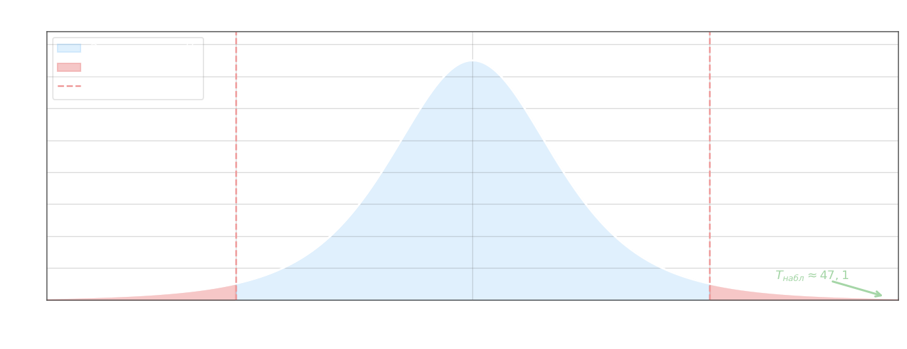

## Проверка гипотезы о значимости коэффициента корреляции

Выборочный коэффициент корреляции $r_\text{выб}$, вычисленный по $n$ наблюдениям, является лишь оценкой генерального коэффициента $r_\text{ген}$. Перед интерпретацией связи необходимо убедиться, что наблюдаемое $r_\text{выб}$ не является случайным отклонением от нуля, характерным для всей генеральной совокупности. Проверяют гипотезы:

$$H_0\colon r_\text{ген} = 0, \qquad H_1\colon r_\text{ген} \neq 0$$

При справедливой $H_0$ статистика

$$T_\text{набл} = \frac{r_\text{выб}\,\sqrt{n - 2}}{\sqrt{1 - r_\text{выб}^2}}$$

имеет распределение Стьюдента с $k = n - 2$ степенями свободы. Критическое значение $T_\text{кр}(\alpha;\, k)$ берётся из таблицы Стьюдента для двустороннего критерия. Если $|T_\text{набл}| > T_\text{кр}$, нулевая гипотеза отвергается и коэффициент корреляции признаётся значимым.

**Пример.** По данным примера 2 из [предыдущего конспекта](1-correlation-analysis.md) имеем $r_\text{выб} = 0{,}9991$, $n = 6$, $\alpha = 0{,}05$.

$$T_\text{набл} = \frac{0{,}9991 \cdot \sqrt{6 - 2}}{\sqrt{1 - 0{,}9991^2}} = \frac{0{,}9991 \cdot 2}{\sqrt{1 - 0{,}9982}} = \frac{1{,}9982}{\sqrt{0{,}0018}} \approx \frac{1{,}9982}{0{,}04243} \approx 47{,}1$$

Степени свободы $k = 6 - 2 = 4$. Из таблицы Стьюдента: $T_\text{кр}(0{,}05;\, 4) = 2{,}78$. Поскольку $T_\text{набл} = 47{,}1 \gg 2{,}78$, наблюдаемое значение глубоко в правой критической области $(-\infty;\,-2{,}78) \cup (2{,}78;\,+\infty)$, и $H_0$ **отвергается**: коэффициент корреляции значимо отличается от нуля, линейная связь между $X$ и $Y$ подтверждается.

## Доверительный интервал для генерального коэффициента корреляции

Помимо проверки значимости, на практике строят **доверительный интервал**, который с надёжностью $\gamma$ накрывает истинное значение $r_\text{ген}$:

$$r_\text{выб} - \Delta_r < r_\text{ген} < r_\text{выб} + \Delta_r$$

Предельная погрешность вычисляется по формуле:

$$\Delta_r = t \cdot \frac{1 - r_\text{выб}^2}{\sqrt{n}}$$

где $t$ определяется из условия $\Phi(t) = \gamma/2$ по таблице функции Лапласа, $\Phi(t) = \dfrac{1}{\sqrt{2\pi}}\int_0^t e^{-u^2/2}\,du$. Множитель $(1 - r_\text{выб}^2)$ отражает тот факт, что при $|r_\text{выб}| \to 1$ оценка становится устойчивее и интервал сужается.

**Пример.** Дано $r_\text{выб} = 0{,}9991$, $n = 6$, надёжность $\gamma = 0{,}9545$.

Находим $t$ из условия:

$$\Phi(t) = \frac{\gamma}{2} = \frac{0{,}9545}{2} = 0{,}47725 \implies t = 2$$

Вычисляем предельную погрешность:

$$\Delta_r = 2 \cdot \frac{1 - 0{,}9991^2}{\sqrt{6}} = 2 \cdot \frac{1 - 0{,}9982}{2{,}449} = 2 \cdot \frac{0{,}0018}{2{,}449} \approx 0{,}0015$$

Доверительный интервал:

$$0{,}9991 - 0{,}0015 < r_\text{ген} < 0{,}9991 + 0{,}0015$$

$$0{,}9976 < r_\text{ген} < 1$$

Верхняя граница формально равна $1{,}0006$, но поскольку $r_\text{ген} \leq 1$ по определению, она усекается до $1$. С вероятностью $0{,}9545$ генеральный коэффициент корреляции лежит в интервале $(0{,}9976;\; 1)$ — связь является тесной и практически линейной.
