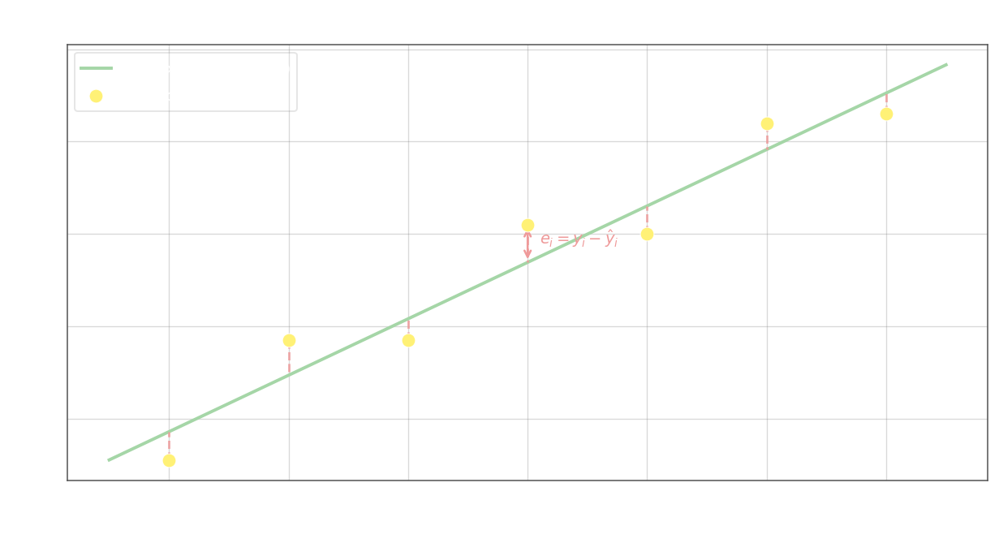

## Метод наименьших квадратов (МНК)

Пусть имеется $n$ пар наблюдений $(x_i,\, y_i)$, $i = 1, 2, \ldots, n$. Уравнение регрессии задано параметрической функцией $\hat{y} = \varphi(x;\, a_0, a_1, \ldots, a_m)$, содержащей $m+1$ неизвестный коэффициент. Задача МНК — найти значения $a_0, a_1, \ldots, a_m$, при которых кривая регрессии наилучшим образом проходит через облако точек.

Для каждой наблюдаемой пары определяется **остаток** (невязка) — вертикальное отклонение наблюдаемого значения от предсказанного:

$$e_i = y_i - \varphi(x_i;\, a_0, \ldots, a_m), \qquad i = 1, 2, \ldots, n$$

Остатки могут быть как положительными, так и отрицательными, поэтому в качестве меры суммарного отклонения берут сумму их квадратов. МНК минимизирует функционал:

$$S(a_0, a_1, \ldots, a_m) = \sum_{i=1}^{n} e_i^2 = \sum_{i=1}^{n} \bigl(y_i - \varphi(x_i;\, a_0, \ldots, a_m)\bigr)^2 \;\longrightarrow\; \min$$

Квадратичная форма $S$ гарантирует, что все слагаемые неотрицательны и крупные отклонения штрафуются сильнее малых. Именно поэтому МНК более чувствителен к выбросам, чем, например, минимизация суммы модулей $|e_i|$.

## Нормальные уравнения

Необходимое условие минимума $S$ — равенство нулю всех частных производных по параметрам:

$$\frac{\partial S}{\partial a_k}(a_0, \ldots, a_m) = 0, \qquad k = 0, 1, \ldots, m$$

Это даёт систему из $m+1$ уравнений — **нормальные уравнения МНК**. Их решение однозначно определяет оптимальные коэффициенты $a_0^*, \ldots, a_m^*$. Раскрывая производную:

$$\frac{\partial S}{\partial a_k} = -2\sum_{i=1}^{n}\bigl(y_i - \varphi(x_i;\, a_0, \ldots, a_m)\bigr)\,\frac{\partial \varphi}{\partial a_k}(x_i;\, a_0, \ldots, a_m) = 0$$

что эквивалентно условию ортогональности вектора остатков каждому из базисных направлений пространства параметров. В матричной форме нормальные уравнения записываются как $\mathbf{X}^\top \mathbf{X}\,\mathbf{a} = \mathbf{X}^\top \mathbf{y}$, откуда при невырожденной матрице Грама получают явное решение $\mathbf{a}^* = (\mathbf{X}^\top \mathbf{X})^{-1}\mathbf{X}^\top \mathbf{y}$.
