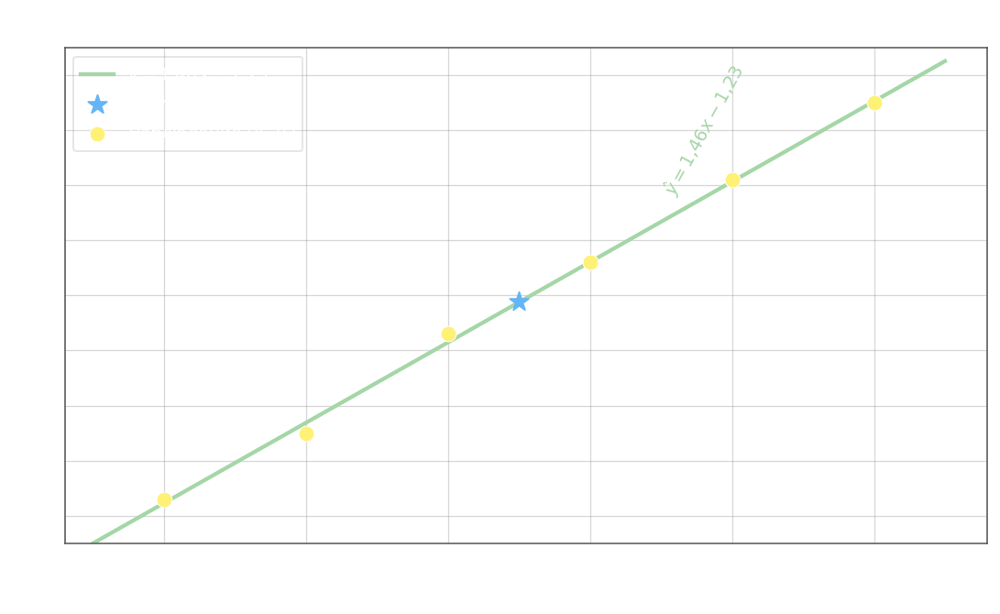

## Линейная регрессия: нормальные уравнения и формулы коэффициентов

Простейший случай регрессии — линейная модель с двумя параметрами:

$$\hat{y}_x = ax + b$$

где $a$ — наклон (коэффициент регрессии) и $b$ — свободный член (сдвиг). По методу наименьших квадратов необходимо минимизировать:

$$S(a, b) = \sum_{i=1}^{n}(y_i - ax_i - b)^2 \;\longrightarrow\; \min$$

Приравниваем обе частные производные к нулю:

$$\frac{\partial S}{\partial a} = -2\sum_{i=1}^{n}x_i(y_i - ax_i - b) = 0 \implies \sum x_i y_i - a\sum x_i^2 - b\sum x_i = 0$$

$$\frac{\partial S}{\partial b} = -2\sum_{i=1}^{n}(y_i - ax_i - b) = 0 \implies \sum y_i - a\sum x_i - nb = 0$$

Это даёт **систему нормальных уравнений**:

$$\begin{cases} a\displaystyle\sum x_i^2 + b\sum x_i = \sum x_i y_i \\[6pt] a\displaystyle\sum x_i + bn = \sum y_i \end{cases}$$

## Решение: явные формулы для a и b

Разделив обе части каждого уравнения на $n$ и введя обозначения $\bar{x} = \dfrac{1}{n}\sum x_i$, $\bar{y} = \dfrac{1}{n}\sum y_i$, $\overline{xy} = \dfrac{1}{n}\sum x_i y_i$, $\overline{x^2} = \dfrac{1}{n}\sum x_i^2$, система принимает матричную форму:

$$\begin{pmatrix}\overline{x^2} & \bar{x} \\ \bar{x} & 1\end{pmatrix} \begin{pmatrix}a \\ b\end{pmatrix} = \begin{pmatrix}\overline{xy} \\ \bar{y}\end{pmatrix}$$

Определители по правилу Крамера:

$$\Delta = \overline{x^2} - \bar{x}^2 = \sigma_x^2, \qquad \Delta_a = \overline{xy} - \bar{x}\,\bar{y} = \sigma_{xy}$$

где $\sigma_x^2$ — выборочная дисперсия $X$, $\sigma_{xy}$ — выборочная ковариация. Отсюда:

$$\boxed{a = \frac{\overline{xy} - \bar{x}\,\bar{y}}{\overline{x^2} - \bar{x}^2} = \frac{\sigma_{xy}}{\sigma_x^2}}$$

$$\boxed{b = \bar{y} - a\bar{x}}$$

Связь с корреляционным анализом: $a = r_\text{выб}\cdot\dfrac{\sigma_y}{\sigma_x}$, откуда видно, что наклон линии регрессии пропорционален коэффициенту корреляции. Из второй формулы следует, что прямая регрессии всегда проходит через точку $(\bar{x},\,\bar{y})$.

## Пример — подбор прямой регрессии

Используем данные из [анализа корреляции](1-correlation-analysis.md):

| $x$ | $1$   | $2$   | $3$   | $4$   | $5$   | $6$   |
|-----|-------|-------|-------|-------|-------|-------|
| $y$ | $0{,}3$ | $1{,}5$ | $3{,}3$ | $4{,}6$ | $6{,}1$ | $7{,}5$ |

Средние и вспомогательные величины (вычислены ранее):

$$\bar{x} = 3{,}5, \quad \bar{y} \approx 3{,}883, \quad \overline{x^2} \approx 15{,}167, \quad \overline{xy} \approx 17{,}85$$

Коэффициент регрессии:

$$a = \frac{\overline{xy} - \bar{x}\,\bar{y}}{\overline{x^2} - \bar{x}^2} = \frac{17{,}85 - 3{,}5 \cdot 3{,}883}{15{,}167 - 3{,}5^2} = \frac{17{,}85 - 13{,}591}{15{,}167 - 12{,}25} = \frac{4{,}259}{2{,}917} \approx 1{,}46$$

Свободный член:

$$b = \bar{y} - a\bar{x} = 3{,}883 - 1{,}46 \cdot 3{,}5 = 3{,}883 - 5{,}11 \approx -1{,}23$$

Уравнение линейной регрессии:

$$\hat{y} = 1{,}46\,x - 1{,}23$$

Прямая объясняет практически всю изменчивость $Y$, что согласуется с $r_\text{выб} \approx 0{,}981$ из предыдущего анализа — высокая корреляция гарантирует хорошее качество линейной регрессии.

