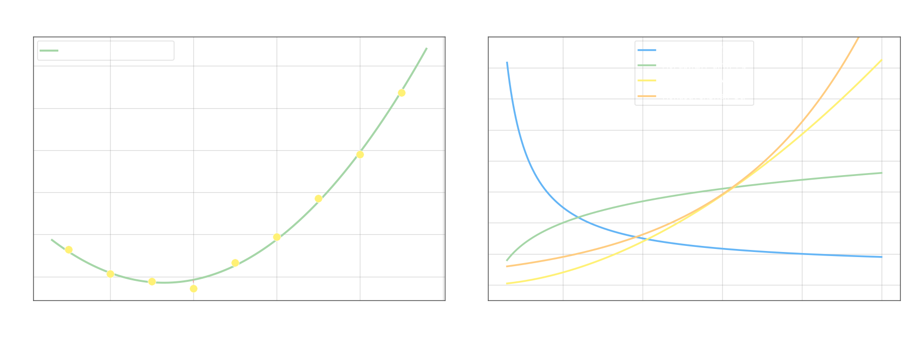

## Нелинейная регрессия

Когда данные явно не описываются прямой, подбирают нелинейное уравнение регрессии. МНК применяется в том же виде: минимизируется $S = \sum(y_i - \hat{y}_i)^2$, частные производные по всем параметрам приравниваются к нулю.

## Параболическая зависимость

Модель с тремя параметрами:

$$\hat{y}_x = ax^2 + bx + c$$

Функционал МНК:

$$S(a, b, c) = \sum_{i=1}^{n}\bigl(y_i - (ax_i^2 + bx_i + c)\bigr)^2$$

Условия минимума:

$$\frac{\partial S}{\partial a} = -2\sum_{i=1}^{n}(y_i - ax_i^2 - bx_i - c)\,x_i^2 = 0$$

$$\frac{\partial S}{\partial b} = -2\sum_{i=1}^{n}(y_i - ax_i^2 - bx_i - c)\,x_i = 0$$

$$\frac{\partial S}{\partial c} = -2\sum_{i=1}^{n}(y_i - ax_i^2 - bx_i - c) = 0$$

Раскрывая скобки и деля каждое уравнение на $n$, получаем **систему нормальных уравнений** через выборочные средние:

$$\begin{cases} a\,\overline{x^4} + b\,\overline{x^3} + c\,\overline{x^2} = \overline{x^2 y} \\[4pt] a\,\overline{x^3} + b\,\overline{x^2} + c\,\bar{x} = \overline{xy} \\[4pt] a\,\overline{x^2} + b\,\bar{x} + c = \bar{y} \end{cases}$$

где обозначения те же, что в [линейной регрессии](5-linear-regression.md): $\overline{x^k} = \dfrac{1}{n}\sum x_i^k$, $\overline{x^k y} = \dfrac{1}{n}\sum x_i^k y_i$. Система линейна относительно $a, b, c$ и решается стандартными методами (метод Гаусса, Крамера и т.д.).

## Линеаризация нелинейных зависимостей

Многие нелинейные модели сводятся к линейной через подходящую замену переменных. После замены применяется обычная [линейная регрессия](5-linear-regression.md) с уравнением $\hat{Y} = aZ + b$.

**Гиперболическая зависимость.** Модель $\hat{y}_x = \dfrac{a}{x} + b$. Замена $z = \dfrac{1}{x}$ превращает её в линейную $\hat{y}_z = az + b$. Нормальные уравнения (через средние по $z_i = 1/x_i$):

$$\begin{cases} a\,\bar{z} + b = \bar{y} \\[4pt] a\,\overline{z^2} + b\,\bar{z} = \overline{zy} \end{cases}$$

**Логарифмическая зависимость.** Модель $\hat{y}_x = a\ln x + b$. Замена $z = \ln x$ немедленно даёт $\hat{y}_z = az + b$.

**Степенная зависимость.** Модель $\hat{y}_x = \beta\, x^{\alpha}$. Логарифмируем обе части:

$$\ln \hat{y}_x = \ln\beta + \alpha \ln x$$

Замены $Y = \ln y$, $z = \ln x$, $a = \alpha$, $b = \ln\beta$ дают $Y = az + b$. После нахождения $a$ и $b$ возвращаемся: $\alpha = a$, $\beta = e^b$.

**Показательная зависимость.** Модель $\hat{y}_x = \beta\,\alpha^x$. Логарифмируем:

$$\ln \hat{y}_x = \ln\beta + x\ln\alpha$$

Замены $Y = \ln y$, $z = x$ (не меняется!), $a = \ln\alpha$, $b = \ln\beta$ дают $Y = az + b$. Обратное преобразование: $\alpha = e^a$, $\beta = e^b$.

Общий принцип: подобрать замену переменных так, чтобы уравнение стало линейным, применить МНК в новых переменных, вернуться к исходным. Выбор подходящей модели опирается на визуальный анализ облака точек и содержательный смысл задачи.
