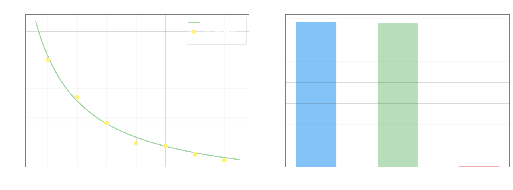

## Оценка тесноты корреляционной нелинейной связи

Линейный коэффициент корреляции $r$ измеряет только силу **линейной** зависимости. Для оценки тесноты произвольной нелинейной связи, когда уравнение регрессии $\hat{y}_x = f(x)$ уже построено, используют **корреляционное соотношение** $\eta$.

Идея состоит в разложении общей дисперсии $Y$ на две части. **Общая дисперсия** (до учёта регрессии) характеризует разброс всех $y_i$ вокруг выборочной средней:

$$\sigma_y^2 = \frac{1}{n}\sum_{i=1}^{n}(y_i - \bar{y})^2$$

где $\bar{y} = \dfrac{1}{n}\sum_{i=1}^{n} y_i$. **Остаточная дисперсия** характеризует разброс наблюдений вокруг линии регрессии — ту часть изменчивости, которую модель не объяснила:

$$\sigma_\text{ос}^2 = \frac{1}{n}\sum_{i=1}^{n}(y_i - \hat{y}_{x_i})^2$$

где $\hat{y}_{x_i} = f(x_i)$ — выровненные (предсказанные) значения. Чем лучше регрессия, тем меньше $\sigma_\text{ос}^2$ по сравнению с $\sigma_y^2$.

**Выборочное корреляционное соотношение:**

$$\eta_\text{выб} = \sqrt{1 - \frac{\sigma_\text{ос}^2}{\sigma_y^2}}$$

Величина $\eta_\text{выб}$ принимает значения $0 \leq \eta \leq 1$. При $\eta = 0$ регрессия не уменьшает дисперсию — связи нет. При $\eta = 1$ все точки лежат точно на кривой регрессии. В отличие от $r$, корреляционное соотношение всегда неотрицательно и подходит для любой формы зависимости.

## Пример

Данные о затухании сигнала при увеличении расстояния:

| $x_i$ | $4$ | $6$ | $8$ | $10$ | $12$ | $14$ | $16$ |
|--------|-----|-----|-----|------|------|------|------|
| $y_i$ | $0{,}50$ | $0{,}37$ | $0{,}28$ | $0{,}21$ | $0{,}20$ | $0{,}17$ | $0{,}15$ |

Подобрана гиперболическая регрессия (методом [линеаризации](6-nonlinear-regression.md)):

$$\hat{y}_x = \frac{1{,}9}{x} + 0{,}04$$

Средняя и общая дисперсия ($n = 7$):

$$\bar{y} = \frac{1}{7}(0{,}50 + 0{,}37 + 0{,}28 + 0{,}21 + 0{,}20 + 0{,}17 + 0{,}15) = \frac{1{,}88}{7} \approx 0{,}269$$

$$\sigma_y^2 = \frac{1}{7}\sum(y_i - \bar{y})^2 \approx 0{,}01370$$

Выровненные значения $\hat{y}_i$ и остатки $e_i = y_i - \hat{y}_i$:

| $x_i$ | $\hat{y}_i$ | $e_i$ | $e_i^2$ |
|--------|------------|-------|---------|
| $4$ | $0{,}515$ | $-0{,}015$ | $0{,}000225$ |
| $6$ | $0{,}357$ | $\phantom{-}0{,}013$ | $0{,}000169$ |
| $8$ | $0{,}278$ | $\phantom{-}0{,}002$ | $0{,}000004$ |
| $10$ | $0{,}230$ | $-0{,}020$ | $0{,}000400$ |
| $12$ | $0{,}198$ | $\phantom{-}0{,}002$ | $0{,}000004$ |
| $14$ | $0{,}176$ | $-0{,}006$ | $0{,}000036$ |
| $16$ | $0{,}159$ | $-0{,}009$ | $0{,}000081$ |

$$\sigma_\text{ос}^2 = \frac{1}{7}\sum e_i^2 = \frac{0{,}000919}{7} \approx 0{,}0001313$$

$$\eta_\text{выб} = \sqrt{1 - \frac{0{,}0001313}{0{,}01370}} \approx \sqrt{0{,}9904} \approx 0{,}9952$$

Связь исключительно тесная: гиперболическая модель объясняет более $99{,}5\%$ дисперсии $Y$.

## Проверка значимости и доверительный интервал

Структура вывода полностью аналогична [проверке значимости коэффициента $r$](2-correlation-significance.md). Гипотезы:

$$H_0\colon \eta_\text{ген} = 0, \qquad H_1\colon \eta_\text{ген} \neq 0$$

Статистика имеет распределение Стьюдента с $k = n - 2$ степенями свободы:

$$T_\text{набл} = \frac{\eta_\text{выб}\,\sqrt{n - 2}}{\sqrt{1 - \eta_\text{выб}^2}}$$

Если $|T_\text{набл}| > T_\text{кр}(\alpha;\, k)$, нулевая гипотеза отвергается.

Доверительный интервал с надёжностью $\gamma$:

$$\eta_\text{выб} - \Delta_\eta < \eta_\text{ген} < \eta_\text{выб} + \Delta_\eta, \qquad \Delta_\eta = t \cdot \frac{1 - \eta_\text{выб}^2}{\sqrt{n}}$$

где $t$ находится из $\Phi(t) = \gamma/2$ по таблице функции Лапласа.
