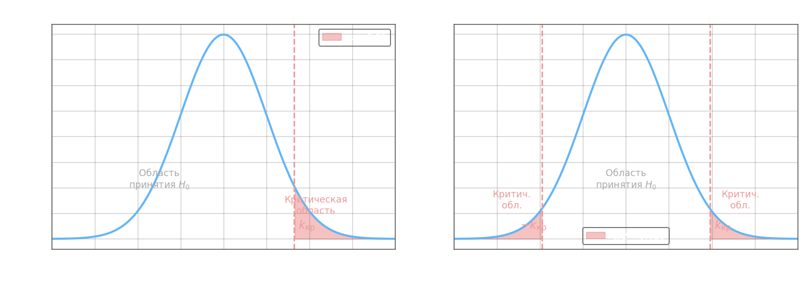

## Статистическая проверка гипотез. Классические тесты

Задача статистического принятия решений состоит в том, чтобы по выборке $(x_1, x_2, \dots, x_n)$ сделать обоснованный вывод об истинном значении параметра генеральной совокупности. Формально формулируются две конкурирующие гипотезы о параметре $\mu$ (например, математическом ожидании).

**Нулевая гипотеза** $H_0$ утверждает, что параметр равен фиксированному значению $q$:

$$H_0\colon \mu = q$$

**Альтернативная гипотеза** $H_1$ задаёт направление отклонения. Для одностороннего (правостороннего) теста:

$$H_1\colon \mu > q$$

Для двустороннего теста:

$$H_1\colon \mu \neq q$$

где $q$ — числовое значение, проверяемое по данным.

## Ошибки двух родов

При проверке гипотезы всегда существует риск неверного решения. Различают два принципиально разных типа ошибок.

**Ошибка I рода** (ложная тревога) — отвергнуть $H_0$, когда она в действительности верна. Вероятность этой ошибки обозначается $\alpha$ и называется **уровнем значимости** теста.

**Ошибка II рода** (пропуск) — принять $H_0$, когда в действительности верна $H_1$. Вероятность этой ошибки обозначается $\beta$.

$$\alpha = P(\text{отвергнуть } H_0 \mid H_0 \text{ верна}), \quad \beta = P(\text{принять } H_0 \mid H_1 \text{ верна})$$

Снижение $\alpha$ при фиксированном объёме выборки $n$ неизбежно увеличивает $\beta$, и наоборот. Единственный способ уменьшить оба — увеличить $n$.

**Мощность теста** (сила теста) — вероятность правильно отвергнуть неверную $H_0$:

$$W = 1 - \beta$$

Хороший тест имеет малый уровень значимости $\alpha$ и высокую мощность $W$. На практике задают $\alpha \in \{0.05,\; 0.01,\; 0.001\}$ и стремятся максимизировать $W$.

## Критическая область и критическое значение

Проверка гипотезы основана на **тестовой статистике** $K$ — числовой функции от выборки, распределение которой при $H_0$ известно. По заданному $\alpha$ находят **критическое значение** $k_\text{кр}$ (порог), разделяющее область принятия $H_0$ и **критическую область** (область отвержения).

Для **одностороннего (правостороннего)** теста $H_1\colon \mu > q$ критическая область — правый хвост:

$$K > k_\text{кр}$$

Для **двустороннего** теста $H_1\colon \mu \neq q$ критическая область — оба хвоста:

$$|K| > k_\text{кр}$$

где $k_\text{кр}$ выбирается симметрично так, чтобы суммарная вероятность попасть в хвосты при $H_0$ равнялась $\alpha$. Если распределение статистики симметрично (например, нормальное или $t$-распределение), двусторонний критерий выражается через квантиль уровня $\alpha/2$:

$$P(K > k_\text{кр}) = \frac{\alpha}{2}$$

## Схема принятия решения

Наблюдаемое значение статистики $k_\text{набл}$ сравнивается с $k_\text{кр}$:

- если $k_\text{набл}$ попадает в критическую область — $H_0$ **отвергается** на уровне значимости $\alpha$;
- иначе — оснований отвергнуть $H_0$ **нет** (не «$H_0$ доказана», а лишь «данных недостаточно, чтобы её опровергнуть»).

## p-значение

Альтернативный и более информативный способ отчёта — **p-значение** (p-value): минимальный уровень значимости, при котором наблюдаемые данные дают основание отвергнуть $H_0$.

$$p = P(K \geq k_\text{набл} \mid H_0)$$

для одностороннего теста (для двустороннего берётся $2 \cdot P(K \geq |k_\text{набл}|)$).

Интерпретация проста: если $p < \alpha$, то $H_0$ отвергается. Например:

- $p = 0.03$ при $\alpha = 0.05$: $H_0$ отвергается — данные достаточно редки при $H_0$;
- $p = 0.17$ при $\alpha = 0.05$: $H_0$ **не** отвергается — вероятность таких данных при $H_0$ достаточно велика (17%), оснований для отклонения нет.

## Критерий $\chi^2$ для дискретных распределений

Когда данные имеют дискретный характер (категории, частоты), применяется **критерий хи-квадрат Пирсона**. По $s$ категориям наблюдаются частоты $n_1, \dots, n_s$ при теоретических (ожидаемых при $H_0$) частотах $np_1, \dots, np_s$. Тестовая статистика:

$$\chi^2 = \sum_{i=1}^{s} \frac{(n_i - np_i)^2}{np_i}$$

где $n$ — объём выборки, $p_i$ — теоретическая вероятность $i$-й категории согласно $H_0$. При выполнении $H_0$ и $n \to \infty$ эта статистика имеет распределение $\chi^2$ с $(s-1)$ степенями свободы. Критическая область — правосторонняя: $\chi^2 > \chi^2_\text{кр}(\alpha,\, s-1)$.

Критерий применим, если ожидаемые частоты $np_i \geq 5$ для всех $i$; при малых ожидаемых частотах используют точный критерий (например, критерий Фишера для таблиц $2\times 2$).

Для **мультиномиального** распределения (обобщение биномиального на несколько исходов) та же статистика $\chi^2$ остаётся стандартным инструментом проверки соответствия теоретическому закону.
