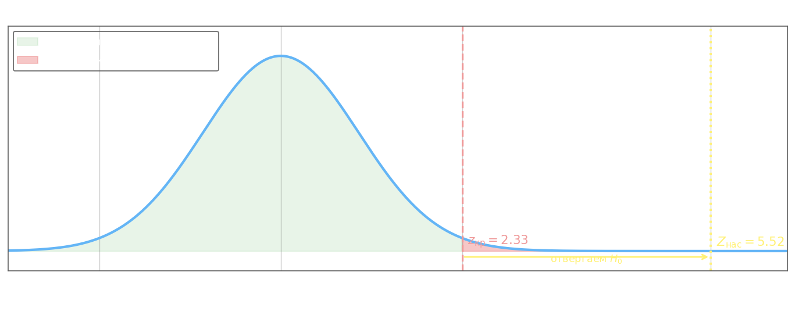

## Сравнение средних двух независимых выборок

Часто требуется установить, значимо ли различаются математические ожидания двух генеральных совокупностей по данным двух независимых выборок объёмов $n_1$ и $n_2$. Нулевая гипотеза во всех таких тестах одна:

$$H_0\colon \mu_1 = \mu_2$$

Выбор конкретной процедуры определяется тем, известны ли генеральные дисперсии и каков объём выборок.

## Z-тест (известные дисперсии или большие выборки)

Если обе выборки извлечены из нормальных генеральных совокупностей с известными дисперсиями $D_1 = D(x_1)$ и $D_2 = D(x_2)$, тестовая статистика строится на основе стандартизованной разности выборочных средних:

$$Z_\text{нас} = \frac{\bar{x}_1 - \bar{x}_2}{\sqrt{\dfrac{D_1}{n_1} + \dfrac{D_2}{n_2}}}$$

где $\bar{x}_1$, $\bar{x}_2$ — выборочные средние, $n_1$, $n_2$ — объёмы выборок. При выполнении $H_0$ статистика $Z_\text{нас}$ имеет стандартное нормальное распределение $N(0,1)$, что позволяет брать критические значения из таблицы функции Лапласа $\Phi_0(t) = \frac{1}{\sqrt{2\pi}}\int_0^t e^{-u^2/2}\,du$.

Для **одностороннего** теста $H_1\colon \mu_1 > \mu_2$ критическая область — правый хвост: $Z_\text{нас} > z_\text{кр}$, где $z_\text{кр}$ находится из $\Phi_0(z_\text{кр}) = 0{,}5 - \alpha$. При $\alpha = 0{,}01$ это даёт $z_\text{кр} = 2{,}33$.

Для **двустороннего** теста $H_1\colon \mu_1 \neq \mu_2$: $|Z_\text{нас}| > z_\text{кр}$, где $\Phi_0(z_\text{кр}) = \frac{1-\alpha}{2}$. При $\alpha = 0{,}02$ также получаем $z_\text{кр} = 2{,}33$.

При больших объёмах выборок ($n_1, n_2 \geq 30$) генеральные дисперсии можно заменить выборочными $S_1^2$, $S_2^2$ — по центральной предельной теореме приближение нормальным остаётся точным.

**Пример.** Две группы изделий: $n_1 = 45$, $\bar{x}_1 = 196$; $n_2 = 40$, $\bar{x}_2 = 190$. Известно, что $\sigma_1 = \sigma_2 = 5$, т.е. $D_1 = D_2 = 25$. Проверить $H_0\colon \mu_1 = \mu_2$ против $H_1\colon \mu_1 > \mu_2$ при $\alpha = 0{,}01$.

$$Z_\text{нас} = \frac{196 - 190}{\sqrt{\dfrac{25}{45} + \dfrac{25}{40}}} = \frac{6}{\sqrt{0{,}556 + 0{,}625}} = \frac{6}{\sqrt{1{,}181}} \approx \frac{6}{1{,}087} \approx 5{,}52$$

Из таблицы Лапласа: $\Phi_0(2{,}33) = 0{,}49$, значит $z_\text{кр} = 2{,}33$. Поскольку $5{,}52 > 2{,}33$, $H_0$ **отвергается** — средние значимо различаются.

## T-тест Стьюдента с объединённой дисперсией (равные неизвестные дисперсии)

Если дисперсии генеральных совокупностей неизвестны, но предполагаются **равными** ($D_1 = D_2 = D$), оценку $D$ строят по обеим выборкам совместно. Объединённая (пулированная) выборочная дисперсия:

$$S_p^2 = \frac{(n_1 - 1)S_1^2 + (n_2 - 1)S_2^2}{n_1 + n_2 - 2}$$

где $S_1^2$, $S_2^2$ — несмещённые выборочные дисперсии каждой группы. Тогда тестовая статистика:

$$T_\text{нас} = \frac{\bar{x}_1 - \bar{x}_2}{\sqrt{S_p^2 \cdot \left(\dfrac{1}{n_1} + \dfrac{1}{n_2}\right)}} = \frac{\bar{x}_1 - \bar{x}_2}{\sqrt{\dfrac{(n_1-1)S_1^2 + (n_2-1)S_2^2}{n_1+n_2-2} \cdot \dfrac{n_1 + n_2}{n_1 n_2}}}$$

При выполнении $H_0$ статистика $T_\text{нас}$ имеет распределение Стьюдента с $k = n_1 + n_2 - 2$ степенями свободы. Критическое значение $t_\text{кр}(\alpha, k)$ берётся из таблицы $t$-распределения; при малых выборках ($n < 30$) использование нормального приближения недопустимо.

Для двустороннего теста $H_1\colon \mu_1 \neq \mu_2$ решение: отвергнуть $H_0$, если $|T_\text{нас}| > t_\text{кр}(\alpha, k)$.

**Пример.** Два набора данных в сгруппированном виде ($\alpha = 0{,}02$, двусторонний тест):

| $x_i$ | 25 | 35 | 40 | 50 | $\Sigma$ |
|:------:|:--:|:--:|:--:|:--:|:--------:|
| $n_{1i}$ | 3 | 3 | 2 | 2 | **10** |
| $n_{2i}$ | 4 | 4 | 3 | 4 | **15** |

Выборочные средние:

$$\bar{x}_1 = \frac{25 \cdot 3 + 35 \cdot 3 + 40 \cdot 2 + 50 \cdot 2}{10} = \frac{360}{10} = 36$$

$$\bar{x}_2 = \frac{25 \cdot 4 + 35 \cdot 4 + 40 \cdot 3 + 50 \cdot 4}{15} = \frac{560}{15} \approx 37{,}33$$

Несмещённые выборочные дисперсии:

$$S_1^2 = \frac{(25-36)^2 \cdot 3 + (35-36)^2 \cdot 3 + (40-36)^2 \cdot 2 + (50-36)^2 \cdot 2}{9} = \frac{363 + 3 + 32 + 392}{9} = \frac{790}{9} \approx 87{,}78$$

$$S_2^2 = \frac{(25-37{,}33)^2 \cdot 4 + (35-37{,}33)^2 \cdot 4 + (40-37{,}33)^2 \cdot 3 + (50-37{,}33)^2 \cdot 4}{14} \approx \frac{1293{,}5}{14} \approx 92{,}39$$

Объединённая дисперсия и тестовая статистика:

$$S_p^2 = \frac{9 \cdot 87{,}78 + 14 \cdot 92{,}39}{23} = \frac{790{,}02 + 1293{,}46}{23} \approx 90{,}59$$

$$T_\text{нас} = \frac{36 - 37{,}33}{\sqrt{90{,}59 \cdot \left(\dfrac{1}{10} + \dfrac{1}{15}\right)}} = \frac{-1{,}33}{\sqrt{90{,}59 \cdot 0{,}1\overline{6}}} = \frac{-1{,}33}{\sqrt{15{,}10}} \approx \frac{-1{,}33}{3{,}89} \approx -0{,}34$$

Степени свободы $k = 10 + 15 - 2 = 23$. Из таблицы $t$-распределения: $t_\text{кр}(0{,}02;\; 23) = 2{,}5$. Поскольку $|-0{,}34| = 0{,}34 < 2{,}5$, $H_0$ **не отвергается** — данные не дают оснований считать средние значимо различными.
