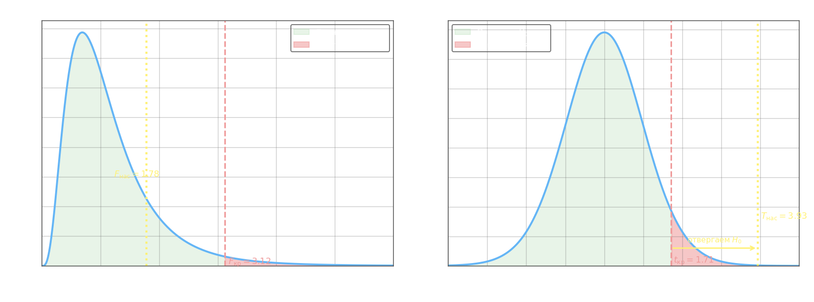

## F-тест Фишера равенства двух дисперсий

Перед применением двухвыборочного [t-теста с объединённой дисперсией](2-two-sample-mean-tests.md) необходимо проверить, выполняется ли допущение о равенстве генеральных дисперсий. Для этого используется **критерий Фишера** (F-тест).

Нулевая гипотеза: $H_0\colon D_1 = D_2$. Обе выборки должны быть из нормальных генеральных совокупностей.

Тестовая статистика строится как отношение большей выборочной дисперсии к меньшей, что гарантирует $F \geq 1$:

$$F_\text{нас} = \frac{S^2_\text{б}}{S^2_\text{м}}$$

где $S^2_\text{б} = \max(S^2_1, S^2_2)$ и $S^2_\text{м} = \min(S^2_1, S^2_2)$ — несмещённые выборочные дисперсии. При выполнении $H_0$ статистика $F_\text{нас}$ имеет распределение Фишера с параметрами:

$$k_1 = n_\text{б} - 1, \quad k_2 = n_\text{м} - 1$$

где $n_\text{б}$ и $n_\text{м}$ — объёмы выборок, дисперсии которых стоят в числителе и знаменателе соответственно. Если выборка с бо́льшей дисперсией оказалась второй, степени свободы меняются местами: $k_1 = n_2 - 1$, $k_2 = n_1 - 1$.

Критическое значение $F_\text{кр}(\alpha;\, k_1;\, k_2)$ берётся из таблицы F-распределения. Решение: если $F_\text{нас} > F_\text{кр}$, то $H_0$ отвергается — дисперсии значимо различаются.

**Пример.** Две независимые выборки из нормальных генеральных совокупностей: $n_1 = 5$, $S^2_1 = 26{,}7$ (большая); $n_2 = 6$, $S^2_2 = 5{,}15$ (меньшая); $\alpha = 0{,}05$.

$$F_\text{нас} = \frac{26{,}7}{5{,}15} \approx 5{,}18, \quad k_1 = 4, \quad k_2 = 5$$

Из таблицы Фишера: $F_\text{кр}(0{,}05;\; 4;\; 5) = 5{,}19$. Поскольку $5{,}18 < 5{,}19$, $H_0$ **не отвергается** — оснований считать дисперсии различными нет (на уровне значимости 0,05).

Заметим, что несмещённую дисперсию $S^2$ получают из биасированной (выборочной) $\sigma^2_\text{в}$ по формуле $S^2 = \dfrac{n}{n-1}\,\sigma^2_\text{в}$. В приведённом примере $\sigma^2_\text{в} = 21{,}36$ для первой выборки, откуда $S^2_1 = \tfrac{5}{4}\cdot 21{,}36 = 26{,}7$.

## Полный рабочий процесс: сначала F-тест, затем t-тест

На практике проверку двух средних выполняют в два шага. Сначала F-тестом выясняют, можно ли считать дисперсии равными, и только потом выбирают подходящий t-тест.

**Пример.** Даны два набора измерений: $n_1 = 10$, $\bar{x}_1 = 12{,}8$, $S^2_1 = 0{,}111$; $n_2 = 16$, $\bar{x}_2 = 12{,}35$, $S^2_2 = 0{,}0625$. Проверить $H_0\colon \mu_1 = \mu_2$ против $H_1\colon \mu_1 > \mu_2$ при $\alpha = 0{,}05$.

**Шаг 1 — проверка равенства дисперсий ($\alpha' = 0{,}025$ на каждую сторону).**

$$F_\text{нас} = \frac{S^2_\text{б}}{S^2_\text{м}} = \frac{0{,}111}{0{,}0625} \approx 1{,}78, \quad k_1 = n_1 - 1 = 9, \quad k_2 = n_2 - 1 = 15$$

Из таблицы: $F_\text{кр}(0{,}025;\; 9;\; 15) = 3{,}14$. Поскольку $1{,}78 < 3{,}14$, $H_0\colon D_1 = D_2$ **не отвергается** — дисперсии можно считать равными. Переходим к pooled t-тесту.

**Шаг 2 — t-тест с объединённой дисперсией.**

Формулу удобно записать через общий числитель:

$$T_\text{нас} = \frac{(\bar{x}_1 - \bar{x}_2)\,\sqrt{\dfrac{n_1 n_2\,(n_1+n_2-2)}{n_1+n_2}}}{\sqrt{(n_1-1)S^2_1 + (n_2-1)S^2_2}}$$

где числитель — стандартизованная разность средних, а знаменатель — корень из взвешенной суммы сумм квадратов. При $H_0$ статистика имеет $t$-распределение с $k = n_1 + n_2 - 2$ степенями свободы.

$$T_\text{нас} = \frac{(12{,}8 - 12{,}35)\cdot\sqrt{\dfrac{10 \cdot 16 \cdot 24}{26}}}{\sqrt{9 \cdot 0{,}111 + 15 \cdot 0{,}0625}} = \frac{0{,}45 \cdot \sqrt{147{,}69}}{\sqrt{0{,}999 + 0{,}9375}} = \frac{0{,}45 \cdot 12{,}15}{\sqrt{1{,}937}} = \frac{5{,}47}{1{,}39} \approx 3{,}93$$

$$k = 10 + 16 - 2 = 24, \quad t_\text{кр}(0{,}05;\; 24) = 1{,}71 \quad \text{(одностороннее)}$$

Поскольку $3{,}93 > 1{,}71$, $H_0$ **отвергается** — среднее первой группы значимо превышает среднее второй.

