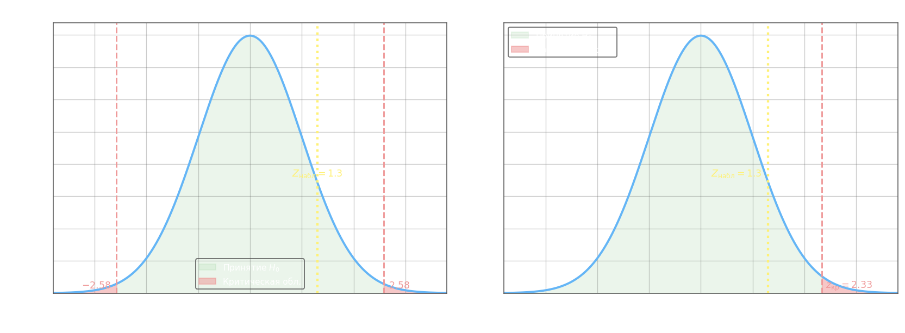

## Проверка гипотезы о значении генеральной средней (сравнение со стандартом)

Задача возникает, когда нужно решить, соответствует ли среднее генеральной совокупности некоторому эталонному значению $a$ — без второй выборки, только по одной. Нулевая гипотеза во всех вариантах:

$$H_0\colon \mu = a$$

Выбор конкретной статистики зависит от того, известна ли генеральная дисперсия.

## Z-тест (генеральная дисперсия $D(x)$ известна)

Если $X$ нормально распределена и $D(x)$ задана заранее, тестовая статистика:

$$Z_\text{набл} = \frac{\bar{x} - a}{\sqrt{\dfrac{D(x)}{n}}}$$

где $\bar{x}$ — выборочная средняя, $n$ — объём выборки. При $H_0$ статистика имеет стандартное нормальное распределение. Критическое значение находят из функции Лапласа $\Phi_0(t) = \dfrac{1}{\sqrt{2\pi}}\int_0^t e^{-u^2/2}\,du$:

- **двусторонняя** критическая область ($H_1\colon \mu \neq a$):

$$\Phi_0(Z_\text{кр}) = \frac{1-\alpha}{2}$$

- **односторонняя** критическая область ($H_1\colon \mu > a$ или $H_1\colon \mu < a$):

$$\Phi_0(Z_\text{кр}) = \frac{1-2\alpha}{2} = \frac{1}{2} - \alpha$$

Интуиция: в двустороннем тесте вероятность $\alpha$ делится поровну на два хвоста, поэтому аргумент функции Лапласа вдвое ближе к $0{,}5$; в одностороннем вся вероятность $\alpha$ находится в одном хвосте.

**Пример.** Генеральная дисперсия $D(x) = 40^2 = 1600$; выборка $n = 64$, $\bar{x} = 136{,}5$; $\alpha = 0{,}01$. Проверить $H_0\colon \mu = 130$.

$$Z_\text{набл} = \frac{136{,}5 - 130}{\sqrt{1600/64}} = \frac{6{,}5}{\sqrt{25}} = \frac{6{,}5}{5} = 1{,}3$$

**а) Двусторонняя альтернатива** $H_1\colon \mu \neq 130$:

$$\Phi_0(Z_\text{кр}) = \frac{1 - 0{,}01}{2} = 0{,}495 \implies Z_\text{кр} = 2{,}58$$

Поскольку $|Z_\text{набл}| = 1{,}3 < 2{,}58$, $Z_\text{набл}$ не попадает в критическую область $(-\infty;\,-2{,}58)\cup(2{,}58;\,+\infty)$ — $H_0$ **не отвергается**.

**б) Односторонняя альтернатива** $H_1\colon \mu > 130$:

$$\Phi_0(Z_\text{кр}) = \frac{1 - 2\cdot0{,}01}{2} = 0{,}49 \implies Z_\text{кр} = 2{,}33$$

Поскольку $1{,}3 < 2{,}33$, $H_0$ **не отвергается** — данных недостаточно, чтобы считать среднее значимо большим 130 даже на этом уровне значимости.

## T-тест Стьюдента (генеральная дисперсия неизвестна, $n < 30$)

Когда $D(x)$ неизвестна и выборка мала, используют выборочное стандартное отклонение $S$ и критерий Стьюдента:

$$T_\text{набл} = \frac{\bar{x} - a}{S}\,\sqrt{n}$$

где $S = \sqrt{\dfrac{1}{n-1}\sum_{i=1}^n (x_i - \bar{x})^2}$ — несмещённое выборочное стандартное отклонение. При $H_0$ статистика имеет $t$-распределение с $k = n - 1$ степенями свободы; критическое значение $T_\text{кр}(\alpha,\,k)$ берётся из таблицы Стьюдента.

**Пример.** Выборка $n = 22$, $\bar{x} = 18$, $S = 5$; $\alpha = 0{,}05$. Проверить $H_0\colon \mu = 19$.

$$T_\text{набл} = \frac{18 - 19}{5}\cdot\sqrt{22} = \frac{-1}{5}\cdot 4{,}690 \approx -0{,}94$$

Степени свободы: $k = 22 - 1 = 21$.

**а) Двусторонняя альтернатива** $H_1\colon \mu \neq 19$:

$T_\text{кр}(0{,}05;\; 21) = 2{,}08$. Критическая область: $(-\infty;\,-2{,}08)\cup(2{,}08;\,+\infty)$.

Поскольку $|{-}0{,}94| = 0{,}94 < 2{,}08$, $H_0$ **не отвергается**.

**б) Односторонняя альтернатива** $H_1\colon \mu < 19$:

$T_\text{кр}(0{,}05;\; 21) = 1{,}72$ (одностороннее). Критическая область: $(-\infty;\,-1{,}72)$.

Поскольку $T_\text{набл} = -0{,}94 > -1{,}72$, $H_0$ **не отвергается** — наблюдаемое значение не попадает в левый хвост.
