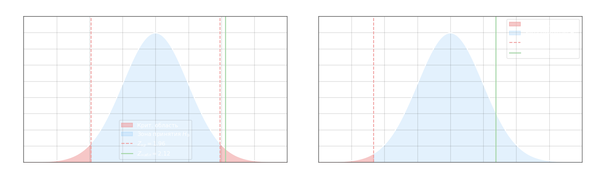

## Сравнение наблюдаемой относительной частоты с гипотетической вероятностью события

Задача возникает, когда по большому числу испытаний $n$ нужно решить, соответствует ли истинная вероятность $p$ появления события некоторому эталонному значению $p_0$. Наблюдаемой характеристикой служит относительная частота $\omega = m/n$, где $m$ — число появлений события. Нулевая гипотеза:

$$H_0\colon p = p_0$$

При большом $n$ и справедливой $H_0$ по центральной предельной теореме $\omega$ приближённо нормально распределена, поэтому тестовая статистика имеет стандартное нормальное распределение:

$$Z_\text{набл} = \frac{\omega - p_0}{\sqrt{p_0\,(1 - p_0)}}\,\sqrt{n}$$

где $\omega$ — наблюдаемая частота, $p_0$ — гипотетическая вероятность, $n$ — объём выборки. Знаменатель $\sqrt{p_0(1-p_0)}$ — стандартное отклонение одного испытания Бернулли при $H_0$.

Критическое значение определяется через функцию Лапласа $\Phi(t) = \dfrac{1}{\sqrt{2\pi}}\int_0^t e^{-u^2/2}\,du$. Для двусторонней критической области ($H_1\colon p \neq p_0$):

$$\Phi(Z_\text{кр}) = \frac{1 - \alpha}{2}$$

Для односторонней критической области ($H_1\colon p < p_0$ или $H_1\colon p > p_0$):

$$\Phi(Z_\text{кр}) = \frac{1 - 2\alpha}{2}$$

Логика та же, что и в одновыборочном Z-тесте для средней: при двустороннем критерии вероятность ошибки $\alpha$ делится поровну на оба хвоста, при одностороннем — вся сосредоточена в одном. Если $|Z_\text{набл}| < Z_\text{кр}$, нулевая гипотеза не отвергается.

**Пример.** Изделие считается соответствующим стандарту, если вероятность успешного прохождения контроля $p \geq 0{,}95$. Проверено $n = 100$ изделий, из них $m = 98$ прошли контроль. Уровень значимости $\alpha = 0{,}1$. Выдвигают гипотезы:

$$H_0\colon p = 0{,}95, \quad H_1\colon p < 0{,}95$$

Это левосторонний тест — производителя интересует, не ниже ли доля стандарта. Вычисляем наблюдаемую частоту и статистику:

$$\omega = \frac{98}{100} = 0{,}98$$

$$Z_\text{набл} = \frac{0{,}98 - 0{,}95}{\sqrt{0{,}95 \cdot 0{,}05}}\,\sqrt{100} = \frac{0{,}03}{\sqrt{0{,}0475}} \cdot 10 \approx \frac{0{,}03}{0{,}2179} \cdot 10 \approx 1{,}377$$

Критическое значение для одностороннего теста:

$$\Phi(Z_\text{кр}) = \frac{1 - 2 \cdot 0{,}1}{2} = 0{,}49 \implies Z_\text{кр} = 2{,}33$$

Поскольку $Z_\text{набл} = 1{,}377 < Z_\text{кр} = 2{,}33$, наблюдаемое значение не попадает в левую критическую область $(-\infty;\,-2{,}33)$, и $H_0$ **не отвергается**: нет оснований считать, что доля качественных изделий ниже стандарта.

**Пример 2.** Монету подбрасывают $n = 200$ раз, орёл выпал $m = 115$ раз. На уровне $\alpha = 0{,}05$ проверить, является ли монета симметричной.

$$H_0\colon p = 0{,}5, \quad H_1\colon p \neq 0{,}5$$

$$\omega = \frac{115}{200} = 0{,}575$$

$$Z_\text{набл} = \frac{0{,}575 - 0{,}5}{\sqrt{0{,}5 \cdot 0{,}5}}\,\sqrt{200} = \frac{0{,}075}{0{,}5} \cdot 14{,}142 \approx 2{,}12$$

$$\Phi(Z_\text{кр}) = \frac{1 - 0{,}05}{2} = 0{,}475 \implies Z_\text{кр} = 1{,}96$$

Так как $|Z_\text{набл}| = 2{,}12 > 1{,}96$, $H_0$ **отвергается**: наблюдаемая частота значимо отличается от $0{,}5$ на уровне значимости $0{,}05$.
