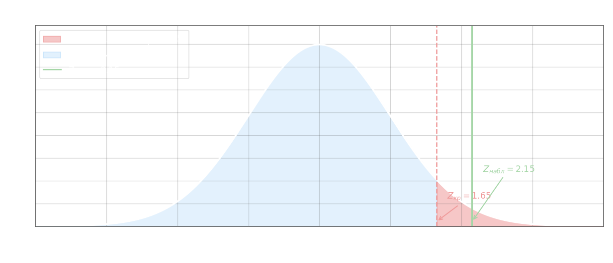

## Сравнение двух вероятностей биномиальных распределений

Задача возникает, когда имеются две независимые генеральные совокупности и нужно решить, одинакова ли в них вероятность появления некоторого события $A$. В серии испытаний первой совокупности объёмом $n_1$ событие $A$ наступило $m_1$ раз; в серии из $n_2$ испытаний второй совокупности — $m_2$ раз. Наблюдаемые частоты:

$$\omega_1 = \frac{m_1}{n_1}, \qquad \omega_2 = \frac{m_2}{n_2}$$

Нулевая гипотеза утверждает равенство двух вероятностей:

$$H_0\colon p_1 = p_2$$

Под $H_0$ обе выборки можно считать взятыми из одной генеральной совокупности с некоторой общей вероятностью $p$, которую оценивают объединённой частотой:

$$\omega = \frac{m_1 + m_2}{n_1 + n_2}$$

где $\omega$ — pooled-оценка, учитывающая оба набора испытаний сразу. При больших $n_1$ и $n_2$ разность $\omega_1 - \omega_2$ приближённо нормальна, и тестовая статистика:

$$Z_\text{набл} = \frac{\omega_1 - \omega_2}{\sqrt{\omega\,(1 - \omega)\!\left(\dfrac{1}{n_1} + \dfrac{1}{n_2}\right)}}$$

имеет стандартное нормальное распределение при справедливой $H_0$. Знаменатель — стандартное отклонение разности частот, построенное на pooled-оценке дисперсии; слагаемые $1/n_1$ и $1/n_2$ отражают вклад каждой выборки в суммарную погрешность.

Критическое значение определяется через функцию Лапласа $\Phi$. Для двусторонней альтернативы ($H_1\colon p_1 \neq p_2$):

$$\Phi(Z_\text{кр}) = \frac{1 - \alpha}{2}$$

Для односторонней альтернативы ($H_1\colon p_1 > p_2$ или $H_1\colon p_1 < p_2$):

$$\Phi(Z_\text{кр}) = \frac{1 - 2\alpha}{2}$$

Если $|Z_\text{набл}| < Z_\text{кр}$, нулевая гипотеза не отвергается. Связь с [тестом для одной доли](5-proportion-test.md) очевидна: при $n_2 \to \infty$ и $\omega_2 \to p_0$ формула вырождается в одновыборочный случай.

**Пример.** Имеются две партии изделий: из первой проверено $n_1 = 200$ штук, бракованных $m_1 = 20$; из второй $n_2 = 300$ штук, бракованных $m_2 = 15$. На уровне значимости $\alpha = 0{,}05$ проверить, превышает ли доля брака в первой партии долю брака во второй:

$$H_0\colon p_1 = p_2, \quad H_1\colon p_1 > p_2$$

Наблюдаемые частоты и pooled-оценка:

$$\omega_1 = \frac{20}{200} = 0{,}1, \quad \omega_2 = \frac{15}{300} = 0{,}05, \quad \omega = \frac{35}{500} = 0{,}07$$

Вычисляем статистику:

$$Z_\text{набл} = \frac{0{,}1 - 0{,}05}{\sqrt{0{,}07 \cdot 0{,}93 \cdot \left(\tfrac{1}{200} + \tfrac{1}{300}\right)}} = \frac{0{,}05}{\sqrt{0{,}0651 \cdot 0{,}00\overline{8}}} \approx \frac{0{,}05}{0{,}02329} \approx 2{,}15$$

Критическое значение для правостороннего теста:

$$\Phi(Z_\text{кр}) = \frac{1 - 2 \cdot 0{,}05}{2} = 0{,}45 \implies Z_\text{кр} = 1{,}65$$

Поскольку $Z_\text{набл} = 2{,}15 > Z_\text{кр} = 1{,}65$, наблюдаемое значение попадает в правую критическую область $(1{,}65;\,+\infty)$, и $H_0$ **отвергается**: доля брака в первой партии значимо выше, чем во второй.

**Пример 2.** В двух группах испытуемых проверяли эффективность вакцины. В первой группе ($n_1 = 500$) заболели $m_1 = 30$ человек, во второй (контрольной, $n_2 = 500$) — $m_2 = 50$. На уровне $\alpha = 0{,}05$ проверить, снижает ли вакцина вероятность заболевания:

$$H_0\colon p_1 = p_2, \quad H_1\colon p_1 < p_2$$

$$\omega_1 = 0{,}06, \quad \omega_2 = 0{,}10, \quad \omega = \frac{80}{1000} = 0{,}08$$

$$Z_\text{набл} = \frac{0{,}06 - 0{,}10}{\sqrt{0{,}08 \cdot 0{,}92 \cdot \left(\tfrac{1}{500} + \tfrac{1}{500}\right)}} = \frac{-0{,}04}{\sqrt{0{,}0736 \cdot 0{,}004}} = \frac{-0{,}04}{0{,}01715} \approx -2{,}33$$

$$\Phi(Z_\text{кр}) = \frac{1 - 2 \cdot 0{,}05}{2} = 0{,}45 \implies Z_\text{кр} = 1{,}65$$

Критическая область для левостороннего теста: $(-\infty;\,-1{,}65)$. Поскольку $Z_\text{набл} = -2{,}33 < -1{,}65$, $H_0$ **отвергается**: вакцина значимо снижает вероятность заболевания.
