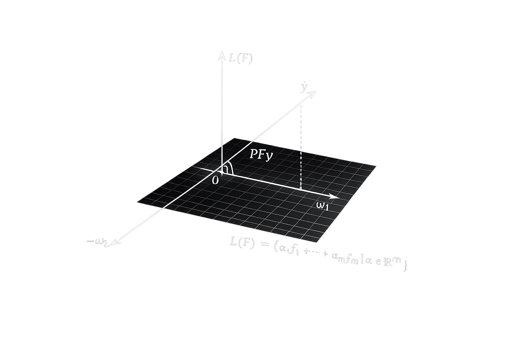

# Метод максимума правдоподобия и МНК

Модель данных с гауссовым шумом:

$
y(x_i) = f(x_i, ω) + ε_i,  ε_i \sim \mathcal{N}(0, σ_i^2)
$

Метод максимума правдоподобия:

$
L(ε_1, \ldots, ε_n \mid ω) = \prod_{i=1}^{n} \frac{1}{\sqrt{2\piσ_i^2}} \exp\left(-\frac{ε_i^2}{2σ_i^2}\right) \to \max
$

Логарифм правдоподобия:

$
-\ln L(ε_1, \ldots, ε_n \mid ω) = const(ω) + \frac{1}{2} \sum_{i=1}^{n} \frac{(f(x_i, ω) - y_i)^2}{σ_i^2} \to \min
$

Вес объектов:

$
w_i = \frac{1}{σ_i^2}
$

чем больше шум -> меньше вес

Пусть $f_1(x), \ldots, f_m(x)$ — базисные функции

Модель линейной регрессии:

$
f(x, ω) = \sum_{j=1}^{m} ω_j f_j(x),  ω \in \mathbb{R}^m
$

Матричное обозначение:

$
F =
\begin{pmatrix}
f_1(x_1) & \cdots & f_m(x_1) \\
\vdots & \ddots & \vdots \\
f_1(x_n) & \cdots & f_m(x_n)
\end{pmatrix}, 
y =
\begin{pmatrix}
y_1 \\
\vdots \\
y_n
\end{pmatrix}, 
ω =
\begin{pmatrix}
ω_1 \\
\vdots \\
ω_m
\end{pmatrix}
$

Ошибка:

$
Q(ω, X^\ell) = \sum_{i=1}^{n} (f(x_i, ω) - y_i)^2 = \|Fω - y\|^2 \to \min
$

Градиент:

$
\frac{\partial Q}{\partial ω} = 2F^T(Fω - y) = 0
$

Нормальные уравнения:

$
F^T F ω = F^T y
$

$[f_1(x), f_2(x), \ldots, f_n(x)]$ — признаки

$F = \begin{bmatrix} f_1(x_1) & \cdots & f_n(x_1) \\ \vdots & \ddots & \vdots \\ f_1(x_l) & \cdots & f_n(x_l) \end{bmatrix}$

$\alpha^* = (F^T F)^{-1} F^T y = F^+ y$

$Q(\alpha^*) = \|P_F y - y\|^2$

$P_F = F(F^T F)^{-1}F^T$

геометрический смысл: ортогональная проекция $y$ на линейное подпространство $L(F)$ 

Линейная оболочка:

$L(F) = \left\{ \sum_{i=1}^{m} \alpha_i f_i \mid \alpha \in \mathbb{R}^m \right\}$

МНК — оценка коэффициентов
