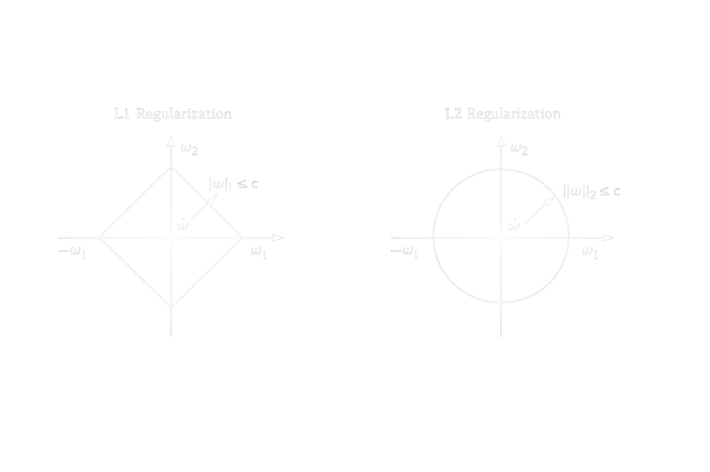

# l1 регуляризатор

Функция потерь дополняется штрафом на модуль весов $L_i^{reg}(ω) = L_i(ω) + λ ||ω|| = L_i(ω) + λ \sum_{i=0}^{n}|ω_i|$. Так как модуль не дифференцируем в нуле, используется субградиент: $∇L_i^{reg}(ω) = ∇L_i(ω) + λ * Sign(ω)$, где $Sign(ω)$ — поэлементная функция знака. Тогда стохастический градиентный спуск: $ω_{t + 1} = ω_t - η * (∂L(ω, x_i, y_i) / ∂ω + λ * Sign(ω_t))$.

L1 регуляризация приводит к разреженности весов (часть коэффициентов становится равной нулю), что позволяет отбирать наиболее важные признаки. Другое ее название Lasso

## l1 в бинарной классификации

```python
import numpy as np


# логарифмическая функция потерь
def loss(w, x, y):
    M = np.dot(w, x) * y
    return np.log2(1 + np.exp(-M))


# производная логарифмической функции потерь по вектору w
def df(w, x, y):
    M = np.dot(x, w) * y
    return -(np.exp(-M) * x.T * y) / ((1 + np.exp(-M)) * np.log(2))


data_x = [(5.8, 1.2), (5.6, 1.5), (6.5, 1.5), (6.1, 1.3), (6.4, 1.3), (7.7, 2.0), (6.0, 1.8), (5.6, 1.3), (6.0, 1.6),
          (5.8, 1.9), (5.7, 2.0), (6.3, 1.5), (6.2, 1.8), (7.7, 2.3), (5.8, 1.2), (6.3, 1.8), (6.0, 1.0), (6.2, 1.3),
          (5.7, 1.3), (6.3, 1.9), (6.7, 2.5), (5.5, 1.2), (4.9, 1.0), (6.1, 1.4), (6.0, 1.6), (7.2, 2.5), (7.3, 1.8),
          (6.6, 1.4), (5.6, 2.0), (5.5, 1.0), (6.4, 2.2), (5.6, 1.3), (6.6, 1.3), (6.9, 2.1), (6.8, 2.1), (5.7, 1.3),
          (7.0, 1.4), (6.1, 1.4), (6.1, 1.8), (6.7, 1.7), (6.0, 1.5), (6.5, 1.8), (6.4, 1.5), (6.9, 1.5), (5.6, 1.3),
          (6.7, 1.4), (5.8, 1.9), (6.3, 1.3), (6.7, 2.1), (6.2, 2.3), (6.3, 2.4), (6.7, 1.8), (6.4, 2.3), (6.2, 1.5),
          (6.1, 1.4), (7.1, 2.1), (5.7, 1.0), (6.8, 1.4), (6.8, 2.3), (5.1, 1.1), (4.9, 1.7), (5.9, 1.8), (7.4, 1.9),
          (6.5, 2.0), (6.7, 1.5), (6.5, 2.0), (5.8, 1.0), (6.4, 2.1), (7.6, 2.1), (5.8, 2.4), (7.7, 2.2), (6.3, 1.5),
          (5.0, 1.0), (6.3, 1.6), (7.7, 2.3), (6.4, 1.9), (6.5, 2.2), (5.7, 1.2), (6.9, 2.3), (5.7, 1.3), (6.1, 1.2),
          (5.4, 1.5), (5.2, 1.4), (6.7, 2.3), (7.9, 2.0), (5.6, 1.1), (7.2, 1.8), (5.5, 1.3), (7.2, 1.6), (6.3, 2.5),
          (6.3, 1.8), (6.7, 2.4), (5.0, 1.0), (6.4, 1.8), (6.9, 2.3), (5.5, 1.3), (5.5, 1.1), (5.9, 1.5), (6.0, 1.5),
          (5.9, 1.8)]
data_y = [-1, -1, -1, -1, -1, 1, 1, -1, -1, 1, 1, -1, 1, 1, -1, 1, -1, -1, -1, 1, 1, -1, -1, -1, -1, 1, 1, -1, 1, -1, 1,
          -1, -1, 1, 1, -1, -1, 1, 1, -1, 1, 1, -1, -1, -1, -1, 1, -1, 1, 1, 1, 1, 1, -1, -1, 1, -1, -1, 1, -1, 1, -1,
          1, 1, -1, 1, -1, 1, 1, 1, 1, 1, -1, -1, 1, 1, 1, -1, 1, -1, -1, -1, -1, 1, 1, -1, 1, -1, 1, 1, 1, 1, -1, 1, 1,
          -1, -1, -1, -1, 1]

x_train = np.array([[1, x[0], x[1], 0.8 * x[0], (x[0] + x[1]) / 2] for x in data_x])
y_train = np.array(data_y)

n_train = len(x_train)  # размер обучающей выборки
w = np.zeros(len(x_train[0]))  # начальные нулевые весовые коэффициенты
nt = np.array([0.5] + [0.01] * (len(w) - 1))  # шаг обучения для каждого параметра w0, w1, w2, ...
lm = 0.01  # значение параметра лямбда для вычисления скользящего экспоненциального среднего
N = 500  # число итераций алгоритма SGD
batch_size = 10  # размер мини-батча (величина K = 10)
lm_l1 = 0.05  # параметр лямбда для L1-регуляризатора

Qe = loss(w, x_train.T, y_train).mean()  # начальное значение среднего эмпирического риска
np.random.seed(0)  # генерация одинаковых последовательностей псевдослучайных чисел

for _ in range(N):
    k = np.random.randint(0, n_train - batch_size - 1)
    batch = range(k, k + batch_size)
    x_batch = x_train[batch]
    y_batch = y_train[batch]

    Qe = lm * loss(w, x_batch.T, y_batch).mean() + (1 - lm) * Qe

    w1 = np.array(w)
    w1[0] = 0

    # l1-reg
    w -= nt * (df(w, x_batch, y_batch).mean(axis=1) + lm_l1 * np.sign(w1))

Q = (x_train @ w * y_train < 0).mean()

```

## l1 в построении модели

```python

import numpy as np


# исходная функция, которую нужно аппроксимировать моделью a(x)
def func(x):
    return -0.5 * x ** 2 + 0.1 * x ** 3 + np.cos(3 * x) + 7


# модель
def model(w, x):
    xv = np.array([x ** n for n in range(len(w))])
    return w.T @ xv


# функция потерь
def loss(w, x, y):
    return (model(w, x) - y) ** 2


# производная функции потерь
def dL(w, x, y):
    xv = np.array([x ** n for n in range(len(w))])
    return 2 * (model(w, x) - y) * xv


coord_x = np.arange(-4.0, 6.0, 0.1)
coord_y = func(coord_x)

N = 5  # сложность модели (полином степени N-1)
lm_l1 = 2.0  # коэффициент лямбда для L1-регуляризатора
sz = len(coord_x)  # количество значений функций (точек)
eta = np.array([0.1, 0.01, 0.001, 0.0001, 0.000002])  # шаг обучения для каждого параметра w0, w1, w2, w3, w4
w = np.zeros(N)  # начальные нулевые значения параметров модели
n_iter = 500  # число итераций алгоритма SGD
lm = 0.02  # значение параметра лямбда для вычисления скользящего экспоненциального среднего
batch_size = 20  # размер мини-батча (величина K = 20)

Qe = loss(w, coord_x, coord_y).mean()  # начальное значение среднего эмпирического риска
np.random.seed(0)  # генерация одинаковых последовательностей псевдослучайных чисел

# здесь продолжайте программу
for _ in range(n_iter):
    k = np.random.randint(0, sz - batch_size - 1)
    batch = range(k, k + batch_size)
    x_batch = coord_x[batch]
    y_batch = coord_y[batch]

    Qe = lm * loss(w, x_batch, y_batch).mean() + (1 - lm) * Qe

    w1 = np.array(w)
    w1[0] = 0
    # l1-reg
    w -= eta * (dL(w, x_batch, y_batch).mean(axis=1) + lm_l1 * np.sign(w1))

Q = loss(w, coord_x, coord_y).mean()

print(Qe)

```

# сравнение l1 и l2

Если рассмотреть $ω_t$ и $ω_{t + 1}$ в пространстве параметров (например, в 2D) , то геометрически L1 регуляризатор задает область в виде ромба, а L2 — в виде окружности. Рассмотрим оптимальное решение $\tilde{ω}$, тогда вероятность того, что решение попадет в вершину (угол) у L1 выше, чем у L2, что приводит к занулению некоторых координат.

Рассмотрим L1. Пусть $ω = [1, ε]^T$, где $0 < ε < 1$, $||ω|| = |ω_1| + |ω_2|$. При $ω = [1 - Δ, ε]^T$, где $0 < Δ < ε < 1$, тогда $||ω|| = |1 - Δ| + |ε| = 1 - Δ + ε$. При $ω = [1, ε - Δ]^T$, $||ω|| = |1| + |ε - Δ| = 1 + ε - Δ$. То есть изменение по разным координатам влияет на норму одинаково, что способствует занулению отдельных компонент.

При L2 $||ω||^2 = ω_1^2 + ω_2^2$. Тогда при $ω = [1 - Δ, ε]^T$: $||ω||^2 = (1 - Δ)^2 + ε^2 = 1 - 2Δ + Δ^2 + ε^2$. При $ω = [1, ε - Δ]^T$: $||ω||^2 = 1 + (ε - Δ)^2 = 1 + ε^2 - 2εΔ + Δ^2$. Значения различаются, и изменение разных координат влияет на норму по-разному, что приводит к более “плавному” сжатию весов без зануления.

Таким образом, L1 регуляризация способствует разреженности весов, а L2 — их сглаживанию.

# Elastic Net (L1 + L2)

комбинация Lasso и Ridge

$L=\sum_{i = 1}^n(yi−y^i)^2+λ\sum_{j = 1}^p∣w_j∣+λ/2\sum_{j = 1}^p∣w_j|^2$

| Метод       | Нули в весах | Устойчивость | Когда использовать   |
| ----------- | ------------ | ------------ | -------------------- |
| Ridge       | нет          | высокая      | все признаки важны   |
| Lasso       | да           | средняя      | много лишних фич     |
| Elastic Net | да           | высокая      | коррелированные фичи |
