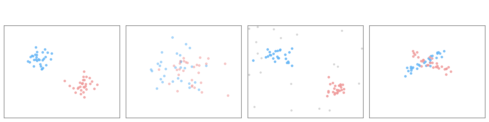
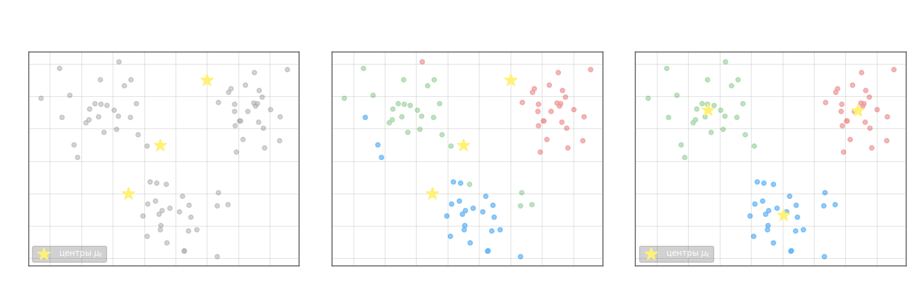

В задаче классификации метки классов заданы заранее. **Задача кластеризации** ставится иначе: данные не размечены, и алгоритм сам разбивает выборку на группы — одновременно определяет множество классов $Y$ и строит отображение $a: X \to Y$. Это обучение без учителя (unsupervised learning).

Типичные цели кластеризации: сжатие данных путём замены каждого кластера его центром; сокращение обучающей выборки до наиболее характерных представителей; выделение нетипичных объектов (аномалий); построение иерархии классов.

**Типы кластеров.** Универсального определения кластера нет — форма зависит от задачи.



Наиболее распространены компактные кластеры, где внутрикластерные расстояния в среднем меньше межкластерных. Нечёткие кластеры перекрываются; кластеры на фоне шума окружены случайными выбросами; вытянутые имеют анизотропную форму. Алгоритм Ллойда оптимален именно для компактных кластеров — при сильном отклонении от шаровой формы его результат деградирует.

**Критерии качества.** Пусть $a(x_i) \in Y$ — номер кластера объекта $x_i$. Среднее внутрикластерное расстояние:

$$f_0 = \frac{\displaystyle\sum_{i,j}\bigl[a_i = a_j\bigr]\,\rho(x_i, x_j)}{\displaystyle\sum_{i,j}\bigl[a_i = a_j\bigr]} \to \min$$

где $a_i = a(x_i)$, $\rho$ — выбранная метрика. Среднее межкластерное расстояние:

$$f_1 = \frac{\displaystyle\sum_{i < j}\bigl[a_i \neq a_j\bigr]\,\rho(x_i, x_j)}{\displaystyle\sum_{i < j}\bigl[a_i \neq a_j\bigr]} \to \max$$

Совместный критерий: $f_0 / f_1 \to \min$.

Вычислять $f_0$ и $f_1$ через все пары объектов затратно. Если известны центры кластеров $\mu_a = \frac{1}{|C_a|}\sum_{i:\,a_i=a} x_i \in \mathbb{R}^n$, то расстояния заменяют на расстояния до центров:

$$\Phi_0 = \sum_{a \in Y} \frac{1}{|C_a|} \sum_{i:\,a_i = a} \rho(x_i,\, \mu_a) \to \min, \qquad \Phi_1 = \sum_{\substack{a,b \in Y \\ a \neq b}} \rho(\mu_a,\, \mu_b) \to \max$$

Критерий $\Phi_0/\Phi_1 \to \min$ вычислятся значительно быстрее.

**Алгоритм Ллойда (k-means).** Минимизирует суммарное квадратичное отклонение объектов от центров своих кластеров:

$$J = \sum_{a=1}^{K} \sum_{i:\,a_i = a} \|x_i - \mu_a\|^2 \to \min_{a(\cdot),\,\mu_1,\ldots,\mu_K}$$

где $K$ — заданное число кластеров, $\|\cdot\|$ — евклидова норма. Прямая минимизация по всем разбиениям комбинаторно сложна, поэтому используют поочерёдную оптимизацию по назначениям $a_i$ и центрам $\mu_a$.

Алгоритм:

1. Инициализация: выбрать $K$ начальных центров $\mu_1, \ldots, \mu_K$ (случайно из выборки или из данных с метками)
2. **Назначение**: каждый объект отнести к ближайшему центру: $a_i = \operatorname{argmin}_{a}\, \rho(x_i, \mu_a)$
3. **Обновление**: пересчитать центры как средние по кластерам: $\mu_a = \dfrac{1}{|C_a|}\displaystyle\sum_{i:\,a_i = a} x_i$
4. Повторять шаги 2–3 до тех пор, пока назначения $a_i$ не перестанут меняться

Каждый шаг не увеличивает $J$, поэтому алгоритм сходится за конечное число итераций. Однако он находит локальный минимум — результат зависит от начальной инициализации.



**Инициализация по размеченным данным.** Если часть выборки размечена ($X^k = \{(x_1,y_1),\ldots,(x_k,y_k)\}$), а остаток $U = \{x_{k+1},\ldots,x_l\}$ — нет, начальные центры вычисляют по размеченным объектам:

$$\mu_a = \frac{1}{|\{i \leq k: y_i = a\}|} \sum_{\substack{i \leq k \\ y_i = a}} x_i$$

Затем алгоритм Ллойда запускается на объединении $X^k \cup U$. Такая постановка называется **частичным обучением** (semi-supervised learning, SSL) — часть данных размечена, часть нет. Различают два режима: **индуктивный** — алгоритм обучается на $X^k \cup U$ и предсказывает метки для новых объектов; **трансдуктивный** — метки предсказываются только для объектов $U$, участвовавших в обучении.

---

- алгоритм Ллойда в двумерном признаковом пространстве, только ос неразмеченными данными

```python
# Алгоритм Ллойда (метод K-средних для кластеризации)

import numpy as np

x = [(98, 62), (80, 95), (71, 130), (89, 164), (137, 115), (107, 155), (109, 105), (174, 62), (183, 115), (164, 153),
     (142, 174), (140, 80), (308, 123), (229, 171), (195, 237), (180, 298), (179, 340), (251, 262), (300, 176),
     (346, 178), (311, 237), (291, 283), (254, 340), (215, 308), (239, 223), (281, 207), (283, 156)]

# x = [(64, 150), (84, 112), (106, 90), (154, 64), (192, 62), (220, 82), (244, 92), (271, 111), (275, 137), (286, 161), (56, 178), (80, 156), (101, 131), (123, 104), (155, 94), (191, 100), (242, 70), (231, 114), (272, 95), (261, 131), (299, 136), (308, 124), (128, 78), (47, 128), (47, 159), (137, 186), (166, 228), (171, 250), (194, 272), (221, 287), (253, 292), (308, 293), (332, 280), (385, 256), (398, 237), (413, 205), (435, 166), (447, 137), (422, 126), (400, 154), (389, 183), (374, 214), (358, 235), (321, 250), (274, 263), (249, 263), (208, 230), (192, 204), (182, 174), (147, 205), (136, 246), (147, 255), (182, 282), (204, 298), (252, 316), (312, 321), (349, 313), (393, 288), (417, 259), (434, 222), (443, 187), (463, 174)]
# x = [(126, 63), (101, 100), (80, 160), (88, 208), (89, 282), (88, 362), (94, 406), (149, 377), (147, 304), (147, 235), (146, 152), (160, 103), (174, 142), (169, 184), (170, 241), (169, 293), (185, 376), (178, 422), (116, 353), (124, 194), (273, 69), (277, 112), (260, 150), (265, 185), (270, 235), (265, 295), (281, 351), (285, 416), (321, 404), (316, 366), (306, 304), (309, 254), (309, 207), (327, 161), (318, 108), (306, 66), (425, 66), (418, 135), (411, 183), (413, 243), (414, 285), (407, 333), (411, 385), (443, 387), (455, 330), (441, 252), (457, 207), (453, 149), (455, 90), (455, 56), (439, 102), (431, 162), (431, 193), (426, 236), (427, 281), (438, 323), (419, 379), (425, 389), (422, 349), (451, 275), (441, 222), (297, 145), (284, 195), (288, 237), (292, 282), (288, 313), (303, 356), (293, 395), (274, 268), (280, 344), (303, 187), (114, 247), (131, 270), (144, 215), (124, 219), (98, 240), (96, 281), (146, 267), (136, 221), (123, 166), (101, 185), (152, 184), (104, 283), (74, 239), (107, 287), (118, 335), (89, 336), (91, 315), (151, 340), (131, 373), (108, 133), (134, 130), (94, 260), (113, 193)]

M = np.mean(x, axis=0)  # вычисление средних по каждой координате
D = np.var(x, axis=0)  # вычисление дисперсий по каждой координате
K = 2  # число кластеров
ma = [np.random.normal(M, np.sqrt(D / 10), 2) for n in range(K)]  # начальные центры кластеров
ro = lambda x_vect, m_vect: np.mean((x_vect - m_vect) ** 2)  # евклидова метрика

n = 0
while n < 10:
    X = [[] for i in range(K)]  # инициализация пустого двумерного списка для хранения объектов кластеров

    for x_vect in x:
        r = [ro(x_vect, m) for m in ma]  # вычисление расстояний для текущего образа до центров кластеров
        X[np.argmin(r)].append(x_vect)  # добавление образа к кластеру с ближайшим центром

    ma = [np.mean(xx, axis=0) for xx in X]  # пересчет центров кластеров

    n += 1


```

- алгоритм Ллойда в двумерном признаковом пространстве, с размеченными и неразмеченными данными

```python
import numpy as np

T = [[(365, 200), (390, 180), (350, 172), (400, 171)], [(77, 150), (100, 200), (50, 130)],
     [(250, 100), (170, 88), (280, 102), (230, 108)]]
data_x = [(48, 118), (74, 96), (103, 82), (135, 76), (162, 79), (184, 97), (206, 111), (231, 118), (251, 118),
          (275, 110), (298, 86), (320, 68), (344, 62), (376, 61), (403, 75), (424, 95), (440, 114), (254, 80),
          (219, 85), (288, 66), (260, 92), (201, 76), (162, 66), (127, 135), (97, 143), (83, 160), (82, 177), (88, 199),
          (105, 205), (135, 208), (151, 198), (157, 169), (153, 152), (117, 158), (106, 168), (106, 185), (123, 188),
          (125, 171), (139, 163), (139, 183), (358, 127), (328, 132), (313, 146), (300, 169), (300, 181), (308, 197),
          (326, 206), (339, 209), (370, 199), (380, 184), (380, 147), (343, 154), (329, 169), (332, 184), (345, 185),
          (363, 159), (361, 177), (344, 169), (311, 175), (351, 89), (134, 96)]

K = 3  # число кластеров

# здесь продолжайте программу
ma = [np.mean(x, axis=0) for x in T]  # отбор центров из размеченных данных
data_x += [coord_t for subT in T for coord_t in subT]  # объединение данных размеченных и нет
ro = lambda x1, x2: np.mean(np.abs(x1 - x2))

n = 0
while n < 10:
    X = [[] for i in range(K)]

    for data_xi in data_x:
        i = np.argmin([ro(m, data_xi) for m in ma])

        X[i].append(data_xi)

    ma = [np.mean(xx, axis=0) for xx in X]

    n += 1
```
