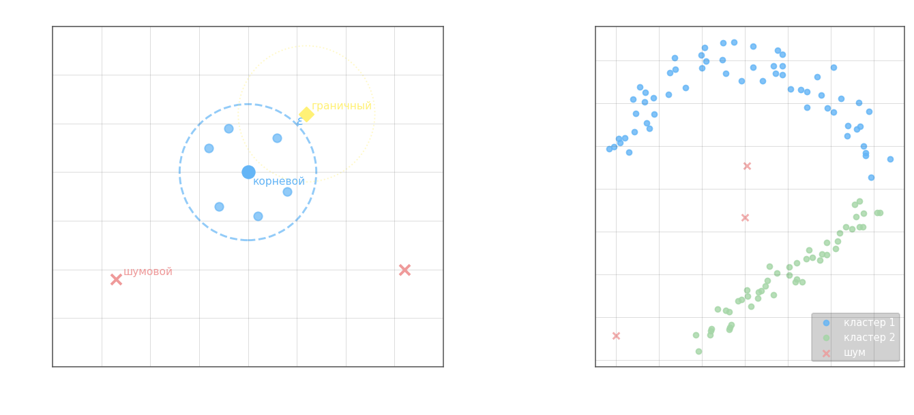

**DBSCAN** (Density-Based Spatial Clustering of Applications with Noise) — алгоритм кластеризации, основанный на плотности точек в окрестности, а не на расстоянии до центроида. В отличие от k-means, он не требует заранее задавать число кластеров и находит группы произвольной формы.

**Ключевые понятия.** Задаются два параметра: $\varepsilon > 0$ — радиус окрестности и $m \in \mathbb{N}$ — минимальное число точек. $\varepsilon$-окрестность объекта $x$:

$$U_\varepsilon(x) = \{u \in X^l : \rho(x, u) \leq \varepsilon\}$$

где $\rho$ — метрика в признаковом пространстве, $X^l$ — вся обучающая выборка.

**Три типа объектов:**

- **Корневой** — $|U_\varepsilon(x)| \geq m$: окрестность содержит не менее $m$ объектов; такие точки образуют «ядро» кластера
- **Граничный** — не корневой, но попадает в $\varepsilon$-окрестность хотя бы одного корневого объекта
- **Шумовой** — не корневой и не граничный; не принадлежит ни одному кластеру



**Алгоритм DBSCAN.**

Вход: выборка $X^l = \{x_1, \ldots, x_l\}$, параметры $\varepsilon$ и $m$.
Выход: разбиение на кластеры $K_1, K_2, \ldots$ и множество шумовых выбросов $N$.

1. $U \leftarrow X^l$ (все объекты непомечены), $N \leftarrow \emptyset$, $a \leftarrow 0$
2. Пока $U \neq \emptyset$:
   - Выбрать произвольный $x \in U$
   - Если $|U_\varepsilon(x)| < m$ — пометить $x$ как возможно шумовой: $N \leftarrow N \cup \{x\}$, $U \leftarrow U \setminus \{x\}$
   - Иначе — создать новый кластер: $a \leftarrow a + 1$, $K \leftarrow U_\varepsilon(x)$
     - Для каждого $x' \in K$ непомеченного или шумового:
       - Если $|U_\varepsilon(x')| \geq m$: расширить кластер — $K \leftarrow K \cup U_\varepsilon(x')$ (добавляем соседей $x'$ в кластер)
       - Иначе: пометить $x'$ как граничный кластера $a$
     - Присвоить $a_i = a$ всем $x_i \in K$; $U \leftarrow U \setminus K$
3. Оставшиеся в $N$ объекты, не поглощённые ни одним кластером, — шумовые выбросы

Ключевой шаг — рекурсивное расширение кластера: когда корневой объект добавляется в кластер, все его корневые соседи тоже расширяются, пока новых корневых точек не остаётся. Граничные точки примыкают к кластеру, но не расширяют его.

Преимущества:

* Находит кластеры произвольной формы (полумесяц, спираль и т.д.) — недостижимо для k-means
* Не требует задавать число кластеров заранее
* Автоматически выделяет шумовые выбросы как отдельный «класс»
* Сложность $O(l \cdot \overline{|U_\varepsilon|})$ — при использовании пространственного индекса близко к $O(l \log l)$

Недостатки:

* При разной плотности кластеров единый $\varepsilon$ работает плохо
* Чувствителен к выбору $\varepsilon$ и $m$: их нужно подбирать под данные
* Плохо масштабируется на высокую размерность (проклятие размерности делает все точки «далёкими»)

---

- сам алгоритм

```python
# Алгоритм DBSCAN, взято с сайта: https://habr.com/ru/post/322034/

from itertools import cycle
from math import hypot
from numpy import random
import matplotlib.pyplot as plt


def dbscan_naive(P, eps, m, distance):
    NOISE = 0
    C = 0

    visited_points = set()
    clustered_points = set()
    clusters = {NOISE: []}

    def region_query(p):
        return [q for q in P if distance(p, q) < eps]

    def expand_cluster(p, neighbours):
        if C not in clusters:
            clusters[C] = []
        clusters[C].append(p)
        clustered_points.add(p)
        while neighbours:
            q = neighbours.pop()
            if q not in visited_points:
                visited_points.add(q)
                neighbourz = region_query(q)
                if len(neighbourz) > m:
                    neighbours.extend(neighbourz)
            if q not in clustered_points:
                clustered_points.add(q)
                clusters[C].append(q)
                if q in clusters[NOISE]:
                    clusters[NOISE].remove(q)

    for p in P:
        if p in visited_points:
            continue
        visited_points.add(p)
        neighbours = region_query(p)
        if len(neighbours) < m:
            clusters[NOISE].append(p)
        else:
            C += 1
            expand_cluster(p, neighbours)

    return clusters


# P = [(98, 62), (80, 95), (71, 130), (89, 164), (137, 115), (107, 155), (109, 105), (174, 62), (183, 115), (164, 153), (142, 174), (140, 80), (308, 123), (229, 171), (195, 237), (180, 298), (179, 340), (251, 262), (300, 176), (346, 178), (311, 237), (291, 283), (254, 340), (215, 308), (239, 223), (281, 207), (283, 156)]
# P = [(126, 63), (101, 100), (80, 160), (88, 208), (89, 282), (88, 362), (94, 406), (149, 377), (147, 304), (147, 235), (146, 152), (160, 103), (174, 142), (169, 184), (170, 241), (169, 293), (185, 376), (178, 422), (116, 353), (124, 194), (273, 69), (277, 112), (260, 150), (265, 185), (270, 235), (265, 295), (281, 351), (285, 416), (321, 404), (316, 366), (306, 304), (309, 254), (309, 207), (327, 161), (318, 108), (306, 66), (425, 66), (418, 135), (411, 183), (413, 243), (414, 285), (407, 333), (411, 385), (443, 387), (455, 330), (441, 252), (457, 207), (453, 149), (455, 90), (455, 56), (439, 102), (431, 162), (431, 193), (426, 236), (427, 281), (438, 323), (419, 379), (425, 389), (422, 349), (451, 275), (441, 222), (297, 145), (284, 195), (288, 237), (292, 282), (288, 313), (303, 356), (293, 395), (274, 268), (280, 344), (303, 187), (114, 247), (131, 270), (144, 215), (124, 219), (98, 240), (96, 281), (146, 267), (136, 221), (123, 166), (101, 185), (152, 184), (104, 283), (74, 239), (107, 287), (118, 335), (89, 336), (91, 315), (151, 340), (131, 373), (108, 133), (134, 130), (94, 260), (113, 193)]
P = [(64, 150), (84, 112), (106, 90), (154, 64), (192, 62), (220, 82), (244, 92), (271, 111), (275, 137), (286, 161),
     (56, 178), (80, 156), (101, 131), (123, 104), (155, 94), (191, 100), (242, 70), (231, 114), (272, 95), (261, 131),
     (299, 136), (308, 124), (128, 78), (47, 128), (47, 159), (137, 186), (166, 228), (171, 250), (194, 272),
     (221, 287), (253, 292), (308, 293), (332, 280), (385, 256), (398, 237), (413, 205), (435, 166), (447, 137),
     (422, 126), (400, 154), (389, 183), (374, 214), (358, 235), (321, 250), (274, 263), (249, 263), (208, 230),
     (192, 204), (182, 174), (147, 205), (136, 246), (147, 255), (182, 282), (204, 298), (252, 316), (312, 321),
     (349, 313), (393, 288), (417, 259), (434, 222), (443, 187), (463, 174)]

eps = 60  # размер эпсилон-окрестности
m = 5  # минимальное число объектов для полной эпсилон-окрестности

clusters = dbscan_naive(P, eps, m, lambda x, y: hypot(x[0] - y[0], x[1] - y[1]))
for c, points in zip(cycle('bgrcmykgrcmykgrcmykgrcmykgrcmykgrcmyk'), clusters.values()):
    X = [p[0] for p in points]
    Y = [p[1] for p in points]
    plt.scatter(X, Y, c=c)
plt.show()
```

- с помощью dbscan

```python
import numpy as np
from sklearn.cluster import DBSCAN

X = [(166, 88), (147, 119), (133, 147), (113, 175), (91, 92), (120, 126), (146, 151), (172, 174), (94, 192), (187, 193),
     (328, 82), (299, 97), (277, 131), (280, 171), (299, 198), (348, 194), (378, 153), (372, 95), (222, 169),
     (332, 141), (69, 256), (110, 258), (139, 257), (179, 256), (210, 256), (248, 256), (295, 256), (322, 254),
     (350, 252), (377, 251), (400, 247), (403, 260), (378, 278), (341, 273), (306, 274), (277, 275), (245, 274),
     (222, 275), (193, 276), (170, 276), (147, 279), (120, 274), (91, 275), (65, 279)]
X = np.array(X)

# здесь продолжайте программу
clustering = DBSCAN(eps=55, min_samples=3, metric='euclidean')

res = clustering.fit_predict(X)
X1, X2, X3, Noise = [X[res == i] for i in [0, 1, 2, -1]]
```