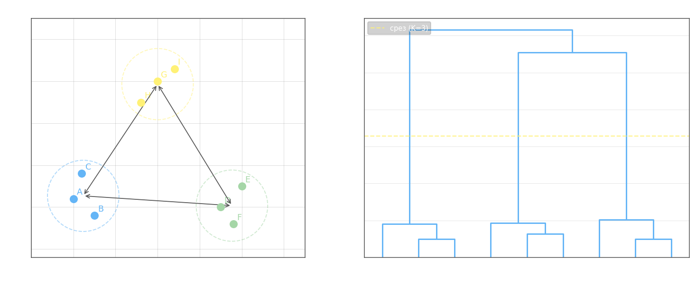

**Агломеративная иерархическая кластеризация** начинает с разбиения, в котором каждый объект — отдельный кластер, и на каждой итерации объединяет два ближайших кластера в один, пока не останется единственный. Результат — иерархия вложенных разбиений, визуализируемая дендрограммой.

**Формула Ланса-Уильямса.** При объединении кластеров $U$ и $V$ в $W = U \cup V$ расстояние от нового кластера до любого другого $S$ пересчитывается единой формулой:

$$R_{ws} = \alpha_u\, R_{us} + \alpha_v\, R_{vs} + \beta\, R_{uv} + \gamma\, |R_{us} - R_{vs}|$$

где $R_{us}$, $R_{vs}$ — расстояния от $U$ и $V$ до $S$ до слияния, $R_{uv}$ — расстояние между объединяемыми кластерами, $\alpha_u, \alpha_v, \beta, \gamma$ — параметры, определяющие тип связи.

Конкретные значения параметров для стандартных методов связи ($|W| = |U| + |V|$):

- **Ближний сосед** (single linkage) — расстояние между ближайшими точками двух кластеров: $\alpha_u = \alpha_v = \tfrac{1}{2}$, $\beta = 0$, $\gamma = -\tfrac{1}{2}$ $\;\Rightarrow\; R_{ws} = \min(R_{us}, R_{vs})$
- **Дальний сосед** (complete linkage) — расстояние между наиболее удалёнными точками: $\alpha_u = \alpha_v = \tfrac{1}{2}$, $\beta = 0$, $\gamma = \tfrac{1}{2}$ $\;\Rightarrow\; R_{ws} = \max(R_{us}, R_{vs})$
- **Среднегрупповое расстояние** (average linkage) — среднее по всем парам точек: $\alpha_u = \tfrac{|U|}{|W|}$, $\alpha_v = \tfrac{|V|}{|W|}$, $\beta = \gamma = 0$
- **Расстояние между центрами** (centroid linkage) — евклидово расстояние между центроидами: $\alpha_u = \tfrac{|U|}{|W|}$, $\alpha_v = \tfrac{|V|}{|W|}$, $\beta = -\alpha_u\alpha_v$, $\gamma = 0$
- **Метод Уорда** (Ward linkage) — минимизирует прирост суммарного внутрикластерного рассеяния: $\alpha_u = \tfrac{|S|+|U|}{|S|+|W|}$, $\alpha_v = \tfrac{|S|+|V|}{|S|+|W|}$, $\beta = \tfrac{-|S|}{|S|+|W|}$, $\gamma = 0$

где $|S|$, $|U|$, $|V|$, $|W|$ — число объектов в соответствующих кластерах.

**Алгоритм.**

1. $\mathcal{C}_1 = \bigl\{\{x_1\},\, \{x_2\},\, \ldots,\, \{x_l\}\bigr\}$ — каждый объект образует свой кластер; $R_{\{x_i\},\{x_j\}} = \rho(x_i, x_j)$
2. Для $t = 2, \ldots, l$:
   - В разбиении $\mathcal{C}_{t-1}$ найти пару кластеров $U, V$ с минимальным $R_{uv}$
   - Объединить: $W = U \cup V$, обновить разбиение $\mathcal{C}_t = \mathcal{C}_{t-1} \cup \{W\} \setminus \{U, V\}$
   - Для каждого $S \in \mathcal{C}_t$ пересчитать $R_{ws}$ по формуле Ланса-Уильямса

**Дендрограмма** — граф, отображающий порядок слияний: по оси $x$ — объекты, по оси $y$ — расстояние $R$, при котором произошло слияние. Горизонтальный срез на уровне $R^*$ задаёт разбиение на кластеры.



Оптимальное число кластеров $K$ определяется по уровню, где расстояние между последовательными слияниями максимально (самый длинный вертикальный промежуток на дендрограмме без горизонтального среза).

**Монотонность дендрограммы.** Расстояния слияний должны не убывать: $R_2 \leq R_3 \leq \cdots \leq R_l$. Это свойство гарантируется, если коэффициенты Ланса-Уильямса удовлетворяют условиям:

$$\alpha_u \geq 0, \quad \alpha_v \geq 0, \quad \alpha_u + \alpha_v + \beta \geq 1, \quad \min\{\alpha_u, \alpha_v\} + \gamma \geq 0$$

Если расстояние между объединяемыми кластерами **сжимается** ($R \leq \rho(\mu_u, \mu_v)$, т.е. ближе центроидов), дендрограмма вверху плотнее. Если **расширяется** ($R \geq \rho(\mu_u, \mu_v)$) — внизу плотнее, а верхние ветви редкие.

Преимущества:

- Не требует задавать число кластеров заранее — $K$ выбирается по дендрограмме после построения
- Работает с любой метрикой $\rho$ и любым методом связи
- Воспроизводимый результат: алгоритм детерминирован

Недостатки:

- Сложность $O(l^2 \log l)$ — плохо масштабируется на большие выборки
- Жадные слияния необратимы: ошибочное объединение на ранней итерации нельзя исправить
- Чувствителен к выбросам при методах ближнего/дальнего соседа

Рекомендации:

- Начинать с метода Уорда как наиболее устойчивого
- Пробовать несколько метрик $\rho$ с разными настройками
- Число кластеров определять по максимальному скачку расстояния на дендрограмме

**Числовой пример** (метод ближнего соседа, single linkage). Пять точек на числовой прямой: $A=0$, $B=1$, $C=5$, $D=7$, $E=13$. Используем расстояние $\rho(x,y)=|x-y|$.

Начальная матрица расстояний:

|   | A  | B  | C  | D  | E  |
|---|----|----|----|----|-----|
| A | 0  | 1  | 5  | 7  | 13 |
| B | 1  | 0  | 4  | 6  | 12 |
| C | 5  | 4  | 0  | 2  | 8  |
| D | 7  | 6  | 2  | 0  | 6  |
| E | 13 | 12 | 8  | 6  | 0  |

**Шаг 1.** Минимум: $R_{AB}=1$. Объединяем $\{A\} \cup \{B\} = \{A,B\}$ при $R=1$.
Пересчёт по формуле ближнего соседа $R_{ws}=\min(R_{us},R_{vs})$:

$$R_{\{AB\},C}=\min(5,4)=4,\quad R_{\{AB\},D}=\min(7,6)=6,\quad R_{\{AB\},E}=\min(13,12)=12$$

|    | AB | C  | D  | E  |
|----|----|----|----|----|
| AB | 0  | 4  | 6  | 12 |
| C  | 4  | 0  | 2  | 8  |
| D  | 6  | 2  | 0  | 6  |
| E  | 12 | 8  | 6  | 0  |

**Шаг 2.** Минимум: $R_{CD}=2$. Объединяем $\{C\} \cup \{D\} = \{C,D\}$ при $R=2$.

$$R_{\{AB\},\{CD\}}=\min(4,6)=4,\quad R_{\{CD\},E}=\min(8,6)=6$$

|    | AB | CD | E  |
|----|----|----|----|
| AB | 0  | 4  | 12 |
| CD | 4  | 0  | 6  |
| E  | 12 | 6  | 0  |

**Шаг 3.** Минимум: $R_{\{AB\},\{CD\}}=4$. Объединяем в $\{A,B,C,D\}$ при $R=4$.

$$R_{\{ABCD\},E}=\min(12,6)=6$$

**Шаг 4.** Единственная пара: $R_{\{ABCD\},E}=6$. Итоговое слияние.

История слияний:

| Шаг | Объединяемые кластеры | Расстояние $R$ |
|-----|-----------------------|----------------|
| 1   | $\{A\}+\{B\}$         | $1$            |
| 2   | $\{C\}+\{D\}$         | $2$            |
| 3   | $\{A,B\}+\{C,D\}$     | $4$            |
| 4   | $\{A,B,C,D\}+\{E\}$   | $6$            |

Расстояния строго возрастают ($1 < 2 < 4 < 6$) — дендрограмма монотонна. Наибольший скачок между шагами 3 и 4 — с $4$ до $6$: горизонтальный срез на любом уровне $R^* \in (4, 6)$ даёт оптимальное разбиение на два кластера $\{A,B,C,D\}$ и $\{E\}$. Срез при $R^* \in (2, 4)$ даёт три кластера: $\{A,B\}$, $\{C,D\}$, $\{E\}$.

---

```python
# Агломеративная иерархическая кластеризация с помощью пакета Sk-Learn

from itertools import cycle
from scipy.cluster.hierarchy import dendrogram
from sklearn.cluster import AgglomerativeClustering
import numpy as np
import matplotlib.pyplot as plt


# функция для отображения дендограммы (взято из депозитория sklearn)
def plot_dendrogram(model, **kwargs):
    # Children of hierarchical clustering
    children = model.children_

    # Distances between each pair of children
    # Since we don't have this information, we can use a uniform one for plotting
    distance = np.arange(children.shape[0])

    # The number of observations contained in each cluster level
    no_of_observations = np.arange(2, children.shape[0] + 2)

    # Create linkage matrix and then plot the dendrogram
    linkage_matrix = np.column_stack([children, distance, no_of_observations]).astype(float)

    # Plot the corresponding dendrogram
    dendrogram(linkage_matrix, **kwargs)


# входные образы для кластеризации
x = [(89, 151), (114, 120), (156, 110), (163, 153), (148, 215), (170, 229), (319, 166), (290, 178), (282, 222)]
x = np.array(x)

NC = 3  # максимальное число кластеров (итоговых)

# агломеративная иерархическая кластеризация
clustering = AgglomerativeClustering(n_clusters=NC, linkage="ward")
x_pr = clustering.fit_predict(x)

# отображение результата кластеризации и дендограммы
f, ax = plt.subplots(1, 2)
for c, n in zip(cycle('bgrcmykgrcmykgrcmykgrcmykgrcmykgrcmyk'), range(NC)):
    clst = x[x_pr == n].T
    ax[0].scatter(clst[0], clst[1], s=10, color=c)

plot_dendrogram(clustering, ax=ax[1])
plt.show()
```
