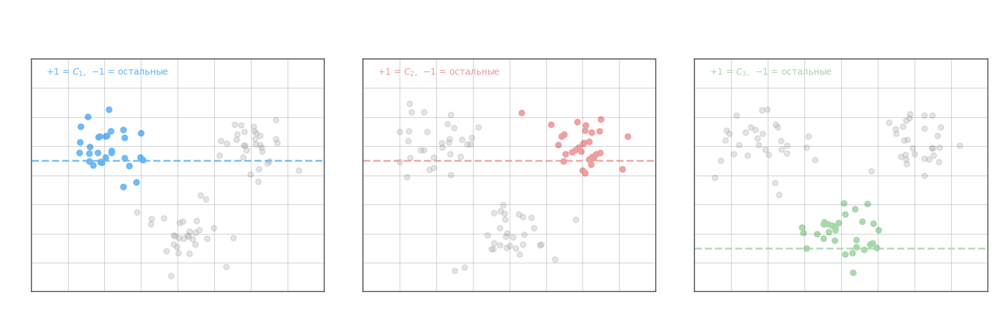
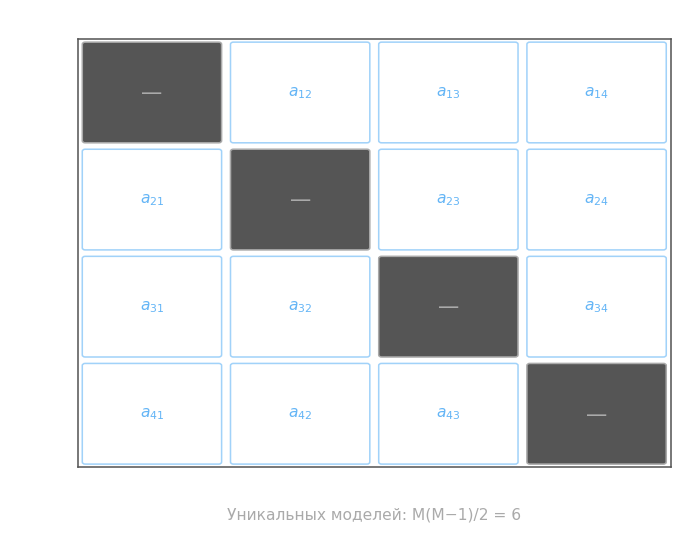

Задача многоклассовой классификации предполагает, что каждый объект принадлежит ровно одному из $M$ классов $\{C_1, C_2, \ldots, C_M\}$. Большинство бинарных классификаторов умеют работать только с двумя классами, поэтому на практике применяют две стратегии декомпозиции: **один против всех** (One-vs-All, OvA) и **каждый против каждого** (All-vs-All, OvO).

**One-vs-All.** Обучают $M$ отдельных бинарных классификаторов: $k$-й классификатор разделяет класс $C_k$ (метка $+1$) от всех остальных (метка $-1$). Каждый возвращает вещественнозначный отклик $g_k(x, \omega_k, \omega_{0k})$, а итоговый ответ выбирается по максимуму:

$$a(x) = \operatorname{argmax}_k\; g_k(x, \omega_k, \omega_{0k})$$

где $x$ — объект, $k \in \{1,\ldots,M\}$ — индекс класса, $\omega_k \in \mathbb{R}^n$ — вектор весов $k$-го классификатора, $\omega_{0k}$ — его порог (смещение), $g_k(x, \omega_k, \omega_{0k}) = \langle \omega_k, x \rangle - \omega_{0k}$ — вещественнозначный отклик (чем больше, тем «увереннее» модель в принадлежности $x$ классу $C_k$).

Важная тонкость: $g_k$ разных классификаторов обучены на несбалансированных подвыборках с разными масштабами весов $\omega_k$, поэтому перед сравнением имеет смысл нормировать отклики, например делением на $\|\omega_k\|$, — иначе класс с большими $\|\omega_k\|$ будет систематически «выигрывать».

**All-vs-All.** Обучают по одному бинарному классификатору для каждой пары классов $(C_i, C_j)$. Число уникальных моделей — $M(M-1)/2$. Классификатор $a_{ij}(x)$ выдаёт $+1$ если объект ближе к $C_i$ и $-1$ если к $C_j$; по антисимметрии $a_{ij}(x) = -a_{ji}(x)$. Итоговый ответ определяется голосованием: класс, набравший больше всего голосов «+1»:

$$a(x) = \operatorname{argmax}_i \sum_j \bigl[a_{ij}(x) = 1\bigr]$$

OvA обучает $M$ моделей, OvO — $M(M-1)/2$. При малом $M$ OvO выгоднее: каждая модель учится на меньшей и более чистой выборке из двух классов. При большом $M$ растущее число пар делает OvO дороже.

**Softmax.** Если модель умеет напрямую оценивать вещественные «очки» $g_k(x)$ для каждого класса, вероятности можно получить через softmax-преобразование:

$$P(a(x) = y_k \mid x) = \frac{\exp(g_k(x))}{\displaystyle\sum_{j=1}^{M} \exp(g_j(x))}$$

Знаменатель нормирует вектор оценок в вероятностное распределение: все вероятности неотрицательны и суммируются в $1$. Обучение ведётся минимизацией кросс-энтропийных потерь по обучающей выборке из $l$ объектов:

$$\mathcal{L} = -\frac{1}{l} \sum_{i=1}^{l} \ln P(a(x_i) = y_i \mid x_i) \to \min$$

Максимизация логарифма правдоподобия истинного класса эквивалентна минимизации расстояния KL между предсказанным распределением и «идеальным», сосредоточенным в одном классе.

**Метрики качества.** Доля правильных ответов (accuracy):

$$\text{Accuracy} = \frac{1}{l} \sum_{i=1}^{l} \bigl[a(x_i) = y_i\bigr]$$

Матрица ошибок (confusion matrix) — квадратная матрица $M \times M$, элемент которой $g_{ij}$ равен числу объектов, отнесённых классификатором к классу $i$, при истинном классе $j$:

$$g_{ij} = \sum_{k=1}^{l} \bigl[a(x_k) = i\bigr]\bigl[y_k = j\bigr]$$

Главная диагональ $g_{ii}$ — правильные ответы для класса $i$. Для многоклассовой задачи каждый класс $C_k$ можно бинаризовать: $y_i^{(k)} = 2[y_i = k] - 1 \in \{-1, +1\}$. Это позволяет вычислить $TP_k$, $FP_k$, $FN_k$ через строки и столбцы матрицы ошибок: $TP_k = g_{kk}$, $FP_k = \sum_{j \neq k} g_{kj}$, $FN_k = \sum_{i \neq k} g_{ik}$.

**Усреднение метрик по классам.** Класс-специфичные precision и recall:

$$p_k = \frac{TP_k}{TP_k + FP_k}, \qquad r_k = \frac{TP_k}{TP_k + FN_k}$$

При *микро-усреднении* (micro-averaging) сначала суммируют абсолютные величины по всем классам, затем вычисляют единую метрику:

$$\overline{TP} = \frac{1}{M}\sum_{k=1}^{M} TP_k, \quad \overline{FP} = \frac{1}{M}\sum_{k=1}^{M} FP_k, \quad \overline{FN} = \frac{1}{M}\sum_{k=1}^{M} FN_k$$

$$\bar{p}_{\text{micro}} = \frac{\overline{TP}}{\overline{TP} + \overline{FP}}, \qquad \bar{r}_{\text{micro}} = \frac{\overline{TP}}{\overline{TP} + \overline{FN}}$$

Микро-усреднение взвешивает каждый объект одинаково — доминирующий класс оказывает большее влияние на итог.

При *макро-усреднении* (macro-averaging) сначала считают метрику для каждого класса, потом берут среднее:

$$\bar{p}_{\text{macro}} = \frac{1}{M}\sum_{k=1}^{M} p_k, \qquad \bar{r}_{\text{macro}} = \frac{1}{M}\sum_{k=1}^{M} r_k$$

Макро-усреднение взвешивает каждый класс одинаково — полезно, когда редкие классы так же важны, как частые. Микро-усреднение предпочтительно при сбалансированных классах или когда важна общая доля правильных ответов; макро-усреднение — при дисбалансе классов или когда нельзя игнорировать качество на малых классах.

**Числовой пример.** Три класса $\{C_1, C_2, C_3\}$, объект $x$, три обученных OvA-классификатора вернули откликм:

$$g_1(x) = 1{,}8, \qquad g_2(x) = -0{,}3, \qquad g_3(x) = 0{,}7$$

*OvA-решение:* $a(x) = \operatorname{argmax}_k g_k = C_1$.

*OvO-решение* (три пары при $M=3$): классификатор $a_{12}$ сравнивает $g_1$ и $g_2$: $1{,}8 > -0{,}3 \Rightarrow +1$ (побеждает $C_1$). Аналогично $a_{13}$: $1{,}8 > 0{,}7 \Rightarrow +1$ (побеждает $C_1$). Классификатор $a_{23}$: $-0{,}3 < 0{,}7 \Rightarrow -1$ (побеждает $C_3$). Подсчёт голосов: $C_1$ получает $2$, $C_2$ — $0$, $C_3$ — $1$. Итог: $a(x) = C_1$.

*Softmax* по тем же откликам:

$$\exp(1{,}8) \approx 6{,}05, \quad \exp(-0{,}3) \approx 0{,}74, \quad \exp(0{,}7) \approx 2{,}01, \quad \text{сумма} \approx 8{,}80$$

$$P(C_1) \approx \frac{6{,}05}{8{,}80} \approx 0{,}688, \quad P(C_2) \approx 0{,}084, \quad P(C_3) \approx 0{,}228$$

Все три стратегии указывают на $C_1$ — с вероятностью $68{,}8\%$ по softmax.

*Метрики на тестовой выборке.* Пусть $l = 10$ объектов — $5$ из $C_1$, $3$ из $C_2$, $2$ из $C_3$ — классифицированы так: из $5$ объектов $C_1$ четыре распознаны верно, один ошибочно отнесён к $C_2$; из $3$ объектов $C_2$ два верно, один ошибочно — к $C_3$; из $2$ объектов $C_3$ один верно, один ошибочно — к $C_1$. Матрица ошибок (строка = предсказанный класс, столбец = истинный):

$$G = \begin{array}{c|ccc} & C_1 & C_2 & C_3 \\\hline C_1 & 4 & 0 & 1 \\ C_2 & 1 & 2 & 0 \\ C_3 & 0 & 1 & 1 \end{array}$$

Диагональ — правильные ответы. Точность: $\text{Accuracy} = (4+2+1)/10 = 0{,}7$.

Из матрицы извлекаем $TP_k = g_{kk}$, $FP_k = $ сумма строки $k$ без диагонали, $FN_k = $ сумма столбца $k$ без диагонали:

$$TP_1=4,\ FP_1=1,\ FN_1=1 \quad\Rightarrow\quad p_1 = \tfrac{4}{5} = 0{,}80,\quad r_1 = \tfrac{4}{5} = 0{,}80$$
$$TP_2=2,\ FP_2=1,\ FN_2=1 \quad\Rightarrow\quad p_2 = \tfrac{2}{3} \approx 0{,}67,\quad r_2 \approx 0{,}67$$
$$TP_3=1,\ FP_3=1,\ FN_3=1 \quad\Rightarrow\quad p_3 = \tfrac{1}{2} = 0{,}50,\quad r_3 = \tfrac{1}{2} = 0{,}50$$

*Микро-усреднение:*

$$\overline{TP} = \tfrac{4+2+1}{3} = \tfrac{7}{3}, \quad \overline{FP} = \tfrac{1+1+1}{3} = 1, \quad \overline{FN} = 1$$

$$\bar{p}_{\text{micro}} = \frac{7/3}{7/3 + 1} = \frac{7}{10} = 0{,}70$$

*Макро-усреднение:*

$$\bar{p}_{\text{macro}} = \frac{0{,}80 + 0{,}67 + 0{,}50}{3} \approx 0{,}656$$

Микро даёт $0{,}70$, макро — $0{,}656$: разница возникла из-за дисбаланса классов. $C_1$ велик и хорошо распознан, его высокое $p_1$ «тянет» микро вверх. Макро относится к каждому классу одинаково, поэтому слабый $C_3$ ($p_3=0{,}50$) снижает итог заметнее.
