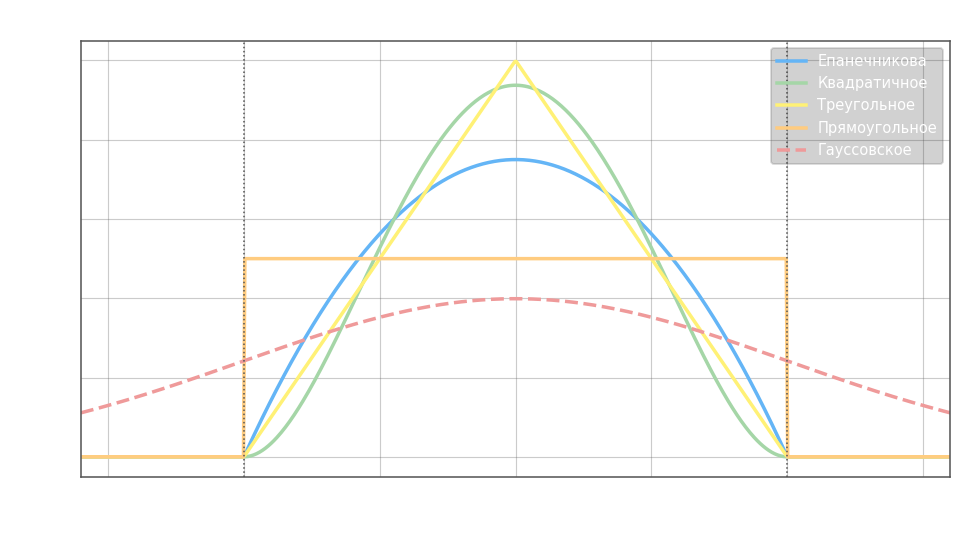
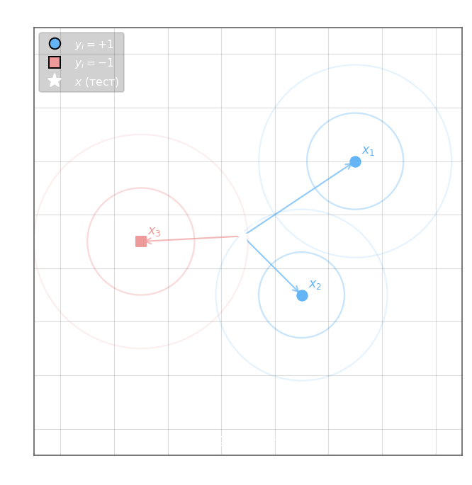

В методе $k$ ближайших соседей весовая функция $\omega(i, x) = [i \leq k]$ резко обнуляется: $k$ ближайших объектов влияют одинаково вне зависимости от расстояния, а все остальные не участвуют вовсе. Естественное улучшение — заменить порог плавно убывающей функцией расстояния.

**Метод окна Парзена.** Вместо порогового отсечения вводится ядровая весовая функция:

$$\omega(i, x) = K\!\left(\frac{\rho(x,\, x^{(i)})}{h}\right)$$

где $K(r) \geq 0$ — ядро (невозрастающая функция на $[0, +\infty)$, $r \in [0,1]$), $h > 0$ — ширина окна. Классификатор принимает вид:

$$a(x;\, X^l,\, h) = \operatorname{argmax}_y \sum_{i=1}^{l} \bigl[y_i = y\bigr] \cdot K\!\left(\frac{\rho(x,\, x_i)}{h}\right)$$

Чем ближе $x_i$ к $x$, тем больший вклад он вносит в голосование.

**Виды ядер.** Все компактные ядра обнуляются за пределами $[-1, 1]$; гауссовское убывает на всей оси, но экспоненциально быстро.



- Епанечникова: $E(r) = \tfrac{3}{4}(1 - r^2)\,[|r| \leq 1]$ — оптимально по среднеквадратичной ошибке оценки плотности
- Квадратичное: $Q(r) = \tfrac{15}{16}(1 - r^2)^2\,[|r| \leq 1]$ — более мягкий спад у границы
- Треугольное: $T(r) = (1 - |r|)\,[|r| \leq 1]$ — линейное убывание
- Прямоугольное: $\Pi(r) = \tfrac{1}{2}\,[|r| \leq 1]$ — сводится к обычному KNN с фиксированным шаром радиуса $h$
- Гауссовское: $G(r) = \tfrac{1}{\sqrt{2\pi}}\exp\!\left(-\tfrac{r^2}{2}\right)$ — единственное ненулевое за пределами $[-1,1]$, хвосты убывают экспоненциально

**Переменная ширина окна.** Фиксированное $h$ плохо работает при неравномерной плотности данных: в разреженных областях окно захватывает слишком мало объектов, в плотных — размывает границу. Решение — адаптировать ширину к локальной плотности, полагая $h$ равным расстоянию до $(k{+}1)$-го соседа:

$$h(x) = \rho\bigl(x,\, x^{(k+1)}\bigr)$$

Тогда нормировка расстояний происходит относительно радиуса, вмещающего ровно $k$ объектов, и алгоритм принимает вид:

$$a(x;\, X^l,\, k,\, K) = \operatorname{argmax}_y \sum_{i=1}^{l} \bigl[y_i = y\bigr] \cdot K\!\left(\frac{\rho(x,\, x_i)}{\rho(x,\, x^{(k+1)})}\right)$$

При $K(r) = [|r| \leq 1]$ это в точности сводится к исходному KNN. Недостаток метода — необходимость выбирать форму ядра $K$.

**Выбор $h$ через LOO.** Ширину окна (или $k$) подбирают минимизацией ошибки leave-one-out: каждый объект поочерёдно исключается из обучающей выборки, а классификатор предсказывает его метку по оставшимся. Производную LOO по $h$ можно вычислить аналитически — для этого разбивают $h$ на малые шаги и следят, когда объекты пересекают границу окна:

$$\text{LOO}(h,\, X^l) = \frac{1}{l}\sum_{i=1}^{l} \bigl[a(x_i;\, X^l \setminus \{x_i\},\, h) \neq y_i\bigr] \to \min_h$$

**Метод потенциальных функций.** Дальнейшее обобщение: каждому обучающему объекту $x_i$ присваивается индивидуальная интенсивность $\varphi_i \geq 0$ и своя ширина окна $h_i > 0$, создавая вокруг него «поле потенциала»:

$$f_i(x) = \varphi_i \cdot K\!\left(\frac{\rho(x,\, x_i)}{h_i}\right)$$



Для мультиклассовой задачи итоговый ответ — класс с наибольшей суммарной интенсивностью:

$$a(x;\, X^l) = \operatorname{argmax}_y \sum_{i=1}^{l} \bigl[y_i = y\bigr] \cdot f_i(x)$$

В бинарном случае ($y_i \in \{-1, +1\}$) вводят суммарный потенциал каждого класса $\Gamma_{\pm 1}(x) = \sum_{i:\,y_i=\pm 1} f_i(x)$ и классифицируют по знаку их разности:

$$a(x;\, X^l) = \operatorname{sign}\!\left(\Gamma_{+1}(x) - \Gamma_{-1}(x)\right) = \operatorname{sign}\!\left(\sum_{i=1}^{l} y_i\, f_i(x)\right)$$

Интенсивности $\varphi_i$ обучаются итеративно: если объект $x_i$ классифицируется неверно, его $\varphi_i$ увеличивается. Это делает метод похожим на перцептрон, работающий не в пространстве признаков, а в пространстве попарных расстояний.

**Как вычисляются $\varphi_i$.** В начале все интенсивности обнуляются: $\varphi_i = 0$. Затем алгоритм проходит по обучающей выборке итерационно — на каждом шаге берётся объект $x_i$ и проверяется, правильно ли его классифицирует текущая модель, то есть совпадает ли $a(x_i;\, X^l)$ с истинной меткой $y_i$. Если ответ неверный — $\varphi_i$ увеличивается на $1$ (или на некоторый шаг $\eta$), усиливая «голос» этого объекта. Если ответ верный — $\varphi_i$ не меняется. Проходы повторяются до тех пор, пока ошибки не перестанут уменьшаться:

$$\varphi_i \leftarrow \varphi_i + \eta \cdot \bigl[a(x_i;\, X^l) \neq y_i\bigr]$$

где $\eta > 0$ — шаг обновления. В итоге объекты, которые алгоритм классифицировал неверно чаще всего, получают наибольшие $\varphi_i$ — они стоят на труднораспознаваемых участках границы и в конечном счёте образуют «опорные» точки, аналогичные опорным векторам SVM. Объекты в глубине своего класса, как правило, остаются с $\varphi_i = 0$ и не влияют на решение.

---

```python
import numpy as np
from sklearn.model_selection import train_test_split

np.random.seed(0)
n_feature = 2  # число признаков

# исходные параметры для формирования образов обучающей выборки
r1 = 0.7
D1 = 3.0
mean1 = [3, 3]
V1 = [[D1 * r1 ** abs(i - j) for j in range(n_feature)] for i in range(n_feature)]

r2 = 0.5
D2 = 2.0
mean2 = [1, 1]  # + np.array(range(1, n_feature+1)) * 0.5
V2 = [[D2 * r2 ** abs(i - j) for j in range(n_feature)] for i in range(n_feature)]

r3 = -0.7
D3 = 1.0
mean3 = [-2, -2]  # + np.array(range(1, n_feature+1)) * -0.5
V3 = [[D3 * r3 ** abs(i - j) for j in range(n_feature)] for i in range(n_feature)]

# моделирование обучающей выборки
N1, N2, N3 = 200, 150, 190
x1 = np.random.multivariate_normal(mean1, V1, N1).T
x2 = np.random.multivariate_normal(mean2, V2, N2).T
x3 = np.random.multivariate_normal(mean3, V3, N3).T

data_x = np.hstack([x1, x2, x3]).T
data_y = np.hstack([np.zeros(N1), np.ones(N2), np.ones(N3) * 2])

x_train, x_test, y_train, y_test = train_test_split(data_x, data_y, random_state=123, test_size=0.5, shuffle=True)

h = 1


def get_dist(x1, x2):
    return np.sum(np.abs(x1 - x2))


def Kr(r):
    return 1 / np.sqrt(2 * np.pi) * np.exp(-1 * np.square(r) / 2)


def ax(yi, xi):
    return np.sum([Kr(get_dist(x_test_i, xi) / h) * (y_train[i] == yi) for i, x_test_i in enumerate(x_train)])


predict = [int(np.argmax([ax(0, x), ax(1, x), ax(2, x)])) for x in x_test]

Q = (predict != y_test).mean()

```
