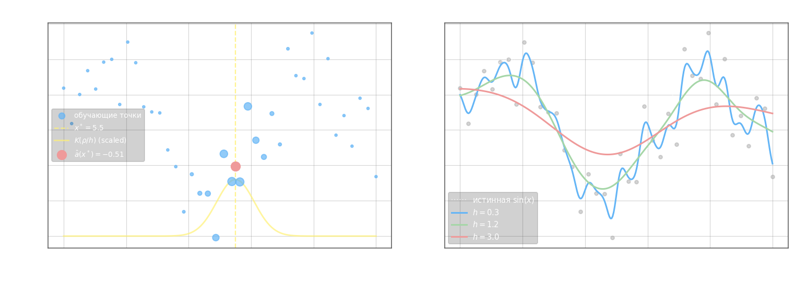

# Аппроксимация данных ядерным сглаживанием

В задаче регрессии требуется восстановить зависимость $y = f(x)$ по обучающей выборке $\{(x_i, y_i)\}_{i=1}^l$. Параметрический подход задаёт глобальную форму модели $g(x, \theta)$ и подбирает $\theta$ — но если структура зависимости неизвестна, лучше отказаться от глобальной формулы и использовать **локальные области**: ответ в точке $x$ вычислять как взвешенное среднее по соседним объектам, где веса определяются близостью в метрике.

**Формула Надарая-Ватсона.** Рассмотрим простой случай: два обучающих объекта $x_1, x_2$ с метками $y_1, y_2$, тестовая точка $x$ между ними. Применяя треугольное ядро $K(r) = (1 - |r|)\,[|r| \leq 1]$, каждый объект получает вес пропорционально своей близости к $x$. Нормируя веса так, чтобы они суммировались в $1$:

$$a(x) = \frac{y_1\, K\!\left(\frac{\rho(x, x_1)}{h}\right) + y_2\, K\!\left(\frac{\rho(x, x_2)}{h}\right)}{K\!\left(\frac{\rho(x, x_1)}{h}\right) + K\!\left(\frac{\rho(x, x_2)}{h}\right)}$$

Обобщение на $l$ объектов с произвольным ядром даёт **формулу Надарая-Ватсона**:

$$a(x;\, X^l) = \frac{\displaystyle\sum_{i=1}^{l} y_i\, K\!\left(\frac{\rho(x,\, x_i)}{h}\right)}{\displaystyle\sum_{i=1}^{l} K\!\left(\frac{\rho(x,\, x_i)}{h}\right)}$$

где $h > 0$ — ширина окна, $K$ — ядро (то же, что в методе Парзена). Ответ — взвешенное среднее меток, в котором ближние объекты доминируют над дальними.

**Альтернативный вывод.** Формула Надарая-Ватсона получается и из минимизации взвешенной среднеквадратичной ошибки: при фиксированном $x$ ищем скалярный ответ $a$, минимизирующий

$$Q(a;\, X^l) = \sum_{i=1}^{l} \omega_i(x)\,(a - y_i)^2 \to \min_a, \qquad \omega_i(x) = K\!\left(\frac{\rho(x,\, x_i)}{h}\right)$$

Приравнивая производную нулю: $\dfrac{\partial Q}{\partial a} = 2\sum_{i=1}^l \omega_i(x)(a - y_i) = 0$, откуда немедленно следует та же формула.



Малое $h$ даёт кривую, «следящую» за каждой точкой (переобучение); большое $h$ слишком сглаживает и теряет структуру. Оптимальное $h$ подбирается через LOO.

**Алгоритм LOWESS** (Locally Weighted Scatterplot Smoothing) — устойчивое к выбросам расширение NW. Ключевая идея: объектам с большой ошибкой LOO-предсказания назначается малый «вес робастности» $\gamma_i$, и их влияние на оценку подавляется итеративно.

Алгоритм:

1. Инициализация: $\gamma_i = 1$, $i = 1, \ldots, l$
2. Повторять до сходимости:
   - Для каждого $i = 1, \ldots, l$ вычислить LOO-оценку с текущими весами робастности:

$$\hat{a}_i = \frac{\displaystyle\sum_{j \neq i} y_j\,\gamma_j\, K\!\left(\dfrac{\rho(x_i,\, x_j)}{h(x_i)}\right)}{\displaystyle\sum_{j \neq i} \gamma_j\, K\!\left(\dfrac{\rho(x_i,\, x_j)}{h(x_i)}\right)}$$

   где $h(x_i) = \rho(x_i, x^{(k+1)})$ — расстояние до $(k{+}1)$-го соседа объекта $x_i$.

   - Обновить веса робастности по остаткам:

$$\gamma_i \leftarrow \hat{K}\!\left(|\hat{a}_i - y_i|\right)$$

   где $\hat{K}$ — второе ядро (обычно bisquare: $\hat{K}(u) = (1 - u^2)^2\,[|u| \leq 1]$), применяемое к нормированному остатку. Объект с большой ошибкой получает $\gamma_i \approx 0$ и перестаёт влиять на оценку.

3. Пока $\gamma_i$ не стабилизируются.

В результате LOWESS автоматически понижает вес выбросов и подстраивается к чистой части данных.

---

```python

import numpy as np

x = np.arange(0, 10, 0.1)  # отсчеты для исходного сигнала
x_est = np.arange(0, 10, 0.01)  # отсчеты, где производится восстановление функции
N = len(x)
y_sin = np.sin(x)
y = y_sin + np.random.normal(0, 0.5, N)

# аппроксимация ядерным сглаживанием
h = 1.0  # при окне меньше 0.1 для финитных ядер будут ошибки

# выбор ядра
K = lambda r: np.exp(-2 * r * r)  # гауссовское ядро
# K = lambda r: np.abs(1 - r) * bool(r <= 1) # треугольное ядро
# K = lambda r: bool(r <= 1)  # прямоугольное ядро

ro = lambda xx, xi: np.abs(xx - xi)  # метрика
w = lambda xx, xi: K(ro(xx, xi) / h)  # веса

# варианты для разных h
for h in [0.1, 0.3, 1, 10]:
    y_est = []
    for xx in x_est:
        ww = np.array([w(xx, xi) for xi in x])
        yy = np.dot(ww, y) / sum(ww)  # формула Надарая-Ватсона
        y_est.append(yy)


```

- прогноз по модели

```python
import numpy as np

rub_usd = [75, 76, 79, 82, 85, 81, 83, 86, 87, 85, 83, 80, 77, 79, 78, 81, 84]

# здесь продолжайте программу
h = 3

K = lambda r: 1 / (2 * np.pi) ** .5 * np.exp(- r ** 2 / 2)
ro = lambda xx, xi: np.abs(xx - xi)  # метрика
w = lambda xx, xi: K(ro(xx, xi) / h)  # веса

length = len(rub_usd)
train_x = list(rub_usd)
predict = []

for i in range(10):
    ww = np.array([w(i + length, x) for x in range(i + length)])
    yy = np.dot(ww, train_x + predict) / sum(ww)

    predict.append(yy)

print(predict)

```
