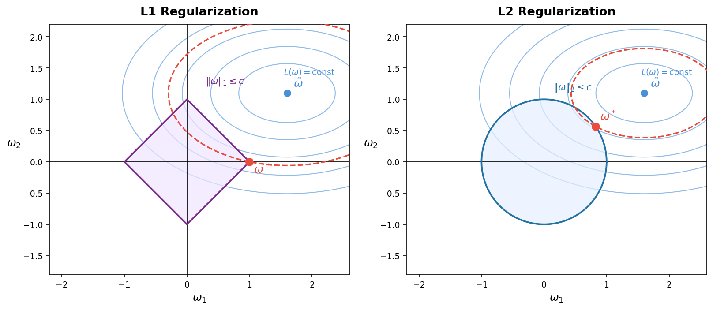

# сравнение l1 и l2

Для наглядности рассмотрим модель с **двумя параметрами** $ω = [ω_1, ω_2]^T$. Это минимальный случай, в котором уже виден геометрический смысл регуляризации; для большего числа параметров логика та же, просто в пространстве более высокой размерности.

**Два объекта на графике:**

1. **Линии уровня функции потерь** $L(ω) = \text{const}$ — для типичных задач (например, МНК) это эллипсы с центром в точке $\tilde{ω}$, которая является несмещённым оптимумом без регуляризации. Чем дальше эллипс от $\tilde{ω}$, тем хуже решение.

2. **Область допустимых значений регуляризатора** — множество векторов $ω$, у которых норма не превышает некоторой константы $c$:
   - L1: $|ω_1| + |ω_2| \leq c$ — **ромб** (квадрат, повёрнутый на 45°), вершины которого лежат на осях координат.
   - L2: $ω_1^2 + ω_2^2 \leq c^2$ — **круг**, граница которого везде гладкая.

**Задача условной оптимизации.** Минимизация с регуляризатором $L(ω) + λ\|ω\|$ эквивалентна задаче с ограничением (для подходящего $c$):

$$\min_ω L(ω) \quad \text{при условии} \quad \|ω\| \leq c$$

Это задача выпуклой оптимизации — по структуре аналог линейного программирования: есть целевая функция и ограничение на область допустимых решений. Ключевое свойство: $\tilde{ω}$ лежит **вне** допустимой области (иначе регуляризация не имела бы эффекта). Поэтому, двигаясь внутри области к $\tilde{ω}$, потери убывают — оптимум прижимается к границе.

**Что изображено на графике.** Оба объекта живут в одном пространстве $(ω_1, ω_2)$ — это одни и те же веса модели:

- **Синие эллипсы** — линии уровня $L(ω) = \text{const}$. Движение *вдоль* эллипса не меняет потери, движение *к центру* их уменьшает. Центр эллипсов — $\tilde{ω}$, несмещённый минимум без ограничений.
- **Ромб / круг** — граница допустимой области $\|ω\| \leq c$.
- **Красный пунктир** — наименьший эллипс, касающийся границы: это и есть регуляризованное решение $ω^*$.

**Почему L1 зануляет, а L2 нет — связь с LP.** Стороны ромба задаются линейными ограничениями:

$$ω_1 + ω_2 \leq c, \quad ω_1 - ω_2 \leq c, \quad -ω_1 + ω_2 \leq c, \quad -ω_1 - ω_2 \leq c$$

Это в точности структура линейного программирования — многогранник, образованный пересечением полупространств. В LP оптимум всегда достигается в вершине, где одновременно активны несколько ограничений. Для ромба вершина — точка $ω_2 = 0$ (два ограничения активны сразу), отсюда зануление координаты.

Круг L2 — одно нелинейное ограничение $ω_1^2 + ω_2^2 \leq c^2$, вершин нет, эллипс касается в гладкой точке — обе координаты ненулевые. В высоких размерностях L1-шар — многогранник с огромным числом вершин на осях координат, поэтому вероятность попасть в вершину (и занулить координату) только растёт.

Покажем аналитически, почему L1 зануляет координаты, а L2 — нет. Идея: возьмём произвольную точку на границе допустимой области и посмотрим, как сдвиг на одну и ту же величину $Δ$ по разным координатам меняет норму.

**Обозначения:**
- $ω_1 = 1$ — «большая» координата (близка к единице), $ω_2 = ε$ — «малая» координата ($0 < ε \ll 1$).
- $Δ > 0$ — малый шаг уменьшения одной из координат ($Δ < ε$, чтобы знак не менялся).
- Сравниваем два варианта шага: уменьшить $ω_1$ на $Δ$ или уменьшить $ω_2$ на $Δ$.

**L1.** Норма $\|ω\|_1 = |ω_1| + |ω_2|$. Начальная точка: $ω = [1,\, ε]^T$, $\|ω\|_1 = 1 + ε$.

- Шаг по $ω_1$: $ω = [1 - Δ,\, ε]^T \Rightarrow \|ω\|_1 = (1 - Δ) + ε = 1 + ε - Δ$
- Шаг по $ω_2$: $ω = [1,\, ε - Δ]^T \Rightarrow \|ω\|_1 = 1 + (ε - Δ) = 1 + ε - Δ$

Норма уменьшилась **одинаково** в обоих случаях. Значит, регуляризатору всё равно, какую координату «давить» — он с одинаковой силой тянет к нулю и большую, и малую. В итоге малая координата быстро достигает нуля и обнуляется.

**L2.** Норма $\|ω\|_2^2 = ω_1^2 + ω_2^2$. Начальная точка: $ω = [1,\, ε]^T$, $\|ω\|_2^2 = 1 + ε^2$.

- Шаг по $ω_1$: $ω = [1 - Δ,\, ε]^T \Rightarrow \|ω\|_2^2 = (1-Δ)^2 + ε^2 = 1 - 2Δ + Δ^2 + ε^2$. Уменьшение $\approx 2Δ$.
- Шаг по $ω_2$: $ω = [1,\, ε - Δ]^T \Rightarrow \|ω\|_2^2 = 1 + (ε-Δ)^2 = 1 + ε^2 - 2εΔ + Δ^2$. Уменьшение $\approx 2εΔ$.

Поскольку $ε \ll 1$, уменьшение нормы при шаге по $ω_2$ в $\frac{1}{ε}$ раз меньше, чем при шаге по $ω_1$. Иными словами, L2 «выгоднее» давить большие координаты, а маленькие почти не трогает — отсюда плавное равномерное сжатие всех весов без зануления.

Таким образом, L1 регуляризация способствует разреженности весов, а L2 — их сглаживанию.

# Elastic Net (L1 + L2)

комбинация Lasso и Ridge

$L=\sum_{i = 1}^n(yi−y^i)^2+λ\sum_{j = 1}^p∣w_j∣+λ/2\sum_{j = 1}^p∣w_j|^2$

| Метод       | Нули в весах | Устойчивость | Когда использовать   |
| ----------- | ------------ | ------------ | -------------------- |
| Ridge       | нет          | высокая      | все признаки важны   |
| Lasso       | да           | средняя      | много лишних фич     |
| Elastic Net | да           | высокая      | коррелированные фичи |
