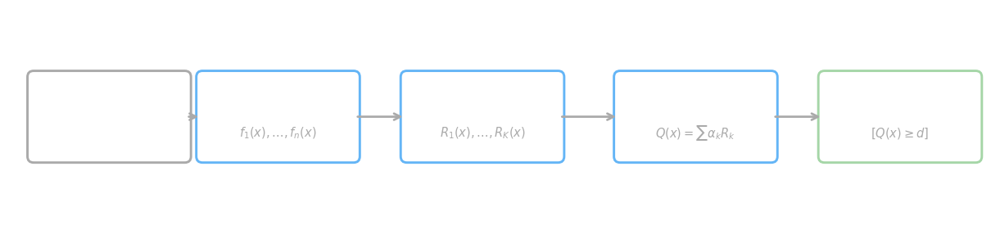
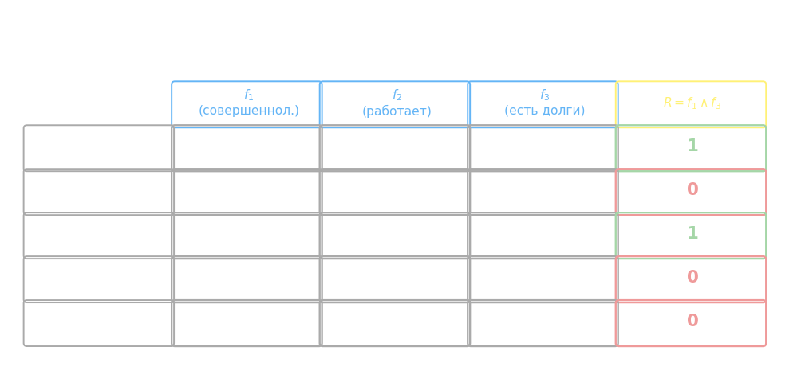
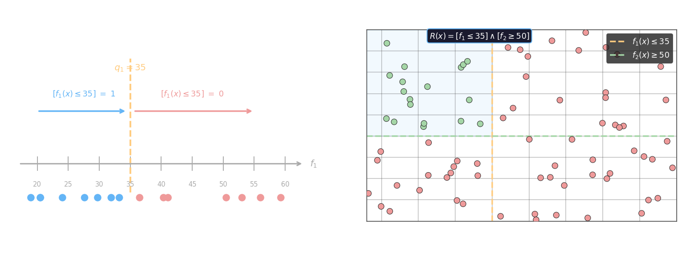
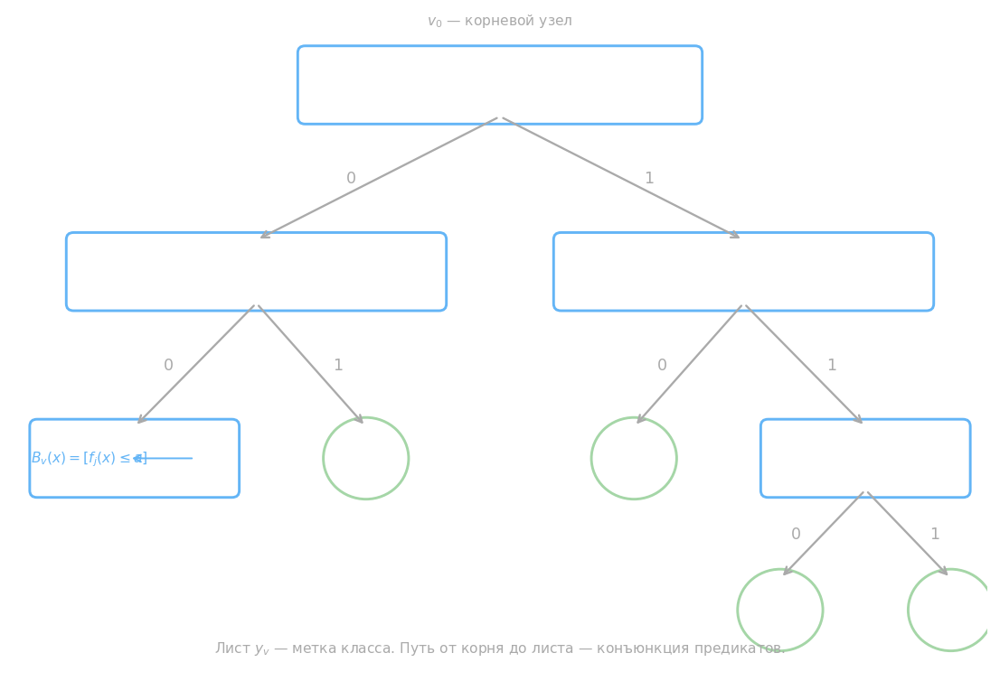
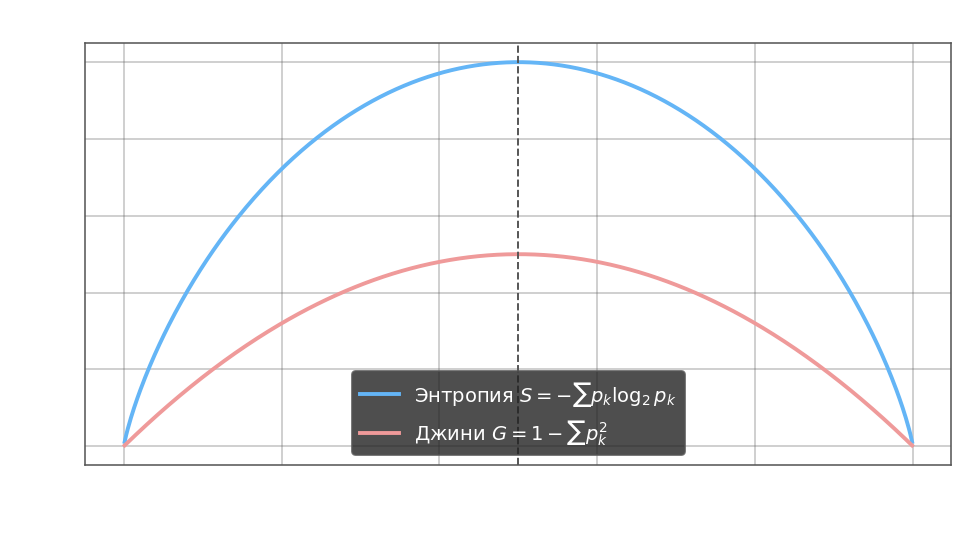
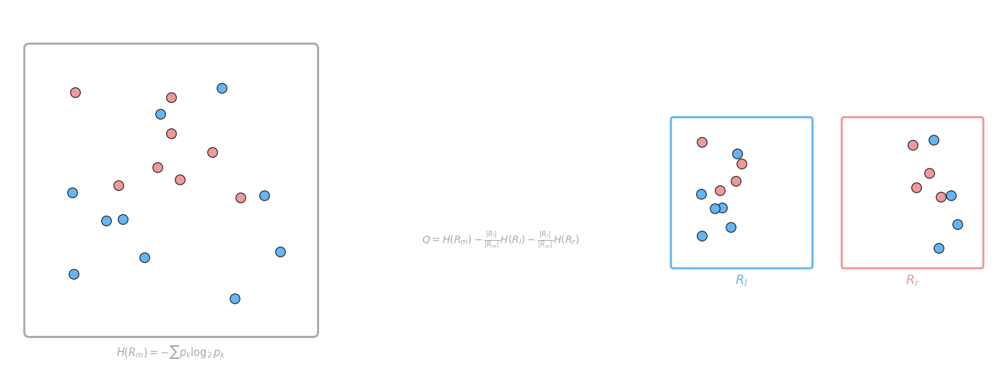
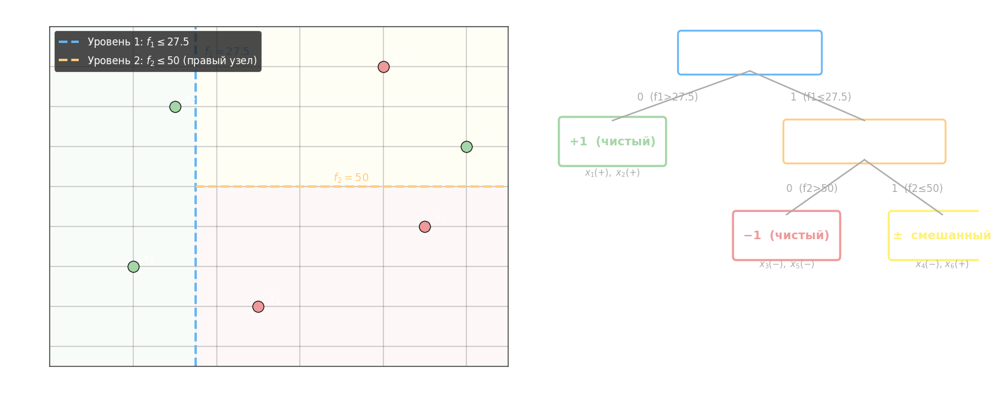
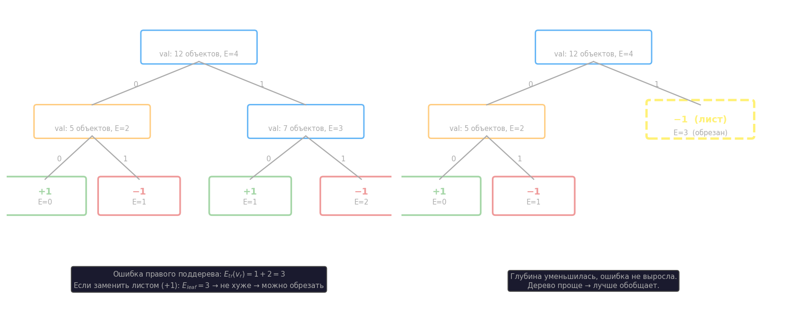

# Логические методы классификации. Решающие деревья

Человек принимает решения по правилам: «если клиент совершеннолетний **и** не имеет долгов — одобрить кредит». Логические методы классификации формализуют именно такой подход: решение строится как набор проверяемых условий над признаками объекта.

Каждое условие называется **конъюнкцией** — булевым предикатом $R_k(x) \in \{0, 1\}$, который проверяет одновременное выполнение нескольких условий на признаки. Итоговый классификатор взвешенно суммирует конъюнкции и сравнивает сумму с порогом:

$$Q(x) = \sum_{k} \alpha_k R_k(x) \geq d$$

где $\alpha_k$ — вес $k$-й конъюнкции, $d$ — порог решения. Если $Q(x) \geq d$ — объект относится к положительному классу.



Принципиальная особенность: в отличие от линейных методов, где $a(x) = \langle \omega, x \rangle$, логический классификатор принимает решение не по числовому скору, а по набору булевых правил — это делает его **интерпретируемым**: каждое правило можно прочитать как предложение на естественном языке.

## Бинарные признаки

Простейший случай — все признаки бинарные: $f_j(x) \in \{0, 1\}$. Каждый признак отвечает на вопрос «да/нет»: совершеннолетний ли клиент, работает ли, есть ли долги. Конъюнкции строятся из **литералов** — прямого вхождения признака $f_j(x)$ или его отрицания $\overline{f_j(x)}$:

$$R(x) = f_1(x) \wedge \overline{f_3(x)}$$

означает: «признак $f_1$ равен 1 **И** признак $f_3$ равен 0». Конъюнкция принимает 1 только когда выполнены все условия сразу — иначе 0.



В таблице выше $x_1$ и $x_3$ удовлетворяют конъюнкции $R = f_1 \wedge \overline{f_3}$ (зелёный 1), остальные — нет (красный 0). Именно эти объекты «активируют» данное правило в классификаторе.

Для $n$ бинарных признаков каждый признак в конъюнкции может участвовать тремя способами: войти напрямую ($f_j$), войти с отрицанием ($\overline{f_j}$) или не участвовать вовсе. Итого $3^n$ различных конъюнкций — при $n = 20$ это уже $3^{20} \approx 3.5 \cdot 10^9$. Явный перебор всех правил невозможен — нужна стратегия жадного построения.

## Вещественные признаки

В реальных задачах признаки вещественные: $f_j(x) \in \mathbb{R}$. Ответ «да/нет» из числа получают сравнением с **пороговым значением** $q_j$:

$$[f_j(x) \leq q_j] \;\to\; \{0, 1\}$$

Например, $f_1(x)$ — возраст клиента, $q_1 = 35$: предикат $[f_1(x) \leq 35]$ равен 1 для молодых клиентов и 0 для остальных. Вместо одного порога можно задать диапазон $[a_j \leq f_j(x) \leq b_j]$, ограничивая признак с двух сторон.

Конъюнкция над подмножеством признаков $S \subseteq \{1, \ldots, n\}$:

$$R(x) = \bigwedge_{j \in S}\bigl[a_j \leq f_j(x) \leq b_j\bigr]$$

где $a_j, b_j$ — пороги, подбираемые по обучающей выборке. Геометрически такая конъюнкция задаёт **прямоугольную область** в пространстве признаков: объект попадает в неё тогда и только тогда, когда все его признаки лежат в заданных диапазонах.



На правом графике $R(x) = [f_1 \leq 35] \wedge [f_2 \geq 50]$ — «молодой клиент с высоким доходом». Зелёные точки удовлетворяют обоим условиям, красные — нет. Ключевое отличие от бинарного случая: пороги $q_j$ вещественные, поэтому кандидатов для разбиения бесконечно много — перебор заменяется поиском оптимального порога по критерию качества.

## Решающие деревья: разбиение пространства признаков

Решающее дерево строит классификатор, последовательно разбивая пространство признаков на прямоугольные области. Каждый внутренний узел дерева выбирает один признак $f_j$ и порог $q$, разделяя объекты на два поддерева: попавшие в $[f_j(x) \leq q]$ идут влево, остальные — вправо. Листовые узлы содержат метку класса.

Конъюнкция, соответствующая пути от корня до листа:

$$R(x) = [f_1(x) \leq q_1] \;\to\; \begin{cases}1 & \text{класс } C_1 \\ 0 & \text{другие классы}\end{cases}$$

Более глубокое дерево добавляет условия на дополнительные признаки:

$$R(x) = [f_2(x) \leq q_2] \wedge [f_1(x) \leq q_1] \;\to\; \begin{cases}1 & \text{класс} \\ 0 & \text{другие}\end{cases}$$

Дерево строится **снизу вверх** («синдром»-подход): сначала формируются листья, соответствующие простейшим правилам, затем объединяются в более сложные конъюнкции. На каждом шаге выбирается разбиение, дающее наибольший **информационный выигрыш** (Information Gain) — прирост чистоты разбиения по сравнению с исходным узлом.

## Критерии качества для построения решающих деревьев



Каждый внутренний узел $v$ дерева хранит предикат $B_v(x) = [f_j(x) \leq a]$, который разбивает текущее подмножество выборки на два дочерних подмножества. Дерево строится жадно: на каждом шаге ищется признак $j_0$ и порог $t_0$, при которых критерий качества разбиения максимален.

### Энтропийный критерий

Мера загрязнённости (impurity) узла — **энтропия**:

$$S = -\sum_{k=1}^{K} p_k \log_2 p_k$$

где $p_k$ — доля объектов класса $k$ в текущем подмножестве, $K$ — число классов. При чистом листе (все объекты одного класса) $S = 0$; при равномерном распределении энтропия максимальна.

Пример: $p_1 = \frac{11}{20}$, $p_2 = \frac{9}{20}$ — распределение в корне:

$$S_0 = -\frac{11}{20} \log_2 \frac{11}{20} - \frac{9}{20} \log_2 \frac{9}{20} \approx 0.993$$

После разбиения порогом $t$ на левое ($N_{\text{left}}$ объектов, энтропия $S_{\text{left}}$) и правое ($N_{\text{right}}$ объектов, энтропия $S_{\text{right}}$) подмножества вычисляется **информационный выигрыш**:

$$IG(j, t) = S_0 - \sum_{i} \frac{N_i}{N} S_i$$

где $N$ — число объектов в текущем узле, $N_i$ — размер $i$-го дочернего узла. На каждой итерации выбирается признак $j_0$ и порог $t_0$, при которых $IG$ наибольший:

$$j_0,\, t_0 = \operatorname{argmax}_{j,\, t} \; IG(j, t)$$

Пример для правого поддерева (7 объектов, 6 одного класса и 1 другого):

$$S_2 = -\frac{6}{7} \log_2 \frac{6}{7} - \frac{1}{7} \log_2 \frac{1}{7} \approx 0.6$$

### Критерий Джини

Альтернативная мера загрязнённости — **критерий Джини**:

$$G = 1 - \sum_{k=1}^{K} p_k^2$$

Для бинарного случая ($K = 2$): $G = 2p_1(1-p_1)$ — парабола с максимумом $0.5$ при равном числе объектов обоих классов. Вычислительно дешевле энтропии (нет логарифма), поэтому широко используется на практике. Оба критерия работают одинаково: нулевое значение при чистом листе, максимум при равном смешении классов.



### Глубина дерева и обобщающая способность

Предикат в узле $B_{j,t}(x) = [x_j \leq t]$ делит пространство одним гиперплоским разрезом. Чем меньше глубина разбиения, тем выше обобщающая способность модели — глубокое дерево точно описывает обучающую выборку, но переобучается. Полный перебор всех признаков и всех порогов на каждом уровне вычислительно дорог; на практике объекты предварительно сортируются по каждому признаку, что позволяет найти оптимальный порог за $O(N \log N)$.

# Inf gain

расчет коэффициента IG с помощью коэффициент Джинни

```python
import numpy as np

np.random.seed(0)
X = np.random.randint(0, 2, size=200) # генерация выборки

t = 150


def get_gini(x): # расчет коэффициента Джинни
    _, counts = np.unique(x, return_counts=True)
    p = counts / counts.sum()

    return 1 - np.sum(p ** 2)


x11 = X[:t] # берем до критерия
x12 = X[t:] # после критерия

S1 = len(x11) / len(X) * get_gini(x11) + len(x12) / len(X) * get_gini(x12) # расчет после сортировки

IG = get_gini(X) - S1 # расчет суммарного коэффициент
```

- вычисление наибольшего информационного выигрыша на одной итерации, с учетом признака (первая или вторая координата)

```python
import numpy as np

data_x = [(5.8, 2.7), (6.7, 3.1), (5.7, 2.9), (5.5, 2.4), (4.8, 3.4), (5.4, 3.4), (4.8, 3.0), (5.5, 2.5), (5.3, 3.7),
          (7.0, 3.2), (5.6, 2.9), (4.9, 3.1), (4.8, 3.0), (5.0, 2.3), (5.2, 3.4), (5.1, 3.8), (5.0, 3.0), (5.0, 3.3),
          (4.6, 3.1), (5.5, 2.6), (5.0, 3.5), (6.7, 3.0), (6.0, 2.2), (4.8, 3.1), (6.4, 2.9), (5.6, 3.0), (4.4, 3.0),
          (4.9, 2.4), (5.6, 3.0), (5.0, 3.6), (5.1, 3.3), (5.8, 4.0), (5.5, 2.4), (5.2, 2.7), (5.1, 3.8), (5.1, 3.5),
          (5.5, 4.2), (4.9, 3.1), (5.9, 3.2), (5.7, 2.6), (4.7, 3.2), (5.4, 3.9), (5.8, 2.6), (5.1, 3.4), (6.4, 3.2),
          (5.8, 2.7), (5.6, 2.7), (5.7, 2.8), (5.4, 3.0), (5.0, 3.2), (4.6, 3.4), (6.0, 2.7), (6.6, 3.0), (4.9, 3.0),
          (4.9, 3.6), (4.4, 3.2), (5.4, 3.4), (6.0, 3.4), (5.9, 3.0), (6.1, 2.8), (5.1, 3.7), (5.5, 3.5), (6.1, 3.0),
          (6.2, 2.2), (5.7, 3.0), (5.2, 3.5), (5.4, 3.7), (4.6, 3.2), (5.2, 4.1), (5.0, 2.0), (6.8, 2.8), (5.0, 3.5),
          (6.7, 3.1), (6.3, 3.3), (6.0, 2.9), (4.7, 3.2), (6.6, 2.9), (5.6, 2.5), (4.4, 2.9), (6.2, 2.9), (6.1, 2.9),
          (4.3, 3.0), (6.9, 3.1), (5.7, 3.8), (5.4, 3.9), (6.1, 2.8), (4.6, 3.6), (5.5, 2.3), (4.8, 3.4), (6.5, 2.8),
          (6.3, 2.5), (5.1, 3.8), (5.7, 4.4), (5.0, 3.4), (4.5, 2.3), (5.7, 2.8), (5.1, 2.5), (5.1, 3.5), (6.3, 2.3),
          (5.0, 3.4)]
data_y = [1, 1, 1, 1, -1, -1, -1, 1, -1, 1, 1, -1, -1, 1, -1, -1, -1, -1, -1, 1, -1, 1, 1, -1, 1, 1, -1, 1, 1, -1, -1,
          -1, 1, 1, -1, -1, -1, -1, 1, 1, -1, -1, 1, -1, 1, 1, 1, 1, 1, -1, -1, 1, 1, -1, -1, -1, -1, 1, 1, 1, -1, -1,
          1, 1, 1, -1, -1, -1, -1, 1, 1, -1, 1, 1, 1, -1, 1, 1, -1, 1, 1, -1, 1, -1, -1, 1, -1, 1, -1, 1, 1, -1, -1, -1,
          -1, 1, 1, -1, 1, -1]

x_train = np.array(data_x)
y_train = np.array(data_y)


def get_gini(x):
    _, counts = np.unique(x, return_counts=True)
    p = counts / counts.sum()

    return 1 - np.sum(p ** 2)


X = np.vstack([x_train.T, data_y]).T
S0 = get_gini(X[:, -1])
th = -np.inf
IG = -np.inf
fj = None

for j in [0, 1]:
    range_t = np.arange(min(x_train[:, j]) + 0.1, max(x_train[:, j]) - 0.1, 0.1)
    for t in range_t:
        x_left = X[X[:, 0] < t]
        x_right = X[X[:, 0] > t]

        S1 = len(x_left) / len(X) * get_gini(x_left[:, -1]) + len(x_right) / len(X) * get_gini(x_right[:, -1])

        IG, th, fj = (S0 - S1, t, j) if S0 - S1 > IG else (IG, th, fj)
```

# Построение бинарных решающих деревьев. ID3

## Алгоритм ID3

**ID3** (Iterative Dichotomiser 3) — жадный алгоритм построения бинарного решающего дерева. Работает сверху вниз: начиная с корня, рекурсивно выбирает наилучшее разбиение в каждой вершине.

**Обозначения.** $R_m$ — подвыборка объектов, попавших в вершину $v_m$. $H(R_m)$ — impurity вершины (энтропия или критерий Джини): $H(R_m) \to 0$ означает чистый лист, все объекты одного класса.

### Критерий разбиения

Для каждой вершины перебираются все признаки $j$ и пороги $t$, разбивающие $R_m$ на левое ($R_l$) и правое ($R_r$) подмножества. Качество разбиения:

$$Q(R_m, j, t) = H(R_m) - \frac{|R_l|}{|R_m|}\,H(R_l) - \frac{|R_r|}{|R_m|}\,H(R_r) \;\to\; \max_{j,\,t}$$

где $|R_m|$, $|R_l|$, $|R_r|$ — количество объектов в соответствующих подмножествах. Критерий $Q$ измеряет взвешенное уменьшение impurity после разбиения. Оптимальные признак и порог:

$$j_m,\, t_m = \operatorname{argmax}_{j,\, t} \; Q(R_m, j, t)$$

Если impurity в вершине уже равна нулю ($H(R_m) = 0$), все объекты принадлежат одному классу — вершина становится листом без разбиения.



### Пример с расчётами

**Выборка** — 6 объектов, два признака $f_1$ (возраст) и $f_2$ (доход), метки $y \in \{+1, -1\}$:

| Объект | $f_1$ | $f_2$ | $y$ |
| ------ | ----- | ----- | --- |
| $x_1$  | 20    | 30    | +1  |
| $x_2$  | 25    | 70    | +1  |
| $x_3$  | 35    | 20    | −1  |
| $x_4$  | 50    | 80    | −1  |
| $x_5$  | 55    | 40    | −1  |
| $x_6$  | 60    | 60    | +1  |

**Шаг 1 — энтропия корня.** В корне 3 объекта класса +1 и 3 класса −1, $p_+ = p_- = \tfrac{1}{2}$:

$$H(R_0) = -\tfrac{1}{2}\log_2\tfrac{1}{2} - \tfrac{1}{2}\log_2\tfrac{1}{2} = 1.0$$

**Шаг 2 — перебор разбиений.** Пробуем два кандидата по $f_1$:

_Вариант A: $f_1 \leq 27.5$_

- $R_l = \{x_1, x_2\}$ — оба $+1$, $H(R_l) = 0$
- $R_r = \{x_3, x_4, x_5, x_6\}$ — один $+1$, три $-1$: $p_+ = \tfrac{1}{4}$, $p_- = \tfrac{3}{4}$

$$H(R_r) = -\tfrac{1}{4}\log_2\tfrac{1}{4} - \tfrac{3}{4}\log_2\tfrac{3}{4} \approx 0.811$$

$$Q(f_1,\;27.5) = 1.0 - \tfrac{2}{6}\cdot 0 - \tfrac{4}{6}\cdot 0.811 \approx \mathbf{0.459}$$

_Вариант Б: $f_1 \leq 42.5$_

- $R_l = \{x_1, x_2, x_3\}$: $p_+ = \tfrac{2}{3}$, $H \approx 0.918$
- $R_r = \{x_4, x_5, x_6\}$: $p_+ = \tfrac{1}{3}$, $H \approx 0.918$

$$Q(f_1,\;42.5) = 1.0 - \tfrac{3}{6}\cdot 0.918 - \tfrac{3}{6}\cdot 0.918 \approx 0.082$$

Лучший порог по $f_1$ — $t = 27.5$, $Q = 0.459$. Аналогично перебираем пороги по $f_2$ — ни один не даёт $Q > 0.459$.

Выбираем $j_0 = f_1,\; t_0 = 27.5$.

**Шаг 3 — левый узел чистый.** $R_l = \{x_1, x_2\}$ — оба $+1$, $H = 0$ → лист с меткой $+1$.

**Шаг 4 — правый узел, второй уровень.** $R_r = \{x_3, x_4, x_5, x_6\}$, $H(R_r) = 0.811$. Пробуем:

_$f_2 \leq 50$:_ $R_l = \{x_3, x_5\}$ оба $-1$ → $H = 0$; $R_r = \{x_4, x_6\}$ по одному → $H = 1.0$

$$Q(f_2,\;50) = 0.811 - \tfrac{2}{4}\cdot 0 - \tfrac{2}{4}\cdot 1.0 = 0.311$$

_$f_1 \leq 42.5$:_ $R_l = \{x_3\}$ → $H = 0$; $R_r = \{x_4, x_5, x_6\}$: $p_+ = \tfrac{1}{3}$, $H = 0.918$

$$Q(f_1,\;42.5) = 0.811 - \tfrac{1}{4}\cdot 0 - \tfrac{3}{4}\cdot 0.918 = 0.122$$

Лучший: $f_2 \leq 50$, $Q = 0.311$. Правый-левый узел ($x_3, x_5$) — чистый $-1$. Правый-правый ($x_4, x_6$) пополам — дерево продолжает расти.



### Критерии остановки

Построение ветви прекращается при выполнении любого из условий:

- impurity узла равна нулю или ниже заданного порога
- число объектов в вершине меньше заданного минимума
- вероятность правильной классификации в вершине превышает заданный уровень
- достигнута максимальная глубина дерева

Критерии остановки — это **регуляризаторы**, ограничивающие сложность модели. По способу применения они делятся на два типа:

- **pre-pruning** (early stopping) — критерии проверяются в процессе построения; ветвь не создаётся, если условие выполнено
- **pruning** (усечение, срезка) — дерево строится полностью, затем ветви отсекаются снизу вверх там, где критерий сигнализирует об избыточности

Достоинства:

- интерпретируемость и простота реализации
- допускает разнородные данные (числовые и категориальные признаки)
- нет откатов — каждое разбиение финально

Недостатки:

- жадность алгоритма приводит к переобучению: локально оптимальные разбиения не гарантируют глобально оптимального дерева
- затухание выборки от корня: чем глубже вершина, тем меньше объектов в листьях и тем ненадёжнее оценки
- высокая чувствительность к шуму и к выбору критерия impurity

## Усечение решающих деревьев (Pruning)

ID3 слишком хорошо подгоняется под обучающую выборку: глубокое дерево запоминает шум, а не закономерность. Решение — **разбить выборку** на обучающую (70%) и контрольную (30%) и использовать контрольную как сигнал для обрезки.

### Алгоритм Reduced Error Pruning

Алгоритм проходит по построенному дереву снизу вверх. Для каждого внутреннего узла $v$ рассматриваются два варианта:

- **оставить** поддерево: ошибка $E_{tr}(v) = E_{tr}(v_l) + E_{tr}(v_r)$ — сумма ошибок дочерних узлов на контрольной выборке
- **обрезать** до листа: взять метку класса большинства среди объектов контрольной выборки, попавших в $v$; ошибка $E_{leaf}(v)$

Если $E_{leaf}(v) \leq E_{tr}(v)$ — поддерево заменяется листом. Обрезку повторяют итеративно снизу вверх до тех пор, пока ни одно усечение не улучшает качество.



### Многоклассовый случай

При $M > 2$ классах $C = \{C_1, C_2, \ldots, C_M\}$ каждый узел хранит не бинарный предикат, а разбиение на $M$ ветвей. Недостаток — число возможных разбиений растёт комбинаторно. Стандартный приём — **свести к бинарному**: вместо $M$-арного разбиения в каждом узле проверяется, принадлежит ли объект некоторому подмножеству классов $C_p$ или его дополнению $C_r$:

$$B_j(x) = [x_j \in C_p], \qquad B_j(x) = [x_j \in C_r]$$

Число различных бинарных разбиений $M$ классов на две непустые части:

$$N = 2^{M-1} - 1$$

### Вероятностная интерпретация листьев

Вместо жёсткой метки каждый лист $v$ хранит **вероятностное распределение** по классам. Для листа с множеством обучающих объектов $U_v$:

$$P(y \mid x, v) = \frac{1}{|U_v|} \sum_{i:\, x_i \in U_v} [y_i = y]$$

то есть доля объектов класса $y$ среди попавших в лист. Вероятности суммируются по путям дерева рекурсивно:

$$P(y \mid x, v) = \sum_{i} g_{vi}\, P(y \mid x,\, v_i), \qquad g_{vi} = \frac{|C_i|}{|v|}$$

где $g_{vi}$ — доля объектов, ушедших в $i$-й дочерний узел, $v_i$ — $i$-й дочерний узел. Финальное предсказание:

$$a(x) = \operatorname{argmax}_{y}\; P(y \mid x, v)$$

**Пример.** Лист $v$ содержит 5 обучающих объектов: 3 класса $A$, 1 класса $B$, 1 класса $C$:

$$P(A \mid x, v) = \tfrac{3}{5} = 0.6, \quad P(B \mid x, v) = \tfrac{1}{5} = 0.2, \quad P(C \mid x, v) = \tfrac{1}{5} = 0.2$$

$$a(x) = \operatorname{argmax} \{0.6,\; 0.2,\; 0.2\} = A$$

Теперь рассмотрим узел $v$ с двумя дочерними листьями $v_l$ ($|C_l| = 4$) и $v_r$ ($|C_r| = 6$), $|v| = 10$. Вероятности в листьях: $P(A|x,v_l) = 1.0$,\; $P(A|x,v_r) = \tfrac{1}{3}$. Рекурсивная формула:

$$P(A \mid x, v) = \tfrac{4}{10} \cdot 1.0 + \tfrac{6}{10} \cdot \tfrac{1}{3} = 0.4 + 0.2 = 0.6$$

### Обработка категориальных признаков

Признак может принимать не числовые значения, а метки из конечного множества (цвет, категория товара, город). Для таких признаков сравнение $f_j(x) \leq t$ не имеет смысла — предикат заменяется проверкой принадлежности: $[f_j(x) \in S]$ для некоторого подмножества $S$ допустимых значений. При $M$ значениях число возможных разбиений равно $2^{M-1} - 1$, что быстро становится большим — на практике используют жадный перебор или сортировку по impurity.

**Пример.** Признак $f$ — тип клиента: $\{\text{студент},\; \text{работающий},\; \text{пенсионер}\}$, $M = 3$, классы: одобрить (+) / отказать (−).

| $f$        | +   | −   |
| ---------- | --- | --- |
| студент    | 1   | 3   |
| работающий | 4   | 1   |
| пенсионер  | 2   | 2   |

Число различных бинарных разбиений: $2^{3-1} - 1 = 3$.

| Разбиение $S$                        | $H(R_l)$ | $H(R_r)$ | $Q$       |
| ------------------------------------ | -------- | -------- | --------- |
| $\{\text{студент}\}$ vs остальные    | 0.811    | 0.954    | 0.046     |
| $\{\text{работающий}\}$ vs остальные | 0.722    | 0.971    | **0.133** |
| $\{\text{пенсионер}\}$ vs остальные  | 1.000    | 0.881    | 0.014     |

Лучшее разбиение: $S = \{\text{работающий}\}$ — предикат $[\,f(x) = \text{работающий}\,]$ даёт наибольший информационный выигрыш $Q = 0.133$.
