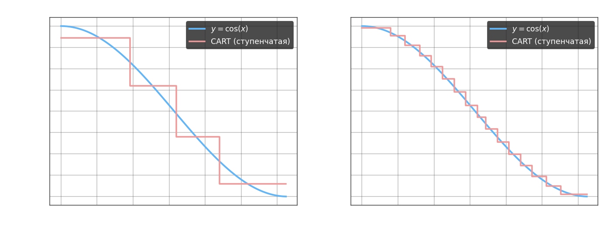

# Решающие деревья в задачах регрессии. Алгоритм CART

**CART** (Classification and Regression Tree) — алгоритм построения бинарного решающего дерева, применимый как для классификации, так и для регрессии. В задаче регрессии листья дерева содержат не метку класса, а вещественное значение: прогноз в каждом листе — константа. На каждом шаге построения дерево аппроксимирует целевую функцию кусочно-постоянной функцией — по одной ступеньке на каждый лист.

Пусть $X^l = \{(x_i,\, y_i)\}_{i=1}^l$, $y_i \in \mathbb{R}$. Например, $y_i = \cos(x_i)$ — на каждом шаге разбиения происходит аппроксимация кусочной константой.



## Прогноз в листе

Для листа $v$, содержащего подвыборку $R_v$, прогноз — среднее арифметическое целевых значений:

$$b_v = \frac{1}{|R_v|} \sum_{i:\, x_i \in R_v} y_i$$

## Impurity для регрессии

В задаче регрессии impurity узла определяется как сумма квадратов отклонений от прогноза листа — дисперсия целевых значений внутри узла:

$$H(R) = \sum_{i:\, x_i \in R} \bigl(b_v - y_i\bigr)^2$$

где $b_v = a(x_i)$ — предсказание модели в листе. Чистый лист ($H = 0$) означает, что все объекты имеют одинаковое $y_i$.

## Критерий разбиения

Как и в ID3, разбиение выбирается максимизацией взвешенного уменьшения impurity:

$$Q(R_m, j, t) = H(R_m) - \frac{|R_l|}{|R_m|}\,H(R_l) - \frac{|R_r|}{|R_m|}\,H(R_r) \;\to\; \max_{j,\,t}$$

Формула та же, что в задаче классификации, — разница только в выборе $H$: для классификации энтропия или критерий Джини, для регрессии — дисперсия. Для решения используется тот же жадный алгоритм перебора признаков и порогов.

---

- задача регрессии косинуса по алгоритму CART для функций

````python
# Решающее дерево для задачи регрессии

from sklearn import tree
import numpy as np
import matplotlib.pyplot as plt

x = np.arange(0, np.pi, 0.1).reshape(-1, 1)
y = np.cos(x)

clf = tree.DecisionTreeRegressor(max_depth=3)
clf = clf.fit(x, y)
pr_y = clf.predict(x)

# качество
Q = np.square(pr_y - y.ravel()).mean()

# tree.plot_tree(clf)
plt.plot(x, y, label="cos(x)")
plt.plot(x, pr_y, label="DT Regression")
plt.grid()
plt.legend()
plt.title('max_depth=3')
plt.show()
````

- пример для бинарной классификации

```python
import numpy as np
from sklearn.tree import DecisionTreeClassifier

X = np.array(
    [(300, 200), (320, 180), (400, 100), (430, 65), (64, 150), (84, 112), (106, 90), (154, 64), (192, 62), (220, 82),
     (244, 92), (271, 111), (275, 137), (286, 161), (56, 178), (80, 156), (101, 131), (123, 104), (155, 94), (191, 100),
     (242, 70), (231, 114), (272, 95), (261, 131), (299, 136), (308, 124), (128, 78), (47, 128), (47, 159), (137, 186),
     (166, 228), (171, 250), (194, 272), (221, 287), (253, 292), (308, 293), (332, 280), (385, 256), (398, 237),
     (413, 205), (435, 166), (447, 137), (422, 126), (400, 154), (389, 183), (374, 214), (358, 235), (321, 250),
     (274, 263), (249, 263), (208, 230), (192, 204), (182, 174), (147, 205), (136, 246), (147, 255), (182, 282),
     (204, 298), (252, 316), (312, 321), (349, 313), (393, 288), (417, 259), (434, 222), (443, 187), (463, 174),
     (420, 90)])
Y = np.array(
    [0, 0, 0, 0, 0, 0, 0, 0, 0, 0, 0, 0, 0, 0, 0, 0, 0, 0, 0, 0, 0, 0, 0, 0, 0, 0, 0, 0, 0, 1, 1, 1, 1, 1, 1, 1, 1, 1,
     1, 1, 1, 1, 1, 1, 1, 1, 1, 1, 1, 1, 1, 1, 1, 1, 1, 1, 1, 1, 1, 1, 1, 1, 1, 1, 1, 1, 1])

# здесь продолжайте программу
clf_tree = DecisionTreeClassifier(criterion='gini', max_depth=4)
clf = clf_tree.fit(X, Y)
predict = clf.predict(X)

Q = np.mean(predict == Y)
```