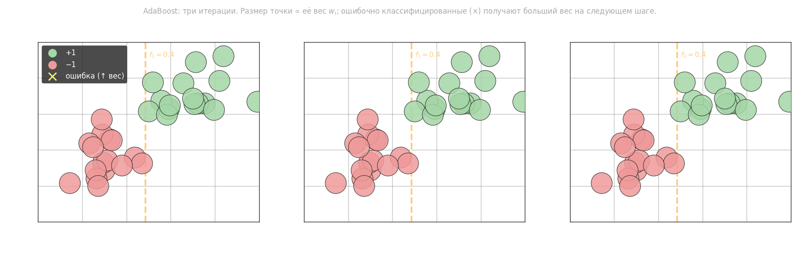

# Введение в бустинг. Алгоритм AdaBoost

## Bagging vs Boosting

Bagging строит $T$ алгоритмов с равными весами $\frac{1}{T}$: $a(x) = \frac{1}{T}\sum_{t=1}^T a_t(x)$. Проблема — алгоритмы обучаются независимо на перекрывающихся подвыборках и остаются скоррелированными: $\mathbb{E}[a_j(x) \cdot a_i(x)] \neq 0$. Дисперсия ошибки снижается, но не оптимально.

**Бустинг** решает это двумя способами: разными весами $\alpha_t$ для каждого базового алгоритма и **последовательным** обучением — каждый следующий алгоритм концентрируется на объектах, которые ошибся предыдущий.

## Постановка задачи

Композиция базовых алгоритмов $b_t(x)$ с весами $\alpha_t$:

$$a(x) = \sum_{t=1}^{T} \alpha_t\, b_t(x)$$

где $b_t(x)$ — базовый алгоритм (например, решающий пень). Для бинарной классификации $y_i \in \{-1, +1\}$ определим **отступ** (margin) объекта $x_i$:

$$M_i = y_i \cdot a(x_i)$$

Если $M_i > 0$ — классификатор верен, $M_i < 0$ — ошибка. Эмпирический риск:

$$Q_T = \sum_{i=1}^{l} [M_i < 0] = \sum_{i=1}^{l} \left[y_i \sum_{t=1}^T \alpha_t b_t(x_i) < 0\right] \to \min$$

Индикатор $[\cdot]$ не дифференцируем. Заменяем его верхней оценкой — **экспоненциальной потерей**:

$$[M_i < 0] \leq e^{-M_i} \implies Q_T \leq \hat{Q}_T = \sum_{i=1}^{l} \exp\!\left(-y_i \sum_{t=1}^T \alpha_t b_t(x_i)\right)$$

## Последовательная минимизация

Экспоненциальную потерю можно разложить в произведение:

$$\hat{Q}_T = \sum_{i=1}^{l} \prod_{t=1}^{T} \exp\!\left(-y_i\, \alpha_t\, b_t(x_i)\right)$$

На шаге $t$ уже построены $b_1, \ldots, b_{t-1}$ с весами $\alpha_1, \ldots, \alpha_{t-1}$. Введём **веса объектов**:

$$w_i^{(t)} = \exp\!\left(-y_i \sum_{t'=1}^{t-1} \alpha_{t'} b_{t'}(x_i)\right), \quad w_i^{(1)} = 1$$

Тогда задача шага $t$ — минимизировать:

$$Q_t = \sum_{i=1}^{l} w_i^{(t)}\, \exp\!\left(-y_i\, \alpha_t\, b_t(x_i)\right) \to \min_{\alpha_t,\, b_t}$$

Поскольку $y_i, b_t(x_i) \in \{-1, +1\}$, показатель экспоненты равен $-\alpha_t$ при верной классификации и $+\alpha_t$ при ошибке:

$$Q_t = e^{-\alpha_t} \underbrace{\sum_{b_t(x_i)=y_i} w_i^{(t)}}_{1 - \epsilon_t} + e^{+\alpha_t} \underbrace{\sum_{b_t(x_i)\neq y_i} w_i^{(t)}}_{\epsilon_t}$$

где $\epsilon_t = \sum_{i:\,b_t(x_i) \neq y_i} w_i^{(t)}$ — взвешенная ошибка классификации.

## Оптимальные $b_t$ и $\alpha_t$

Оптимальный базовый алгоритм минимизирует взвешенную ошибку:

$$b_t = \operatorname{argmin}_{b}\; \sum_{i=1}^{l} w_i^{(t)}\, [b(x_i) \neq y_i]$$

Оптимальный вес находится из $\partial Q_t / \partial \alpha_t = 0$:

$$-e^{-\alpha_t}(1-\epsilon_t) + e^{\alpha_t}\epsilon_t = 0 \implies \alpha_t = \frac{1}{2} \ln \frac{1 - \epsilon_t}{\epsilon_t}$$

где $\alpha_t > 0$ при $\epsilon_t < 0.5$ (алгоритм лучше случайного). Чем точнее базовый алгоритм, тем больше его вес.

## Обновление весов

После выбора $(b_t, \alpha_t)$ веса следующего шага:

$$w_i^{(t+1)} = w_i^{(t)} \cdot \exp\!\left(-\alpha_t\, y_i\, b_t(x_i)\right)$$

Объекты, классифицированные **верно**: $y_i b_t(x_i) = +1$ → $w$ умножается на $e^{-\alpha_t} < 1$ (вес уменьшается). Объекты с **ошибкой**: $y_i b_t(x_i) = -1$ → $w$ умножается на $e^{+\alpha_t} > 1$ (вес растёт). После обновления веса нормируются: $w_i \leftarrow w_i / \sum_j w_j$.

## Алгоритм AdaBoost

1. Инициализация: $w_i = \frac{1}{l}$, $i = 1, \ldots, l$
2. Для $t = 1, \ldots, T$:
   - Найти $b_t = \operatorname{argmin}_{b}\; \sum_i w_i\, [b(x_i) \neq y_i]$
   - Вычислить взвешенную ошибку: $\epsilon_t = \sum_i w_i\, [b_t(x_i) \neq y_i]$
   - Вычислить вес: $\alpha_t = \dfrac{1}{2} \ln \dfrac{1 - \epsilon_t}{\epsilon_t}$
   - Обновить и нормировать веса: $w_i \leftarrow w_i \cdot \exp(-\alpha_t y_i b_t(x_i))$, затем $w_i \leftarrow w_i / \sum_j w_j$
3. Итоговый классификатор: $a(x) = \mathrm{sign}\!\left(\displaystyle\sum_{t=1}^T \alpha_t\, b_t(x)\right)$



---

- adaboost на бинарной классификации

```python
# Алгоритм классификации AdaBoost на решающих деревьях

import numpy as np
import matplotlib.pyplot as plt
from sklearn.tree import DecisionTreeClassifier


def get_grid(data):
    x_min, x_max = data[:, 0].min() - 10, data[:, 0].max() + 10
    y_min, y_max = data[:, 1].min() - 10, data[:, 1].max() + 10
    return np.meshgrid(np.arange(x_min, x_max, 1), np.arange(y_min, y_max, 1))


t = [[(85, 174), (93, 156), (103, 176), (113, 152), (123, 133), (128, 160), (147, 127), (152, 137), (180, 124),
      (180, 148), (205, 133), (207, 113), (199, 158), (222, 168), (235, 137), (237, 152), (265, 149), (258, 180),
      (237, 196), (255, 214), (270, 203), (280, 186), (280, 228), (269, 239), (300, 203), (289, 240), (279, 270),
      (294, 271), (308, 238), (118, 187), (154, 154)],
     [(157, 226), (180, 205), (179, 238), (196, 225), (171, 256), (201, 255), (184, 288), (218, 254), (215, 293),
      (233, 282), (217, 330), (226, 316), (241, 314), (253, 337), (267, 314), (278, 335), (286, 349), (290, 314),
      (309, 345), (328, 347), (329, 314), (314, 322), (342, 286), (356, 314), (360, 332), (368, 286), (376, 307),
      (387, 273), (384, 248), (395, 289), (377, 263), (389, 213), (409, 224), (409, 258), (376, 202), (380, 169),
      (408, 186), (408, 205), (424, 164), (406, 149), (436, 197), (427, 242), (419, 273), (402, 313), (380, 335)]]
n1 = len(t[0])
n2 = len(t[1])

train_data = np.r_[t[0], t[1]]
train_labels = np.r_[np.ones(n1) * -1, np.ones(n2)]

# x, y = train_data[:, 0], train_data[:, 1]
# plt.scatter(x[train_labels == -1], y[train_labels == -1])
# plt.scatter(x[train_labels == 1], y[train_labels == 1])
# plt.show()

XN = len(train_data)  # длина обучающей выборки
T = 1  # число алгоритмов в композиции
max_depth = 2  # максимальная глубина решающих деревьев
w = np.ones(XN) / XN  # начальные значения весов для объектов выборки
algs = []  # список из полученных алгоритмов
alfa = []  # список из вычисленных весов для композиции

for n in range(T):
    # создаем и обучаем решающее дерево с весами объектов w
    algs.append(DecisionTreeClassifier(criterion='gini', max_depth=max_depth))
    # вычисляем прогноз для конкретной модели
    algs[n].fit(train_data, train_labels, sample_weight=w)

    predicted = algs[n].predict(train_data)  # формируем прогнозы полученного дерева по обучающей выборке
    N = np.sum(np.abs(train_labels - predicted) / 2 * w)  # вычисляем долю неверных классификаций
    alfa.append(
        0.5 * np.log((1 - N) / N) if N != 0 else np.log((1 - 1e-8) / 1e-8)
    )  # вычисляем вес для текущего алгоритма

    # пересчитываем веса объектов выборки
    w = w * np.exp(-1 * alfa[n] * train_labels * predicted)
    w = w / np.sum(w)

# вычисляем число ошибок классификации на основе полученной композиции
predicted = alfa[0] * algs[0].predict(train_data)
for n in range(1, T):
    predicted += alfa[n] * algs[n].predict(train_data)

N = np.sum(np.abs(train_labels - np.sign(predicted)) / 2)
print(f"Число ошибок на обучающей выборке: {N} при композиции {T} решающих деревьев")

# отображаем полученные результаты классификации
# xx, yy = get_grid(train_data)
# predicted = alfa[0] * algs[0].predict(np.c_[xx.ravel(), yy.ravel()]).reshape(xx.shape)
# for n in range(1, T):
#     predicted += alfa[n] * algs[n].predict(np.c_[xx.ravel(), yy.ravel()]).reshape(xx.shape)
#
# plt.pcolormesh(xx, yy, predicted, cmap='spring', shading='auto')
# plt.scatter(train_data[:, 0], train_data[:, 1], c=train_labels, s=5000 * w, cmap='spring', edgecolors='black',
#             linewidth=1.5)
# plt.show()
```

- еще пример с бинарной классификацией

```python
import numpy as np
from sklearn.model_selection import train_test_split
from sklearn.tree import DecisionTreeClassifier

np.random.seed(0)
n_feature = 2

# исходные параметры для формирования образов обучающей выборки
r1 = 0.7
D1 = 3.0
mean1 = [3, 7]
V1 = [[D1 * r1 ** abs(i - j) for j in range(n_feature)] for i in range(n_feature)]

r2 = 0.5
D2 = 2.0
mean2 = [4, 2]
V2 = [[D2 * r2 ** abs(i - j) for j in range(n_feature)] for i in range(n_feature)]

# моделирование обучающей выборки
N1, N2 = 1000, 1200
x1 = np.random.multivariate_normal(mean1, V1, N1).T
x2 = np.random.multivariate_normal(mean2, V2, N2).T

data_x = np.hstack([x1, x2]).T
data_y = np.hstack([np.ones(N1) * -1, np.ones(N2)])

x_train, x_test, y_train, y_test = train_test_split(data_x, data_y, random_state=123, test_size=0.3, shuffle=True)

# здесь продолжайте программу
T = 10
max_depth = 3
w = np.ones(len(x_train)) / len(x_train)
algs = []
alfa = []

for n in range(T):
    algs.append(DecisionTreeClassifier(criterion='gini', max_depth=max_depth))
    algs[n].fit(x_train, y_train, sample_weight=w)

    predicted = algs[n].predict(x_train)

    N = np.sum((y_train != predicted) * w) + 1e-8
    alfa.append(0.5 * np.log((1 - N) / N))

    w = w * np.exp(-1 * alfa[n] * y_train * predicted)
    w = w / np.sum(w)

predict = alfa[0] * algs[0].predict(x_test)
for n in range(1, T):
    predict += alfa[n] * algs[n].predict(x_test)

predict = np.sign(predict)
Q = np.sum(predict != y_test)

```
