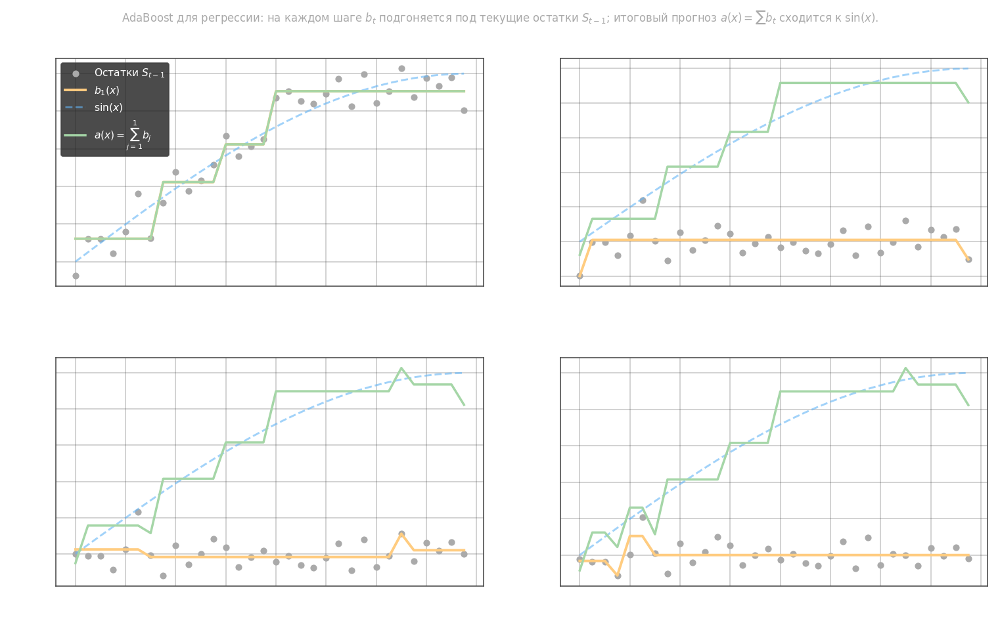
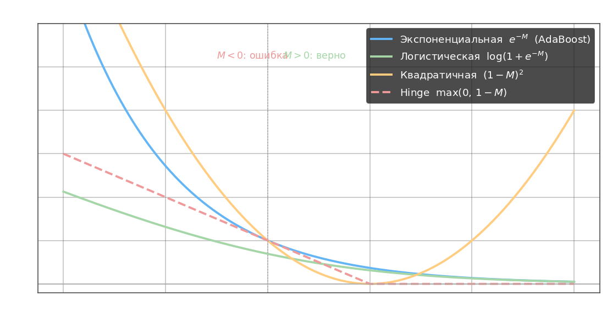

# Алгоритм AdaBoost в задачах регрессии

AdaBoost фиксирует набор базовых алгоритмов $b_1(x), \ldots, b_T(x)$ и весовые коэффициенты $\alpha_t$:

$$a(x) = \sum_{t=1}^{T} \alpha_t\, b_t(x)$$

В задаче регрессии критерий качества — квадратичный. В отличие от классификации с экспоненциальной потерей $L = e^{-M}$, здесь $L = (y - a(x))^2$.

## Вывод через остатки

Полный функционал качества:

$$Q_T = \frac{1}{2}\sum_{i=1}^{l} \left(y_i - \sum_{j=1}^{T} \alpha_j b_j(x_i)\right)^2$$

Выделим вклад последнего алгоритма. Обозначим **остаток** после $T-1$ шагов:

$$S_{i,\,T-1} = y_i - \sum_{j=1}^{T-1} \alpha_j b_j(x_i)$$

Тогда:

$$Q_T = \frac{1}{2}\sum_{i=1}^{l} \bigl(S_{i,\,T-1} - \alpha_T b_T(x_i)\bigr)^2$$

На каждом шаге $t$ задача сводится к обучению $b_t$ на текущих остатках $S_{i,\,t-1}$ — это обычная задача регрессии. При $\alpha_t = 1$ каждый базовый алгоритм минимизирует:

$$Q_t = \sum_{i=1}^{l} \bigl(S_{i,\,t-1} - b_t(x_i)\bigr)^2$$

**Значение в листе.** Если $b_t$ — решающее дерево, то для листа $R_v$ оптимальное значение константы $c$ находится из $\frac{\partial Q}{\partial c} = \sum_{i: x_i \in R_v}(y_i - c) = 0$, откуда:

$$c = \frac{1}{|R_v|}\sum_{i:\,x_i \in R_v} y_i$$

то есть каждый лист хранит среднее арифметическое остатков объектов, попавших в него.

## Алгоритм AdaBoost для регрессии

**Вход:** выборка $X^l = \{(x_i, y_i)\}_{i=1}^l$, число алгоритмов $T$.  
**Выход:** базовые алгоритмы $b_1(x), \ldots, b_T(x)$.

1. Инициализация остатков: $S_{i,0} = y_i$
2. Для $t = 1, \ldots, T$:
   - Найти наилучший алгоритм: $b_t = \operatorname{argmin}_{b}\; \sum_{i=1}^{l}\bigl(S_{i,\,t-1} - b(x_i)\bigr)^2$
   - Обновить остатки: $S_{i,\,t} = S_{i,\,t-1} - b_t(x_i)$
3. Итоговый прогноз: $a(x) = \sum_{t=1}^{T} b_t(x)$



На каждом шаге $b_t$ аппроксимирует то, что предыдущие деревья не объяснили. Остатки $S_{i,t}$ монотонно убывают по норме.

Преимущества:

- работает лучше линейной регрессии на нелинейных зависимостях
- можно отсеивать выбросы подбором устойчивой функции потерь (например, $|y - a(x)|$ вместо квадратичной)

Недостатки:

- чувствительность к выбросам при квадратичной потере
- строго последовательные шаги — сложно интерпретировать вклад каждого дерева
- короткие гладкие кривые аппроксимирует ступенчато
- нужна дополнительная валидационная выборка для подбора $T$

# Градиентный бустинг

Градиентный бустинг — общий фреймворк построения ансамбля, в котором каждый следующий алгоритм аппроксимирует **антиградиент** функционала потерь. Это позволяет работать с произвольной дифференцируемой функцией $L$, а не только с квадратичной.

## Общая постановка

Задача — минимизировать суммарный функционал:

$$Q(\alpha, b) = \sum_{i=1}^{l} L\!\bigl(a(x_i),\, y_i\bigr) \to \min$$

где $a(x)$ — текущая ансамблевая модель, $L$ — произвольная дифференцируемая функция потерь.

На каждом шаге $t$ имеется текущий прогноз $f_{t-1,i} = a_{t-1}(x_i)$. Вычислим **градиент** функционала по прогнозу:

$$g_i = \frac{\partial\, L(f_{t-1,i},\, y_i)}{\partial f_{t-1,i}}$$

где $g_i$ — чувствительность потерь к изменению прогноза на объекте $x_i$.

Шаг градиентного спуска в пространстве прогнозов:

$$f_{t,i} = f_{t-1,i} - \alpha\, g_i$$

Так как $f_{t,i}$ — значение функции на конкретных объектах, а нам нужна обобщающая модель, обучим базовый алгоритм $b_t$ аппроксимировать вектор антиградиента $\{-g_i\}$:

$$b_t = \operatorname{argmin}_{b}\; \sum_{i=1}^{l} \bigl(b(x_i) + g_i\bigr)^2$$

где задача сводится к обычной регрессии на псевдоостатки $-g_i$.

Оптимальный шаг $\alpha_t$ подбирается одномерной оптимизацией:

$$\alpha_t = \operatorname{argmin}_{\alpha}\; \sum_{i=1}^{l} L\!\bigl(f_{t-1,i} + \alpha\, b_t(x_i),\; y_i\bigr)$$

Обновление прогноза:

$$f_t = f_{t-1} + \alpha_t\, b_t(x)$$

## Алгоритм градиентного бустинга

**Вход:** выборка $\{(x_i, y_i)\}_{i=1}^l$, функция потерь $L$, число шагов $T$.

1. Инициализация: $f_0(x) = \operatorname{argmin}_c \sum_{i} L(c, y_i)$ (константный прогноз)
2. Для $t = 1, \ldots, T$:
   - Вычислить псевдоостатки: $r_i = -g_i = -\dfrac{\partial L(f_{t-1}(x_i),\, y_i)}{\partial f_{t-1}(x_i)}$
   - Обучить $b_t$ на $\{(x_i, r_i)\}$ — задача регрессии
   - Найти шаг: $\alpha_t = \operatorname{argmin}_{\alpha} \sum_{i} L(f_{t-1}(x_i) + \alpha\, b_t(x_i),\, y_i)$
   - Обновить: $f_t(x) = f_{t-1}(x) + \alpha_t\, b_t(x)$
3. Итоговый прогноз: $a(x) = f_T(x)$

## Функции потерь как функции отступа

Для задачи классификации удобно записывать потери через **отступ** $M = y \cdot a(x)$, $y \in \{-1, +1\}$. При $M < 0$ объект классифицирован неверно, при $M > 0$ — верно.



| Функция потерь   | $L(M)$             | Метод                   |
| ---------------- | ------------------ | ----------------------- |
| Экспоненциальная | $e^{-M}$           | AdaBoost                |
| Логистическая    | $\log(1 + e^{-M})$ | Логистическая регрессия |
| Квадратичная     | $(1 - M)^2$        | Least Squares Boosting  |
| Hinge            | $\max(0,\, 1 - M)$ | SVM                     |

Экспоненциальная потеря даёт AdaBoost как частный случай градиентного бустинга: антиградиент совпадает с пересчётом весов объектов.

## Стохастический градиентный бустинг

На каждом шаге $t$ вместо всей выборки используется случайная подвыборка размера $m < l$ (без возвращения). Это снижает корреляцию между деревьями и ускоряет обучение:

$$b_t = \operatorname{argmin}_{b}\; \sum_{i \in I_t} \bigl(b(x_i) + g_i\bigr)^2, \quad |I_t| = m$$

где $I_t$ — случайное подмножество индексов на шаге $t$.

Преимущества:

- единый фреймворк для произвольной функции потерь
- при логистической потере получаем вероятностные оценки $P(y\,|\,x)$
- стохастический вариант снижает переобучение и ускоряет сходимость

Недостатки:

- чувствителен к выбросам при квадратичной потере (используют $|r_i|$ вместо $r_i^2$)
- строго последовательное обучение — не параллелизуется
- требует подбора числа деревьев $T$ и шага $\alpha$

---

```python
# Алгоритм регрессии AdaBoost на решающих деревьях
import numpy as np
import matplotlib.pyplot as plt
from sklearn.tree import DecisionTreeRegressor

np.random.seed(123)

x = np.arange(0, np.pi / 2, 0.1).reshape(-1, 1)
y = np.sin(x) + np.random.normal(0, 0.1, x.shape)

# plt.plot(x, y)
# plt.grid()
# plt.show()

T = 5  # число алгоритмов в композиции
max_depth = 2  # максимальная глубина решающих деревьев
algs = []  # список из полученных алгоритмов
s = np.array(y.ravel())
for n in range(T):
    # создаем и обучаем решающее дерево
    algs.append(DecisionTreeRegressor(max_depth=max_depth))
    algs[-1].fit(x, s)

    s -= algs[-1].predict(x)  # пересчитываем остатки

# восстанавливаем исходный сигнал по набору полученных деревьев
yy = algs[0].predict(x)
for n in range(1, T):
    yy += algs[n].predict(x)

# отображаем результаты в виде графиков
# plt.plot(x, y)  # исходный график
# plt.plot(x, yy)  # восстановленный график
# plt.plot(x, s)  # остаточный сигнал
# plt.grid()
# plt.show()
```
