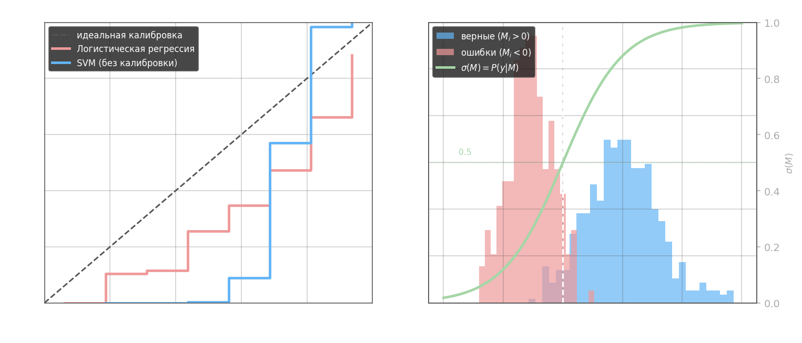
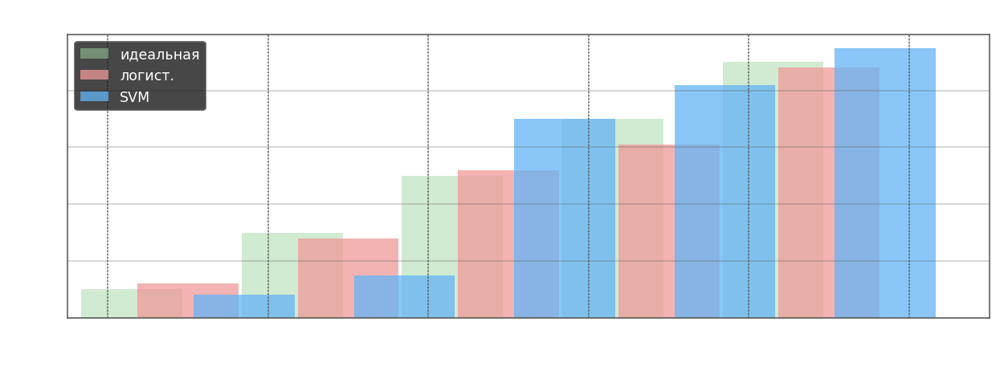

Доля аккуратности $\text{accuracy} = \frac{1}{k}\sum_{i=1}^k [a(x_i) = y_i] = \frac{1}{k}\sum_{i=1}^k [M_i > 0]$ показывает лишь число правильных ответов, но не говорит ничего о распределении ошибок по выборке и о том, насколько модель уверена в своих решениях. Два классификатора с одинаковой точностью могут вести себя принципиально по-разному: один уверенно правильно классифицирует большинство объектов и ошибается только на шуме, другой еле-еле переходит порог на большинстве примеров. Представление качества одним числом не информативно.

Отступ $M_i = y_i \cdot \langle \omega, x_i \rangle$ несёт больше информации: большой положительный отступ означает уверенную правильную классификацию, отрицательный — ошибку, значение около нуля — неуверенное решение на границе. Если использовать функцию потерь $\mathcal{L}(M_i) = \log(1 + e^{-M_i})$, то из неё естественно извлекается вероятность принадлежности к классу:

$$P(y \mid M) = \sigma(M) = \frac{1}{1 + e^{-M}}, \qquad \sigma(M) = P(y \mid x, \omega)$$

При $M = 0$ вероятность равна $0.5$ — полная неопределённость, при больших положительных $M$ она стремится к 1.

*Правый график. Ось X — отступ $M_i$, ось Y — количество объектов выборки. Синие столбцы — гистограмма отступов верно классифицированных объектов: они сосредоточены правее нуля, то есть модель уверенно относит их к правильному классу. Красные столбцы — гистограмма ошибок: они сосредоточены левее нуля. Зона около $M = 0$ — переходная: объекты с обоих классов перемешаны, модель неуверена. Зелёная кривая $\sigma(M)$ — сигмоида, наложенная поверх гистограммы: она показывает, какую вероятность $P(y \mid x)$ модель приписывает объекту с данным отступом. При $M = 0$ — ровно $0.5$, чем дальше от нуля вправо, тем ближе к $1$, влево — к $0$.*

*Левый график. Ось X — предсказанная моделью вероятность $\hat{p}$, ось Y — реальная доля верных ответов среди всех объектов, которым модель присвоила вероятность $\hat{p}$. Если модель идеально откалибрована, точка $(\hat{p},\, \hat{p})$ лежит на диагонали: когда модель говорит «70% уверенности», ровно 70% таких предсказаний оказываются верными. Логистическая регрессия близка к диагонали. SVM систематически отклоняется: в средней зоне она предсказывает «около 0.5», но реальная доля верных ответов выше — модель недооценивает свою уверенность.*

**Калибровка** отвечает на вопрос: насколько предсказанные вероятности $P(y \mid M_i)$ соответствуют реальным частотам правильных ответов? Для проверки отрезок $[0, 1]$ разбивается на диапазоны $P_0 = 0 < P_1 < P_2 < \ldots < P_n = 1$, и для каждого диапазона вычисляется доля объектов выборки, у которых ответ действительно верный:

$$\text{для всех } x_i \text{ с } P(y = y_i \mid M_i) \in [P_k, P_{k+1}): \quad \hat{f}_k = \frac{1}{|B_k|}\sum_{i \in B_k} [a(x_i) = y_i]$$

Если модель хорошо откалибрована, $\hat{f}_k \approx \frac{P_k + P_{k+1}}{2}$ — то есть ступенчатая кривая на графике «предсказанная вероятность vs доля верных» лежит вдоль диагонали.

*Каждая группа столбцов — один диапазон предсказанных вероятностей $[P_k, P_{k+1})$. Высота столбца = реальная доля верных ответов среди объектов, попавших в этот диапазон. Зелёный (идеал) всегда совпадает с центром диапазона. Красный (логистическая) близок к идеалу. Синий (SVM) в средних диапазонах резко прыгает — модель предсказывает «около 0.5», но реальная доля верных уже 0.7, то есть SVM недооценивает свою уверенность в переходной зоне.*

Логистическая регрессия по построению даёт вероятности, близкие к калиброванным — это следствие максимизации правдоподобия. SVM оптимизирует зазор, а не правдоподобие, поэтому выходные значения $\langle \omega, x \rangle$ не являются калиброванными вероятностями: модель может быть чрезмерно уверенной в одном регионе и неуверенной в другом. SVM можно дополнительно откалибровать, проведя **калибровку модели** — например, методом Платта (Platt scaling), который обучает логистическую регрессию поверх выходов SVM, или изотонической регрессией.

Помимо калибровки, качество модели оценивается через показатели, учитывающие асимметрию классов: **precision**, **recall** и **F-мера**, которые рассматриваются в следующих файлах этого раздела.
