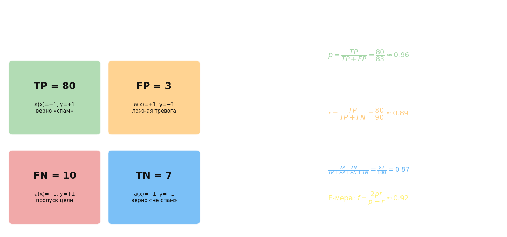
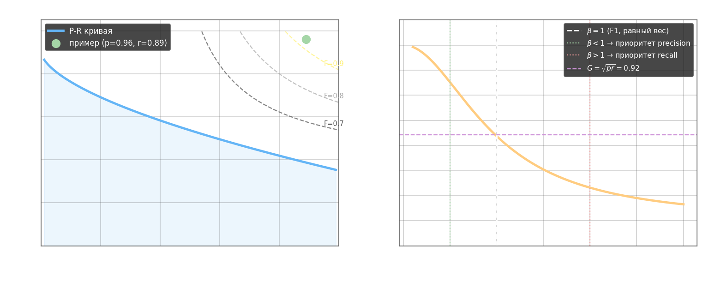

Когда один класс значительно меньше другого (несбалансированная выборка), accuracy перестаёт быть информативной метрикой. Модель, которая всегда предсказывает мажоритарный класс, получает высокий accuracy, но совершенно бесполезна. Для таких задач вводят матрицу ошибок и более тонкие метрики.

Каждый объект выборки попадает ровно в одну из четырёх ячеек в зависимости от того, что предсказала модель и какова истинная метка:

* **TP** (true positive) — $a(x) = +1$, $y = +1$: модель верно предсказала положительный класс
* **TN** (true negative) — $a(x) = -1$, $y = -1$: модель верно предсказала отрицательный класс
* **FP** (false positive) — $a(x) = +1$, $y = -1$: ложная тревога, модель ошиблась в сторону +1
* **FN** (false negative) — $a(x) = -1$, $y = +1$: пропуск цели, модель ошиблась в сторону −1

Пример со спам-фильтром: из 90 спам-сообщений 80 верно помечены как спам (TP), 10 пропущены (FN); из 10 нормальных писем 3 ошибочно помечены как спам (FP), 7 верно пропущены (TN).



*На схеме: зелёный — TP (верные срабатывания), красный — FN (пропуски), оранжевый — FP (ложные тревоги), синий — TN (верные отказы). Справа — формулы precision, recall, accuracy и F-меры для этого примера.*

Общая точность: $\text{accuracy} = \frac{1}{l}\sum_{i=1}^l [a(x_i) = y_i] = \frac{TP + TN}{TP + FP + FN + TN}$. При несбалансированных классах этот показатель вводит в заблуждение, поэтому вводят два дополняющих друг друга показателя.

**Precision** (точность) — доля правильных среди всех, кому модель сказала «+1»:

$$p = \frac{TP}{TP + FP} = \frac{\sum_i [a(x_i)=1][a(x_i)=y_i]}{\sum_i [a(x_i)=1]}$$

Отвечает на вопрос: насколько можно доверять модели, когда она выдаёт положительный ответ?

**Recall** (полнота) — доля найденных среди всех истинно положительных:

$$r = \frac{TP}{TP + FN} = \frac{\sum_i [a(x_i)=1][a(x_i)=y_i]}{\sum_i [y_i = +1]}$$

Отвечает на вопрос: какую долю реальных положительных объектов модель нашла?

Precision и recall находятся в противоречии: снижая порог классификатора, можно поймать больше положительных (recall растёт), но среди них окажется больше ложных (precision падает). Объединить оба показателя в одно число можно несколькими способами. Взвешенная сумма $Q = \alpha_1 p + \alpha_2 r$ требует подбора коэффициентов. Минимум $Q = \min(p, r)$ учитывает только худший из двух показателей. Наиболее распространённое решение — **гармоническое среднее**, которое штрафует за разброс между $p$ и $r$ сильнее, чем арифметическое:

$$f = \frac{2 p \cdot r}{p + r}$$

Если нужно явно расставить приоритеты, используют $F_\beta$-меру с весовым параметром $\beta$:

$$f_\beta = \frac{(1 + \beta^2) \cdot p \cdot r}{\beta^2 \cdot p + r}$$

При $\beta < 1$ больший вес получает precision, при $\beta > 1$ — recall. При $\beta = 1$ получается стандартная $F_1$-мера. Альтернатива — геометрическое среднее $G = \sqrt{p \cdot r}$, менее чувствительное к экстремальным значениям.



*Левый график: кривая P–R параметризована порогом классификатора; пунктирные линии — изолинии постоянной F-меры. Идеальная модель стремится в правый верхний угол. Правый график: при $\beta=1$ F-мера принимает среднее значение; при малых $\beta$ кривая тяготеет к precision, при больших — к recall. Фиолетовая пунктирная линия — геометрическое среднее $G$.*

Как выбрать метрику зависит от задачи: в медицинской диагностике пропуск болезни (FN) критичен → приоритет recall; в спам-фильтре ложная тревога раздражает пользователя → приоритет precision. Между кривыми на плоскости ранжирования эти метрики связаны с ROC-кривой, рассмотренной в следующем файле.

---

- вычисление TP, TN, FP, FN

```python
import numpy as np

np.random.seed(0)

# исходные параметры распределений двух классов
r1 = 0.7
D1 = 1.0
mean1 = [1, -2]
V1 = [[D1, D1 * r1], [D1 * r1, D1]]

r2 = -0.5
D2 = 2.0
mean2 = [0, 2]
V2 = [[D2, D2 * r2], [D2 * r2, D2]]

# моделирование обучающей выборки
N1 = 500
N2 = 1000
x1 = np.random.multivariate_normal(mean1, V1, N1).T
x2 = np.random.multivariate_normal(mean2, V2, N2).T

data_x = np.hstack([x1, x2]).T
data_y = np.hstack([np.ones(N1) * -1, np.ones(N2)])

# вычисление оценок МО и ковариационных матриц
mm1 = np.mean(x1.T, axis=0)
mm2 = np.mean(x2.T, axis=0)

a = (x1.T - mm1).T
VV1 = np.array([[np.dot(a[0], a[0]) / N1, np.dot(a[0], a[1]) / N1],
                [np.dot(a[1], a[0]) / N1, np.dot(a[1], a[1]) / N1]])

a = (x2.T - mm2).T
VV2 = np.array([[np.dot(a[0], a[0]) / N2, np.dot(a[0], a[1]) / N2],
                [np.dot(a[1], a[0]) / N2, np.dot(a[1], a[1]) / N2]])

# для гауссовского байесовского классификатора
Py1, L1 = 0.5, 1  # вероятности появления классов
Py2, L2 = 1 - Py1, 1  # и величины штрафов неверной классификации

# здесь продолжайте программу
ax = lambda x, v, m, l, py: np.log(l * py) - 0.5 * (x - m) @ np.linalg.inv(v) @ (x - m).T - 0.5 * np.log(
    np.linalg.det(v))

predict = []
for x in data_x:
    predict.append(np.argmax([ax(x, VV1, mm1, L1, Py1), ax(x, VV2, mm2, L2, Py2)]) * 2 - 1)

predict = np.array(predict)

TP, TN, FP, FN = 0, 0, 0, 0

length = len(data_y)

TP = np.sum((y_pred == 1) & (y_test == 1))
TN = np.sum((y_pred == -1) & (y_test == -1))
FP = np.sum((y_pred == 1) & (y_test == -1))
FN = np.sum((y_pred == -1) & (y_test == 1))
```

- вычисление precision, recall

```python
import numpy as np


# логарифмическая функция потерь
def loss(w, x, y):
    # здесь реализация функции потерь
    return np.log2(1 + np.exp(-w @ x * y))


# производная логарифмической функции потерь по вектору w
def df(w, x, y):
    # здесь реализация производной функции потерь
    M = - (w @ x.T * y)
    return - np.exp(M) * x * y / ((1 + np.exp(M)) * np.log(2))


data_x = [(5.8, 1.2), (5.6, 1.5), (6.5, 1.5), (6.1, 1.3), (6.4, 1.3), (7.7, 2.0), (6.0, 1.8), (5.6, 1.3), (6.0, 1.6),
          (5.8, 1.9), (5.7, 2.0), (6.3, 1.5), (6.2, 1.8), (7.7, 2.3), (5.8, 1.2), (6.3, 1.8), (6.0, 1.0), (6.2, 1.3),
          (5.7, 1.3), (6.3, 1.9), (6.7, 2.5), (5.5, 1.2), (4.9, 1.0), (6.1, 1.4), (6.0, 1.6), (7.2, 2.5), (7.3, 1.8),
          (6.6, 1.4), (5.6, 2.0), (5.5, 1.0), (6.4, 2.2), (5.6, 1.3), (6.6, 1.3), (6.9, 2.1), (6.8, 2.1), (5.7, 1.3),
          (7.0, 1.4), (6.1, 1.4), (6.1, 1.8), (6.7, 1.7), (6.0, 1.5), (6.5, 1.8), (6.4, 1.5), (6.9, 1.5), (5.6, 1.3),
          (6.7, 1.4), (5.8, 1.9), (6.3, 1.3), (6.7, 2.1), (6.2, 2.3), (6.3, 2.4), (6.7, 1.8), (6.4, 2.3), (6.2, 1.5),
          (6.1, 1.4), (7.1, 2.1), (5.7, 1.0), (6.8, 1.4), (6.8, 2.3), (5.1, 1.1), (4.9, 1.7), (5.9, 1.8), (7.4, 1.9),
          (6.5, 2.0), (6.7, 1.5), (6.5, 2.0), (5.8, 1.0), (6.4, 2.1), (7.6, 2.1), (5.8, 2.4), (7.7, 2.2), (6.3, 1.5),
          (5.0, 1.0), (6.3, 1.6), (7.7, 2.3), (6.4, 1.9), (6.5, 2.2), (5.7, 1.2), (6.9, 2.3), (5.7, 1.3), (6.1, 1.2),
          (5.4, 1.5), (5.2, 1.4), (6.7, 2.3), (7.9, 2.0), (5.6, 1.1), (7.2, 1.8), (5.5, 1.3), (7.2, 1.6), (6.3, 2.5),
          (6.3, 1.8), (6.7, 2.4), (5.0, 1.0), (6.4, 1.8), (6.9, 2.3), (5.5, 1.3), (5.5, 1.1), (5.9, 1.5), (6.0, 1.5),
          (5.9, 1.8)]
data_y = [-1, -1, -1, -1, -1, 1, 1, -1, -1, 1, 1, -1, 1, 1, -1, 1, -1, -1, -1, 1, 1, -1, -1, -1, -1, 1, 1, -1, 1, -1, 1,
          -1, -1, 1, 1, -1, -1, 1, 1, -1, 1, 1, -1, -1, -1, -1, 1, -1, 1, 1, 1, 1, 1, -1, -1, 1, -1, -1, 1, -1, 1, -1,
          1, 1, -1, 1, -1, 1, 1, 1, 1, 1, -1, -1, 1, 1, 1, -1, 1, -1, -1, -1, -1, 1, 1, -1, 1, -1, 1, 1, 1, 1, -1, 1, 1,
          -1, -1, -1, -1, 1]

x_train = np.array([[1, x[0], x[1]] for x in data_x])
y_train = np.array(data_y)

n_train = len(x_train)  # размер обучающей выборки
w = [0.0, 0.0, 0.0]  # начальные весовые коэффициенты
nt = np.array([0.5, 0.01, 0.01])  # шаг обучения для каждого параметра w0, w1, w2
lm = 0.01  # значение параметра лямбда для вычисления скользящего экспоненциального среднего
N = 500  # число итераций алгоритма SGD

np.random.seed(0)  # генерация одинаковых последовательностей псевдослучайных чисел

# здесь продолжайте программу
for _ in range(N):
    k = np.random.randint(0, n_train - 1)
    w -= nt * df(w, x_train[k], y_train[k])

TP = np.sum((y_pred == 1) & (y_test == 1))
TN = np.sum((y_pred == -1) & (y_test == -1))
FP = np.sum((y_pred == 1) & (y_test == -1))
FN = np.sum((y_pred == -1) & (y_test == 1))

precision = TP / (TP + FP)
recall = TP / (TP + FN)
```

- вычисление F-меры

```python
import numpy as np
from sklearn import svm
from sklearn.model_selection import train_test_split

np.random.seed(0)

# исходные параметры распределений классов
r1 = 0.2
D1 = 3.0
mean1 = [2, -2]
V1 = [[D1, D1 * r1], [D1 * r1, D1]]

r2 = 0.5
D2 = 2.0
mean2 = [-1, -1]
V2 = [[D2, D2 * r2], [D2 * r2, D2]]

# моделирование обучающей выборки
N1 = 2500
N2 = 1500
x1 = np.random.multivariate_normal(mean1, V1, N1).T
x2 = np.random.multivariate_normal(mean2, V2, N2).T

data_x = np.hstack([x1, x2]).T
data_y = np.hstack([np.ones(N1) * -1, np.ones(N2)])

x_train, x_test, y_train, y_test = train_test_split(data_x, data_y, random_state=123, test_size=0.4, shuffle=True)

# здесь продолжайте программу
clf = svm.SVC(kernel='linear')
clf.fit(x_train, y_train)
predict = clf.predict(x_test)

w = [clf.intercept_[0], *clf.coef_[0]]

TP = np.sum((y_pred == 1) & (y_test == 1))
TN = np.sum((y_pred == -1) & (y_test == -1))
FP = np.sum((y_pred == 1) & (y_test == -1))
FN = np.sum((y_pred == -1) & (y_test == 1))

precision = TP / (TP + FP)
recall = TP / (TP + FN)

betta = 0.5 ** 2

F = 2 * precision * recall / (precision + recall)
Fb = (1 + betta) * precision * recall / (betta * precision + recall)
```