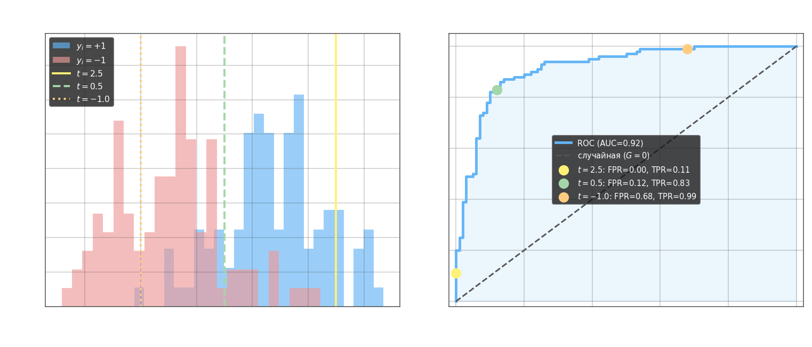
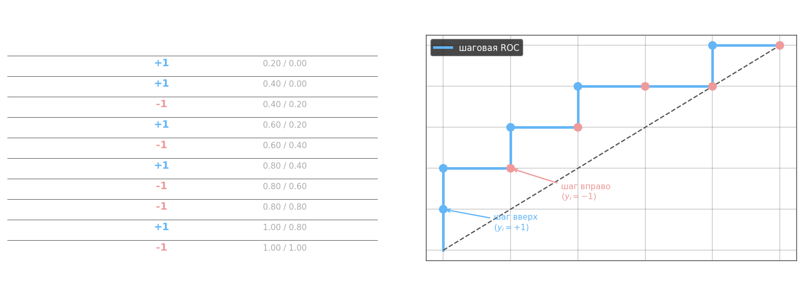
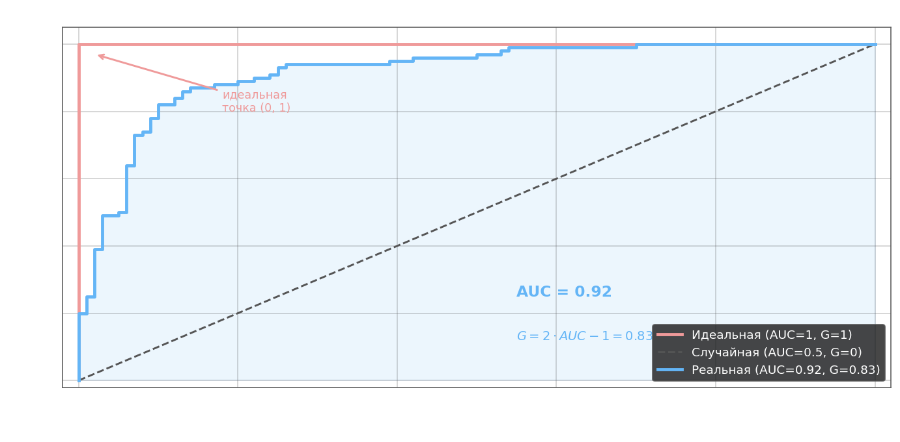

ROC-кривая (Receiver Operating Characteristic) — инструмент оценки качества **ранжирования**: насколько хорошо модель упорядочивает объекты по степени принадлежности к положительному классу. В отличие от precision/recall, которые зависят от конкретного порога, ROC-кривая показывает поведение классификатора при **всех** возможных порогах одновременно.

Модель задаётся скалярным произведением $b(x) = \langle \omega, x \rangle$, а порог $t$ определяет решение: $a(x, t) = \text{sign}(\langle \omega, x \rangle - t)$. Идеальная модель — та, у которой скалярные произведения положительных объектов больше, чем у отрицательных, то есть $b(x_i) > b(x_j)$ всегда при $y_i = +1$, $y_j = -1$.

При фиксированном пороге $t$ классификатор характеризуется двумя числами. **FPR** (False Positive Rate) — доля отрицательных объектов, ошибочно принятых за положительные, то есть специфичность наоборот:

$$\text{FPR}(t) = \frac{FP(t)}{FP(t) + TN(t)} = \frac{\sum_{i=1}^l [y_i = -1]\,[a(x_i, t) = +1]}{\sum_{i=1}^l [y_i = -1]}$$

**TPR** (True Positive Rate, он же recall) — доля положительных объектов, верно найденных моделью:

$$\text{TPR}(t) = \frac{TP(t)}{TP(t) + FN(t)} = \frac{\sum_{i=1}^l [y_i = +1]\,[a(x_i, t) = +1]}{\sum_{i=1}^l [y_i = +1]}$$

FPR — это мощность пересечения множества $\{y_i = -1\}$ и $\{a(x_i, t) = +1\}$, нормированная на размер отрицательного класса. $1 - \text{FPR}(t)$ называется специфичностью алгоритма.



*Левый график: синие — положительный класс, красные — отрицательный, вертикальные линии — три значения порога $t$. Правый: каждому порогу соответствует точка (FPR, TPR) на ROC-пространстве — снижение $t$ сдвигает точку вправо вверх.*

**Построение ROC-кривой.** Для всех объектов выборки сортируем по убыванию $b(x_i) = \langle \omega, x_i \rangle$: $b(x_1) \geq b(x_2) \geq \ldots \geq b(x_l)$. Порог $t$ пробегает значения $b(x_1), b(x_2), \ldots$ — при каждом шаге добавляется один объект. Если он положительный ($y_i = +1$) — TPR увеличивается, точка на графике делает шаг **вверх**. Если отрицательный ($y_i = -1$) — FPR увеличивается, шаг **вправо**. Результат — ступенчатая кривая от $(0, 0)$ до $(1, 1)$.



*Левая таблица: объекты отсортированы по убыванию $b(x_i)$; синие строки ($y_i=+1$) поднимают TPR, красные ($y_i=-1$) — FPR. Правый график: шаги вверх при встрече положительного, вправо — отрицательного объекта.*



*Идеальная модель (красная) сначала поднимает все TP, не делая ни одной ошибки — кривая идёт по левому краю и верхней границе. Случайная модель (пунктир) даёт диагональ: при любом пороге FPR ≈ TPR. Реальная (синяя) — между ними; закрашенная площадь = AUC.*

**AUC-ROC** (Area Under Curve) — площадь под ROC-кривой, $0 \leq \text{AUC} \leq 1$. Имеет вероятностную интерпретацию: AUC равна вероятности того, что случайно выбранный положительный объект получит более высокий $b(x)$, чем случайно выбранный отрицательный. Идеальная модель: AUC = 1; случайная: AUC = 0.5.

**Коэффициент Джини** — нормированная версия AUC:

$$G = 2 \cdot \text{AUC-ROC} - 1, \qquad G \in [-1, 1]$$

Для идеальной модели $G = 1$, для случайной $G = 0$. Метрика чувствительна к балансу классов и плохо обобщается на многоклассовые выборки.

---

- вычисления FPR TPR

```python
import numpy as np
from sklearn import svm
from sklearn.model_selection import train_test_split

np.random.seed(0)

# исходные параметры распределений классов
r1 = 0.2
D1 = 3.0
mean1 = [2, -2]
V1 = [[D1, D1 * r1], [D1 * r1, D1]]

r2 = 0.5
D2 = 2.0
mean2 = [-1, -1]
V2 = [[D2, D2 * r2], [D2 * r2, D2]]

# моделирование обучающей выборки
N1 = 1000
N2 = 1000
x1 = np.random.multivariate_normal(mean1, V1, N1).T
x2 = np.random.multivariate_normal(mean2, V2, N2).T

data_x = np.hstack([x1, x2]).T
data_y = np.hstack([np.ones(N1) * -1, np.ones(N2)])

x_train, x_test, y_train, y_test = train_test_split(data_x, data_y, random_state=123, test_size=0.5, shuffle=True)

# здесь продолжайте программу
clf = svm.SVC(kernel='linear')
clf.fit(x_train, y_train)
predict = clf.predict(x_test)

w = [clf.intercept_[0], *clf.coef_[0]]

t = 2

y_pred = np.sign(w[1:] @ x_test.T + w[0] - t)

TP = np.sum((y_pred == 1) & (y_test == 1))
TN = np.sum((y_pred == -1) & (y_test == -1))
FP = np.sum((y_pred == 1) & (y_test == -1))
FN = np.sum((y_pred == -1) & (y_test == 1))

FPR = FP / (FP + TN)
TPR = TP / (TP + FN)
```

- данные для roc-кривой

```python
import numpy as np
from sklearn import svm
from sklearn.model_selection import train_test_split

np.random.seed(0)

# исходные параметры распределений классов
r1 = -0.2
D1 = 3.0
mean1 = [1, -5]
V1 = [[D1, D1 * r1], [D1 * r1, D1]]

r2 = 0.5
D2 = 2.0
mean2 = [-1, -2]
V2 = [[D2, D2 * r2], [D2 * r2, D2]]

# моделирование обучающей выборки
N1 = 1000
N2 = 1000
x1 = np.random.multivariate_normal(mean1, V1, N1).T
x2 = np.random.multivariate_normal(mean2, V2, N2).T

data_x = np.hstack([x1, x2]).T
data_y = np.hstack([np.ones(N1) * -1, np.ones(N2)])

x_train, x_test, y_train, y_test = train_test_split(data_x, data_y, random_state=123, test_size=0.5, shuffle=True)

# здесь продолжайте программу
clf = svm.SVC(kernel='linear')
clf.fit(x_train, y_train)

w = [clf.intercept_[0], *clf.coef_[0]]

FPR = []
TPR = []

for t in np.arange(5.7, -7.8, -0.1):
    y_pred = np.sign(w[1:] @ x_test.T + w[0] - t)

    TP = np.sum((y_pred == 1) & (y_test == 1))
    TN = np.sum((y_pred == -1) & (y_test == -1))
    FP = np.sum((y_pred == 1) & (y_test == -1))
    FN = np.sum((y_pred == -1) & (y_test == 1))

    FPR += [FP / (FP + TN)]
    TPR += [TP / (TP + FN)]
```