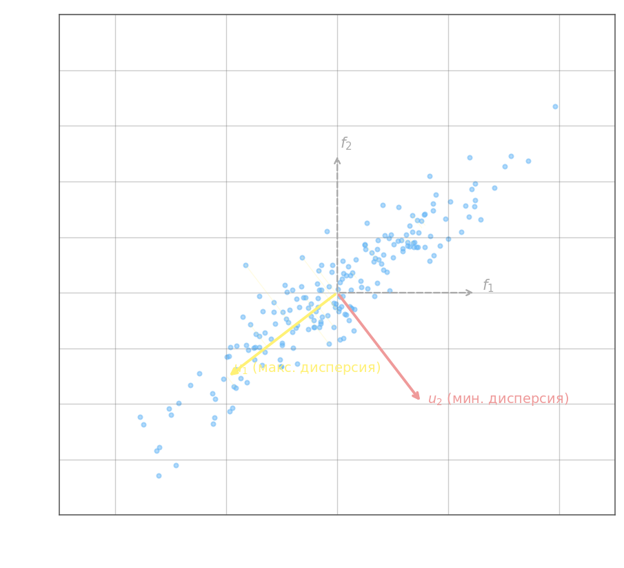

# pca

Одна из причин переобучения — избыточное признаковое пространство: модель подстраивается под шум в нерелевантных признаках. Бороться с этим можно упрощением модели, L1/L2-регуляризацией или **сокращением размерности** — заменой исходных признаков меньшим числом новых, лучше описывающих структуру данных. Метод главных компонент (PCA) реализует именно последнее: он находит новый ортонормированный базис в пространстве признаков, в котором дисперсия данных максимально сосредоточена в первых координатах.

Пусть каждый объект $x_k$ описывается вектором признаков $f_k = [f_1(x_k),\, f_2(x_k),\, \ldots,\, f_n(x_k)]^T$. В двумерном случае точки образуют вытянутое «облако» в осях $(f_1, f_2)$. Если повернуть систему координат так, чтобы первая ось совпала с направлением наибольшего разброса, проекции точек на неё будут нести максимум информации, а проекции на вторую ось — минимум. При достаточно малой дисперсии вдоль второй оси её можно отбросить без существенной потери информации.



Новый базис задаётся ортонормированными векторами $u_1, u_2, \ldots, u_n$, где $\|u_j\| = 1$ и $\langle u_i, u_j \rangle = 0$ при $i \neq j$. Матрица $U = [u_1 \mid u_2 \mid \cdots \mid u_n]^T$ задаёт поворот: новые признаки $g_k$ каждого объекта вычисляются как

$$g_k = U \cdot f_k, \qquad g_j(x_k) = \langle u_j,\, f_k \rangle = \sum_i u_{ji}\, f_i(x_k)$$

Обратное преобразование: $f_k = U^T g_k$ (так как $U$ ортогональна, $U^{-1} = U^T$). В двумерном примере с осями под углом $45°$:

$$U = \begin{bmatrix} \tfrac{1}{\sqrt{2}} & \tfrac{1}{\sqrt{2}} \\[4pt] \tfrac{1}{\sqrt{2}} & -\tfrac{1}{\sqrt{2}} \end{bmatrix}, \qquad u_1 = \begin{bmatrix} \tfrac{1}{\sqrt{2}} \\[2pt] \tfrac{1}{\sqrt{2}} \end{bmatrix}, \quad u_2 = \begin{bmatrix} \tfrac{1}{\sqrt{2}} \\[2pt] -\tfrac{1}{\sqrt{2}} \end{bmatrix}$$

**Нахождение главных направлений в $n$-мерном пространстве.** Строится матрица Грама (ковариационная матрица признаков по выборке из $l$ объектов):

$$\hat{F} = \frac{1}{l} F^T F, \qquad F = \begin{bmatrix} f_1(x_1) & \cdots & f_n(x_1) \\ \vdots & & \vdots \\ f_1(x_l) & \cdots & f_n(x_l) \end{bmatrix}$$

Затем решается задача на собственные значения: $\det(\hat{F} - \lambda E) = 0$. Собственные значения $\lambda_1 \geq \lambda_2 \geq \cdots \geq \lambda_n \geq 0$ показывают **дисперсию данных вдоль соответствующей оси** — чем больше $\lambda_j$, тем больше разброс проекций вдоль $u_j$. Собственные векторы $u_1, u_2, \ldots, u_n$ образуют искомый ортонормированный базис — они и являются главными компонентами.

Отбор признаков сводится к выбору порога: оставляют первые $m$ компонент, для которых $\lambda_j$ достаточно велики, и отбрасывают оставшиеся $n - m$ компонент с малой дисперсией. Доля объяснённой дисперсии при выборе $m$ компонент: $\sum_{j=1}^m \lambda_j \,/\, \sum_{j=1}^n \lambda_j$.

**Численный пример.** Возьмём выборку из $l = 4$ объектов с $n = 2$ признаками, уже центрированную (среднее каждого признака равно нулю):

$$F = \begin{bmatrix}2 & 1 \\ 1 & 2 \\ -1 & -2 \\ -2 & -1\end{bmatrix}$$

Каждая строка — один объект, каждый столбец — один признак. Видно, что признаки коррелированы: там, где первый большой, второй тоже большой.

**Шаг 1. Матрица Грама.**

$$F^T F = \begin{bmatrix}2&1&-1&-2\\1&2&-2&-1\end{bmatrix}\begin{bmatrix}2&1\\1&2\\-1&-2\\-2&-1\end{bmatrix} = \begin{bmatrix}4+1+1+4 & 2+2+2+2\\2+2+2+2 & 1+4+4+1\end{bmatrix} = \begin{bmatrix}10&8\\8&10\end{bmatrix}$$

$$\hat{F} = \frac{1}{4}F^TF = \begin{bmatrix}2{,}5 & 2\\ 2 & 2{,}5\end{bmatrix}$$

**Шаг 2. Собственные значения — дисперсии вдоль главных направлений.**

$$\det(\hat{F} - \lambda I) = (2{,}5 - \lambda)^2 - 4 = 0 \quad\Rightarrow\quad 2{,}5 - \lambda = \pm 2$$

$$\lambda_1 = 4{,}5, \qquad \lambda_2 = 0{,}5$$

Доля объяснённой дисперсии первой компонентой: $4{,}5\,/\,(4{,}5 + 0{,}5) = 90\%$.

**Шаг 3. Собственные векторы — главные направления.**

Для $\lambda_1 = 4{,}5$:

$$(\hat{F} - 4{,}5\,I)\,u = \begin{bmatrix}-2 & 2\\ 2 & -2\end{bmatrix}u = 0 \quad\Rightarrow\quad u_1 = u_2 \quad\Rightarrow\quad u_1 = \frac{1}{\sqrt{2}}\begin{bmatrix}1\\1\end{bmatrix}$$

Для $\lambda_2 = 0{,}5$:

$$(\hat{F} - 0{,}5\,I)\,u = \begin{bmatrix}2 & 2\\ 2 & 2\end{bmatrix}u = 0 \quad\Rightarrow\quad u_1 = -u_2 \quad\Rightarrow\quad u_2 = \frac{1}{\sqrt{2}}\begin{bmatrix}1\\-1\end{bmatrix}$$

Первая компонента $u_1 = [1,1]^T/\sqrt{2}$ — направление вдоль «диагонали» (оба признака растут вместе). Вторая $u_2 = [1,-1]^T/\sqrt{2}$ — перпендикулярное направление, несущее лишь 10% разброса.

**Шаг 4. Проекции на новый базис.**

$$G = F U^T, \qquad U = \frac{1}{\sqrt{2}}\begin{bmatrix}1&1\\1&-1\end{bmatrix}$$

Для каждого объекта вычисляем $g_k = U f_k^T$. Например, первая строка:

$$g_1 = \frac{1}{\sqrt{2}}\begin{bmatrix}1&1\\1&-1\end{bmatrix}\begin{bmatrix}2\\1\end{bmatrix} = \frac{1}{\sqrt{2}}\begin{bmatrix}3\\1\end{bmatrix}$$

Аналогично для остальных строк:

$$G = \frac{1}{\sqrt{2}}\begin{bmatrix}3&1\\3&-1\\-3&1\\-3&-1\end{bmatrix}$$

Проверка: дисперсия первого столбца $G$ равна $\frac{1}{4}\left(\frac{9}{2}+\frac{9}{2}+\frac{9}{2}+\frac{9}{2}\right) = 4{,}5 = \lambda_1$ ✓, дисперсия второго — $0{,}5 = \lambda_2$ ✓.

**Шаг 5. Сокращение до одной компоненты.**

Оставляем только первый столбец $G$: $g_k^{(1)} = 3/\sqrt{2}$ для первых двух объектов и $-3/\sqrt{2}$ для последних двух. Восстанавливаем приближение исходных данных:

$$\hat{F} = G_1\, u_1^T = \frac{1}{\sqrt{2}}\begin{bmatrix}3\\3\\-3\\-3\end{bmatrix} \cdot \frac{1}{\sqrt{2}}\begin{bmatrix}1&1\end{bmatrix} = \begin{bmatrix}1{,}5&1{,}5\\1{,}5&1{,}5\\-1{,}5&-1{,}5\\-1{,}5&-1{,}5\end{bmatrix}$$

Ошибка восстановления: $\|F - \hat{F}\|^2 = 4 \times (0{,}5^2 + 0{,}5^2) = 2 = l \cdot \lambda_2$ — в точности равна числу объектов, умноженному на отброшенное собственное значение.

---

- использование linalg для вычисления собственных чисел и собственных векторов

```python
import numpy as np

np.random.seed(0)

# исходные параметры для формирования образов обучающей выборки
r = 0.7
D = 3.0
mean = [3, 7, -2, 4, 6]
n_feature = 5
V = [[D * r ** abs(i - j) for j in range(n_feature)] for i in range(n_feature)]

# моделирование обучающей выборки
N = 1000
X = np.random.multivariate_normal(mean, V, N)

# здесь продолжайте программу
# X матрицу Грама для признаков (результирующий размер n_feature x n_feature)
F = 1 / N * X.T @ X
# вычислите собственные числа L и собственные векторы W
L, W = np.linalg.eig(F)
# сортировка собственных векторов
W = sorted(zip(L, W.T), key=lambda lx: lx[0], reverse=True)
W = np.array([w[1] for w in W])
# вычисление X в пространстве векторов WW.
G = X @ W.T
```
