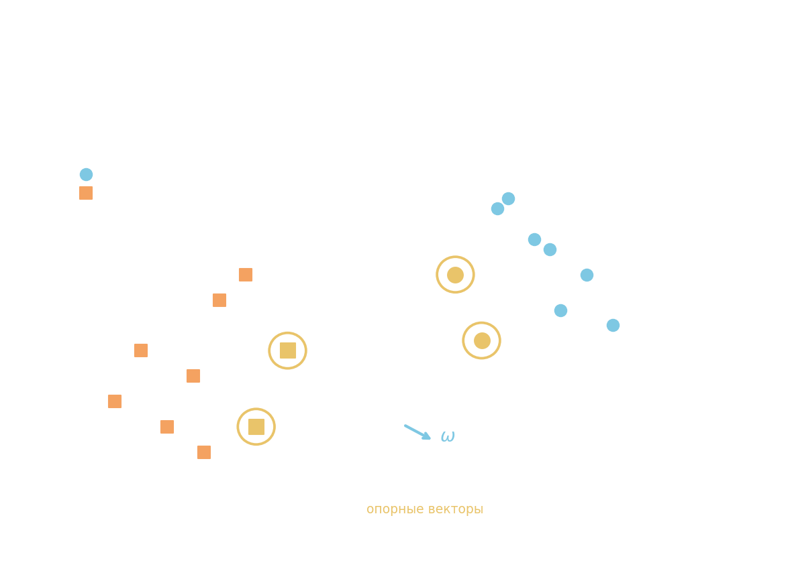
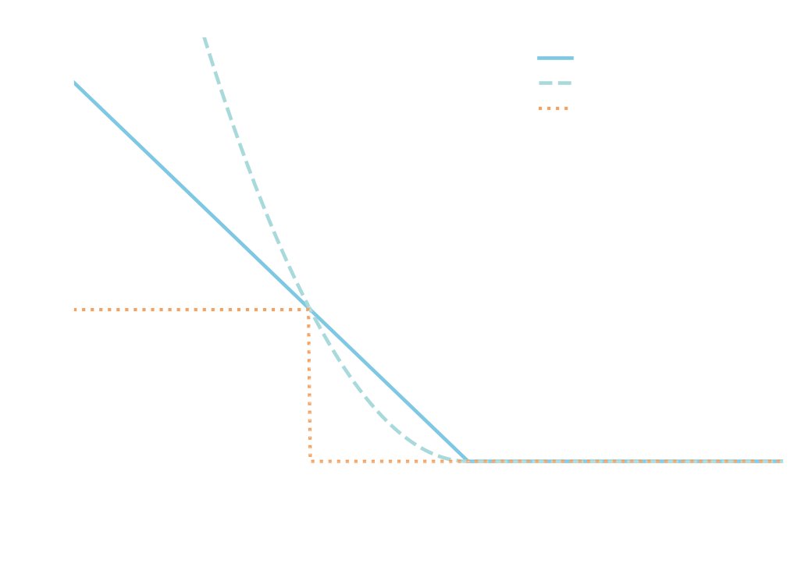

# Метод опорных векторов (Support Vector Machine, SVM)

Идея: найти разделяющую гиперплоскость с **максимальной шириной полосы** между классами — это обеспечивает лучшую обобщающую способность.



Классификатор задаётся знаком скалярного произведения:

$$a(x) = \text{sgn}(\langle\omega, x\rangle - b), \qquad a(x) \in \{-1,\, +1\}$$

## Ширина полосы и отступ

**Отступ** $i$-го объекта — расстояние до гиперплоскости с учётом знака класса:

$$M_i = y_i\bigl(\langle\omega, x_i\rangle - b\bigr), \quad M_i > 0 \text{ — верно},\quad M_i < 0 \text{ — ошибка}$$

Расстояние между крайними объектами разных классов ($x_+$ и $x_-$, проекция на $\omega$):

$$L = \frac{\langle\omega,\, x_+ - x_-\rangle}{\|\omega\|} \to \max$$

**Нормировка**: масштабируем $\omega$ так, чтобы на опорных векторах отступ равнялся ровно 1:

$$M_i(\omega, b) = +1 \text{ для ближайшего }x_+, \qquad M_i(\omega, b) = -1 \text{ для ближайшего }x_-$$

Тогда $\langle\omega, x_+\rangle - \langle\omega, x_-\rangle = 1 - (-1) = 2$, и ширина полосы:

$$L = \frac{2}{\|\omega\|} \to \max \quad \Longleftrightarrow \quad \frac{1}{2}\|\omega\|^2 \to \min$$

## Линейно разделимый случай

Задача квадратичного программирования:

$$\frac{1}{2}\|\omega\|^2 \to \min_{\omega,\,b} \qquad \text{при ограничениях } M_i(\omega, b) \geq 1 \quad \forall\, i$$

## Линейно неразделимый случай: slack variables

Выборка может быть линейно неразделима. Вводим **переменные отклонений** $\varepsilon_i \geq 0$ (slack variables — штраф за нарушение полосы):

$$\frac{1}{2}\|\omega\|^2 + C\sum_{i=1}^l \varepsilon_i \to \min \qquad \text{при} \quad \begin{cases}M_i(\omega, b) \geq 1 - \varepsilon_i \\ \varepsilon_i \geq 0\end{cases}$$

$C > 0$ — гиперпараметр, регулирующий компромисс между шириной полосы и числом ошибок.

Выражая $\varepsilon_i$ из ограничений (при равенстве $\varepsilon_i = 1 - M_i$, иначе $\varepsilon_i = 0$):

$$\varepsilon_i = \max(0,\, 1 - M_i(\omega, b)) \quad \Longrightarrow \quad L_i(\omega, b) = \bigl(1 - M_i(\omega, b)\bigr)_+$$

Это **hinge loss** — штрафует за отступ меньше 1, ноль если отступ $\geq 1$.



Итоговая задача в форме «эмпирический риск + L2-регуляризация»:

$$Q(\omega, b) = \sum_{i=1}^l \bigl(1 - M_i(\omega, b)\bigr)_+ + \frac{1}{2C}\|\omega\|^2 \to \min_{\omega,\,b}$$

Функция не гладкая (hinge не дифференцируема в нуле) → градиентный спуск напрямую не применим.

## Решение через ККТ (условия Каруна–Куна–Такера)

Задача квадратичного программирования вида:

$$\begin{cases}f(x) \to \min \\ g_i(x) \leq 0 \\ h_j(x) = 0\end{cases}$$

Функция Лагранжа:

$$\mathcal{L}(x;\,\mu,\lambda) = f(x) + \sum_{i=1}^m \mu_i\, g_i(x) + \sum_{j=1}^k \lambda_j\, h_j(x)$$

Необходимые условия оптимальности (ККТ) в точке минимума $x^*$:

$$\frac{\partial\mathcal{L}}{\partial x} = 0, \quad g_i(x) \leq 0,\quad h_j(x) = 0,\quad \mu_i \geq 0,\quad \mu_i g_i(x) = 0$$

Последнее — **условие дополняющей нежёсткости**: либо ограничение активно ($g_i = 0$), либо множитель равен нулю ($\mu_i = 0$).

Для SVM функция Лагранжа:

$$\mathcal{L} = \frac{1}{2}\|\omega\|^2 - \sum_i \lambda_i\bigl(M_i(\omega, b) - 1\bigr) - \sum_i \varepsilon_i(\lambda_i + \eta_i - C)$$

где $\lambda_i \geq 0$ — множители для $M_i \geq 1 - \varepsilon_i$, $\eta_i \geq 0$ — множители для $\varepsilon_i \geq 0$.

После применения условий ККТ вектор нормали выражается через опорные объекты:

$$\boxed{\omega = \sum_{i=1}^l \lambda_i\, y_i\, x_i}$$

$\lambda_i$ — коэффициенты опорных векторов; большинство из них равно нулю.

## Типы объектов по значению $\lambda_i$

| $\lambda_i$ | $\varepsilon_i$ | $M_i$ | Тип объекта |
|---|---|---|---|
| $\lambda_i = 0$ | $0$ | $\geq 1$ | не опорный — вне полосы, не влияет на $\omega$ |
| $0 < \lambda_i < C$ | $0$ | $= 1$ | **опорный — на границе полосы** |
| $\lambda_i = C$ | $> 0$ | $< 1$ | **опорный-нарушитель** — внутри полосы или ошибочно классифицирован |

Объект $x_i$ — опорный если $\lambda_i \neq 0$. Это наименее типичные (граничные) представители класса. $\omega$ определяется только ими — остальные объекты не важны.

## Двойственная форма классификатора

$\omega$ — направляющий вектор разделяющей гиперплоскости. Подставляя $\omega = \sum_i \lambda_i y_i x_i$ в классификатор, получаем **двойственное представление**:

$$a(x) = \text{sgn}\!\left(\sum_{i=1}^l \lambda_i\, y_i\, \langle x,\, x_i\rangle - \omega_0\right)$$

т.е. классификация нового объекта $x$ сводится к вычислению скалярных произведений только с **опорными объектами** (у остальных $\lambda_i = 0$). Именно это свойство открывает путь к **ядровому трюку** (kernel trick): достаточно заменить $\langle x, x_i\rangle$ на ядровую функцию $K(x, x_i)$ — и SVM автоматически становится нелинейным, не меняя алгоритма оптимизации.

- SVM для линейной модели w0 + w1 _ x1 + w2 _ x2 = y

```python
import numpy as np
from sklearn import svm

data_x = [
    (4.9, 3.3), (5.6, 4.5), (6.4, 4.3), (6.7, 5.7), (6.3, 5.0), (5.2, 3.9), (5.5, 3.7), (5.6, 3.6), (5.5, 3.8),
    (6.1, 4.7), (7.4, 6.1), (6.0, 5.1), (5.5, 4.4), (5.9, 5.1), (6.5, 5.8), (6.5, 4.6), (6.7, 4.4), (6.3, 5.6),
    (5.9, 4.8), (6.0, 4.5), (5.6, 4.1), (5.6, 4.9), (4.9, 4.5), (6.2, 4.5), (6.1, 4.7), (6.1, 4.9), (6.2, 5.4),
    (5.7, 4.2), (6.1, 5.6), (5.8, 4.0), (6.6, 4.6), (5.6, 4.2), (7.2, 6.1), (7.7, 6.7), (5.6, 3.9), (7.7, 6.9),
    (6.0, 4.0), (6.1, 4.0), (7.6, 6.6), (5.1, 3.0), (6.3, 6.0), (6.7, 5.7), (6.8, 5.9), (6.4, 5.5), (7.0, 4.7),
    (5.8, 5.1), (5.8, 5.1), (6.4, 5.3), (6.3, 4.9), (6.4, 5.3), (5.7, 3.5), (7.2, 5.8), (6.4, 5.6), (5.7, 4.5),
    (6.0, 4.5), (7.7, 6.1), (6.2, 4.3), (7.1, 5.9), (7.3, 6.3), (5.0, 3.3), (6.3, 5.1), (5.8, 3.9), (6.4, 4.5),
    (6.3, 5.6), (6.8, 5.5), (6.9, 5.4), (5.5, 4.0), (5.7, 4.1), (6.5, 5.5), (6.3, 4.7), (5.0, 3.5), (6.7, 5.8),
    (6.9, 4.9), (7.7, 6.7), (5.8, 4.1), (6.4, 5.6), (6.7, 5.2), (6.7, 4.7), (5.4, 4.5), (6.8, 4.8), (5.7, 4.2),
    (5.5, 4.0), (6.3, 4.9), (6.5, 5.2), (5.8, 5.1), (6.0, 4.8), (6.2, 4.8), (6.5, 5.1), (7.9, 6.4), (6.7, 5.0),
    (6.7, 5.6), (6.0, 5.0), (6.1, 4.6), (5.7, 5.0), (7.2, 6.0), (6.3, 4.4), (5.9, 4.2), (6.9, 5.1), (6.6, 4.4),
    (6.9, 5.7)
    ]
data_y = [
    -1, -1, -1, 1, 1, -1, -1, -1, -1, -1, 1, -1, -1, 1, 1, -1, -1, 1, -1, -1, -1, 1, 1, -1, -1, 1, 1, -1, 1, -1,
    -1, -1, 1, 1, -1, 1, -1, -1, 1, -1, 1, 1, 1, 1, -1, 1, 1, 1, 1, 1, -1, 1, 1, -1, -1, 1, -1, 1, 1, -1, 1, -1,
    -1, 1, 1, 1, -1, -1, 1, -1, -1, 1, -1, 1, -1, 1, 1, -1, -1, -1, -1, -1, -1, 1, 1, 1, 1, 1, 1, -1, 1, 1, -1, 1,
    1, -1, -1, 1, -1, 1
    ]

# обучающая выборка в формате [1, x1, x2]
x_train = np.array([[1] + list(x) for x in data_x])  # входные образы
y_train = np.array(data_y)  # целевые значения (метки классов)

# здесь продолжайте программу
clf = svm.SVC(kernel='linear')  # SVM с линейным ядром
clf.fit(x_train, y_train)  # нахождение вектора w по обучающей выборке
lin_clf = svm.LinearSVC()  # SVM для линейно разделимой выборки (используется для получения вектора w)
lin_clf.fit(x_train, y_train)  # нахождение вектора w по обучающей выборке
v = clf.support_vectors_  # выделение опорных векторов
w = lin_clf.coef_[0]  # коэффициенты линейной модели
w[0] = w[0] * w[2]

Q = np.sum(np.sign(x_train @ w) != y_train)

```

или

```python
import numpy as np
from sklearn import svm

data_x = [(3.0, 4.9), (2.7, 3.9), (3.0, 5.5), (2.6, 4.0), (2.9, 4.3), (3.1, 5.1), (2.2, 4.5), (2.3, 3.3), (2.7, 5.1),
          (3.3, 5.7), (2.8, 5.1), (2.8, 4.9), (2.5, 4.5), (2.8, 4.7), (3.2, 4.7), (3.2, 5.7), (2.8, 6.1), (3.6, 6.1),
          (2.8, 4.8), (2.9, 4.5), (3.1, 4.9), (2.3, 4.4), (3.3, 6.0), (2.6, 5.6), (3.0, 4.4), (2.9, 4.7), (2.8, 4.0),
          (2.5, 5.8), (2.4, 3.3), (2.8, 6.7), (3.0, 5.1), (2.3, 4.0), (3.1, 5.5), (2.8, 4.8), (2.7, 5.1), (2.5, 4.0),
          (3.1, 4.4), (3.8, 6.7), (3.1, 5.6), (3.1, 4.7), (3.0, 5.8), (3.0, 5.2), (3.0, 4.5), (2.7, 4.9), (3.0, 6.6),
          (2.9, 4.6), (3.0, 4.6), (2.6, 3.5), (2.7, 5.1), (2.5, 5.0), (2.0, 3.5), (3.2, 5.9), (2.5, 5.0), (3.4, 5.6),
          (3.4, 4.5), (3.2, 5.3), (2.2, 4.0), (2.2, 5.0), (3.3, 4.7), (2.7, 4.1), (2.4, 3.7), (3.0, 4.2), (3.2, 6.0),
          (3.0, 4.2), (3.0, 4.5), (2.7, 4.2), (2.5, 3.0), (2.8, 4.6), (2.9, 4.2), (3.1, 5.4), (2.5, 4.9), (3.2, 5.1),
          (2.8, 4.5), (2.8, 5.6), (3.4, 5.4), (2.7, 3.9), (3.0, 6.1), (3.0, 5.8), (3.0, 4.1), (2.5, 3.9), (2.4, 3.8),
          (2.6, 4.4), (2.9, 3.6), (3.3, 5.7), (2.9, 5.6), (3.0, 5.2), (3.0, 4.8), (2.7, 5.3), (2.8, 4.1), (2.8, 5.6),
          (3.2, 4.5), (3.0, 5.9), (2.9, 4.3), (2.6, 6.9), (2.8, 5.1), (2.9, 6.3), (3.2, 4.8), (3.0, 5.5), (3.0, 5.0),
          (3.8, 6.4)]
data_y = [1, -1, 1, -1, -1, 1, -1, -1, -1, 1, 1, 1, 1, -1, -1, 1, 1, 1, -1, -1, -1, -1, 1, 1, -1, -1, -1, 1, -1, 1, 1,
          -1, 1, 1, 1, -1, -1, 1, 1, -1, 1, 1, -1, 1, 1, -1, -1, -1, 1, 1, -1, 1, 1, 1, -1, 1, -1, 1, -1, -1, -1, -1, 1,
          -1, -1, -1, -1, -1, -1, 1, -1, 1, -1, 1, 1, -1, 1, 1, -1, -1, -1, -1, -1, 1, 1, 1, 1, 1, -1, 1, -1, 1, -1, 1,
          1, 1, -1, 1, -1, 1]

# обучающая выборка в формате [1, x1, x2]
x_train = np.array([[1] + list(x) for x in data_x])  # входные образы
y_train = np.array(data_y)  # целевые значения (метки классов)

# здесь продолжайте программу
# Воспользуйтесь для этого классом svm.SVC пакета Scikit-Learn следующим образом:
clf = svm.SVC(kernel='linear')

clf.fit(data_x, data_y)
# Затем, используя объект clf, с помощью метода fit вычислите коэффициенты w по выборке data_x, data_y (а не x_train, y_train).
# Значения вычисленных коэффициентов можно получить через атрибут coeff_ объекта clf:
w12 = clf.coef_[0]
# А величину смещения через атрибут intercept_
w0 = clf.intercept_[0]
# Также объект clf позволяет получить список опорных векторов с помощью атрибута
# support_vectors_ следующей командой:
v_support = clf.support_vectors_
w = [w0, w12[0], w12[1]]

Q = np.sum(np.sign(x_train @ w) != y_train)

```

- с нелинейной

```python
import numpy as np
from sklearn import svm


def func(x):
    return np.sin(0.5 * x) + 0.2 * np.cos(2 * x) - 0.1 * np.sin(4 * x) - 2.5


def model(w, x):
    return w[0] + w[1] * x + w[2] * x ** 2 + w[3] * x ** 3 + w[4] * np.cos(x) + w[5] * np.sin(x)


# обучающая выборка
coord_x = np.arange(-4.0, 6.0, 0.1)
coord_y = func(coord_x)

x_train = np.array([[x, x ** 2, x ** 3, np.cos(x), np.sin(x)] for x in coord_x])
y_train = coord_y

svr = svm.SVR(kernel='linear')
svr.fit(x_train, y_train)
w1 = svr.coef_[0]
w0 = svr.intercept_[0]

w = [w0, *w1]
Q = np.square(model(w, coord_x) - coord_y).mean()
```

- для нескольких гиперплоскостей

```python
import numpy as np
from sklearn import svm
from sklearn.model_selection import train_test_split

np.random.seed(0)
# исходные параметры распределений классов
r1 = 0.6
D1 = 3.0
mean1 = [1, -2]
V1 = [[D1, D1 * r1], [D1 * r1, D1]]

r2 = 0.7
D2 = 2.0
mean2 = [-3, -1]
V2 = [[D2, D2 * r2], [D2 * r2, D2]]

r3 = 0.5
D3 = 1.0
mean3 = [1, 2]
V3 = [[D3, D3 * r3], [D3 * r3, D3]]

# моделирование обучающей выборки
N = 500
x1 = np.random.multivariate_normal(mean1, V1, N).T
x2 = np.random.multivariate_normal(mean2, V2, N).T
x3 = np.random.multivariate_normal(mean3, V3, N).T

data_x = np.hstack([x1, x2, x3]).T
data_y = np.hstack([np.zeros(N), np.ones(N), np.ones(N) * 2])

x_train, x_test, y_train, y_test = train_test_split(data_x, data_y, random_state=123, test_size=0.3, shuffle=True)

# здесь продолжайте программу
clf = svm.SVC(kernel='linear')
clf.fit(x_test, y_test)

# формируем w для каждой (как и в предыдущих)
w1, w2, w3 = [[clf.intercept_[i], *clf.coef_[i]] for i in range(3)]

# Прогноз того или иного класса для образа выполняется по многоклассовой стратегии "один против остальных" (one-vs-rest).
# Поэтому прогнозы классов для выборки x_test следует делать с помощью метода predict объекта clf:
predict = clf.predict(x_test)

Q = np.sum(predict != y_test)
```
