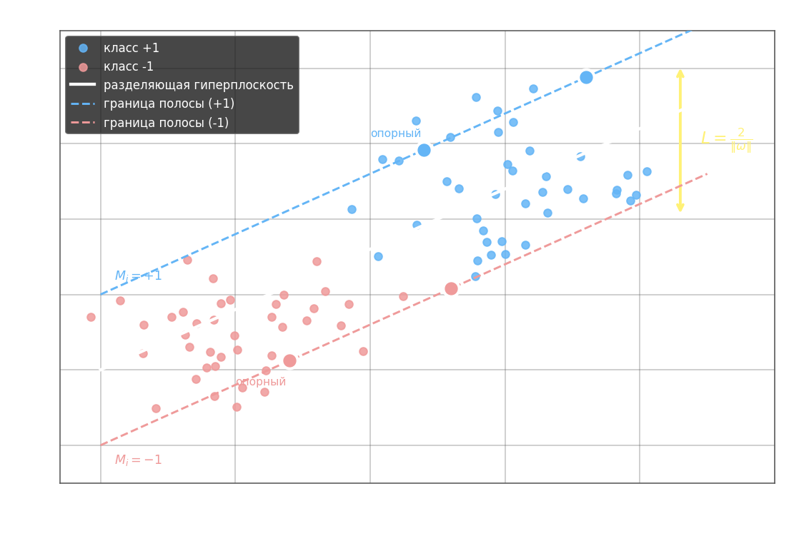
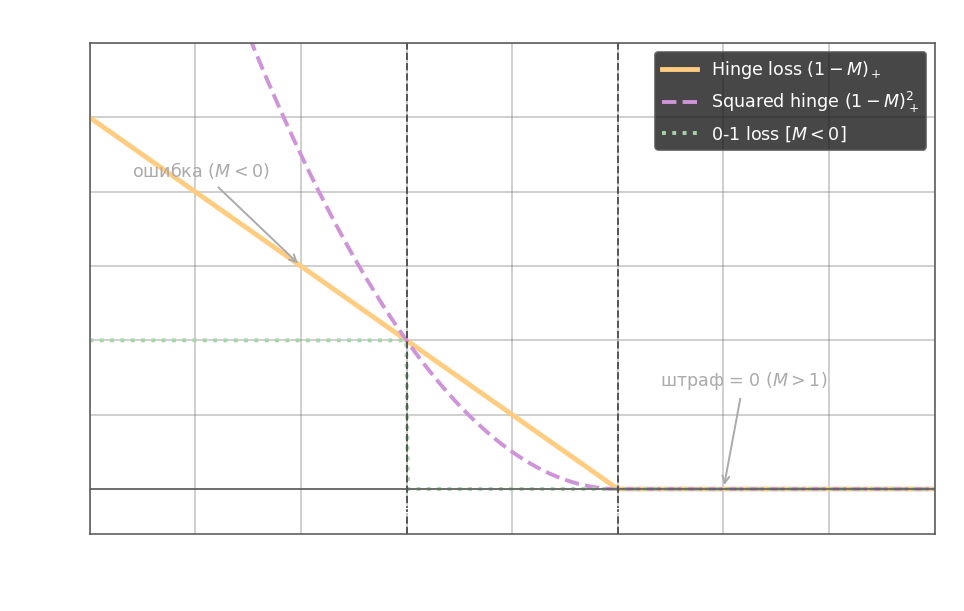

# Метод опорных векторов (Support Vector Machine, SVM)

Идея: найти разделяющую гиперплоскость с **максимальной шириной полосы** между классами — это обеспечивает лучшую обобщающую способность.



Классификатор задаётся знаком скалярного произведения:

$$a(x) = \text{sgn}(\langle\omega, x\rangle - b), \qquad a(x) \in \{-1,\, +1\}$$

## Ширина полосы и отступ

**Отступ** $i$-го объекта — расстояние до гиперплоскости с учётом знака класса:

$$M_i = y_i\bigl(\langle\omega, x_i\rangle - b\bigr), \quad M_i > 0 \text{ — верно},\quad M_i < 0 \text{ — ошибка}$$

**Ширина полосы** — расстояние от $x_-$ до $x_+$, измеренное вдоль направления $\omega$ (перпендикуляра к гиперплоскости). Геометрически это проекция вектора $(x_+ - x_-)$ на единичный вектор $\frac{\omega}{\|\omega\|}$:

$$L = |x_+ - x_-| \cdot \cos\alpha$$

Скалярное произведение связывает длину, угол и проекцию:

$$\langle\omega,\, x_+ - x_-\rangle = \|\omega\| \cdot |x_+ - x_-| \cdot \cos\alpha$$

Отсюда $|x_+ - x_-| \cdot \cos\alpha = \dfrac{\langle\omega,\, x_+ - x_-\rangle}{\|\omega\|}$, то есть:

$$L = \frac{\langle\omega,\, x_+ - x_-\rangle}{\|\omega\|} \to \max$$

**Нормировка**: знак классификатора не изменится, если умножить $\omega$ и $b$ на любое $\alpha > 0$:

$$a(x) = \text{sgn}(\langle\omega, x\rangle - b) = \text{sgn}(\langle\alpha\omega, x\rangle - \alpha b)$$

а отступ просто масштабируется: $\alpha M_i = y_i(\langle\alpha\omega, x_i\rangle - \alpha b)$. Значит, $\alpha$ можно выбрать свободно — зафиксируем его так, чтобы на ближайших к гиперплоскости точках ($x_+$ и $x_-$) отступ был ровно $\pm 1$:

$$M_i(\omega, b) = +1 \text{ для ближайшего }x_+, \qquad M_i(\omega, b) = -1 \text{ для ближайшего }x_-$$

Это означает $\langle\omega, x_+\rangle - b = 1$ и $\langle\omega, x_-\rangle - b = -1$. Вычитая:

$$\langle\omega, x_+\rangle - \langle\omega, x_-\rangle = 1 - (-1) = 2$$

Подставляем в формулу ширины $L = \langle\omega, x_+ - x_-\rangle / \|\omega\|$:

$$L = \frac{2}{\|\omega\|} \to \max \quad \Longleftrightarrow \quad \frac{1}{2}\|\omega\|^2 \to \min$$

Переход равносилен по двум причинам. Во-первых, $\frac{2}{\|\omega\|}$ максимальна тогда и только тогда, когда $\|\omega\|$ минимальна — монотонное убывание. Во-вторых, $\|\omega\| \to \min$ равносильно $\|\omega\|^2 \to \min$ (квадрат сохраняет положение минимума), а множитель $\frac{1}{2}$ добавлен для удобства: при дифференцировании он компенсирует двойку от производной квадрата, что упрощает условия ККТ.

## Линейно разделимый случай

Задача квадратичного программирования:

$$\frac{1}{2}\|\omega\|^2 \to \min_{\omega,\,b} \qquad \text{при ограничениях } M_i(\omega, b) \geq 1 \quad \forall\, i$$

## Линейно неразделимый случай: slack variables

Если выборка линейно неразделима, ограничение $M_i \geq 1$ не выполняется для всех объектов. Ослабляем его, разрешая каждому объекту нарушить полосу на величину $\xi_i \geq 0$ (slack variables):

$$M_i(\omega, b) \geq 1 - \xi_i, \quad i = 1,\ldots,l$$

Чтобы нарушения не были бесплатными, штрафуем за их суммарную величину. Получаем задачу:

$$\begin{cases}\dfrac{1}{2}\|\omega\|^2 + C\displaystyle\sum_{i=1}^l \xi_i \to \min_{\omega,\,b,\,\xi} \\[6pt] M_i(\omega, b) \geq 1 - \xi_i, \quad i = 1,\ldots,l \\ \xi_i \geq 0, \quad i = 1,\ldots,l\end{cases}$$

$C > 0$ — гиперпараметр: большой $C$ сильно штрафует ошибки (узкая полоса), малый $C$ допускает ошибки ради широкой полосы.

**Почему нельзя просто взять $\xi_i \to +\infty$?** Тогда ограничение $M_i \geq 1 - \xi_i$ выполняется тривиально для любых $\omega, b$, но $C\sum\xi_i \to +\infty$ — целевая функция растёт. Алгоритм вынужден делать $\xi_i$ как можно меньше.

**Нахождение оптимальных $\xi_i$.** Переписываем ограничения в явном виде:

$$\begin{cases}\xi_i \geq 1 - M_i(\omega, b) \\ \xi_i \geq 0\end{cases}$$

Так как $C > 0$ и мы минимизируем $\sum \xi_i$, оптимум достигается при наименьшем допустимом $\xi_i$:

$$\begin{cases}\xi_i = 1 - M_i(\omega, b), & \text{если } M_i < 1 \text{ (нарушитель)} \\ \xi_i = 0, & \text{если } M_i \geq 1 \text{ (вне полосы)}\end{cases} \quad \Longrightarrow \quad \xi_i = \max\bigl(0,\, 1 - M_i(\omega, b)\bigr)$$

В сокращённой записи: $\xi_i = L_i(\omega, b) = \bigl(1 - M_i(\omega, b)\bigr)_+$.

Подставляем оптимальные $\xi_i$ в целевую функцию — задача сводится к безусловной минимизации. Деля на $C$, получаем итоговую задачу в форме **эмпирический риск + L2-регуляризация**:

$$\boxed{\sum_{i=1}^l \bigl(1 - M_i(\omega, b)\bigr)_+ + \frac{1}{2C}\|\omega\|^2 \to \min_{\omega,\,b}}$$

Первое слагаемое — **hinge loss**: штрафует за отступ меньше 1, равно нулю если отступ $\geq 1$. Второе — L2-регуляризатор, геометрически отвечает за максимизацию ширины полосы.



Функция не гладкая (hinge не дифференцируема в нуле) → градиентный спуск напрямую не применим.

**Субградиентный метод** — альтернатива для негладкой hinge: вместо производной берётся субградиент по правилу:

$$\frac{\partial L_i}{\partial \omega} = \begin{cases} -y_i x_i, & M_i < 1 \\ 0, & M_i \geq 1 \end{cases}$$

Однако основной подход — сведение к задаче квадратичного программирования через ККТ, что даёт эффективные численные методы и позволяет выделить опорные векторы.

## Решение через ККТ (условия Каруна–Куна–Такера)

Задача квадратичного программирования с неравенствами имеет вид:

$$\begin{cases}f(x) \to \min \\ g_i(x) \leq 0, \quad i = 1,\ldots,m \\ h_j(x) = 0, \quad j = 1,\ldots,k\end{cases}$$

Прямое решение такой задачи затруднено: ограничения-неравенства не позволяют просто приравнять градиент к нулю. Идея метода множителей Лагранжа: «встроить» ограничения в целевую функцию, добавив каждое из них с весовым коэффициентом (множителем). Тогда задача с ограничениями превращается в задачу без ограничений — поиск стационарной точки нового функционала.

Для её решения строится **функция Лагранжа** — целевая функция, в которую ограничения добавлены со своими множителями:

$$\mathcal{L}(x;\,\mu,\lambda) = f(x) + \sum_{i=1}^m \mu_i\, g_i(x) + \sum_{j=1}^k \lambda_j\, h_j(x)$$

Множители $\mu_i \geq 0$ соответствуют неравенствам, $\lambda_j$ — равенствам (знак не ограничен). Интуиция: если ограничение-неравенство не активно ($g_i(x) < 0$), оно не должно влиять на решение, поэтому его вклад обнуляется.

Множители не задаются вручную — они находятся как часть решения через **двойственную задачу**. Из условия стационарности $\partial\mathcal{L}/\partial x = 0$ выражают $x^*(\mu, \lambda)$ и подставляют обратно в лагранжиан, получая двойственный функционал $D(\mu, \lambda)$, который зависит только от множителей. Роли меняются: то, что было параметрами (множители), становится переменными оптимизации, а $x$ «уходит» внутрь:

$$D(\mu, \lambda) = \mathcal{L}(x^*(\mu,\lambda);\,\mu,\lambda) \to \max_{\mu \geq 0,\,\lambda}$$

Для выпуклых задач (как SVM) двойственная задача эквивалентна прямой — зазор двойственности равен нулю, и решение двойственной даёт точное решение прямой. В SVM двойственная задача квадратична по $\lambda_i$ и решается стандартными методами (например, SMO), после чего $\omega = \sum_i \lambda_i y_i x_i$ восстанавливается напрямую.

**Необходимые условия оптимальности (ККТ)** в точке минимума $x^*$:

$$\frac{\partial\mathcal{L}}{\partial x}\bigg|_{x^*} = 0 \qquad \text{(стационарность)}$$

$$g_i(x^*) \leq 0, \quad h_j(x^*) = 0 \qquad \text{(допустимость)}$$

$$\mu_i \geq 0 \qquad \text{(двойственная допустимость)}$$

$$\mu_i\, g_i(x^*) = 0 \quad \forall\, i \qquad \text{(дополняющая нежёсткость)}$$

Условие дополняющей нежёсткости означает: либо ограничение активно — $g_i(x^*) = 0$ и $\mu_i$ может быть любым неотрицательным, либо ограничение неактивно — $g_i(x^*) < 0$ и тогда $\mu_i = 0$ (это ограничение «не работает»). Для выпуклых задач условия ККТ являются не только необходимыми, но и достаточными.

**Применение к SVM.** Перепишем ограничения задачи в стандартной форме $g_i \leq 0$:

$$g_i^{(1)} = 1 - \varepsilon_i - M_i(\omega, b) \leq 0, \qquad g_i^{(2)} = -\varepsilon_i \leq 0$$

Функция Лагранжа с множителями $\lambda_i \geq 0$ для первой группы и $\eta_i \geq 0$ для второй:

$$\mathcal{L} = \frac{1}{2}\|\omega\|^2 + C\sum_i \varepsilon_i + \sum_i \lambda_i\bigl(1 - \varepsilon_i - M_i(\omega, b)\bigr) - \sum_i \eta_i\,\varepsilon_i$$

Раскрывая $M_i(\omega, b) = y_i(\langle\omega, x_i\rangle - b)$:

$$\mathcal{L} = \frac{1}{2}\|\omega\|^2 + C\sum_i \varepsilon_i + \sum_i \lambda_i - \sum_i \lambda_i\,\varepsilon_i - \sum_i \lambda_i\,y_i\langle\omega, x_i\rangle + b\sum_i \lambda_i\,y_i - \sum_i \eta_i\,\varepsilon_i$$

Берём частные производные и приравниваем к нулю (условие стационарности):

**По $\omega$:**
$$\frac{\partial \mathcal{L}}{\partial \omega} = \omega - \sum_i \lambda_i\,y_i\,x_i = 0 \quad \Longrightarrow \quad \boxed{\omega = \sum_{i=1}^l \lambda_i\, y_i\, x_i}$$

**По $b$:**
$$\frac{\partial \mathcal{L}}{\partial b} = \sum_i \lambda_i\,y_i = 0 \quad \Longrightarrow \quad \sum_{i=1}^l \lambda_i\,y_i = 0$$

Это ограничение на множители: вклады положительного и отрицательного классов взвешенно уравновешиваются.

**По $\varepsilon_i$:**
$$\frac{\partial \mathcal{L}}{\partial \varepsilon_i} = C - \lambda_i - \eta_i = 0 \quad \Longrightarrow \quad \lambda_i + \eta_i = C$$

Так как $\eta_i \geq 0$, отсюда следует $\lambda_i \leq C$. Вместе с $\lambda_i \geq 0$ получаем: $0 \leq \lambda_i \leq C$.

Из условий дополняющей нежёсткости:

$$\lambda_i\bigl(1 - \varepsilon_i - M_i\bigr) = 0 \qquad \eta_i\,\varepsilon_i = 0$$

Первое говорит: если $\lambda_i > 0$, то $M_i = 1 - \varepsilon_i$ (объект лежит ровно на границе или нарушает её). Второе говорит: если $\eta_i > 0$ (т.е. $\lambda_i < C$), то $\varepsilon_i = 0$ (нет нарушения).

$\lambda_i$ — коэффициенты опорных векторов; большинство из них равно нулю — это следует из условия нежёсткости: если $M_i > 1$ (объект далеко от полосы), то $g_i^{(1)} < 0$ и $\lambda_i = 0$.

## Типы объектов по значению $\lambda_i$

| $\lambda_i$         | $\varepsilon_i$ | $M_i$    | Тип объекта                                                         |
| ------------------- | --------------- | -------- | ------------------------------------------------------------------- |
| $\lambda_i = 0$     | $0$             | $\geq 1$ | не опорный — вне полосы, не влияет на $\omega$                      |
| $0 < \lambda_i < C$ | $0$             | $= 1$    | **опорный — на границе полосы**                                     |
| $\lambda_i = C$     | $> 0$           | $< 1$    | **опорный-нарушитель** — внутри полосы или ошибочно классифицирован |

Объект $x_i$ — опорный если $\lambda_i \neq 0$. Это наименее типичные (граничные) представители класса. $\omega$ определяется только ими — остальные объекты не важны.

**Замечание**: при линейно неразделимой выборке число опорных векторов значительно возрастает по сравнению с разделимым случаем — в полосу попадает больше нарушителей ($\lambda_i = C$).

## Двойственная форма классификатора

$\omega$ — направляющий вектор разделяющей гиперплоскости. Подставляя $\omega = \sum_i \lambda_i y_i x_i$ в классификатор, получаем **двойственное представление**:

$$a(x) = \text{sgn}\!\left(\sum_{i=1}^l \lambda_i\, y_i\, \langle x,\, x_i\rangle - \omega_0\right)$$

т.е. классификация нового объекта $x$ сводится к вычислению скалярных произведений только с **опорными объектами** (у остальных $\lambda_i = 0$). Именно это свойство открывает путь к **ядровому трюку** (kernel trick): достаточно заменить $\langle x, x_i\rangle$ на ядровую функцию $K(x, x_i)$ — и SVM автоматически становится нелинейным, не меняя алгоритма оптимизации.

**`svm.SVC(kernel='linear')`** — универсальный, работает и для линейно неразделимых данных (через slack variables, параметр `C`).  
**`svm.LinearSVC()`** — оптимизирован для линейно разделимых данных; на неразделимых может давать некорректные результаты.

- SVM для линейной модели w0 + w1 _ x1 + w2 _ x2 = y

```python
import numpy as np
from sklearn import svm

data_x = [
    (4.9, 3.3), (5.6, 4.5), (6.4, 4.3), (6.7, 5.7), (6.3, 5.0), (5.2, 3.9), (5.5, 3.7), (5.6, 3.6), (5.5, 3.8),
    (6.1, 4.7), (7.4, 6.1), (6.0, 5.1), (5.5, 4.4), (5.9, 5.1), (6.5, 5.8), (6.5, 4.6), (6.7, 4.4), (6.3, 5.6),
    (5.9, 4.8), (6.0, 4.5), (5.6, 4.1), (5.6, 4.9), (4.9, 4.5), (6.2, 4.5), (6.1, 4.7), (6.1, 4.9), (6.2, 5.4),
    (5.7, 4.2), (6.1, 5.6), (5.8, 4.0), (6.6, 4.6), (5.6, 4.2), (7.2, 6.1), (7.7, 6.7), (5.6, 3.9), (7.7, 6.9),
    (6.0, 4.0), (6.1, 4.0), (7.6, 6.6), (5.1, 3.0), (6.3, 6.0), (6.7, 5.7), (6.8, 5.9), (6.4, 5.5), (7.0, 4.7),
    (5.8, 5.1), (5.8, 5.1), (6.4, 5.3), (6.3, 4.9), (6.4, 5.3), (5.7, 3.5), (7.2, 5.8), (6.4, 5.6), (5.7, 4.5),
    (6.0, 4.5), (7.7, 6.1), (6.2, 4.3), (7.1, 5.9), (7.3, 6.3), (5.0, 3.3), (6.3, 5.1), (5.8, 3.9), (6.4, 4.5),
    (6.3, 5.6), (6.8, 5.5), (6.9, 5.4), (5.5, 4.0), (5.7, 4.1), (6.5, 5.5), (6.3, 4.7), (5.0, 3.5), (6.7, 5.8),
    (6.9, 4.9), (7.7, 6.7), (5.8, 4.1), (6.4, 5.6), (6.7, 5.2), (6.7, 4.7), (5.4, 4.5), (6.8, 4.8), (5.7, 4.2),
    (5.5, 4.0), (6.3, 4.9), (6.5, 5.2), (5.8, 5.1), (6.0, 4.8), (6.2, 4.8), (6.5, 5.1), (7.9, 6.4), (6.7, 5.0),
    (6.7, 5.6), (6.0, 5.0), (6.1, 4.6), (5.7, 5.0), (7.2, 6.0), (6.3, 4.4), (5.9, 4.2), (6.9, 5.1), (6.6, 4.4),
    (6.9, 5.7)
    ]
data_y = [
    -1, -1, -1, 1, 1, -1, -1, -1, -1, -1, 1, -1, -1, 1, 1, -1, -1, 1, -1, -1, -1, 1, 1, -1, -1, 1, 1, -1, 1, -1,
    -1, -1, 1, 1, -1, 1, -1, -1, 1, -1, 1, 1, 1, 1, -1, 1, 1, 1, 1, 1, -1, 1, 1, -1, -1, 1, -1, 1, 1, -1, 1, -1,
    -1, 1, 1, 1, -1, -1, 1, -1, -1, 1, -1, 1, -1, 1, 1, -1, -1, -1, -1, -1, -1, 1, 1, 1, 1, 1, 1, -1, 1, 1, -1, 1,
    1, -1, -1, 1, -1, 1
    ]

# обучающая выборка в формате [1, x1, x2]
x_train = np.array([[1] + list(x) for x in data_x])  # входные образы
y_train = np.array(data_y)  # целевые значения (метки классов)

clf = svm.SVC(kernel='linear')  # SVM с линейным ядром
clf.fit(x_train, y_train)  # нахождение вектора w по обучающей выборке
lin_clf = svm.LinearSVC()  # SVM для линейно разделимой выборки (используется для получения вектора w)
lin_clf.fit(x_train, y_train)  # нахождение вектора w по обучающей выборке
v = clf.support_vectors_  # выделение опорных векторов
w = lin_clf.coef_[0]  # коэффициенты линейной модели
w[0] = w[0] * w[2]

Q = np.sum(np.sign(x_train @ w) != y_train)

```

или

```python
import numpy as np
from sklearn import svm

data_x = [(3.0, 4.9), (2.7, 3.9), (3.0, 5.5), (2.6, 4.0), (2.9, 4.3), (3.1, 5.1), (2.2, 4.5), (2.3, 3.3), (2.7, 5.1),
          (3.3, 5.7), (2.8, 5.1), (2.8, 4.9), (2.5, 4.5), (2.8, 4.7), (3.2, 4.7), (3.2, 5.7), (2.8, 6.1), (3.6, 6.1),
          (2.8, 4.8), (2.9, 4.5), (3.1, 4.9), (2.3, 4.4), (3.3, 6.0), (2.6, 5.6), (3.0, 4.4), (2.9, 4.7), (2.8, 4.0),
          (2.5, 5.8), (2.4, 3.3), (2.8, 6.7), (3.0, 5.1), (2.3, 4.0), (3.1, 5.5), (2.8, 4.8), (2.7, 5.1), (2.5, 4.0),
          (3.1, 4.4), (3.8, 6.7), (3.1, 5.6), (3.1, 4.7), (3.0, 5.8), (3.0, 5.2), (3.0, 4.5), (2.7, 4.9), (3.0, 6.6),
          (2.9, 4.6), (3.0, 4.6), (2.6, 3.5), (2.7, 5.1), (2.5, 5.0), (2.0, 3.5), (3.2, 5.9), (2.5, 5.0), (3.4, 5.6),
          (3.4, 4.5), (3.2, 5.3), (2.2, 4.0), (2.2, 5.0), (3.3, 4.7), (2.7, 4.1), (2.4, 3.7), (3.0, 4.2), (3.2, 6.0),
          (3.0, 4.2), (3.0, 4.5), (2.7, 4.2), (2.5, 3.0), (2.8, 4.6), (2.9, 4.2), (3.1, 5.4), (2.5, 4.9), (3.2, 5.1),
          (2.8, 4.5), (2.8, 5.6), (3.4, 5.4), (2.7, 3.9), (3.0, 6.1), (3.0, 5.8), (3.0, 4.1), (2.5, 3.9), (2.4, 3.8),
          (2.6, 4.4), (2.9, 3.6), (3.3, 5.7), (2.9, 5.6), (3.0, 5.2), (3.0, 4.8), (2.7, 5.3), (2.8, 4.1), (2.8, 5.6),
          (3.2, 4.5), (3.0, 5.9), (2.9, 4.3), (2.6, 6.9), (2.8, 5.1), (2.9, 6.3), (3.2, 4.8), (3.0, 5.5), (3.0, 5.0),
          (3.8, 6.4)]
data_y = [1, -1, 1, -1, -1, 1, -1, -1, -1, 1, 1, 1, 1, -1, -1, 1, 1, 1, -1, -1, -1, -1, 1, 1, -1, -1, -1, 1, -1, 1, 1,
          -1, 1, 1, 1, -1, -1, 1, 1, -1, 1, 1, -1, 1, 1, -1, -1, -1, 1, 1, -1, 1, 1, 1, -1, 1, -1, 1, -1, -1, -1, -1, 1,
          -1, -1, -1, -1, -1, -1, 1, -1, 1, -1, 1, 1, -1, 1, 1, -1, -1, -1, -1, -1, 1, 1, 1, 1, 1, -1, 1, -1, 1, -1, 1,
          1, 1, -1, 1, -1, 1]

# обучающая выборка в формате [1, x1, x2]
x_train = np.array([[1] + list(x) for x in data_x])  # входные образы
y_train = np.array(data_y)  # целевые значения (метки классов)

# Воспользуйтесь для этого классом svm.SVC пакета Scikit-Learn следующим образом:
clf = svm.SVC(kernel='linear')

clf.fit(data_x, data_y)
# Затем, используя объект clf, с помощью метода fit вычислите коэффициенты w по выборке data_x, data_y (а не x_train, y_train).
# Значения вычисленных коэффициентов можно получить через атрибут coeff_ объекта clf:
w12 = clf.coef_[0]
# А величину смещения через атрибут intercept_
w0 = clf.intercept_[0]
# Также объект clf позволяет получить список опорных векторов с помощью атрибута
# support_vectors_ следующей командой:
v_support = clf.support_vectors_
w = [w0, w12[0], w12[1]]

Q = np.sum(np.sign(x_train @ w) != y_train)

```

- для нескольких гиперплоскостей

```python
import numpy as np
from sklearn import svm
from sklearn.model_selection import train_test_split

np.random.seed(0)
# исходные параметры распределений классов
r1 = 0.6
D1 = 3.0
mean1 = [1, -2]
V1 = [[D1, D1 * r1], [D1 * r1, D1]]

r2 = 0.7
D2 = 2.0
mean2 = [-3, -1]
V2 = [[D2, D2 * r2], [D2 * r2, D2]]

r3 = 0.5
D3 = 1.0
mean3 = [1, 2]
V3 = [[D3, D3 * r3], [D3 * r3, D3]]

# моделирование обучающей выборки
N = 500
x1 = np.random.multivariate_normal(mean1, V1, N).T
x2 = np.random.multivariate_normal(mean2, V2, N).T
x3 = np.random.multivariate_normal(mean3, V3, N).T

data_x = np.hstack([x1, x2, x3]).T
data_y = np.hstack([np.zeros(N), np.ones(N), np.ones(N) * 2])

x_train, x_test, y_train, y_test = train_test_split(data_x, data_y, random_state=123, test_size=0.3, shuffle=True)

# здесь продолжайте программу
clf = svm.SVC(kernel='linear')
clf.fit(x_test, y_test)

# формируем w для каждой (как и в предыдущих)
w1, w2, w3 = [[clf.intercept_[i], *clf.coef_[i]] for i in range(3)]

# Прогноз того или иного класса для образа выполняется по многоклассовой стратегии "один против остальных" (one-vs-rest).
# Поэтому прогнозы классов для выборки x_test следует делать с помощью метода predict объекта clf:
predict = clf.predict(x_test)

Q = np.sum(predict != y_test)
```
