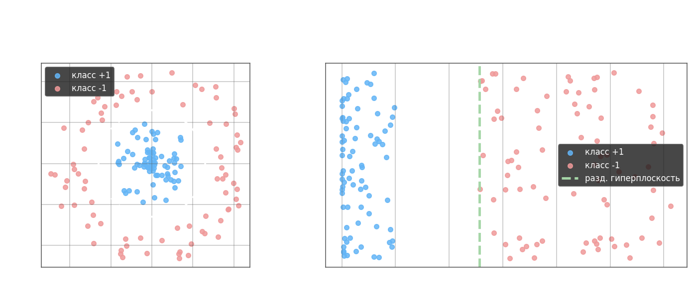
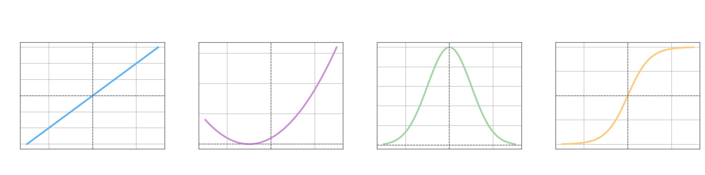
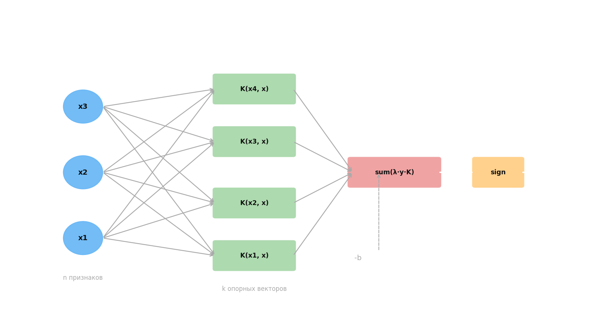

# SVM для нелинейных ядер

Линейный SVM строит классификатор $a(x) = \text{sign}(\langle \omega, x \rangle - b)$, где весовой вектор раскладывается через опорные: $\omega = \sum_{i=1}^k \lambda_i y_i x_i$. Подставляя, получаем $a(x) = \text{sign}\!\left(\sum_{i=1}^k \lambda_i y_i \langle x_i, x \rangle - b\right)$ — классификация сводится к проекциям $x$ на опорные векторы. Если разбить опорные по классам $\omega_+ = \sum_{i:\,y_i=+1} \lambda_i x_i$ и $\omega_- = \sum_{i:\,y_i=-1} \lambda_i x_i$, то $a(x) = \text{sign}(\langle \omega_+, x \rangle - \langle \omega_-, x \rangle)$: знак определяется тем, к какой группе опорных векторов точка ближе.

В линейном случае $\langle x_i, x \rangle = x_i^T x$. Ключевая идея kernel trick: заменить скалярное произведение функцией ядра $K(x_i, x)$, вычисляя «сходство» в некотором признаковом пространстве без явного построения отображения:

$$a(x) = \text{sign}\!\left(\sum_{i=1}^k \lambda_i y_i K(x_i, x) - b\right)$$



Например, квадратичное ядро $K(u,v) = \langle u,v \rangle^2 = (u_1 v_1 + u_2 v_2)^2 = u_1^2 v_1^2 + u_2^2 v_2^2 + 2 u_1 u_2 v_1 v_2$ есть скалярное произведение в пространстве $\mathbb{R}^3$: $K(u,v) = \langle \phi(u), \phi(v) \rangle$, где $\phi(u) = [u_1^2,\; u_2^2,\; \sqrt{2}\,u_1 u_2]^T$. Таким образом, SVM с ядром неявно разделяет данные гиперплоскостью в пространстве $\phi(x)$, при этом вычисляя только ядро в исходном пространстве — при разных ядрах получаются разные разделяющие гиперплоскости.

Функция $K(x, x')$ является допустимым ядром SVM (ядром Мерсера) тогда и только тогда, когда она симметрична $K(x, x') = K(x', x)$ и неотрицательно определена: $\iint K(x, x')\,g(x)\,g(x')\,dx\,dx' \geq 0$ для любой $g: \mathcal{X} \to \mathbb{R}$. Это эквивалентно существованию гильбертова пространства $H$ и отображения $\phi: \mathcal{X} \to H$ такого, что $K(x, x') = \langle \phi(x), \phi(x') \rangle_H$.

Основные виды ядер:



— линейное: $K(x, x') = \langle x, x' \rangle$

— постоянное: $K(x, x') = 1$

— полиномиальное: $K(x, x') = (\langle x, x' \rangle + c)^d$

— RBF (гауссово, радиально-базисная функция): $K(x, x') = \exp\!\left(-\gamma\,\|x - x'\|^2\right)$ — используется для линейно неразделимых данных, соответствует бесконечномерному пространству $\phi$

— гиперболический тангенс: $K(x, x') = \tanh(\kappa\langle x, x' \rangle + \theta)$

Из известных ядер можно строить новые. Если $K_1, K_2$ — ядра, то ядрами также являются: произведение $K(x, x') = K_1(x, x') \cdot K_2(x, x')$; взвешенная сумма $K(x, x') = \alpha_1 K_1(x, x') + \alpha_2 K_2(x, x')$ при $\alpha_1, \alpha_2 > 0$; и любое $K(x, x') = \langle \psi(x), \psi(x') \rangle$ для произвольного отображения $\psi: \mathcal{X} \to \mathbb{R}^n$.



SVM с ядром допускает интерпретацию как нейронная сеть: входной слой из $n$ признаков подаётся в скрытый слой из $k$ нейронов, каждый из которых вычисляет $K(x_i, x)$ для одного опорного вектора $x_i$, затем выход суммируется с весами $\lambda_i y_i$, добавляется смещение $-b$ и применяется знаковая функция. Число нейронов скрытого слоя равно числу опорных векторов и определяется автоматически в процессе обучения.

Преимущества SVM:

- Задача обучения формулируется как задача квадратичного программирования с выпуклой целевой функцией — она имеет единственную точку минимума (глобальный оптимум, нет локальных минимумов).
- Метод автоматически выделяет опорные векторы, формируя компактное представление модели.
- Число нейронов скрытого слоя определяется данными.
- Максимизация зазора между классами обеспечивает хорошую обобщающую способность.

Недостатки SVM:

- Нет универсальных рекомендаций по выбору ядра для конкретной задачи — выбор ядра остаётся эвристикой.
- Нет встроенного механизма отбора признаков. Необходимо подбирать гиперпараметры: параметр регуляризации $C$, параметр ядра $\gamma$ (для RBF) и другие.
- Вычислительная сложность обучения $O(n^2)$–$O(n^3)$ по числу объектов — плохо масштабируется на большие датасеты.

---

```python
import numpy as np
from sklearn import svm
from sklearn.model_selection import train_test_split

np.random.seed(0)

# исходные параметры распределений классов
r1 = 0.6
D1 = 3.0
mean1 = [1, -2]
V1 = [[D1, D1 * r1], [D1 * r1, D1]]

r2 = 0.5
D2 = 2.0
mean2 = [-2, -1]
V2 = [[D2, D2 * r2], [D2 * r2, D2]]

# моделирование обучающей выборки
N = 500
x1 = np.random.multivariate_normal(mean1, V1, N).T
x2 = np.random.multivariate_normal(mean2, V2, N).T

data_x = np.hstack([x1, x2]).T
data_y = np.hstack([np.ones(N) * -1, np.ones(N)])

x_train, x_test, y_train, y_test = train_test_split(data_x, data_y, random_state=123, test_size=0.4, shuffle=True)

# здесь продолжайте программу
clf = svm.SVC(kernel='rbf')
clf.fit(x_train, y_train)
predict = clf.predict(x_test)

Q = (predict != y_test).mean()
acc = (predict == y_train).mean()  # показатель аккуратности модели
```
