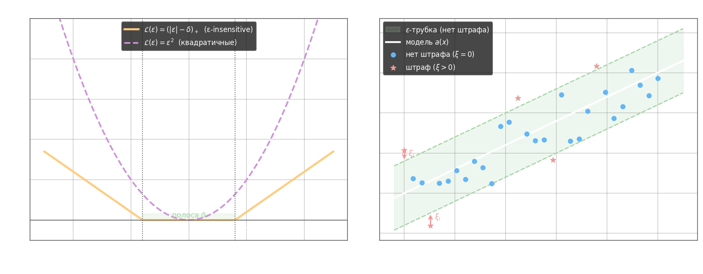
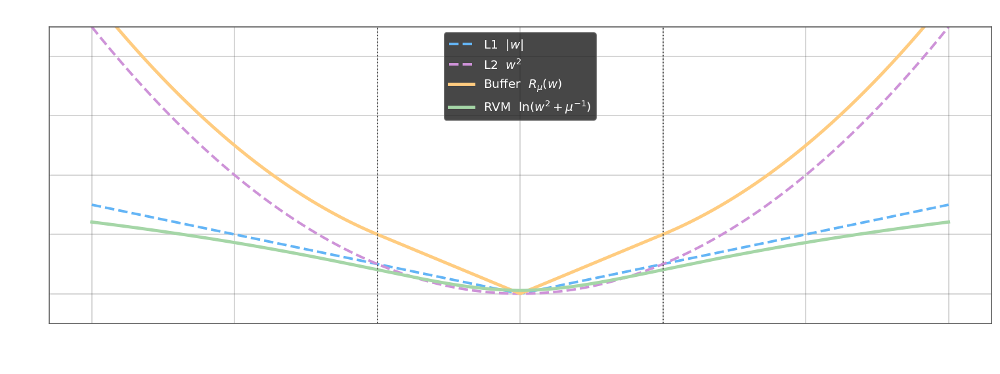

В задаче регрессии SVM строит модель $a(x) = \langle \omega, x \rangle - \omega_0$, где $\omega \in \mathbb{R}^n$, $\omega_0 \in \mathbb{R}$. Вместо максимизации зазора здесь минимизируется отклонение предсказания от целевых значений, но с ключевой особенностью: малые отклонения не штрафуются вообще.

Для этого вводится **ε-нечувствительная функция потерь** $\mathcal{L}(\varepsilon) = (|\varepsilon| - \delta)_+$, которая равна нулю, пока отклонение $|\varepsilon| = |\hat{y} - y|$ не превышает порог $\delta$, и растёт линейно за этой полосой. Альтернатива — квадратичные потери $\mathcal{L}(\varepsilon) = \varepsilon^2$, но они штрафуют за каждое ненулевое отклонение.



Исходная задача оптимизации:

$$\sum_{i=1}^l \bigl(|\langle \omega, x_i \rangle - \omega_0 - y_i| - \delta\bigr)_+ + \frac{1}{2C}\|\omega\|^2 \to \min_{\omega,\,\omega_0}$$

Модуль в потерях порождает $2l$ неравенств, поэтому вводят **переменные отклонений** $\xi_i^+, \xi_i^- \geq 0$:

$$\xi_i^+ = \bigl(\langle \omega, x_i \rangle - \omega_0 - y_i - \delta\bigr)_+ \quad \text{(штраф сверху)}$$
$$\xi_i^- = \bigl(-\langle \omega, x_i \rangle + \omega_0 + y_i - \delta\bigr)_+ \quad \text{(штраф снизу)}$$

Стандартная форма задачи SVR со slack-переменными:

$$\frac{1}{2}\|\omega\|^2 + C\sum_{i=1}^l (\xi_i^+ + \xi_i^-) \to \min_{\omega,\,\omega_0,\,\xi^+,\,\xi^-}$$

$$\text{при} \quad y_i - \delta - \xi_i^- \leq \langle \omega, x_i \rangle - \omega_0 \leq y_i + \delta + \xi_i^+, \quad \xi_i^+, \xi_i^- \geq 0, \quad i = 1,\ldots,l$$

Параметр $\delta$ напрямую управляет разрежённостью решения: **чем больше $\delta$, тем меньше опорных векторов** — точки внутри трубки не влияют на $\omega$ вовсе.

Связь с задачей классификации: если свести задачу к L1-норме по отступам $M_i(\omega, \omega_0)$, получаем форму, аналогичную классификации:

$$\sum_{i=1}^l \bigl(1 - M_i(\omega, \omega_0)\bigr)_+ + \frac{1}{2C}\|\omega\|^2 \to \min$$

что открывает путь к регуляризации признакового пространства через замену регуляризатора.

Добавление к функционалу L1-штрафа по весам (LASSO-регуляризация) обеспечивает **отбор признаков**: нерелевантные $w_j$ обнуляются. Однако LASSO не обладает эффектом группировки — среди коррелированных признаков он выбирает один произвольно.

**Doubly Regularized SVM (ElasticNet SVM)** объединяет L1 и L2:

$$C\sum_{i=1}^l \bigl(1 - M_i(\omega, \omega_0)\bigr)_+ + \mu_1 \sum_{j=1}^n |w_j| + \frac{1}{2}\sum_{j=1}^n w_j^2 \to \min_{\omega,\,\omega_0}$$

Параметр $\mu_1$ регулирует жёсткость отбора. Достоинства: отбор признаков с настраиваемой селекцией, есть эффект группировки (коррелированные признаки получают похожие веса). Недостаток: шумовые признаки тоже группируются, а не подавляются.

**Buffer Feature Machine** использует комбинированный регуляризатор $R_\mu$, ведущий себя как L1 для малых весов и как L2 для больших:

$$C\sum_{i=1}^l \bigl(1 - M_i(\omega, \omega_0)\bigr)_+ + \sum_{j=1}^n R_\mu(w_j) \to \min, \qquad R_\mu(w_j) = \begin{cases} 2\mu|w_j|, & |w_j| \leq \mu \\ \mu^2 + w_j^2, & |w_j| \geq \mu \end{cases}$$

Это сочетание L1 + L2, где порог $\mu$ разделяет режимы. Достоинства по сравнению с ElasticNet: плавная селекция (нет резкого порога как у LASSO), хороший эффект группировки, шумовые признаки подавляются.

**Relevance Vector Machine (RVM)** заменяет регуляризатор логарифмическим штрафом с индивидуальными гиперпараметрами $\mu_j$:

$$C\sum_{i=1}^l \bigl(1 - M_i(\omega, \omega_0)\bigr)_+ + \gamma\sum_{j=1}^n \ln\!\left(w_j^2 + \frac{1}{\mu_j}\right) \to \min$$

Функция $R(w_j) = \ln(w_j^2 + \mu_j^{-1})$ имеет вероятностную интерпретацию как логарифм априорного распределения Стьюдента на каждый вес, что соответствует байесовской модели с автоматическим определением релевантности (ARD). Параметры $\mu_j$ обновляются в процессе оптимизации, позволяя индивидуально регулировать штраф для каждого признака.



Итоговое сравнение регуляризаторов:

- L1 (LASSO) — жёсткий отбор признаков, нет эффекта группировки
- L2 (Ridge) — нет отбора, хорошая группировка коррелированных признаков
- ElasticNet — отбор + группировка, но шумовые признаки тоже группируются
- Buffer — плавный отбор + группировка + подавление шума
- RVM — максимально гибкий, вероятностная интерпретация, индивидуальная регуляризация каждого признака

---

```python
import numpy as np
from sklearn import svm


def func(x):
    return np.sin(0.5 * x) + 0.2 * np.cos(2 * x) - 0.1 * np.sin(4 * x) + 3


# обучающая выборка
coord_x = np.expand_dims(np.arange(-4.0, 6.0, 0.1), axis=1)
coord_y = func(coord_x).ravel()

# здесь продолжайте программу
x_train = coord_x[::3]
y_train = coord_y[::3]

svr = svm.SVR(kernel='rbf')
svr.fit(x_train, y_train)
# обучение
predict = svr.predict(coord_x)
Q = np.square(predict - coord_y).mean()
```
