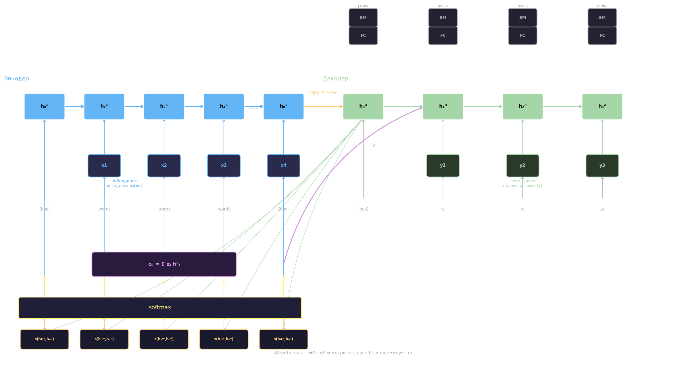
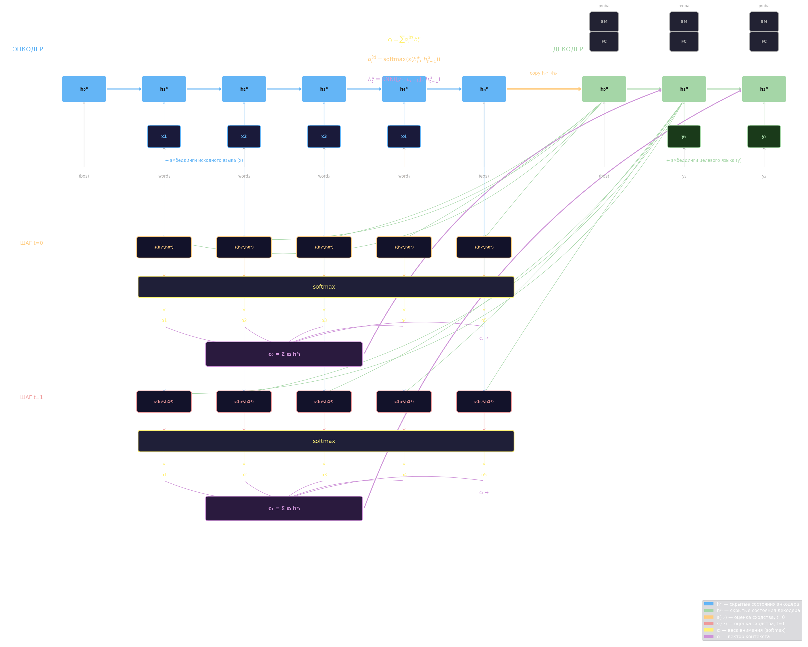

# Attention

## Архитектура Seq2Seq

Seq2Seq (sequence-to-sequence) — архитектура для задач «последовательность → последовательность»: машинный перевод, суммаризация, генерация ответов. Она состоит из двух RNN: **энкодера** и **декодера**.

Энкодер прогоняет входную последовательность $\langle\text{bos}\rangle, x_1, x_2, \ldots, x_n, \langle\text{eos}\rangle$ через RNN и накапливает скрытые состояния $h_0^e, h_1^e, \ldots, h_n^e$. Последнее состояние $h_n^e$ копируется как начальное скрытое состояние декодера $h_0^d$; именно оно несёт всю информацию об исходной последовательности. Декодер в режиме авторегрессии порождает выходные токены $y_1, y_2, \ldots$: на каждом шаге он принимает предыдущий токен и своё скрытое состояние, а выход пропускается через полносвязный слой и softmax для получения распределения вероятностей следующего слова.

Интуитивная проблема этой схемы: информация о всей входной последовательности сжата в один вектор фиксированного размера. Чем длиннее предложение, тем сложнее сохранить контекст — ранние слова «теряют связь» с декодером.

## Механизм Attention

Attention решает проблему сжатия контекста, позволяя декодеру на каждом шаге обращаться ко **всем** скрытым состояниям энкодера, взвешивая их по степени релевантности текущему шагу декодирования.

На шаге $t$ декодера вычисляется **вектор контекста** $c_t$:

$$c_t = \sum_{i=1}^{n} \alpha_i^{(t)} \, h_i^e$$

где $h_i^e$ — скрытое состояние энкодера на позиции $i$, $\alpha_i^{(t)}$ — вес внимания, показывающий, насколько важно $i$-е слово входной последовательности при генерации $t$-го выходного токена.

Веса $\alpha_i^{(t)}$ получаются через softmax из оценок попарного сходства (alignment scores):

$$\alpha_i^{(t)} = \frac{\exp\!\bigl(s(h_i^e,\, h_{t-1}^d)\bigr)}{\sum_{j=1}^{n} \exp\!\bigl(s(h_j^e,\, h_{t-1}^d)\bigr)}$$

где $s(\cdot,\cdot)$ — функция оценки близости энкодерного состояния $h_i^e$ и предыдущего декодерного состояния $h_{t-1}^d$.

Функция $s$ может быть реализована по-разному. Простейший вариант — **скалярное произведение** (dot-product attention):

$$s(h_i^e, h_{t-1}^d) = (h_i^e)^\top h_{t-1}^d$$

геометрически это проекция одного вектора на другой — мера близости в пространстве скрытых состояний. Альтернатива — небольшая **полносвязная сеть** (аддитивный attention по Бадано):

$$s(h_i^e, h_{t-1}^d) = v^\top \tanh\!\bigl(W_1 h_i^e + W_2 h_{t-1}^d\bigr)$$

где $v$, $W_1$, $W_2$ — обучаемые параметры. В этом случае оценка сходства сама является результатом обучения, что делает механизм более гибким.

Новое скрытое состояние декодера на шаге $t$ вычисляется с учётом вектора контекста:

$$h_t^d = \mathrm{RNN}\!\bigl([y_t;\, c_{t-1}],\; h_{t-1}^d\bigr)$$

где $[y_t;\, c_{t-1}]$ — конкатенация предыдущего выходного токена и вектора контекста предыдущего шага.

Каждый вес $\alpha_i^{(t)}$ — вещественное число из $[0, 1]$, суммирующиеся в единицу. Интерпретируется как «доля внимания»: насколько важно $i$-е слово энкодера при генерации текущего слова декодером. Совокупность весов $\{\alpha_i^{(t)}\}$ образует **карту внимания** (attention map) — матрицу выравнивания между словами источника и целевого текста. Эта карта интерпретируема: для пары «я люблю» → «I love» она показывает, какое слово оригинала повлияло на каждое слово перевода.

Набор весов $\alpha$ может использоваться не только для взвешенного суммирования (мягкое внимание), но и для обнаружения и копирования отдельных токенов — например, при генерации именованных сущностей или числовых значений, которые лучше скопировать из источника дословно.

Механизм внимания особенно помогает при переводе длинных предложений: вместо того чтобы хранить весь контекст в одном векторном состоянии, декодер каждый шаг «смотрит» туда, где сосредоточена нужная информация.

## Роль $y_t$ и teacher forcing

$y_t$ — это токены **целевого языка**, которые декодер генерирует по одному. Никакого готового перевода здесь нет: декодер стартует с $\langle\text{bos}\rangle$, на первом шаге предсказывает $y_1$ (через FC + softmax выбирается слово с наибольшей вероятностью), затем $y_1$ превращается в эмбеддинг и вместе с вектором контекста $c_1$ подаётся на вход следующего шага для предсказания $y_2$, и так далее до $\langle\text{eos}\rangle$.

При **обучении** вместо собственного предсказанного $y_t$ на вход декодера подают **правильный** токен из обучающей пары — это приём называется *teacher forcing*. Без него ошибка первого шага накапливается и смещает все последующие предсказания, из-за чего сеть сходится очень медленно или не сходится вовсе. При **инференсе** teacher forcing не применяется: декодер питается своими же предсказаниями.

