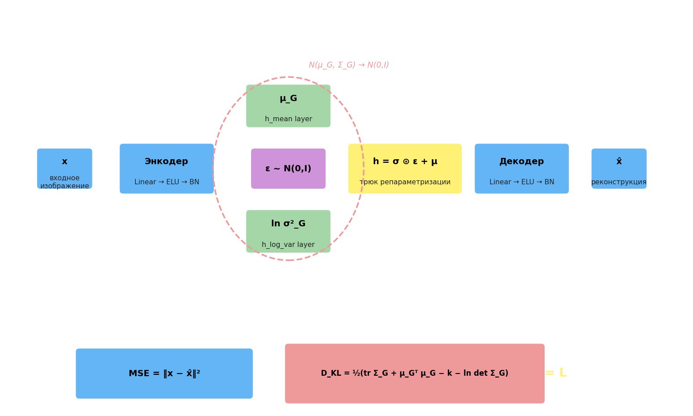

## Вариационные автоэнкодеры (VAE)

### Проблема обычного автоэнкодера

Скрытое пространство — наименьший слой после энкодера. Если рассмотреть векторы $h$, которые туда попадают, видно, что они образуют кластеры по классам. Из кластера можно взять любой вектор и пропустить через декодер — получится осмысленный результат. Но если взять точку **между** кластерами, при декодировании получится бессмыслица: сеть никогда не видела таких $h$ при обучении.

VAE решает эту проблему, заставляя кластеры перекрываться и заполнять пространство плотно, придавая скрытым векторам вид нормального распределения $\mathcal{N}(0, I)$.

### Идея: энкодер предсказывает распределение

Вместо одной точки $h$ энкодер предсказывает **параметры распределения** — вектор среднего $\mu_G$ и вектор дисперсий $\sigma^2_G$. Затем $h$ сэмплируется из $\mathcal{N}(\mu_G, \Sigma_G)$. Декодер берёт этот $h$ и восстанавливает вход.

Для того чтобы вся область скрытого пространства была покрыта осмысленными векторами, фактическое распределение $\mathcal{N}(\mu_G, \Sigma_G)$ должно быть близко к целевому $\mathcal{N}(0, I)$. Близость измеряется **дивергенцией Кульбака–Лейблера**.

### Дивергенция Кульбака–Лейблера

В общем случае KL-дивергенция между двумя многомерными нормальными распределениями:

$$D_{KL} = \frac{1}{2}\left(\operatorname{tr}(\Sigma_N^{-1}\Sigma_G) + (\mu_N - \mu_G)^\top \Sigma_N^{-1}(\mu_N - \mu_G) - k + \ln\frac{\det\Sigma_N}{\det\Sigma_G}\right)$$

где $k$ — размерность скрытого пространства, $\Sigma_G$ — фактическая ковариационная матрица, $\Sigma_N$ — целевая.

Для целевого $\mathcal{N}(0, I)$: $\mu_N = \mathbf{0}$, $\Sigma_N = I$, поэтому формула упрощается:

$$D_{KL} = \frac{1}{2}\left(\operatorname{tr}(\Sigma_G) + \mu_G^\top\mu_G - k - \ln\det\Sigma_G\right)$$

Если $\Sigma_G$ диагональна ($\Sigma_G = \mathrm{diag}(\sigma_1^2,\ldots,\sigma_k^2)$, что предполагает независимость компонент), то:

$$D_{KL} = \frac{1}{2}\sum_{i=1}^{k}\left(\sigma_i^2 + \mu_i^2 - 1 - \ln\sigma_i^2\right)$$

Именно эта формула используется в `KLLoss`: через `h_log_var` передаётся $\ln\sigma^2$, через `h_mean` — $\mu$.

### Трюк репараметризации

Прямое сэмплирование $h \sim \mathcal{N}(\mu, \sigma^2)$ не дифференцируемо по параметрам — через него нельзя propagate градиент. Решение — **трюк репараметризации**:

$$h = \sigma_h \odot \varepsilon + \mu, \quad \varepsilon \sim \mathcal{N}(0, I)$$

Случайность выносится в фиксированный шум $\varepsilon$, а параметры $\mu$ и $\sigma$ становятся детерминированными выходами энкодера — через них градиент проходит свободно.

### Архитектура

Энкодер разветвляется в два параллельных выхода: один предсказывает $\mu$, другой $\ln\sigma^2$. Затем вычисляется $h = \sigma \odot \varepsilon + \mu$ (трюк репараметризации) и подаётся в декодер.



### Функция потерь

Обучение минимизирует два критерия одновременно:

$$\mathcal{L} = \underbrace{\frac{1}{N}\sum_i (\hat{y}_i - y_i)^2}_{\text{MSE (реконструкция)}} + \underbrace{D_{KL}}_{\text{регуляризация скрытого пространства}}$$

MSE отвечает за качество восстановления входа; $D_{KL}$ — за то, чтобы скрытое распределение не коллапсировало в точки и заполняло пространство непрерывно.

---

# дивергенция Кульбака-Лейблера

```python
import torch
import torch.nn as nn

# здесь объявляйте класс KLLoss
import torch
import torch.nn as nn


# здесь объявляйте класс KLLoss
class KLLoss(nn.Module):
    def forward(self, h_mean, h_var):
        return -0.5 * torch.sum(1 + torch.log(h_var) - h_mean ** 2 - h_var, dim=1)


batch_size = 10
h_mean = torch.rand(batch_size, 10)
h_var = torch.rand(batch_size, 10) + 2.0

# здесь продолжайте программу
loss_func = KLLoss()

loss_func.eval()

loss = loss_func(h_mean, h_var).mean()
```

# Вариационный автоенкодер

```python
import os
import numpy as np
import matplotlib.pyplot as plt

from tqdm import tqdm
import torch
import torch.utils.data as data
import torchvision
import torchvision.transforms.v2 as tfs_v2
import torch.nn as nn
import torch.optim as optim


class AutoEncoderMNIST(nn.Module):
    def __init__(self, input_dim, output_dim, hidden_dim):
        super().__init__()
        self.hidden_dim = hidden_dim
        # енкодер
        self.encoder = nn.Sequential(
            nn.Linear(input_dim, 128),
            nn.ELU(inplace=True),
            nn.BatchNorm1d(128),
            nn.Linear(128, 64),
            nn.ELU(inplace=True),
            nn.BatchNorm1d(64)
        )

        # формирование ср кв отклонения 
        self.h_mean = nn.Linear(64, self.hidden_dim)
        # формирование мат ожидания
        self.h_log_var = nn.Linear(64, self.hidden_dim)

        # декодер
        self.decoder = nn.Sequential(
            nn.Linear(self.hidden_dim, 64),
            nn.ELU(inplace=True),
            nn.BatchNorm1d(64),
            nn.Linear(64, 128),
            nn.ELU(inplace=True),
            nn.BatchNorm1d(128),
            nn.Linear(128, output_dim),
            nn.Sigmoid()
        )

    def forward(self, x):
        enc = self.encoder(x)

        h_mean = self.h_mean(enc)
        h_log_var = self.h_log_var(enc)

        # шум сгенерированный по нормальному распределению
        noise = torch.normal(mean=torch.zeros_like(h_mean), std=torch.ones_like(h_log_var))
        # Умножение матрица ст. откл. и сложение с мат. ожиданием
        h = noise * torch.exp(h_log_var / 2) + h_mean
        # пропуск через декодер
        x = self.decoder(h)

        return x, h, h_mean, h_log_var


# критерий качества с учетом коэффициента Кульбака-Лейблера
class VAELoss(nn.Module):
    def forward(self, x, y, h_mean, h_log_var):
        # MSE
        img_loss = torch.sum(torch.square(x - y), dim=-1)
        kl_loss = -0.5 * torch.sum(1 + h_log_var - torch.square(h_mean) - torch.exp(h_log_var), dim=-1)
        return torch.mean(img_loss + kl_loss)


model = AutoEncoderMNIST(784, 784, 2)
transforms = tfs_v2.Compose([tfs_v2.ToImage(), tfs_v2.ToDtype(dtype=torch.float32, scale=True),
                             tfs_v2.Lambda(lambda _img: _img.ravel())])

d_train = torchvision.datasets.MNIST(r'C:\datasets\mnist', download=True, train=True, transform=transforms)
train_data = data.DataLoader(d_train, batch_size=100, shuffle=True)

optimizer = optim.Adam(params=model.parameters(), lr=0.001)
loss_func = VAELoss()

epochs = 5
model.train()

for _e in range(epochs):
    loss_mean = 0
    lm_count = 0

    train_tqdm = tqdm(train_data, leave=True)
    for x_train, y_train in train_tqdm:
        predict, _, h_mean, h_log_var = model(x_train)
        loss = loss_func(predict, x_train, h_mean, h_log_var)

        optimizer.zero_grad()
        loss.backward()
        optimizer.step()

        lm_count += 1
        loss_mean = 1 / lm_count * loss.item() + (1 - 1 / lm_count) * loss_mean
        train_tqdm.set_description(f"Epoch [{_e + 1}/{epochs}], loss_mean={loss_mean:.3f}")

st = model.state_dict()
torch.save(st, 'model_vae_3.tar')

# st = torch.load('model_vae.tar', weights_only=True)
# model.load_state_dict(st)

model.eval()

d_test = torchvision.datasets.MNIST(r'C:\datasets\mnist', download=True, train=False, transform=transforms)
x_data = transforms(d_test.data).view(len(d_test), -1)

_, h, _, _ = model(x_data)
h = h.detach().numpy()

plt.scatter(h[:, 0], h[:, 1])
plt.grid()

n = 5
total = 2 * n + 1

plt.figure(figsize=(total, total))

num = 1
for i in range(-n, n + 1):
    for j in range(-n, n + 1):
        ax = plt.subplot(total, total, num)
        num += 1
        h = torch.tensor([3 * i / n, 3 * j / n], dtype=torch.float32)
        predict = model.decoder(h.unsqueeze(0))
        predict = predict.detach().squeeze(0).view(28, 28)
        dec_img = predict.numpy()

        plt.imshow(dec_img, cmap='gray')
        ax.get_xaxis().set_visible(False)
        ax.get_yaxis().set_visible(False)

plt.show()
```