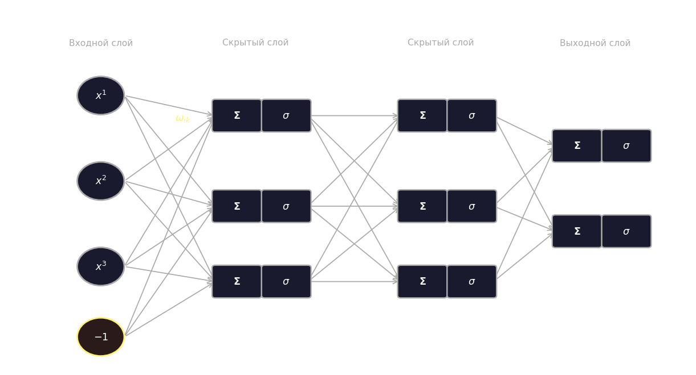
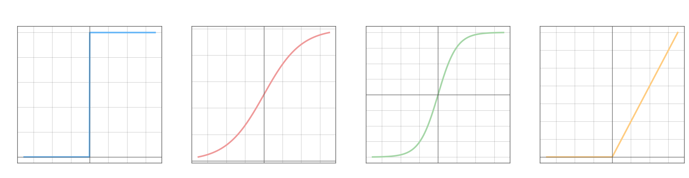
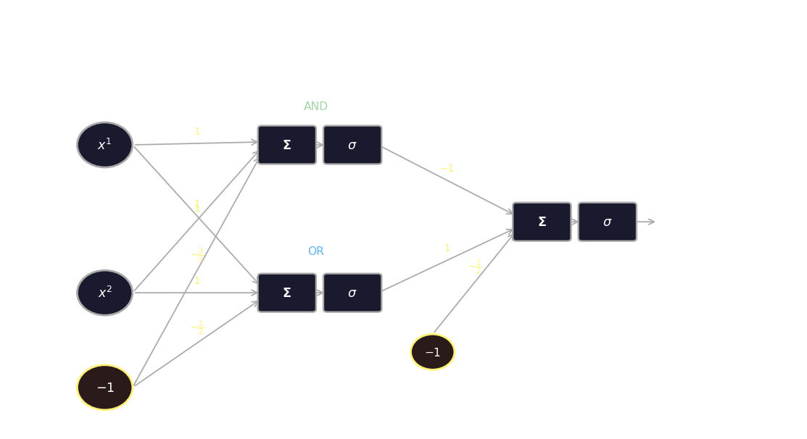
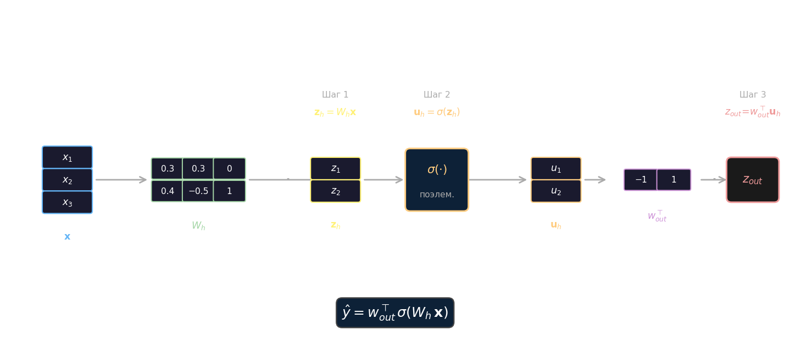
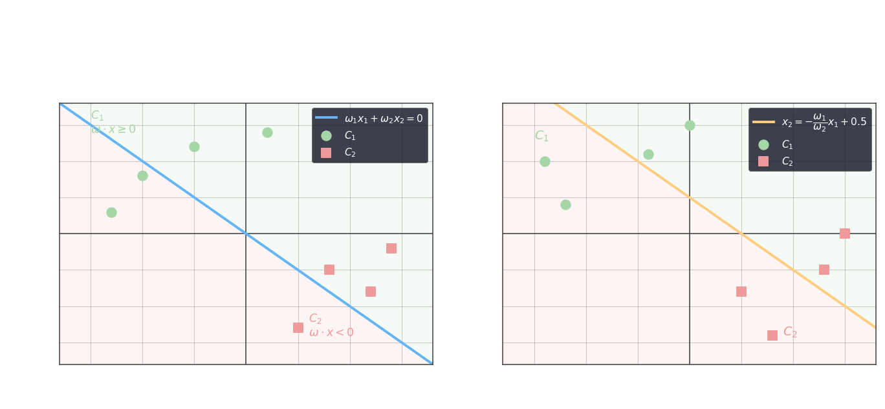
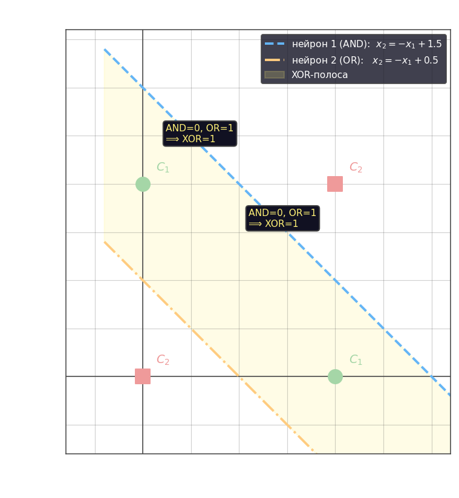

# Нейронные сети

## Структура полносвязной НС

Полносвязная нейронная сеть с равномерным распределением состоит из входного слоя, одного или нескольких скрытых слоёв и выходного слоя. Входной вектор дополняется смещением (bias): из $n$ признаков формируется расширенная выборка

$$x = [-1,\, x^1,\, x^2,\, \ldots,\, x^n]^\top$$

где $-1$ — константный элемент, задающий порог нейрона.

Каждый нейрон состоит из двух частей: **сумматора** $\Sigma$ и **функции активации** $\sigma$. Сумматор вычисляет взвешенную сумму входов

$$\xi_k = \sum_{i=0}^{n} \omega_{ik}\, x^i, \quad k = 1, 2, \ldots, M$$

где $\omega_{ik}$ — вес связи от $i$-го входа к $k$-му нейрону, $M$ — число нейронов в слое. Выходное значение нейрона $k$ скрытого слоя:

$$u^k = \sigma_k(\xi_k) = \sigma_k\!\left(\sum_{i=0}^{n} \omega_{ik}\, x^i\right), \quad k = 1, \ldots, n$$

Выходы скрытого слоя образуют новый расширенный вектор признаков $u = [-1,\, u^1,\, u^2,\, \ldots,\, u^n]^\top$, который подаётся на следующий слой. На каждом шагу формируются новые признаки — именно в этом состоит выразительная сила многослойных сетей. Выходной нейрон $m$ вычисляет:

$$a^m = \sigma_m\!\left(\sum_{k=0}^{n} \omega_{mk}\, u^k\right), \quad m = 1, \ldots$$

## Функции активации

Каждый нейрон реализует нелинейное отображение $a(x) = \sigma(\langle\omega, x\rangle)$. Именно нелинейность $\sigma$ принципиально важна: без неё весь стек слоёв сводится к одному линейному преобразованию, поскольку суперпозиция линейных функций линейна.

Наиболее распространённые функции активации для скрытых нейронов:

- Ступенька: $\sigma(x) = \begin{cases}1, & x \ge 0 \\ 0, & x < 0\end{cases}$
- Сигмоида: $\sigma(x) = \dfrac{1}{1 + \exp(-x)}$
- Гиперболический тангенс: $\sigma(x) = \tanh(x)$
- ReLU: $\sigma(x) = \max(0,\, x)$

В выходных нейронах задач регрессии ставится линейная функция $\sigma(x) = x$ — сеть тогда выдаёт непрерывное значение без ограничения диапазона. Для многоклассовой классификации применяется **softmax**, нормирующий выходы в распределение вероятностей по $M$ классам:

$$\sigma_m(x) = \frac{\exp(x^m)}{\displaystyle\sum_{j=1}^{M} \exp(x^j)}$$

где $x^m$ — вход $m$-го выходного нейрона.

## Теорема об универсальной аппроксимации

Возникает вопрос: сколько скрытых слоёв необходимо? По теореме о структуре полносвязной НС для равномерной аппроксимации **достаточно двух слоёв**. При сигмоидальной функции активации $\sigma(x) = \frac{1}{1+e^{-x}}$ существует функция вида

$$a(x) = \sum_{k=1}^{b} \alpha_k\, \sigma\!\left(\langle x, \omega_k \rangle + \omega_0\right)$$

где $\alpha_k$ — веса выходного нейрона, $\omega_k$ — весовой вектор $k$-го скрытого нейрона, $b$ — их число, такая что для любой непрерывной $f$ и любого $\varepsilon > 0$:

$$|a(x) - f(x)| < \varepsilon \quad \forall\, x \in [0, 1]$$

## Нейрон реализует логические функции

Рассмотрим двоичные входы $x = [x^1, x^2]^\top$, $x^1, x^2 \in \{0, 1\}$. Нейрон со ступенчатой активацией вычисляет пороговую функцию от взвешенной суммы входов. Конъюнкция, дизъюнкция и отрицание реализуются следующими линейными пороговыми условиями:

$$x^1 \wedge x^2 = \Bigl[x^1 + x^2 - \tfrac{3}{2} > 0\Bigr]$$

$$x^1 \vee x^2 = \Bigl[x^1 + x^2 - \tfrac{1}{2} > 0\Bigr]$$

$$\neg x^1 = \Bigl[-x^1 + \tfrac{1}{2} > 0\Bigr]$$

Функции AND и OR линейно разделимы и реализуются одним нейроном. XOR не является линейно разделимой функцией, поэтому его нельзя реализовать одним нейроном. Через AND и OR XOR выражается как:

$$x^1 \oplus x^2 = \Bigl[(x^1 \vee x^2) - (x^1 \wedge x^2) - \tfrac{1}{2} > 0\Bigr]$$

что сводится к двухслойной сети: первый скрытый слой вычисляет $x^1 \wedge x^2$ и $x^1 \vee x^2$, выходной нейрон — их взвешенную разность с порогом.

### Аппроксимация XOR одним слоем

Альтернативный подход — расширить вектор признаков произведением $x^1 x^2$, тем самым добавив нелинейный признак уже во входное пространство:

$$x = \bigl[-1,\, x^1,\, x^2,\, x^1 x^2\bigr]^\top$$

Тогда XOR реализуется **одним нейроном**:

$$x^1 \oplus x^2 = \Bigl[x^1 + x^2 - 2x^1 x^2 - \tfrac{1}{2} > 0\Bigr]$$

Это иллюстрирует общий принцип: обогащение входного пространства нелинейными признаками может заменять дополнительный слой в сети.

## Нейронные сети в виде матричных умножений

Прямой проход через сеть удобно записать в матричном виде — тогда вместо цикла по нейронам достаточно трёх векторных операций. Для скрытого слоя из $M$ нейронов и $n$ входов алгоритм следующий.

**Шаг 1.** Вычислить взвешенные суммы для всех нейронов слоя одновременно:

$$\mathbf{z}_h = W_h \cdot \mathbf{x}$$

где $W_h \in \mathbb{R}^{M \times n}$ — матрица весов скрытого слоя (строка $k$ содержит веса $k$-го нейрона), $\mathbf{x} \in \mathbb{R}^n$ — входной вектор.

**Шаг 2.** Применить функцию активации поэлементно:

$$\mathbf{u}_h = \sigma(\mathbf{z}_h), \qquad u_k = \sigma(z_k)$$

**Шаг 3.** Вычислить выходной слой аналогичным образом, подав $\mathbf{u}_h$ как новый входной вектор:

$$z_{out} = \mathbf{w}_{out} \cdot \mathbf{u}_h$$

Для нескольких выходных нейронов $\mathbf{w}_{out}$ расширяется до матрицы $W_{out}$. Весь прямой проход однослойной скрытой сети записывается компактно:

$$\hat{y} = \mathbf{w}_{out}^\top\, \sigma(W_h\, \mathbf{x})$$

### Пример

Сеть с тремя входами и двумя скрытыми нейронами. Матрица весов скрытого слоя, вектор смещений и веса выходного нейрона:

$$W_1 = \begin{pmatrix} 0.5 & 0.5 & 0 \\ 0 & 0.5 & -0.5 \end{pmatrix}, \quad b_1 = \begin{pmatrix} 0 \\ -1 \end{pmatrix}, \quad w_2 = \begin{pmatrix} 1.5 \\ -2 \end{pmatrix}$$

При входе $x = [3,\; -2,\; 1]^\top$ скрытый слой вычисляет (без функции активации):

$$u = W_1 x + b_1 = \begin{pmatrix} 0.5\cdot3 + 0.5\cdot(-2) + 0 + 0 \\ 0\cdot3 + 0.5\cdot(-2) + (-0.5)\cdot1 - 1 \end{pmatrix} = \begin{pmatrix} 0.5 \\ -2.5 \end{pmatrix}$$

Выход сети:

$$y = w_2^\top u = 1.5 \cdot 0.5 + (-2)\cdot(-2.5) = 0.75 + 5 = 5.75$$

В развёрнутой форме это то же самое, что $y = 1.5\,(0.5x_1 + 0.5x_2) - 2\,(0.5x_2 - 0.5x_3 - 1)$.

### Матричная запись с функцией активации

Тот же трёхшаговый алгоритм с явными формулами для сети с весами

$$W_h = \begin{pmatrix}0.3 & 0.3 & 0\\0.4 & -0.5 & 1\end{pmatrix}$$

даёт взвешенные суммы $z_1 = 0.3x_1 + 0.3x_2$, $z_2 = 0.4x_1 - 0.5x_2 + x_3$, или в матричной форме $\mathbf{z}_h = W_h \mathbf{x}$. После применения активации:

$$\mathbf{u}_h = \sigma(\mathbf{z}_h) = \begin{pmatrix}\sigma(z_1)\\\sigma(z_2)\end{pmatrix}$$

Выходной нейрон с весами $w_{out} = [-1,\; 1]^\top$ вычисляет $z_{out} = w_{out}^\top \mathbf{u}_h = -u_1 + u_2$. Весь прямой проход первого шага компактно записывается как $\mathbf{z}_h = W_h \cdot \mathbf{x}$, второго — $\mathbf{u}_h = \sigma(\mathbf{z}_h)$, третьего — $z_{out} = w_{out}^\top \mathbf{u}_h$.

## Персептрон Розенблата

Персептрон Розенблата — простейший однонейронный классификатор для двух классов $C_1$ и $C_2$. Нейрон принимает входы $x_1, x_2$ с весами $\omega_1, \omega_2$ и применяет знаковую функцию активации:

$$\sigma(z) = \begin{cases}+1, & z \ge 0 \;\Rightarrow [x_1, x_2]^\top \in C_1 \\ -1, & z < 0 \;\Rightarrow [x_1, x_2]^\top \in C_2\end{cases}$$

Решающее правило принимает вид:

$$\omega_1 x_1 + \omega_2 x_2 \ge 0 \;\Rightarrow C_1, \qquad \omega_1 x_1 + \omega_2 x_2 < 0 \;\Rightarrow C_2$$

Граница между классами задаётся уравнением $\omega_1 x_1 + \omega_2 x_2 = 0$, из которого следует уравнение разделяющей прямой и её наклон:

$$x_2 = -\frac{\omega_1}{\omega_2}\, x_1, \qquad k = -\frac{\omega_1}{\omega_2}$$

Без смещения эта прямая всегда проходит через начало координат. Добавление третьего веса $\omega_3$ (bias) позволяет сдвинуть её произвольно:

$$\omega_1 x_1 + \omega_2 x_2 + \omega_3 \cdot (-1) = 0 \;\Rightarrow\; x_2 = -\frac{\omega_1}{\omega_2}\,x_1 - \frac{\omega_3}{\omega_2}$$

где свободный член $b = -\dfrac{\omega_3}{\omega_2}$, откуда $\omega_3 = -b\,\omega_2$. Линейная модель с bias может решить задачу разделения двух произвольно расположенных линейно-разделимых классов.

### Задача XOR: геометрический взгляд

Четыре угловые точки единичного квадрата разбиты на два класса по диагоналям — $C_1\colon (0,1),(1,0)$ и $C_2\colon (0,0),(1,1)$. Ни одна прямая не может разделить их, поэтому XOR не решается одним персептроном.

Двухнейронный скрытый слой справляется с этим, проводя две разделяющие прямые. Первый нейрон отсекает точку $(1,1)$ линией $x_2 = -x_1 + 1{,}5$ — тем самым реализует AND. Второй отсекает $(0,0)$ линией $x_2 = -x_1 + 0{,}5$ — реализует OR. XOR-полоса — это область между двумя линиями, куда попадают ровно точки $C_1$.

Результаты двух нейронов после пороговой функции: $u_\text{AND} \in \{0,1\}$, $u_\text{OR} \in \{0,1\}$. Вычитая AND из OR и применяя порог $-\tfrac{1}{2}$, выходной нейрон вычисляет XOR:

$$z_{out} = u_\text{OR} - u_\text{AND} - \tfrac{1}{2} \;\Rightarrow\; \hat{y} = \sigma(z_{out})$$

Для всех четырёх углов: $(0,0)\colon 0-0-0{,}5<0$, $(0,1)\colon 1-0-0{,}5>0$, $(1,0)\colon 1-0-0{,}5>0$, $(1,1)\colon 1-1-0{,}5<0$ — результат совпадает с XOR.

