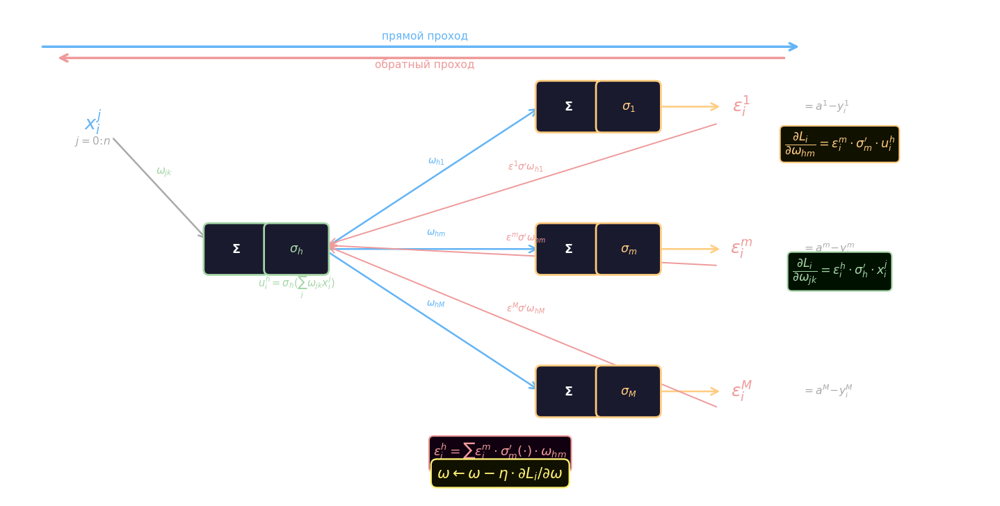
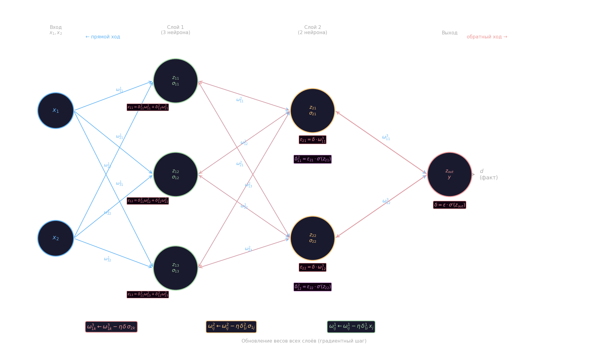

# Алгоритм backpropagation

Весовые коэффициенты нейронной сети невозможно задать вручную — их поиск и есть процесс обучения. Сеть с матрицами весов $W_1, W_2$ реализует параметрическую функцию

$$\hat{y} = f(\bar{x};\, W_1, W_2) \equiv f(\bar{x};\, \omega)$$

где $\omega$ обозначает все веса сети совокупно. Для $p$ объектов обучающей выборки $x^l = [x_1, \ldots, x_p]^\top$ сеть выдаёт прогнозы $\hat{y}^p = [\hat{y}_1, \ldots, \hat{y}_m]^\top$.

Для каждого объекта задаётся **функция потерь** $L_i(\hat{t}_i, y_i)$:

- В задачах регрессии (MSE): $L_i = \displaystyle\sum_{j=1}^{m}(\hat{t}_i^j - y_i^j)^2$
- В задачах бинарной классификации (кросс-энтропия): $L_i = -y_i \log \hat{t}_i - (1-y_i)\log(1-\hat{t}_i)$

где $\hat{t}_i$ — предсказание сети, $y_i$ — истинная метка. Общий показатель качества на всей выборке — **эмпирический риск**:

$$Q(x^l) = \frac{1}{l}\sum_{i=1}^{l} L_i(\hat{t}_i,\, y_i)$$

Минимизация $Q$ выполняется градиентным спуском: на каждом шаге $n$ веса обновляются в направлении антиградиента

$$\omega^{n} = \omega^{n-1} - \eta\,\frac{\partial Q(x^l)}{\partial \omega}$$

где $\eta$ — шаг обучения. Чтобы градиент существовал, **все функции сети должны быть дифференцируемы**, включая функции активации — именно поэтому ступенька заменяется на сигмоиду или tanh.

Для сети с тремя входами, тремя скрытыми нейронами и двумя выходами матрицы весов имеют размеры

$$W_1 = \begin{pmatrix}\omega_{11} & \omega_{12} & \omega_{13} \\ \omega_{21} & \omega_{22} & \omega_{23} \\ \omega_{31} & \omega_{32} & \omega_{33}\end{pmatrix} \in \mathbb{R}^{3\times3}, \quad W_2 = \begin{pmatrix}\omega_{11} & \omega_{12} & \omega_{13} \\ \omega_{21} & \omega_{22} & \omega_{23}\end{pmatrix} \in \mathbb{R}^{2\times3}$$

Прямой проход в матричном виде ($[1\!\times\!3]\cdot[3\!\times\!3]=[1\!\times\!3]$, затем $[2\!\times\!3]\cdot[3\!\times\!1]=[2\!\times\!1]$):

$$\begin{bmatrix}\hat{y}_1 \\ \hat{y}_2\end{bmatrix} = \sigma_2\!\left(W_2\cdot\sigma_1\!\left(W_1\cdot\begin{pmatrix}x_1\\x_2\\x_3\end{pmatrix}\right)\right)$$

Вычисление градиента $\partial Q/\partial\omega$ через сеть выполняется алгоритмом backpropagation — обратным проходом по графу вычислений.

### Почему backpropagation

Прямое численное дифференцирование $Q$ по каждому весу имеет сложность $O(N^2)$, где $N$ — число весов. Backpropagation вычисляет весь градиент за один обратный проход с суммарной сложностью $O(KN)$, где $K$ — число слоёв, — то есть практически за ту же стоимость, что и прямой проход. Этого удаётся достичь потому, что ошибки скрытых нейронов выражаются через уже вычисленные ошибки следующего слоя.

НС реализует параметрическую функцию $a(x) = g(x, \omega)$, где $\omega$ настраивается в процессе обучения, а архитектура (нейроны, связи) фиксируется заранее. Для стохастического обучения на каждом шаге используется один случайно выбранный объект.

### Вывод градиентов

Рассмотрим двухслойную сеть. Скрытый слой: $u^k(x_i) = \sigma_h\!\bigl(\sum_j \omega_{jk}\, x_i^j\bigr)$. Выходной слой: $a^m(x_i) = \sigma_m\!\bigl(\sum_h \omega_{hm}\, u^h(x_i)\bigr)$. Функция потерь MSE на объекте $x_i$:

$$L_i(\omega) = \frac{1}{2}\sum_{m}\bigl(a^m(x_i) - y_i^m\bigr)^2$$

По правилу цепочки градиент распадается на два множителя для каждого слоя.

**Внешний слой** ($m = 1,\ldots,M$; $h = 0,\ldots,H$):

$$\frac{\partial L_i}{\partial \omega_{hm}} = \frac{\partial L_i}{\partial a^m}\cdot\frac{\partial a^m}{\partial \omega_{hm}}$$

Первый множитель — ошибка выходного нейрона, просто разность предсказания и метки:

$$\varepsilon_i^m = \frac{\partial L_i}{\partial a^m} = a^m(x_i) - y_i^m$$

Второй: $\partial a^m / \partial \omega_{hm} = \sigma_m'(\cdot)\cdot u_i^h$. Итого:

$$\frac{\partial L_i(\omega)}{\partial \omega_{hm}} = \varepsilon_i^m \cdot \sigma_m'(\cdot) \cdot u_i^h(x_i)$$

**Скрытый слой** ($k = 1,\ldots,H$; $j = 0,\ldots,n$). Ошибка скрытого нейрона вычисляется через уже найденные $\varepsilon_i^m$ — это и есть «обратное распространение»:

$$\varepsilon_i^h = \frac{\partial L_i}{\partial u^h} = \sum_{m=1}^{M} \varepsilon_i^m \cdot \sigma_m'(\cdot) \cdot \omega_{hm}$$

Градиент по весам скрытого слоя:

$$\frac{\partial L_i(\omega)}{\partial \omega_{jk}} = \varepsilon_i^h \cdot \sigma_h'(\cdot) \cdot x_i^j$$



**Шаг обновления весов** использует оба градиента:

$$\omega_{hm} \leftarrow \omega_{hm} - \eta\,\varepsilon_i^m\,\sigma_m'(\cdot)\,u_i^h, \qquad \omega_{jk} \leftarrow \omega_{jk} - \eta\,\varepsilon_i^h\,\sigma_h'(\cdot)\,x_i^j$$

### Стохастический алгоритм

Вход: выборка $X^l$, шаг обучения $\eta$, параметр скользящего среднего $\lambda$.
Выход: обученные веса $\omega = \{\omega_{jk},\, \omega_{hm}\}$.

1. Инициализировать веса случайно; вычислить начальный $Q(\omega)$.
2. Цикл до сходимости:
3. Выбрать случайный объект $x_i \in X^l$.
4. **Прямой ход** — вычислить и запомнить промежуточные значения:
   - $u_i^k = \sigma_h\!\bigl(\sum_j \omega_{jk}\, x_i^j\bigr)$
   - $a_i^m = \sigma_m\!\bigl(\sum_h \omega_{hm}\, u_i^k\bigr)$
   - $\varepsilon_i^m = a_i^m - y_i^m$
5. Обновить скользящую оценку качества: $\tilde{Q} = (1-\lambda)\,Q + \lambda\,L_i(\omega)$.
6. **Обратный ход** — распространить ошибку на скрытый слой:
   - $\varepsilon_i^h = \sum_{m=1}^{M} \varepsilon_i^m \cdot \sigma_m'(\cdot) \cdot \omega_{hm}$
7. Обновить все веса по формулам градиентного шага.

Преимущества:

- Точное вычисление градиента
- Работает с произвольными дифференцируемыми функциями потерь
- Пригоден для онлайн (динамического) обучения
- Эффективен на сверхбольших выборках
- Возможность распараллеливания

Недостатки:

- Медленная сходимость, может останавливаться вблизи плохого минимума
- Застревание в локальных экстремумах
- Остановка при малом градиенте — в частности, на асимптотах сигмоиды
- Переобучение (решается Dropout)

### Пример на трёх слоях (2 → 3 → 2 → 1)

Рассмотрим сеть с двумя входами, тремя нейронами в первом скрытом слое, двумя нейронами во втором скрытом слое и одним выходным нейроном. Обозначим $z$ — взвешенную сумму до активации, $\sigma$ — выходное значение после активации.



**Прямой ход** — вычислить и **запомнить** все промежуточные значения.

Слой 1 (3 нейрона):

$$z_{11} = \omega^1_{11}x_1 + \omega^1_{12}x_2, \quad \sigma_{11} = \sigma(z_{11})$$

$$z_{12} = \omega^1_{21}x_1 + \omega^1_{22}x_2, \quad \sigma_{12} = \sigma(z_{12})$$

$$z_{13} = \omega^1_{31}x_1 + \omega^1_{32}x_2, \quad \sigma_{13} = \sigma(z_{13})$$

Слой 2 (2 нейрона), где $\sigma_{1j}$ — выходы первого слоя:

$$z_{21} = \omega^2_{11}\sigma_{11} + \omega^2_{12}\sigma_{12} + \omega^2_{13}\sigma_{13}, \quad \sigma_{21} = \sigma(z_{21})$$

$$z_{22} = \omega^2_{21}\sigma_{11} + \omega^2_{22}\sigma_{12} + \omega^2_{23}\sigma_{13}, \quad \sigma_{22} = \sigma(z_{22})$$

Выходной нейрон:

$$z_{out} = \omega^3_{11}\sigma_{21} + \omega^3_{12}\sigma_{22}, \quad y = \sigma(z_{out})$$

**Обратный ход.** Ошибка на выходе (для квадратичной потери):

$$\varepsilon = d - y$$

где $d$ — истинное значение. Локальный градиент выходного нейрона:

$$\delta = \varepsilon \cdot \sigma'(z_{out})$$

Обновить веса выходного слоя: $\omega^3_{1k} \leftarrow \omega^3_{1k} - \eta\,\delta\,\sigma_{2k}$.

Распространить ошибку на слой 2 — каждый нейрон получает долю пропорционально своему весу:

$$\varepsilon_{21} = \delta\cdot\omega^3_{11}, \qquad \varepsilon_{22} = \delta\cdot\omega^3_{12}$$

Локальные градиенты слоя 2:

$$\delta^2_{11} = \varepsilon_{21}\cdot\sigma'(z_{21}), \qquad \delta^2_{12} = \varepsilon_{22}\cdot\sigma'(z_{22})$$

Обновить веса слоя 2: $\omega^2_{ij} \leftarrow \omega^2_{ij} - \eta\,\delta^2_{1i}\,\sigma_{1j}$.

Распространить ошибку на слой 1 — каждый нейрон первого слоя получает сумму от всех нейронов второго:

$$\varepsilon_{11} = \delta^2_{11}\omega^2_{11} + \delta^2_{12}\omega^2_{21}$$

$$\varepsilon_{12} = \delta^2_{11}\omega^2_{12} + \delta^2_{12}\omega^2_{22}$$

$$\varepsilon_{13} = \delta^2_{11}\omega^2_{13} + \delta^2_{12}\omega^2_{23}$$

Локальные градиенты слоя 1: $\delta^1_{1i} = \varepsilon_{1i}\cdot\sigma'(z_{1i})$.

Обновить веса слоя 1: $\omega^1_{ij} \leftarrow \omega^1_{ij} - \eta\,\delta^1_{1i}\,x_j$.

На следующей итерации берётся другой объект $(x_1, x_2)$, и весь цикл повторяется заново.

реализация

```python
import torch
from random import randint


def act(z):
    return torch.tanh(z)


def df(z):
    s = act(z)
    return 1 - s * s


# функция прямого прохода
def go_forward(x_inp, w1, w2):
    # запоминаем результат первого нейрона
    z1 = torch.mv(w1[:, :3], x_inp) + w1[:, 3]
    # пропуск через функцию активации
    s = act(z1)

    # пропуск через второй нейрон
    z2 = torch.dot(w2[:2], s) + w2[2]
    # результат после ф-ции активации
    y = act(z2)
    # y: torch.Size([]) z1: torch.Size([2]) z2: torch.Size([]) s: torch.Size([2])
    return y, z1, z2


# генерация случайных данных и весов
torch.manual_seed(1)

# генерация случайных, начальных весов
# W1 - веса для первого нейрона
W1 = torch.rand(8).view(2, 4) - 0.5
# W2 - веса для второго нейрона
W2 = torch.rand(3) - 0.5

# обучающая выборка (она же полная выборка)
x_train = torch.FloatTensor([(-1, -1, -1), (-1, -1, 1), (-1, 1, -1), (-1, 1, 1),(1, -1, -1), (1, -1, 1), (1, 1, -1), (1, 1, 1)])
y_train = torch.FloatTensor([-1, 1, -1, 1, -1, 1, -1, -1])

lmd = 0.05  # шаг обучения
N = 1000  # число итераций при обучении
total = len(y_train)  # размер обучающей выборки

for _ in range(N):
    k = randint(0, total - 1)
    x = x_train[k]  # [3] случайный выбор образа из обучающей выборки

    # y - float результат выхода второго нейрона
    # z1 - [1] входные данные на первую функцию действия, с учетом весов
    # z2 - float входные данные на вторую функцию действия, с учетом весов
    # на каждом шаге НС будет пересчитываться с новыми весами
    y, z1, z2 = go_forward(x, W1, W2)  #прямой проход по НС и вычисление выходных значений нейронов

    # так как квадратичная функция потерь, то производная - разница между фактом и обучением
    e = y - y_train[k] # float

    # подставляем в производную ф-цию входные данные на нейрон, умножаем на ошибку
    # градиент предпоследнего нейрона
    delta = e * df(z2)  # вычисление локального градиента.

    # подставляем в производную второго нейрона, его входные значения
    # умножаем на градиент предыдущего шага
    delta2 = W2[:2] * delta * df(z1)  # [2] вектор из 2-х локальных градиентов скрытого слоя


    # корректировка весов второго уровня
    W2[:2] = W2[:2] - lmd * delta * z1  # [3] корректировка весов связей последнего слоя
    W2[2] = W2[2] - lmd * delta  # [3] корректировка bias


    # корректировка связей первого слоя
    W1[0, :3] = W1[0, :3] - lmd * delta2[0] * x # [2, 4]
    W1[1, :3] = W1[1, :3] - lmd * delta2[1] * x # [2, 4]

    # корректировка bias
    W1[0, 3] = W1[0, 3] - lmd * delta2[0]
    W1[1, 3] = W1[1, 3] - lmd * delta2[1]

# тестирование обученной НС
for x, d in zip(x_train, y_train):
    y, z1, out = go_forward(x, W1, W2)
    print(f"Выходное значение НС: {y} => {d}")

# результирующие весовые коэффициенты
print(W1)
print(W2)
```
