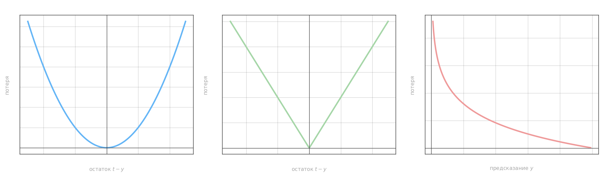
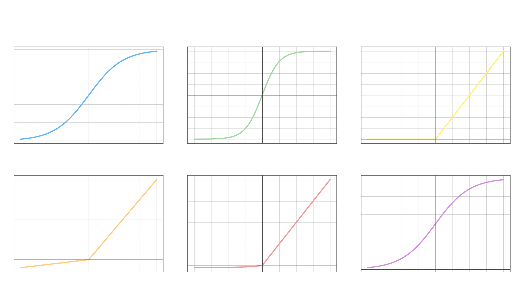

# основные виды

задачи регрессии - nn.MSELoss, nn.L1Loss
задачи бинарной классификации - nn.BCELoss, nn.BCEWithLogitsLoss
задачи многоклассовой классификации - nn.CrossEntropyLoss, nn.NLLLoss

# Квадратичная функция потерь

Штрафует за квадрат отклонения — большие ошибки весят непропорционально сильно. Применяется в задачах регрессии.

$$L = \frac{1}{p}\sum_{i=1}^{p}(t_i - y_i)^2$$

где $t_i$ — предсказание сети, $y_i$ — истинное значение, $p$ — размер батча.

```python
import torch

# значения x, func, predict не менять
x = torch.arange(-3, 3, 0.1)
func = x ** 2 - 2 * torch.cos(x) - 5
predict = func + torch.empty_like(func).normal_(0, 0.5)

loss_func = torch.nn.MSELoss()
Q = loss_func(predict, func)
Q_mse = torch.mean((predict - func) ** 2)
```

# Логарифмическая функция потерь

Бинарная кросс-энтропия — стандартная функция потерь для задач бинарной классификации. Сильно штрафует за уверенные неправильные предсказания.

$$L = \frac{1}{p}\sum_{i=1}^{p}\bigl[d_i\log y_i + (1 - d_i)\log(1 - y_i)\bigr]$$

где $d_i \in \{0, 1\}$ — истинная метка, $y_i \in (0, 1)$ — предсказанная вероятность. `BCEWithLogitsLoss` численно устойчивее: сигмоида применяется внутри по специальному алгоритму, поэтому использовать её предпочтительнее, чем `BCELoss` + явная сигмоида.

```python
import torch

# значения predict, target не менять
batch_size = 8
target = torch.randint(0, 2, (batch_size, 1), dtype=torch.float32)  # целевые значения
predict = torch.empty(batch_size, 1).normal_(0, 2.0)  # прогнозные значения

loss_func = torch.nn.BCEWithLogitsLoss()
Q = loss_func(predict, target)

p = torch.nn.functional.sigmoid(predict)
Q_bce = -1 * torch.mean(target * torch.log(p) + (1 - target) * torch.log(1 - p))
```



# MAELoss (L1Loss)

Штрафует за абсолютное отклонение — менее чувствительна к выбросам, чем MSE. Производная постоянна (±1), поэтому градиент не затухает при больших ошибках.

$$L = \frac{1}{p}\sum_{i=1}^{p}|t_i - y_i|$$

# CrossEntropyLoss

Многоклассовая кросс-энтропия. Внутри PyTorch применяет `log_softmax` перед суммированием, поэтому на вход подаётся сырой логит, а не вероятность.

$$L = -\frac{1}{p}\sum_{i=1}^{p}\sum_{m} t_i^m \log y_i^m$$

где $t_i^m \in \{0,1\}$ — one-hot метка класса $m$ для объекта $i$, $y_i^m$ — предсказанная вероятность.

# NLLLoss

Negative Log-Likelihood Loss — вариант кросс-энтропии, когда `log_softmax` применяется вручную до подачи в функцию потерь.

$$L = -\sum_{i} t_i \log y_i$$

# Функции активации



**Сигмоида** ($\text{sigmoid}$) — логистическая функция, выход в $(0, 1)$:

$$\sigma(x) = \frac{1}{1 + e^{-x}}$$

Применяется в выходном нейроне бинарной классификации. В скрытых слоях опасна: на концах области определения производная $\sigma'(x) \approx 0$ — это области насыщения, где градиент перестаёт влиять на веса.

**Гиперболический тангенс** — выход в $(-1, 1)$, нулевое среднее помогает сходимости:

$$\sigma(x) = \frac{e^x - e^{-x}}{e^x + e^{-x}} = \tanh(x)$$

Применяется в неглубоких НС (2–3 слоя). Также имеет области насыщения: в начале и конце производная $\approx 0$, что замедляет обучение.

**ReLU** (Rectified Linear Unit) — стандартный выбор для скрытых слоёв глубоких сетей. Производная равна 1 при $x > 0$, поэтому градиент не затухает:

$$\sigma(x) = \max(0,\, x)$$

**Leaky ReLU** — устраняет «мёртвые нейроны» ReLU (когда нейрон постоянно выдаёт 0 и не обучается), пропуская малую долю отрицательного сигнала:

$$\sigma(x) = \begin{cases}x, & x > 0 \\ \alpha x, & x \le 0\end{cases} \quad \alpha = 0.1$$

**ELU** (Exponential Linear Unit) — сглаженная альтернатива Leaky ReLU, не имеет нижних ограничений:

$$\sigma(x) = \begin{cases}x, & x > 0 \\ \alpha(e^x - 1), & x \le 0\end{cases} \quad \alpha = 0.1$$

**Linear** $\sigma(x) = x$ — применяется **только** в выходных нейронах задач регрессии. Линейную функцию нельзя использовать в скрытых слоях: backprop-сигнал проходит без изменений, и вся многослойная сеть коллапсирует в одну линейную модель.

**Softmax** — нормирует выходы в распределение вероятностей, применяется в выходном слое многоклассовой классификации:

$$\sigma(x_i) = \frac{\exp(x_i)}{\displaystyle\sum_{j} \exp(x_j)}$$
