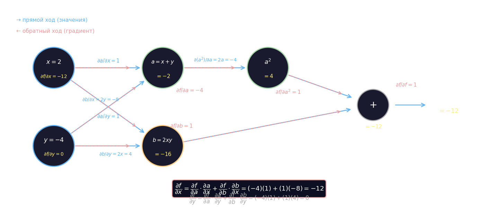

# backward

## Вычислительный граф

Каждая арифметическая операция над тензорами в PyTorch строит узел вычислительного графа. Узлы — это операции, рёбра — промежуточные значения, передаваемые между ними. Благодаря этой структуре производную сложной функции можно найти автоматически, применяя правило цепочки вдоль рёбер графа.

Рассмотрим функцию

$$f(x, y) = (x + y)^2 + 2xy$$

при $x = 2$, $y = -4$. Введём промежуточные переменные $a = x + y$ и $b = 2xy$, тогда $f = a^2 + b$. График операций:

$$x, y \;\longrightarrow\; a = x + y \;\longrightarrow\; a^2 \;\longrightarrow\; (+) \;\longrightarrow\; f$$
$$x, y \;\longrightarrow\; b = 2xy \;\longrightarrow\; (+)$$

**Прямой проход** — вычислить и запомнить все промежуточные значения:

$$a = 2 + (-4) = -2, \quad a^2 = 4, \quad b = 2 \cdot 2 \cdot (-4) = -16, \quad f = 4 + (-16) = -12$$

**Обратный проход** — применить правило цепочки от выхода к входам. В каждом узле хранится локальная частная производная, поэтому умножать нужно только соседние производные. Локальные производные в данном примере:

$$\frac{\partial a}{\partial x} = 1, \quad \frac{\partial a}{\partial y} = 1, \quad \frac{\partial f}{\partial a} = 2a = -4$$

$$\frac{\partial b}{\partial x} = 2y = -8, \quad \frac{\partial b}{\partial y} = 2x = 4, \quad \frac{\partial f}{\partial b} = 1$$

Полные производные по входам получаются суммированием всех путей через граф:

$$\frac{\partial f}{\partial x} = \frac{\partial f}{\partial a}\cdot\frac{\partial a}{\partial x} + \frac{\partial f}{\partial b}\cdot\frac{\partial b}{\partial x} = (-4)(1) + (1)(-8) = -12$$

$$\frac{\partial f}{\partial y} = \frac{\partial f}{\partial a}\cdot\frac{\partial a}{\partial y} + \frac{\partial f}{\partial b}\cdot\frac{\partial b}{\partial y} = (-4)(1) + (1)(4) = 0$$

Результат совпадает с аналитическими производными: $\frac{\partial f}{\partial x} = 2(x+y) + 2y = -4 - 8 = -12$ и $\frac{\partial f}{\partial y} = 2(x+y) + 2x = -4 + 4 = 0$.



## Автоматическое дифференцирование

Автоматическое дифференцирование состоит из двух шагов.

**1. Прямой проход** — функция вычисляется в обычном порядке, однако все промежуточные значения сохраняются в памяти. Именно поэтому в PyTorch тензоры с флагом `requires_grad=True` хранят историю операций.

**2. Обратный проход** — граф обходится в обратном направлении. В каждом узле применяется локальная производная, умноженная на входящий градиент с предыдущего узла (правило цепочки). Итоговый результат накапливается в атрибуте `.grad` каждого входного тензора.

Именно это делает вызов `L.backward()`: начиная от скалярного выхода $L$, он обходит граф вычислений и заполняет `.grad` у всех тензоров, помеченных как `requires_grad=True`.

## Позволяет найти производную от заданных значений в точке

```python
import torch

x0, x1, x2, x3 = map(float, input().split())  # переменные x0, x1, x2, x3 в программе не менять

cords_x = torch.arange(-4, 6, 0.1)  # точки интервала [-4; 6) с шагом 0.1 (тензор в программе не менять)

# указываем множественные параметры которые буду подвергнуты дифференцированию
w0 = torch.tensor(x0, dtype=torch.float32, requires_grad=True)
w1 = torch.tensor(x1, dtype=torch.float32, requires_grad=True)
w2 = torch.tensor(x2, dtype=torch.float32, requires_grad=True)
w3 = torch.tensor(x3, dtype=torch.float32, requires_grad=True)


def predict(x):
    return w0 + w1 * x + w2 * x ** 2 + w3 * x ** 3


def func(x):
    return -0.7 * x - 0.2 * x ** 2 + 0.05 * x ** 3 - 0.2 * torch.cos(3 * x) + 2


# сама функция,
L = torch.mean((predict(cords_x) - func(cords_x)) ** 2)

L.backward()

```
