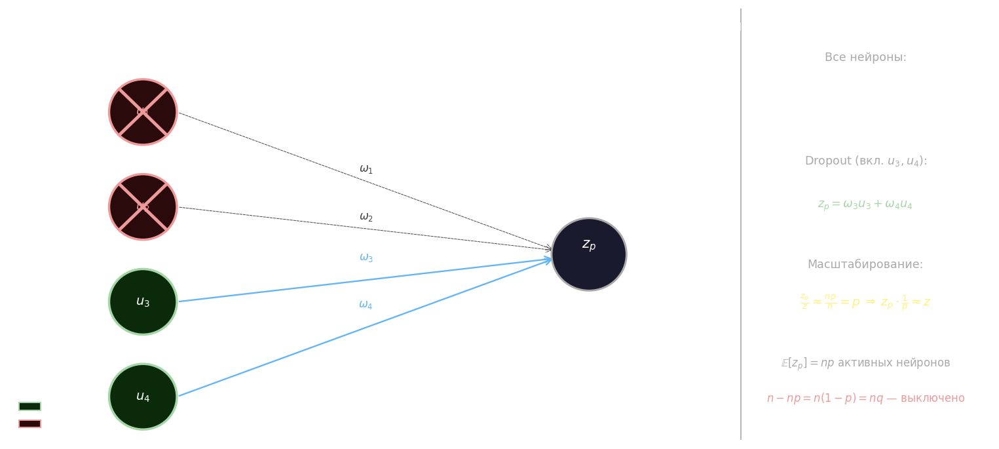
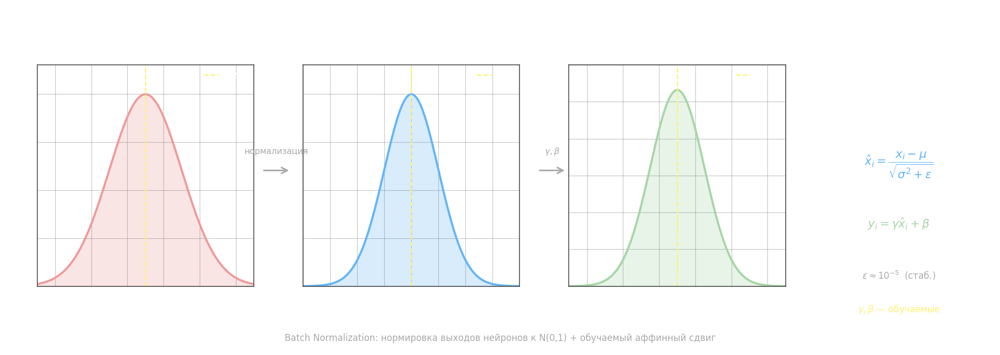

# Виды ф-ций оптимизации

- SGD
- RMSprop
- Adadelta
- Adam

```python
import torch
import torch.optim as optim

w = torch.tensor([1, 2, 3])
m = 1

# функции оптимизаторы
optim.SGD(params=[w], lr=0.1, momentum=m, nesterov=True)
optim.RMSprop(params=[w], lr=0.1, momentum=m, )
optim.Adadelta(params=w, lr=0.1)
optim.Adam(params=w, lr=0.1)
```

# Вычисление точки минимума

```python
import torch
import torch.optim as optim


def func(x):
    return 0.2 * (x - 2) ** 2 - 0.3 * torch.cos(4 * x)


lr = 0.1  # шаг обучения
x0 = 0.0  # начальное значение точки минимума
N = 200  # число итераций градиентного алгоритма
x = torch.tensor([x0], requires_grad=True)

optimizer = optim.RMSprop(lr=lr, params=[x])

for _ in range(200):
    y = func(x)
    y.backward()

    optimizer.step()
    optimizer.zero_grad()

```

# Пример SGD

```python
import torch
import torch.optim as optim

from random import randint


def model(X, w):
    return X @ w


N = 2
w = torch.FloatTensor(N).uniform_(-1e-5, 1e-5)
w.requires_grad_(True)
x = torch.arange(0, 3, 0.1)

y_train = 0.5 * x + 0.2 * torch.sin(2 * x) - 3.0
x_train = torch.tensor([[_x ** _n for _n in range(N)] for _x in x])

total = len(x)
lr = torch.tensor([0.1, 0.01])
loss_func = torch.nn.L1Loss()  # ф-ция потерь
optimizer = optim.Adam(params=[w], lr=0.01)  # параметры ф-ции для оптимизации

for _ in range(1000):
    k = randint(0, total - 1)
    y = model(x_train[k], w)  # выбор batch
    loss = loss_func(y, y_train[k])  # использование оптимизатора  (y, y_train[k]) ** 2

    loss.backward()  # вычисление градиента
    optimizer.step()  # w.data = w.data - lr * w.grad
    optimizer.zero_grad()  # w.grad.zero_()

print(w)
predict = model(x_train, w)
```

# L1, L2 и Dropout

Три стандартных способа бороться с переобучением нейронной сети. L1 и L2 регуляризация добавляют штраф за большие веса прямо в функцию потерь, сохраняя архитектуру сети нетронутой. Dropout временно отключает нейроны в процессе обучения.

**L2-регуляризация** (Ridge) добавляет к функции потерь сумму квадратов весов:

$$\tilde{L} = L + \frac{\lambda}{2}\sum_{i} w_i^2$$

где $\lambda$ — коэффициент регуляризации. Градиент штрафного члена $\lambda w_i$ приводит к равномерному уменьшению всех весов на каждом шаге — это называют _weight decay_. Большие веса штрафуются сильнее, что сглаживает поверхность функции потерь и снижает чувствительность к отдельным признакам.

**L1-регуляризация** (Lasso) использует сумму модулей:

$$\tilde{L} = L + \lambda\sum_{i} |w_i|$$

Производная $\lambda \operatorname{sign}(w_i)$ постоянна по величине, поэтому малые веса стягиваются ровно в ноль — L1 порождает разреженные модели. В PyTorch реализуется вручную через `loss += lambda * w.abs().sum()`.

## Dropout

Dropout — техника обучения, при которой на каждом шаге часть нейронов слоя случайно отключается. Каждый нейрон включается с вероятностью $p$, поэтому из $n$ нейронов в среднем активно $np$, а $n(1-p) = nq$ — выключено. Математическое ожидание числа активных нейронов:

$$\mathbb{E}\left[\sum_{i=1}^{n} x_i \gamma_i\right] = \sum_{i=1}^{n} x_i p_i = np$$

где $\gamma_i \in \{0, 1\}$ — случайная маска, $p_i = p$ для всех нейронов.

При полном слое из четырёх нейронов сумматор принимает:

$$z = \omega_1 u_1 + \omega_2 u_2 + \omega_3 u_3 + \omega_4 u_4$$

Если во время обучения отключены $u_1$ и $u_2$, то активный сигнал:

$$z_p = \omega_3 u_3 + \omega_4 u_4$$

В среднем $z_p/z \approx np/n = p$, поэтому выход нейрона занижен в $1/p$ раз. Чтобы вывод сети не менялся при переходе от обучения к инференсу, веса масштабируются:

$$z_p \cdot \frac{1}{p} \approx z$$

На практике PyTorch применяет это масштабирование автоматически в режиме `model.train()` и убирает его при `model.eval()`.



Dropout нужно добавлять только по необходимости — его может заменить уменьшение числа нейронов в слое или L2-регуляризация. В PyTorch слой Dropout вставляется между линейными слоями:

```python
import torch.nn as nn

model = nn.Sequential(
    nn.Linear(4, 64),
    nn.ReLU(),
    nn.Dropout(p=0.5),   # отключает каждый нейрон с вероятностью 0.5
    nn.Linear(64, 1),
)
```

# Batch Normalization

При прохождении данных через нелинейные функции активации распределение выходов нейронов смещается — особенно заметно это при малейших изменениях весов в процессе обучения. Такой сдвиг называют **internal covariate shift**: каждый слой вынужден постоянно подстраиваться под изменившееся распределение входов с предыдущего слоя, что замедляет сходимость и дестабилизирует обучение.

**Идея**: на выходах каждого нейрона явно вычислить среднее $\mu$ и дисперсию $\sigma^2$ по батчу, а затем нормировать так, чтобы получить нулевое среднее и единичную дисперсию. Для батча размером $m$:

$$\mu = \frac{1}{m}\sum_{i=1}^{m} x_i, \qquad \sigma^2 = \frac{1}{m}\sum_{i=1}^{m}(x_i - \mu)^2$$

$$\hat{x}_i = \frac{x_i - \mu}{\sqrt{\sigma^2 + \varepsilon}}$$

где $\varepsilon \approx 10^{-5}$ — малая добавка, чтобы не делить на ноль.

После нормализации распределение стало стандартным, но жёстко зафиксированным. Это может быть невыгодно: иногда сдвинутое или масштабированное распределение обучается лучше. Поэтому вторым шагом вводится **обучаемое аффинное преобразование**:

$$y_i = \gamma\,\hat{x}_i + \beta$$

где $\gamma$ (масштаб) и $\beta$ (смещение) — параметры, настраиваемые через backpropagation вместе с остальными весами сети. Если сеть сочтёт нужным «отменить» нормализацию, она просто выставит $\gamma = \sigma$, $\beta = \mu$.



В PyTorch слой добавляется между линейным преобразованием и функцией активации:

```python
import torch.nn as nn

model = nn.Sequential(
    nn.Linear(128, 64),
    nn.BatchNorm1d(64),   # нормирует каждый из 64 признаков по батчу
    nn.ReLU(),
    nn.Linear(64, 1),
)
```

Для свёрточных сетей используется `nn.BatchNorm2d(num_channels)` — нормировка идёт по всем пространственным позициям и элементам батча в каждом канале.

Практические рекомендации: сначала попробовать Batch Normalization, и лишь потом при необходимости добавлять Dropout. На одном слое лучше не применять оба метода одновременно — они плохо взаимодействуют друг с другом.

# пример 2

```python
import numpy as np
import torch
from torch.nn import BCEWithLogitsLoss
from torch.optim import Adam


def model(x, w1, w2, b1, b2):
    x = x @ w1.permute(1, 0) + b1
    x = torch.tanh(x)
    x = x @ w2.permute(1, 0) + b2
    return x


np.random.seed(1)  # установка "зерна" генератора датчика случайных чисел
torch.manual_seed(123)

W1 = torch.empty(2, 2).normal_(0, 1e-5)
bias1 = torch.rand(2, requires_grad=True)
W2 = torch.empty(1, 2).normal_(0, 1e-5)
bias2 = torch.rand(1, requires_grad=True)

W1.requires_grad_(True)
W2.requires_grad_(True)

# обучающая выборка
n_items = 20
C00 = torch.empty(n_items, 2).normal_(0, 1)
C11 = torch.empty(n_items, 2).normal_(0, 1) + torch.FloatTensor([5, 5])
C01 = torch.empty(n_items, 2).normal_(0, 1) + torch.FloatTensor([0, 5])
C10 = torch.empty(n_items, 2).normal_(0, 1) + torch.FloatTensor([5, 0])

x_train = torch.cat([C00, C11, C01, C10])
y_train = torch.cat([torch.ones(n_items * 2), torch.zeros(n_items * 2)])

lr = 0.01  # шаг обучения
N = 1000  # число итераций при обучении
total = y_train.size(0)  # размер обучающей выборки

# здесь продолжайте программу
loss_func = BCEWithLogitsLoss()
optimizer = Adam(params=[W1, W2, bias1, bias2], lr=lr)
for _ in range(N):
    k = np.random.randint(0, total)
    y = model(x_train[k], W1, W2, bias1, bias2)
    loss = loss_func(y[0], y_train[k])

    loss.backward()
    optimizer.step()
    optimizer.zero_grad()

predict = model(x_train, W1, W2, bias1, bias2).sum(dim=1) > 0

Q = (predict.float() == y_train).float().mean()
```
